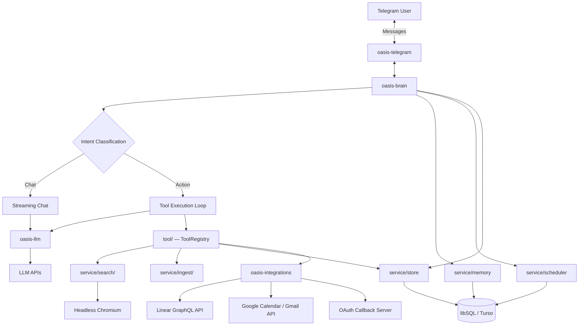
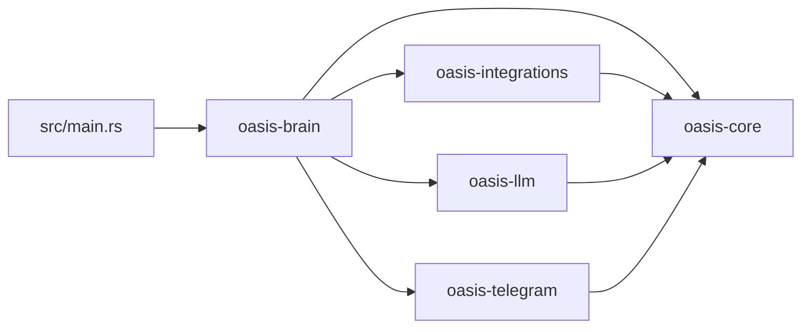
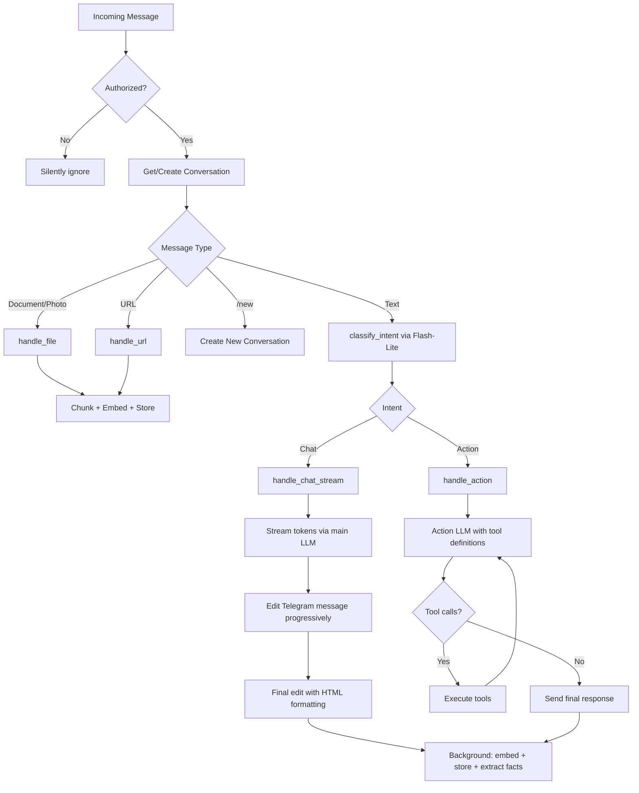
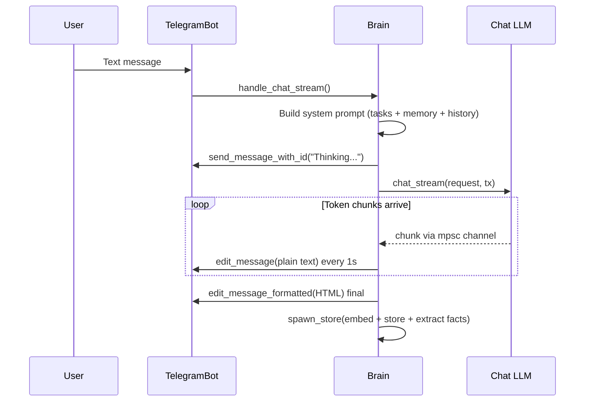
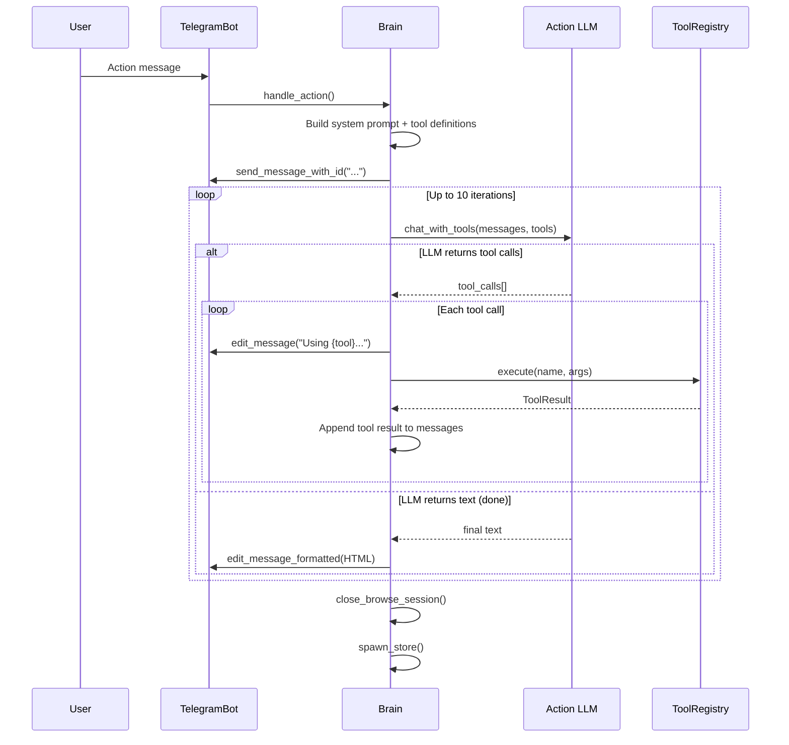
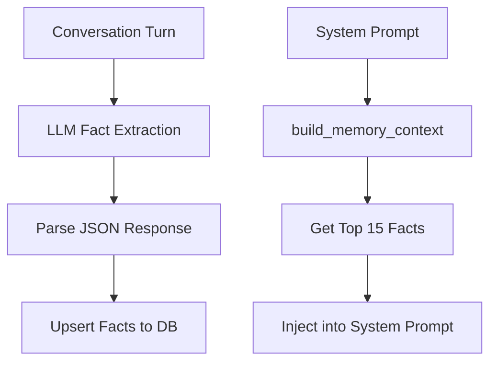
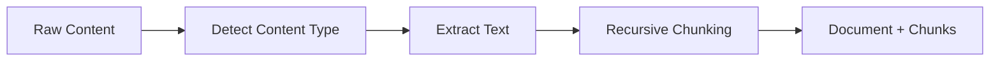

# Oasis Architecture

Oasis is a personal AI assistant accessed via Telegram. It combines conversational AI, a knowledge base (RAG), task management, scheduled automations, web browsing, and conversational memory — all in a single Rust binary.

## System Overview



## Crate Dependency Graph (5 crates)



| Crate | Responsibility |
|-------|---------------|
| **oasis-core** | Shared types (`Document`, `Chunk`, `Message`, `ChatRequest`/`ChatResponse`), `Config` loading, `OasisError` enum, utility functions (`new_id`, `now_unix`) |
| **oasis-llm** | `LlmProvider` and `EmbeddingProvider` traits with implementations for Anthropic, OpenAI, Gemini, Ollama. All raw HTTP, no SDK dependencies. |
| **oasis-telegram** | `TelegramBot` client with long polling. Hand-rolled, no bot framework. Markdown-to-HTML conversion. |
| **oasis-integrations** | External service integrations (Linear, Google Calendar, Gmail) with OAuth support. Defines `TokenStore` trait. |
| **oasis-brain** | Orchestration layer (`Brain` struct) plus all business logic, organized in three layers (see below). |

## Brain: Three-Layer Architecture

oasis-brain is the largest crate, organized into three layers with strict downward-only dependencies:

```
brain/     (L1: Orchestration)  — routing, chat streaming, action dispatch, scheduling
  ├── mod.rs         Brain struct + new() constructor
  ├── router.rs      run(), handle_message(), intent classification
  ├── chat.rs        handle_chat_stream(), system prompt construction
  ├── action.rs      handle_action() tool loop
  ├── storage.rs     spawn_store(), background message persistence
  ├── lifecycle.rs   startup/shutdown
  ├── ingest.rs      file/URL ingestion handlers
  └── scheduling.rs  scheduled actions loop

tool/      (L2: Extension point) — Tool trait + ToolRegistry + implementations
  ├── mod.rs         Tool trait, ToolResult, ToolRegistry
  ├── search.rs      web_search, browse_url, page_click, page_type, page_read
  ├── knowledge.rs   knowledge_search, remember
  ├── schedule.rs    schedule_create/list/update/delete
  ├── memory_tool.rs memory_search, memory_forget
  ├── linear.rs      linear_create_issue/list/update/search
  ├── calendar.rs    calendar_list/create/update/delete
  ├── gmail.rs       gmail_search/read/draft/send/reply
  ├── skill.rs       skill-based execution
  ├── shell.rs       shell_exec (sandboxed)
  ├── file.rs        file_read/write/list (sandboxed)
  └── http.rs        http_request (SSRF-protected)

service/   (L3: Infrastructure)  — storage, LLM dispatch, search, ingestion, memory
  ├── store.rs       VectorStore (libSQL wrapper, all DB operations)
  ├── memory.rs      MemoryStore (fact extraction, confidence decay)
  ├── llm.rs         LlmDispatch + Embedder (provider dispatch)
  ├── intent.rs      Intent enum, parse_intent()
  ├── skills.rs      SkillManager
  ├── search/        WebSearch (Google scraping, browser, page snapshots)
  └── ingest/        IngestPipeline (text extraction, chunking)
```

**Dependency rule**: L1 can call L2 and L3. L2 can call L3. L3 never calls upward.

The `Brain` struct is defined in `brain/mod.rs` with all fields and the `new()` constructor. Each behavioral concern is a **separate file containing an `impl Brain` block** — not separate types, but method grouping by file.

## Message Processing Flow

Every incoming Telegram message follows this path:



### Intent Classification

Every text message is classified by a lightweight intent LLM (Gemini Flash-Lite):

| Intent | Behavior |
|--------|----------|
| `Chat` | Stream response from the Chat LLM. No tools. |
| `Action` | Enter tool execution loop with the Action LLM. Up to 10 iterations. |

The classifier returns `{"intent":"chat"}` or `{"intent":"action"}`. If JSON parsing fails, defaults to `Action` (safer — lets the tool-use LLM decide). The intent LLM has **3x exponential backoff retry** for transient errors (429, 500-504).

### Chat Flow (Streaming)



- Intermediate edits use **plain text** (markdown may be incomplete mid-stream)
- Final edit uses **HTML** via `pulldown-cmark` conversion
- Edit rate limited to **once per second** to avoid Telegram rate limits
- Edit errors silently ignored (`let _ =`) — fallback ensures text isn't lost

### Action Flow (Tool Loop)



**Short-circuit optimization**: For single simple tools (`task_create`, `task_list`, `schedule_*`, `remember`, etc.), the tool output is sent directly without an extra LLM synthesis round-trip.

### System Prompt Construction

The system prompt is built dynamically and includes:
1. Bot identity and current date/time (with timezone)
2. Tool usage guidelines (when to use browser vs web_search)
3. Active task summary (from VectorStore)
4. Memory context (user facts from MemoryStore, top 15)
5. Recent conversation history (last N messages from VectorStore)

### Background Storage (`spawn_store`)

After every response, a background tokio task:
1. Embeds the user message (assistant message is NOT embedded — saves API calls)
2. Stores both user and assistant messages in the `messages` table
3. Extracts user facts from the conversation turn using the intent LLM
4. Upserts extracted facts into the `user_facts` table

## Three LLM Models

Oasis uses three separately configurable LLM models:

| Model | Config Section | Default | Purpose |
|-------|---------------|---------|---------|
| **Chat LLM** | `[llm]` | Claude Sonnet 4.5 | Streaming conversational responses |
| **Intent LLM** | `[intent]` | Gemini Flash-Lite | Intent classification, fact extraction, scheduled report synthesis |
| **Action LLM** | `[action]` | Falls back to `[llm]` | Agentic tool-use loop with function calling |

### LLM Dispatch Pattern

Providers are **not stored as trait objects**. They are created on-the-fly in dispatch methods via match on provider name:

```
match provider {
    "gemini"    => GeminiLlm::new(key, model).chat(request),
    "anthropic" => AnthropicLlm::new(key, model).chat(request),
    "openai"    => OpenAiLlm::new(key, model).chat(request),
    "ollama"    => OllamaLlm::new(url, model).chat(request),
}
```

Three dispatch paths exist in `LlmDispatch`:
- `chat_stream()` — uses `config.llm.*` (streaming, spawned task)
- `chat_intent()` — uses `config.intent.*` (with retry)
- `chat_with_tools()` — uses `config.action.*` (function calling)

### Streaming Protocol

1. Brain creates an `mpsc::unbounded_channel`
2. LLM call is spawned as a tokio task, receives the `tx` sender
3. As SSE chunks arrive, text deltas are sent via `tx.send(chunk)`
4. Brain receives chunks from `rx` and batches Telegram edits (1s interval)
5. When the stream ends, the spawned task returns the final `ChatResponse` (with usage stats)

## Available Tools

When the Action LLM runs, it has access to tools from the `ToolRegistry`:

| Tool | Purpose |
|------|---------|
| `web_search` | Google search via headless Chromium + embedding-based ranking |
| `knowledge_search` | Vector search over knowledge base chunks and past messages |
| `remember` | Ingest text into the knowledge base |
| `schedule_create` | Create recurring automated actions |
| `schedule_list` | List all scheduled actions |
| `schedule_update` | Enable/disable or reschedule actions |
| `schedule_delete` | Delete scheduled actions |
| `browse_url` | Open a URL in headless browser, return page snapshot |
| `page_click` | Click an interactive element on the current page |
| `page_type` | Type text into an input field on the current page |
| `page_read` | Re-read current page state without interaction |
| `shell_exec` | Execute a shell command (sandboxed, blocked patterns) |
| `file_read` / `file_write` / `file_list` | Filesystem operations (sandboxed workspace) |
| `http_request` | HTTP requests (SSRF-protected, blocks internal IPs) |
| **Linear** (conditional — requires `OASIS_LINEAR_API_KEY`) | |
| `linear_create_issue` | Create a Linear issue with title, description, team, priority |
| `linear_list_issues` | List issues with filters; also lists available teams |
| `linear_update_issue` | Update issue state, assignee, or priority |
| `linear_search` | Full-text search across Linear issues |
| **Google** (conditional — requires `OASIS_GOOGLE_CLIENT_ID`) | |
| `google_connect` | Get OAuth authorization URL to connect Google account |
| `calendar_list_events` | List Google Calendar events for a date range |
| `calendar_create_event` | Create a calendar event with attendees |
| `calendar_update_event` | Update an existing calendar event |
| `calendar_delete_event` | Delete a calendar event |
| `gmail_search` | Search emails using Gmail query syntax |
| `gmail_read` | Read full content of a specific email |
| `gmail_draft` | Create a draft email |
| `gmail_send` | Send an email (LLM confirms with user via ask_user first) |
| `gmail_reply` | Reply to an email thread |

**Conditional registration**: Integration tools are only loaded into the ToolRegistry when their API credentials are configured. No API key = no tools registered.

## Memory System

Automatic user fact extraction and long-term memory.



### Extraction (after every message)

1. `spawn_store()` calls `extract_and_store_facts()` in a background task
2. Fetches existing facts (top 30) to avoid re-extracting known information
3. Sends the conversation turn + extraction prompt to the **intent LLM**
4. Parses the response as JSON array of `{fact, category}` objects
5. Upserts each fact into the `user_facts` table

### Injection (before every response)

`build_memory_context()` fetches top 15 facts sorted by confidence and recency, formatted as a markdown section injected into the system prompt.

### Confidence System

- New facts start at confidence `1.0`
- Re-extracted facts get `+0.1` (capped at 1.0)
- Facts not reinforced in 7+ days decay by `*0.95`
- Facts below `0.3` confidence AND older than 30 days are pruned

## Ingestion Pipeline

Converts files, URLs, and raw text into `Document` + `Chunk` structs ready for embedding.



The pipeline does NOT embed or store — Brain handles embedding and VectorStore persistence separately.

### Chunking Strategy

Recursive splitting: paragraphs → sentences → words. Each chunk (except the first) starts with the last `overlap_chars` characters from the previous chunk.

| Parameter | Default | Purpose |
|-----------|---------|---------|
| `max_tokens` | 512 | Max tokens per chunk (approx `tokens * 4 = chars`) |
| `overlap_tokens` | 50 | Overlap between consecutive chunks |

## Web Search and Browser

Two modes of operation using headless Chromium:

### Search Mode (`web_search` tool)

1. Navigate to Google, type query, extract results (stealth mode to avoid CAPTCHA)
2. **Phase 1**: Fast fetch all URLs with reqwest + Mozilla Readability (parallel)
3. **Phase 2**: Chromium fallback for JS-heavy pages with < 200 chars extracted (sequential)
4. Brain ranks results via embedding-based cosine similarity (chunk, embed, rank)

### Interactive Browser Mode (`browse_url`, `page_click`, `page_type`, `page_read`)

Returns `PageSnapshot` with page text (max 5000 chars) and up to 50 interactive elements tagged with `data-oi` attributes. Supports clicking, typing, and re-reading page state for multi-step web interactions.

## Scheduled Actions

Background loop running every 60 seconds:
1. Query `scheduled_actions` for enabled actions where `next_run <= now`
2. Execute each action's tool calls via the ToolRegistry
3. Optionally synthesize results with the intent LLM using `synthesis_prompt`
4. Send the result to the owner via Telegram
5. Compute and store the next run time

## Database Schema

All data is stored in libSQL (SQLite-compatible) with DiskANN vector extensions. Supports local file or remote Turso.

| Table | Module | Purpose |
|-------|--------|---------|
| `documents` | store | Ingested documents (files, URLs, text) |
| `chunks` | store | Document chunks with `F32_BLOB(1536)` embedding vectors |
| `conversations` | store | Telegram chat sessions |
| `messages` | store | Chat messages with optional embedding vectors |
| `config` | store | Key-value store (telegram_offset, owner_user_id, OAuth tokens) |
| `scheduled_actions` | store | Recurring automated actions |
| `user_facts` | memory | Extracted user facts with confidence scores |
| `conversation_topics` | memory | Tracked conversation topics |

### Vector Search

Both chunk and message search use libSQL's `vector_top_k` function with DiskANN indexes:

```sql
SELECT * FROM chunks
WHERE rowid IN vector_top_k('chunks_vector_idx', vector(?), ?)
```

### Connection Strategy

Each method call creates a **fresh connection** via `self.db.connect()`. For remote Turso databases, this avoids `STREAM_EXPIRED` errors on long-lived connections.

## Configuration

Config loads in order: **defaults -> `oasis.toml` -> environment variables** (env wins).

| Section | Key env vars | Purpose |
|---------|-------------|---------|
| `[telegram]` | `OASIS_TELEGRAM_TOKEN` | Bot token, allowed user ID |
| `[llm]` | `OASIS_LLM_API_KEY` | Chat LLM provider/model/key |
| `[intent]` | `OASIS_INTENT_API_KEY` | Intent classifier provider/model/key |
| `[action]` | `OASIS_ACTION_API_KEY` | Action LLM provider/model/key (falls back to `[llm]`) |
| `[embedding]` | `OASIS_EMBEDDING_API_KEY` | Embedding provider/model/dimensions |
| `[database]` | `OASIS_TURSO_URL`, `OASIS_TURSO_TOKEN` | DB path or Turso remote |
| `[chunking]` | - | max_tokens (512), overlap_tokens (50) |
| `[brain]` | - | context_window (20), vector_top_k (10), timezone_offset (7) |
| `[ollama]` | - | base_url for local Ollama |
| `[integrations.linear]` | `OASIS_LINEAR_API_KEY` | Linear API key for issue management |
| `[integrations.google]` | `OASIS_GOOGLE_CLIENT_ID`, `OASIS_GOOGLE_CLIENT_SECRET` | Google OAuth for Calendar + Gmail |
| `[integrations.server]` | - | OAuth callback server port (default 8080) |

### Config Fallback Logic

- If `[intent].api_key` is empty, falls back to `[llm].api_key`
- If `[action].provider` is empty, falls back to `[llm].provider` and `[llm].model`
- If `[action].api_key` is empty, falls back to `[llm].api_key`

## Key Design Decisions

- **Three-layer module structure**: `brain/` (orchestration) → `tool/` (extension point) → `service/` (infrastructure). Dependency flows downward only.
- **Tool trait pattern**: `Tool` trait with `definitions()` + `execute()` methods, `ToolRegistry` for dynamic dispatch. Blanket `impl<T: Tool> Tool for Arc<T>` allows sharing tools between Brain fields and the registry.
- **No async trait objects for LLM**: Providers are created on-the-fly via match dispatch, avoiding `dyn` complexity. The `LlmProvider` trait uses RPITIT (return-position impl trait in trait), which is not object-safe by design.
- **`async_trait` for Tool**: The `Tool` trait uses `#[async_trait]` because it must be object-safe (stored as `Box<dyn Tool>` in `ToolRegistry`).
- **No external crates for errors**: Custom `OasisError` enum with manual `Display` impl.
- **No bot framework**: Hand-rolled Telegram client using raw HTTP (reqwest).
- **All providers use raw HTTP**: No SDK dependencies for any LLM provider.
- **No chrono/time crate**: Hand-rolled date math in `util.rs`.
- **ULID-like IDs**: `new_id()` generates time-sortable IDs from timestamp + `/dev/urandom`.
- **Background storage**: `spawn_store()` embeds and persists messages after responding, so user doesn't wait.
- **Separate DB handles**: Each component opens its own libsql connection to avoid contention.
- **Fresh connections per call**: VectorStore creates a new connection for each method call to avoid `STREAM_EXPIRED` on Turso.
- **Conditional tool registration**: Integration tools are only registered when credentials are configured. No API key = no tools loaded.
- **TokenStore abstraction**: `oasis-integrations` defines a `TokenStore` trait for OAuth token persistence. Brain implements it via VectorStore's `config` table.
- **Telegram HTML, not Markdown**: All formatted output uses `parse_mode: "HTML"` via `pulldown-cmark` conversion. Telegram's legacy "Markdown" parse_mode is too limited.
