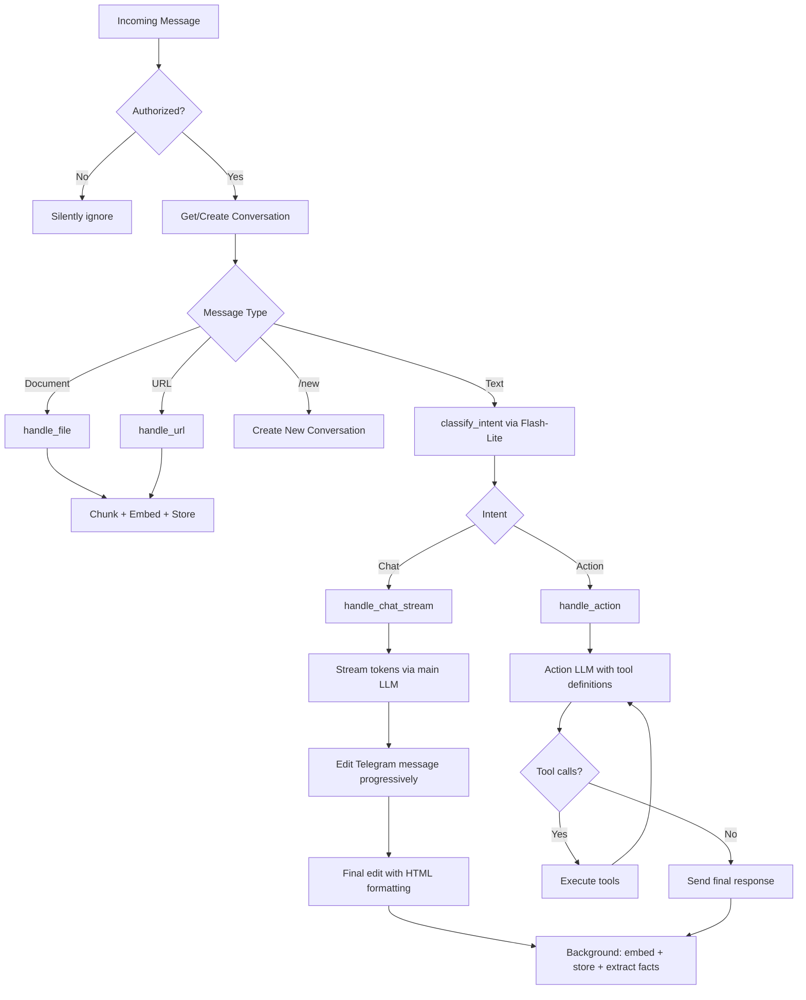

# Oasis Architecture

Oasis is a personal AI assistant accessed via Telegram. It combines conversational AI, a knowledge base (RAG), task management, scheduled automations, web browsing, and conversational memory — all in a single Rust binary.

## System Overview

## Crate Dependency Graph (5 crates)

oasis-brain is organized in three layers:

- **`brain/`** (L1: Orchestration) — Message routing, intent dispatch, streaming chat, action loop, scheduled actions, background storage
- **`tool/`** (L2: Extension point) — `Tool` trait + `ToolRegistry` for dynamic dispatch, with implementations: `TaskTool`, `SearchTool`, `KnowledgeTool`, `ScheduleTool`, `MemoryTool`, `LinearTool`, `CalendarTool`, `GmailTool`
- **`service/`** (L3: Infrastructure) — `store`, `tasks`, `memory`, `llm` (LlmDispatch + Embedder), `search/`, `ingest/`, `intent`, `scheduler`

## Message Processing Flow

Every incoming Telegram message follows this path:

## Three LLM Models

Oasis uses three separately configurable LLM models:

| Model | Config Section | Default | Purpose |
|-------|---------------|---------|---------|
| **Chat LLM** | `[llm]` | Claude Sonnet 4.5 | Streaming conversational responses |
| **Intent LLM** | `[intent]` | Gemini Flash-Lite | Intent classification (Chat vs Action), fact extraction, scheduled report synthesis |
| **Action LLM** | `[action]` | Falls back to `[llm]` | Agentic tool-use loop with function calling |

## Available Tools

When the Action LLM runs, it has access to these tools:

| Tool | Purpose |
|------|---------|
| `task_create` | Create a task with title, description, due date, priority |
| `task_list` | List tasks, optionally filtered by status |
| `task_update` | Update task status (todo/in_progress/done) |
| `task_delete` | Delete tasks by title match or `*` for all |
| `web_search` | Google search via headless Chromium + embedding-based ranking |
| `knowledge_search` | Vector search over knowledge base chunks and past messages |
| `remember` | Ingest text into the knowledge base |
| `schedule_create` | Create recurring automated actions |
| `schedule_list` | List all scheduled actions |
| `schedule_update` | Enable/disable or reschedule actions |
| `schedule_delete` | Delete scheduled actions |
| `browse_url` | Open a URL in headless browser, return page snapshot |
| `page_click` | Click an interactive element on the current page |
| `page_type` | Type text into an input field on the current page |
| `page_read` | Re-read current page state without interaction |
| **Linear** (conditional — requires `OASIS_LINEAR_API_KEY`) | |
| `linear_create_issue` | Create a Linear issue with title, description, team, priority |
| `linear_list_issues` | List issues with filters; also lists available teams |
| `linear_update_issue` | Update issue state, assignee, or priority |
| `linear_search` | Full-text search across Linear issues |
| **Google** (conditional — requires `OASIS_GOOGLE_CLIENT_ID`) | |
| `google_connect` | Get OAuth authorization URL to connect Google account |
| `calendar_list_events` | List Google Calendar events for a date range |
| `calendar_create_event` | Create a calendar event with attendees |
| `calendar_update_event` | Update an existing calendar event |
| `calendar_delete_event` | Delete a calendar event |
| `gmail_search` | Search emails using Gmail query syntax |
| `gmail_read` | Read full content of a specific email |
| `gmail_draft` | Create a draft email |
| `gmail_send` | Send an email (LLM confirms with user via ask_user first) |
| `gmail_reply` | Reply to an email thread |

## Database Schema

All data is stored in libSQL (SQLite-compatible) with vector extensions. Supports local file or remote Turso.

| Table | Module | Purpose |
|-------|--------|---------|
| `documents` | store | Ingested documents (files, URLs, text) |
| `chunks` | store | Document chunks with `F32_BLOB(1536)` embedding vectors |
| `projects` | store | Project groupings for tasks |
| `tasks` | store | Task items with status, priority, due dates |
| `conversations` | store | Telegram chat sessions |
| `messages` | store | Chat messages with optional embedding vectors |
| `config` | store | Key-value store (telegram_offset, owner_user_id, OAuth tokens) |
| `scheduled_actions` | store | Recurring automated actions |
| `user_facts` | memory | Extracted user facts with confidence scores |
| `conversation_topics` | memory | Tracked conversation topics |
| `reminders` | scheduler | Notification tracking to prevent duplicates |

## Configuration

Config loads in order: **defaults -> `oasis.toml` -> environment variables** (env wins).

| Section | Key env vars | Purpose |
|---------|-------------|---------|
| `[telegram]` | `OASIS_TELEGRAM_TOKEN` | Bot token, allowed user ID |
| `[llm]` | `OASIS_LLM_API_KEY` | Chat LLM provider/model/key |
| `[intent]` | `OASIS_INTENT_API_KEY` | Intent classifier provider/model/key |
| `[action]` | `OASIS_ACTION_API_KEY` | Action LLM provider/model/key (falls back to `[llm]`) |
| `[embedding]` | `OASIS_EMBEDDING_API_KEY` | Embedding provider/model/dimensions |
| `[database]` | `OASIS_TURSO_URL`, `OASIS_TURSO_TOKEN` | DB path or Turso remote |
| `[chunking]` | - | max_tokens (512), overlap_tokens (50) |
| `[brain]` | - | context_window (20), vector_top_k (10), timezone_offset (7) |
| `[ollama]` | - | base_url for local Ollama |
| `[integrations.linear]` | `OASIS_LINEAR_API_KEY` | Linear API key for issue management |
| `[integrations.google]` | `OASIS_GOOGLE_CLIENT_ID`, `OASIS_GOOGLE_CLIENT_SECRET` | Google OAuth for Calendar + Gmail |
| `[integrations.server]` | - | OAuth callback server port (default 8080) |

## Per-System Documentation

- [oasis-core](systems/core.md) - Shared types, config, error handling, utilities
- [oasis-brain](systems/brain.md) - Orchestration layer, message routing, system prompt
- [oasis-llm](systems/llm.md) - LLM and embedding provider implementations
- [oasis-telegram](systems/telegram.md) - Telegram bot client, message formatting
- [oasis-integrations](systems/integrations.md) - External service clients (Linear, Google Calendar, Gmail), OAuth, callback server

oasis-brain internal layers:

**brain/** (orchestration):

- [brain](systems/brain.md) - Message routing, intent dispatch, streaming chat, action loop

**tool/** (extension point):

- [tools](systems/tools.md) - Tool trait, ToolRegistry, and tool implementations

**service/** (infrastructure):

- [store](systems/vector.md) - Vector store, database, all table operations
- [tasks](systems/tasks.md) - Task and project management
- [memory](systems/memory.md) - User fact extraction and memory
- [search](systems/search.md) - Web search and interactive browser
- [ingest](systems/ingest.md) - Text extraction, chunking pipeline
- [scheduler](systems/scheduler.md) - Proactive task reminders

## Key Design Decisions

- **Three-layer module structure**: `brain/` (orchestration) → `tool/` (extension point) → `service/` (infrastructure). Dependency flows downward only.
- **Tool trait pattern**: `Tool` trait with `definitions()` + `execute()` methods, `ToolRegistry` for dynamic dispatch. Blanket `impl<T: Tool> Tool for Arc<T>` allows sharing tools between Brain fields and the registry.
- **No async trait objects**: LLM/embedding providers are created on-the-fly via match dispatch, avoiding `dyn` complexity.
- **No external crates for errors**: Custom `OasisError` enum with manual `Display` impl.
- **No bot framework**: Hand-rolled Telegram client using raw HTTP (reqwest).
- **All providers use raw HTTP**: No SDK dependencies for any LLM provider.
- **ULID-like IDs**: `new_id()` generates time-sortable IDs from timestamp + `/dev/urandom`.
- **Background storage**: `spawn_store()` embeds and persists messages after responding, so user doesn't wait.
- **Separate DB handles**: Each component (VectorStore, TaskManager, MemoryStore, Scheduler) opens its own libsql connection to avoid contention.
- **Conditional tool registration**: Integration tools (Linear, Calendar, Gmail) are only registered in the ToolRegistry when their credentials are configured. No API key = no tools loaded.
- **TokenStore abstraction**: `oasis-integrations` defines a `TokenStore` trait for OAuth token persistence. Brain implements it via VectorStore's `config` table, keeping integration code decoupled from database internals.
