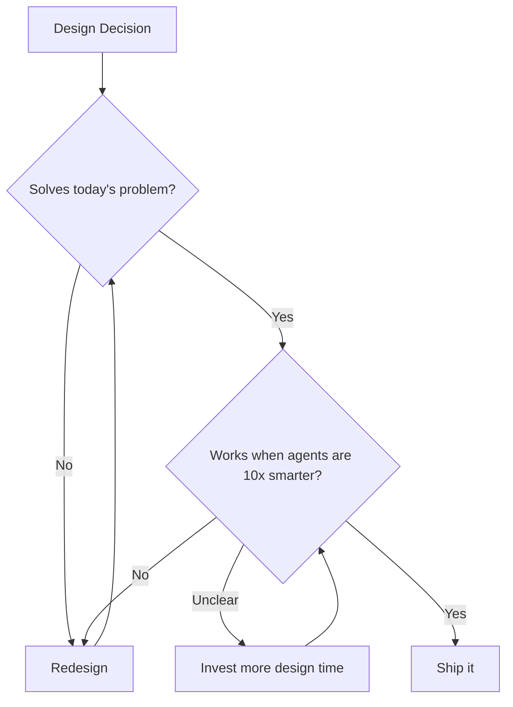
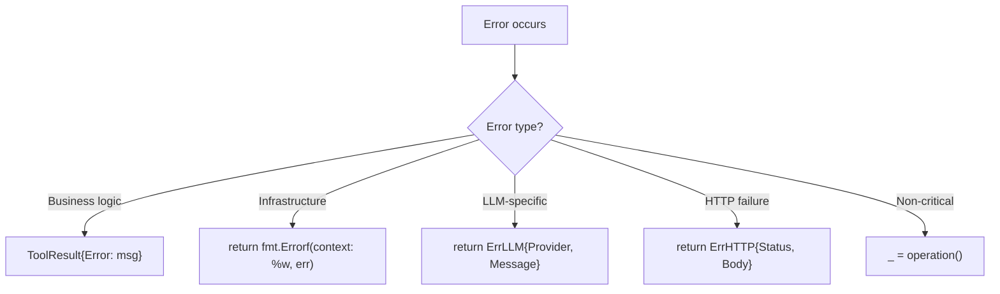

# Contributing to Oasis

Engineering principles and coding conventions for all contributors (human and LLM). Read this before writing any code.

Oasis is an AI agent framework built to evolve toward AGI. We adopt the mindset:

> **Framework primitives** (core interfaces, agent model, tool protocol) — designed for **composability, expressiveness, and longevity**. Correct primitives unlock patterns we haven't anticipated. Wrong primitives become expensive breaking changes. Invest in getting the design right.

## API Strategy (v0.x.x)

Oasis is in beta. The API is evolving. During this phase:

1. **Focus on extensibility + maintainability.** Every new API surface is a maintenance commitment. Don't add convenience sugar while the underlying primitives are still changing.
2. **Enrich building blocks first.** Invest in getting core primitives right — composable, expressive, well-documented. These are the foundation that high-level APIs will eventually build on.
3. **High-level APIs come later.** Once core primitives stabilize (v0.3+), identify patterns that *all* users wire the same way. Those become candidates for compound options or convenience helpers. Data-driven, not speculative.
4. **DX wins without new API surface.** Better examples, better error messages, copy-paste-able snippets. These reduce friction without adding code to maintain.

---

## Design Principles

Every design decision asks two questions:

1. **Does this solve today's problem well?**
2. **Will this still work when agents get 10x smarter?**

If the answer to #2 is "no" or "unclear," invest more design time.



### 1. Design for the Future, Don't Break the Past

AI capabilities grow in jumps. The framework must be ready for the next jump without breaking what already works.

**Future-readiness:**

- **Design interfaces that accommodate autonomy.** Today's agents follow explicit tool-calling loops. Tomorrow's agents may dynamically discover tools, spawn sub-agents, or negotiate task delegation with peers. Interfaces should not assume a fixed execution pattern.
- **Keep protocol types open for extension.** Prefer structs with optional fields over rigid signatures. Adding a field to `AgentTask.Context` is non-breaking. Adding a parameter to `Agent.Execute()` is breaking.
- **Don't hardcode today's limitations.** If current LLMs can't do X but the interface could support X without extra complexity, design for X.
- **Think in composability.** An Agent that contains Agents. A Tool that wraps an Agent. A Network that routes to Networks. Recursive composition is how simple primitives produce AGI-like behavior.

**Forward-compatibility:**

- **Add, don't remove.** New methods extend interfaces. New fields extend structs. Existing signatures don't change.
- **Extend via composition, not modification.** Need a `Provider` that also does embeddings? That's a separate `EmbeddingProvider` interface.
- **Deprecate before deleting.** Mark deprecated with comments and a note on what replaces it. Remove in the next major version.
- **Defaults preserve behavior.** Zero values must produce the same behavior as before the field existed.
- **Optional capabilities via interface assertion.**

```go
// Good: optional capability via separate interface
type StreamingAgent interface {
    Agent
    ExecuteStream(ctx context.Context, task AgentTask, ch chan<- string) (AgentResult, error)
}

// Check at runtime
if sa, ok := agent.(StreamingAgent); ok {
    return sa.ExecuteStream(ctx, task, ch)
}
```

### 2. Composability Over Convenience

The goal is primitives that snap together to form systems more capable than any individual piece.

- **Interfaces at natural boundaries.** Right place: between your system and an external service. Wrong place: between two internal functions that always change together.
- **Depend on behavior, not implementation.** Consumers shouldn't care whether storage is SQLite or Postgres.
- **Expressiveness over simplicity at the framework layer.** If adding one field opens 5 new use cases without significant complexity, it's worth it.
- **Earn every abstraction in application code.** Write concrete code first. Extract only when a pattern repeats 3x. No `utils`, `helpers`, or `common` packages. Framework primitives are different — they're designed for composability from the start.
- **Composability requires explicit dependencies.** Constructor injection, not service locator. Dependencies visible in function signatures. No hidden side effects. Parameters over ambient state.

### 3. Code for Dual Readers — Human and Agent

Code is read by humans today and will be read, extended, and generated by agents tomorrow.

- Names explain *intent*, not *implementation*. `BuildContext` over `GetTop15FactsAndFormat`.
- Comments explain **why**, not **what**. If a comment just restates the code, delete it.
- **Godoc on every exported symbol** — explain the contract, not just "returns X".
- **Interface contracts in comments** — document invariants, thread-safety, nil/zero behavior.
- **Consistent patterns.** When every Tool follows the same Execute pattern, agents generate correct code on the first try.
- `Example*` functions in tests for key APIs.
- Top-to-bottom flow. Early return for edge cases, happy path below. Max 2 levels of nesting.
- One file, one concern.

### 4. Fail Gracefully, Recover Autonomously

An autonomous agent can't ask a human every time something goes wrong.

- **Never crash on recoverable errors.** Memory extraction fails? Chat continues without memory.
- **Distinguish transient vs permanent.** Transient (429, 5xx, timeout) → retry with backoff. Permanent (400, 404) → return immediately.
- **Degrade, don't die.** A partially functional agent is infinitely more useful than a crashed one.
- **Error messages must be actionable.** `"invalid args: expected string for 'query' field"`, not `"invalid args"`.

### Practical Engineering

- **Performance where it matters.** Optimize user-perceived latency and API call count. Don't micro-optimize code that runs once per request.
- **Own your dependencies.** Can stdlib or <200 lines hand-rolled solve it? Don't add the dep. For external APIs: no SDKs — raw HTTP + JSON gives full control.

---

## Coding Conventions

### Error Handling



- Error messages lowercase, no trailing period: `"invalid schedule format: %s"`
- Always wrap with context: `fmt.Errorf("store init: %w", err)`, not bare `return err`
- Use `ErrLLM` (in `errors.go`) for provider-specific errors, `ErrHTTP` for HTTP errors
- No `pkg/errors` or error wrapping libraries — only `fmt.Errorf` with `%w`
- **`ToolResult` is not an error.** `Tool.Execute` always returns nil Go error. Business errors go in `ToolResult.Error`. Go errors = infrastructure failure only.
- Non-critical operations discard errors with `_ =` (e.g., Telegram edits during streaming)

### Code Style

- **Imports:** 3 groups separated by blank lines — stdlib, external+root, internal. Root package aliased as `oasis` in subpackages.
- **Naming:** standard Go (`PascalCase` exported, `camelCase` unexported). Constructors: `New(...)` or `NewXxx(...)`. Tool names: `snake_case`.
- **JSON tags:** `snake_case`. Internal-only fields: `json:"-"`.
- **Package names:** short, lowercase, single words (`gemini`, `sqlite`, `schedule`).
- **File per concern.** One file, one responsibility.
- **Compile-time interface checks:** `var _ oasis.Store = (*Store)(nil)` in every implementation.
- **Package doc comments** on every package's primary file.
- **4+ constructor params:** group in a `Deps` struct.

### Extensibility

- **New interface:** define in root `oasis` package, document contracts+nil behavior, add concrete implementation + compile-time check.
- **Extend existing interface:** don't modify signatures. New capability = new interface + type-assert. New struct field = zero value preserves old behavior.
- **New tool:** package in `tools/`, implement `oasis.Tool`, parse args into anonymous struct, dispatch on `name` for multi-function tools.
- **New provider:** package in `provider/`, raw HTTP only, add `wrapErr()` helper. Streaming via SSE with `ch <- chunk` and `defer close(ch)`.
- **Processors:** implement `PreProcessor`/`PostProcessor`/`PostToolProcessor`. Return `nil` to pass through, `ErrHalt` to short-circuit. Must be concurrent-safe. Register via `WithProcessors()`, guardrails first.

### Database

- **Fresh connections per operation.** No connection caching — avoids `STREAM_EXPIRED` on Turso.
- `CREATE TABLE IF NOT EXISTS` in `Init()`.
- Embeddings stored as JSON text. Vector search: in-process cosine similarity.

### Config

- **Cascade:** defaults -> `oasis.toml` -> env vars. Env wins.
- **Env vars:** `OASIS_` prefix, uppercase, underscore-separated.
- **New field:** add to config struct, set default in `Default()`, add env override in `Load()`, update `oasis.toml`.

### Concurrency

- Heavy non-critical work in background goroutines.
- LLM streaming via buffered channels (`make(chan string, 100)`).
- Transient errors (429, 5xx) retried with exponential backoff. Permanent errors (400, 404) returned immediately.

### Logging

- Standard `log` package only. No structured logging frameworks.
- Messages start with `[tag]`: `[recv]`, `[chat]`, `[tool]`, `[agent]`, `[store]`, `[memory]`, `[ingest]`.

### Testing

- Table-driven tests for multi-case functions. Focus on pure functions and business logic.
- No tests requiring external services (LLM API, Telegram, real databases).

### Telegram

- Always `parse_mode: "HTML"`, never `"Markdown"`.
- Intermediate edits: plain text. Final edit: HTML. Edit errors silently ignored. Max 1 edit/sec. 4096-char limit.

---

## Things to Never Do

- Do not add LLM SDK dependencies — raw HTTP only
- Do not add bot/HTTP router/error wrapping/time-date/logging frameworks
- Do not cache database connections
- Do not return Go `error` from `Tool.Execute` for business failures — use `ToolResult.Error`
- Do not use global state — constructor injection only
- Do not break existing interface signatures — add new interfaces or optional fields
