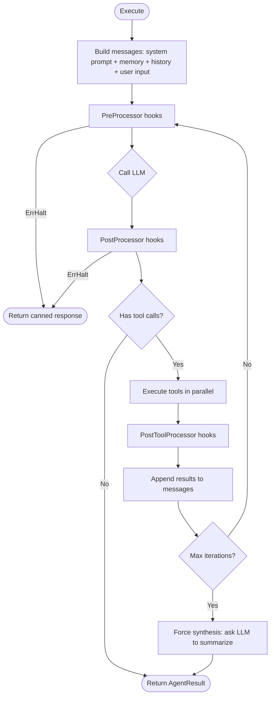

# Agent

Agent is the central primitive in Oasis — a composable unit of work that takes a task and returns a result. Everything builds on this interface.

## Agent Interface

**File:** `agent.go`

```go
type Agent interface {
    Name() string
    Description() string
    Execute(ctx context.Context, task AgentTask) (AgentResult, error)
}
```

Any struct implementing these three methods is an Agent. Agents compose recursively — Networks contain Agents, Workflows orchestrate Agents, and all implement Agent themselves.

## LLMAgent

**File:** `llmagent.go`

The most common Agent implementation. Runs a tool-calling loop with a single Provider: call LLM, execute tool calls, feed results back, repeat until the LLM produces a final text response.

```go
agent := oasis.NewLLMAgent("researcher", "Searches for information", provider,
    oasis.WithTools(searchTool, knowledgeTool),
    oasis.WithPrompt("You are a research assistant."),
    oasis.WithMaxIter(5),
)

result, err := agent.Execute(ctx, oasis.AgentTask{
    Input: "What are the best practices for Go error handling?",
})
```

### Execution Loop



### Key Behaviors

- **Parallel tool execution** — when the LLM returns multiple tool calls in one response, they run concurrently via a fixed worker pool of `min(len(calls), 10)` goroutines pulling from a shared work channel. The dispatch is context-aware: if `ctx` is cancelled while tool calls are in-flight, the function returns immediately with error results for incomplete calls. Single calls run inline without goroutine overhead
- **Max iterations** — defaults to 10. When reached, the agent appends a synthesis prompt and makes one final LLM call
- **Streaming** — LLMAgent implements `StreamingAgent`. Emits `StreamEvent` values throughout execution: tool call start/result events during tool iterations, text-delta events during the final response
- **Memory** — stateless by default. Enable with `WithConversationMemory` and `WithUserMemory`

## AgentTask

The input to any Agent:

```go
type AgentTask struct {
    Input       string         // natural language task
    Attachments []Attachment   // optional multimodal content
    Context     map[string]any // optional metadata
}
```

Context carries metadata through the agent hierarchy. Use the typed constants and accessors:

```go
task := oasis.AgentTask{
    Input: "hello",
    Context: map[string]any{
        oasis.ContextThreadID: "thread-123",
        oasis.ContextUserID:   "user-42",
        oasis.ContextChatID:   "chat-99",
    },
}
task.TaskThreadID()  // "thread-123"
task.TaskUserID()    // "user-42"
task.TaskChatID()    // "chat-99"
```

## AgentResult

The output from any Agent:

```go
type AgentResult struct {
    Output      string       // final response text
    Attachments []Attachment // multimodal content from LLM response
    Usage       Usage        // aggregate token usage across all LLM calls
    Steps       []StepTrace  // per-step execution trace, chronological order
}
```

### Execution Traces

`Steps` records every tool call and agent delegation that occurred during execution. Each `StepTrace` includes name, type (`"tool"`, `"agent"`, or `"step"` for Workflows), input, output, token usage, and wall-clock duration:

```go
result, _ := network.Execute(ctx, task)
for _, step := range result.Steps {
    fmt.Printf("%-6s %-20s %5dms  in=%-4d out=%d\n",
        step.Type, step.Name, step.Duration.Milliseconds(),
        step.Usage.InputTokens, step.Usage.OutputTokens)
}
```

`Steps` is nil when no tools were called. See [Observability](observability.md#built-in-execution-traces-no-otel-required) for details.

## AgentOptions

Options shared by `NewLLMAgent` and `NewNetwork`:

| Option | Description |
| ------ | ----------- |
| `WithTools(tools ...Tool)` | Add tools |
| `WithPrompt(s string)` | Set system prompt |
| `WithMaxIter(n int)` | Max tool-calling iterations (default 10) |
| `WithAgents(agents ...Agent)` | Add subagents (Network only) |
| `WithProcessors(processors ...any)` | Add processor middleware |
| `WithInputHandler(h InputHandler)` | Enable human-in-the-loop |
| `WithPlanExecution()` | Enable batched tool calls via `execute_plan` tool |
| `WithCodeExecution(r CodeRunner)` | Enable sandboxed code execution via `execute_code` tool |
| `WithResponseSchema(s *ResponseSchema)` | Enforce structured JSON output. Use `NewResponseSchema(name, schema)` with `SchemaObject` for type-safe schema building |
| `WithDynamicPrompt(fn PromptFunc)` | Per-request system prompt resolution |
| `WithDynamicModel(fn ModelFunc)` | Per-request provider/model selection |
| `WithDynamicTools(fn ToolsFunc)` | Per-request tool set (replaces static tools) |
| `WithConversationMemory(s Store, opts...)` | Enable history load/persist per thread |
| `WithUserMemory(m MemoryStore, e EmbeddingProvider)` | Enable user fact injection + auto-extraction |
| `WithTracer(t Tracer)` | Attach a tracer for span creation (`agent.execute` → `agent.loop.iteration`, etc.) |
| `WithLogger(l *slog.Logger)` | Attach a structured logger (replaces `log.Printf`) |

## Dynamic Configuration

All three dynamic options accept a function called at the start of every `Execute`/`ExecuteStream` call. Dynamic values override their static counterparts.

### Dynamic Prompt

Per-request system prompt based on user attributes, locale, tier, etc.:

```go
agent := oasis.NewLLMAgent("assistant", "Multi-tenant assistant", provider,
    oasis.WithPrompt("You are a helpful assistant."), // fallback
    oasis.WithDynamicPrompt(func(ctx context.Context, task oasis.AgentTask) string {
        user, _ := db.GetUser(ctx, task.TaskUserID())
        return fmt.Sprintf("You assist %s, a %s-tier user.", user.Name, user.Tier)
    }),
)
```

### Dynamic Model

Per-request provider selection (e.g., route pro-tier users to a better model):

```go
agent := oasis.NewLLMAgent("assistant", "Tiered assistant", defaultProvider,
    oasis.WithDynamicModel(func(ctx context.Context, task oasis.AgentTask) oasis.Provider {
        if task.Context["tier"] == "pro" {
            return geminiPro
        }
        return geminiFlash
    }),
)
```

### Dynamic Tools

Per-request tool gating (e.g., admin-only tools):

```go
agent := oasis.NewLLMAgent("assistant", "Role-gated assistant", provider,
    oasis.WithDynamicTools(func(ctx context.Context, task oasis.AgentTask) []oasis.Tool {
        if task.Context["role"] == "admin" {
            return allTools
        }
        return safeTools
    }),
)
```

Dynamic tools **replace** (not merge with) the static `WithTools` set.

### Task Context in Tools

`LLMAgent` and `Network` automatically inject the `AgentTask` into `context.Context` at the start of every `Execute` call. Tools can read it via `TaskFromContext`:

```go
func (t *MyTool) Execute(ctx context.Context, name string, args json.RawMessage) (oasis.ToolResult, error) {
    task, ok := oasis.TaskFromContext(ctx)
    if ok {
        userID := task.TaskUserID()
        // personalize, authorize, audit, etc.
    }
    // ...
}
```

This works without any changes to the `Tool` interface.

## StreamingAgent

Optional capability for agents that support event streaming:

```go
type StreamingAgent interface {
    Agent
    ExecuteStream(ctx context.Context, task AgentTask, ch chan<- StreamEvent) (AgentResult, error)
}
```

Both `LLMAgent` and `Network` implement it. The channel carries typed `StreamEvent` values:

| Event | Emitted by | Fields |
| ----- | ---------- | ------ |
| `EventTextDelta` | Provider | `Content` (token text) |
| `EventToolCallStart` | Agent | `Name`, `Args` (JSON) |
| `EventToolCallResult` | Agent | `Name`, `Content` (result), `Usage`, `Duration` |
| `EventAgentStart` | Network | `Name` (subagent name) |
| `EventAgentFinish` | Network | `Name`, `Content` (output), `Usage`, `Duration` |

Check at runtime via type assertion:

```go
if sa, ok := agent.(oasis.StreamingAgent); ok {
    ch := make(chan oasis.StreamEvent, 64)
    go func() {
        for ev := range ch {
            switch ev.Type {
            case oasis.EventTextDelta:
                fmt.Print(ev.Content)
            case oasis.EventToolCallStart:
                fmt.Printf("[calling %s...]\n", ev.Name)
            case oasis.EventToolCallResult:
                fmt.Printf("[%s done]\n", ev.Name)
            }
        }
    }()
    result, err := sa.ExecuteStream(ctx, task, ch)
}
```

## Background Execution

`Spawn` launches any Agent in a background goroutine:

```go
handle := oasis.Spawn(ctx, agent, task)

handle.State()   // Pending, Running, Completed, Failed, Cancelled
handle.Done()    // channel, closed when done
handle.Await(ctx) // block until done
handle.Cancel()   // request cancellation
```

See [Background Agents Guide](../guides/background-agents.md) for patterns.

## Suspend/Resume

Agents support pausing execution to await external input. A processor can return `Suspend(payload)` to pause the agent — `Execute` returns `ErrSuspended`, which carries a `Resume(ctx, data)` method to continue from where it left off. Conversation history is preserved across suspend/resume cycles.

See [Workflow](workflow.md) for DAG-level suspend/resume and [Processors](processor.md) for processor-triggered gates.

## See Also

- [Network](network.md) — multi-agent coordination
- [Workflow](workflow.md) — deterministic DAG orchestration
- [Tool](tool.md) — what agents can do
- [Code Execution](code-execution.md) — sandboxed Python with tool bridge
- [Memory](memory.md) — conversation and user memory
- [Observability](observability.md) — tracing and structured logging
- [Custom Agent Guide](../guides/custom-agent.md)
