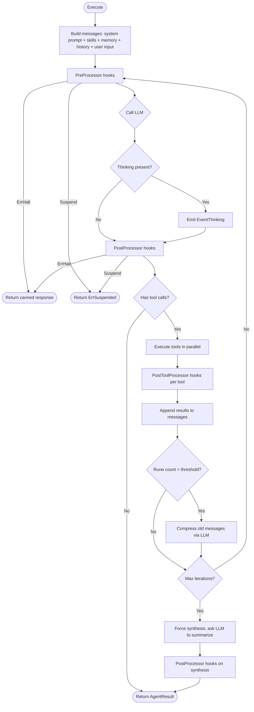

# Agent

Agent is the central primitive in Oasis — a composable unit of work that takes a task and returns a result. Everything builds on this interface.

## Agent Interface

**File:** `agent.go`

```go
type Agent interface {
    Name() string
    Description() string
    Execute(ctx context.Context, task AgentTask) (AgentResult, error)
}
```

Any struct implementing these three methods is an Agent. Agents compose recursively — Networks contain Agents, Workflows orchestrate Agents, and all implement Agent themselves.

## LLMAgent

**File:** `llmagent.go`

The most common Agent implementation. Runs a tool-calling loop with a single Provider: call LLM, execute tool calls, feed results back, repeat until the LLM produces a final text response.

```go
agent := oasis.NewLLMAgent("researcher", "Searches for information", provider,
    oasis.WithTools(searchTool, knowledgeTool),
    oasis.WithPrompt("You are a research assistant."),
    oasis.WithMaxIter(5),
)

result, err := agent.Execute(ctx, oasis.AgentTask{
    Input: "What are the best practices for Go error handling?",
})
```

### Execution Loop


```mermaid
flowchart TD
    START([Execute]) --> BUILD[Build messages: system prompt + skills + memory + history + user input]
    BUILD --> PRE[PreProcessor hooks]
    PRE -->|ErrHalt| HALT([Return canned response])
    PRE -->|Suspend| SUSPENDED([Return ErrSuspended])
    PRE --> LLM{Call LLM}
    LLM --> THINK{Thinking present?}
    THINK -->|Yes| EMIT_THINK[Emit EventThinking]
    THINK -->|No| POST
    EMIT_THINK --> POST[PostProcessor hooks]
    POST -->|ErrHalt| HALT
    POST -->|Suspend| SUSPENDED
    POST --> CHECK{Has tool calls?}
    CHECK -->|No| DONE([Return AgentResult])
    CHECK -->|Yes| DISPATCH[Execute tools in parallel]
    DISPATCH --> POSTTOOL[PostToolProcessor hooks per tool]
    POSTTOOL --> APPEND[Append results to messages]
    APPEND --> COMPRESS{Rune count > threshold?}
    COMPRESS -->|Yes| SUMMARIZE[Compress old messages via LLM]
    COMPRESS -->|No| ITER
    SUMMARIZE --> ITER{Max iterations?}
    ITER -->|No| PRE
    ITER -->|Yes| SYNTH[Force synthesis: ask LLM to summarize]
    SYNTH --> SYNTHPOST[PostProcessor hooks on synthesis]
    SYNTHPOST --> DONE
```

### Key Behaviors

- **Parallel tool execution** — when the LLM returns multiple tool calls in one response, they run concurrently via a fixed worker pool of `min(len(calls), 10)` goroutines pulling from a shared work channel. The dispatch is context-aware: if `ctx` is cancelled while tool calls are in-flight, the function returns immediately with error results for incomplete calls. Single calls run inline without goroutine overhead. Individual tool panics are caught by recovery wrappers and converted to error results (`"error: tool <name> panic: <value>"`) — a panicking tool never crashes the agent
- **Max iterations** — defaults to 10. When reached, the agent appends a synthesis prompt (`"You have used all available tool calls. Summarize what you found and respond to the user."`) and makes one final LLM call without tools. PostProcessor hooks run on the synthesis response as well
- **Streaming** — LLMAgent implements `StreamingAgent`. Emits `StreamEvent` values throughout execution: tool call start/result events during tool iterations, text-delta events during the final response. All channel sends are context-guarded — if the consumer stops reading or the context is cancelled, the agent loop exits cleanly instead of blocking
- **Memory** — stateless by default. Enable with `WithConversationMemory` and `WithUserMemory`
- **Cached tool definitions** — when using static tools (no `WithDynamicTools`), tool definitions are computed once at construction time and reused across `Execute` calls. Dynamic tools still rebuild per-request
- **Bounded attachments** — tool-result attachments are accumulated up to a cap of 50 per execution and a byte budget (default 50 MB, configurable via `WithMaxAttachmentBytes`). This prevents unbounded memory growth in long-running loops with attachment-heavy tools
- **Tool result truncation** — tool results exceeding 100,000 runes (~25K tokens) are truncated in the message history with an `[output truncated]` marker. Stream events and step traces retain the full content. This prevents unbounded memory growth from tools returning very large outputs
- **Suspend snapshot budget** — per-agent limits on concurrent suspended states: max snapshots (default 20) and max bytes (default 256 MB), configurable via `WithSuspendBudget`. When the budget is exceeded, suspension is rejected with an error instead of leaking memory. Counters are decremented when `Resume()` or `Release()` is called
- **Context compression** — per-turn LLM summarization of old tool results when message rune count exceeds the threshold set by `WithCompressThreshold`. **Disabled by default** (the old 200K default is gone). Uses a dedicated provider when configured via `WithCompressModel`, falling back to the main provider. The last 2 iterations are always preserved intact. Degrades gracefully on error (continues uncompressed). For long-running chat threads, prefer per-thread compaction via [`WithCompaction`](compaction.md) — per-turn compression remains useful for narrow scopes where tool results bloat a single execution; per-thread compaction is the better default for ongoing conversations
- **Generation parameters** — `WithTemperature`, `WithTopP`, `WithTopK`, `WithMaxTokens` set per-agent LLM sampling parameters. All fields are pointer types — nil means "use provider default", so agents sharing one provider can have different temperatures without creating separate provider instances. Parameters are injected into every `ChatRequest.GenerationParams`; providers map them to their native API
- **Thinking visibility** — when the LLM returns reasoning/chain-of-thought content (e.g., Gemini thinking mode), it's captured in `ChatResponse.Thinking` and exposed via `AgentResult.Thinking` (last reasoning before the final response). An `EventThinking` stream event fires after each LLM call when thinking is present. PostProcessors can inspect reasoning for guardrails or debugging via the full `ChatResponse`

## AgentTask

The input to any Agent:

```go
type AgentTask struct {
    Input       string         // natural language task
    Attachments []Attachment   // optional multimodal content
    Context     map[string]any // optional metadata
}
```

Context carries metadata through the agent hierarchy. Use the typed constants and accessors:

```go
task := oasis.AgentTask{
    Input: "hello",
}.WithThreadID("thread-123").WithUserID("user-42").WithChatID("chat-99")

task.TaskThreadID()  // "thread-123"
task.TaskUserID()    // "user-42"
task.TaskChatID()    // "chat-99"
```

## AgentResult

The output from any Agent:

```go
type AgentResult struct {
    Output      string       // final response text
    Thinking    string       // last LLM reasoning/chain-of-thought before final response
    Attachments []Attachment // multimodal content from LLM response
    Usage       Usage        // aggregate token usage across all LLM calls
    Steps       []StepTrace  // per-step execution trace, chronological order
}
```

### Execution Traces

`Steps` records every tool call and agent delegation that occurred during execution. Each `StepTrace` includes name, type (`"tool"`, `"agent"`, or `"step"` for Workflows), input, output, token usage, and wall-clock duration:

```go
result, _ := network.Execute(ctx, task)
for _, step := range result.Steps {
    fmt.Printf("%-6s %-20s %5dms  in=%-4d out=%d\n",
        step.Type, step.Name, step.Duration.Milliseconds(),
        step.Usage.InputTokens, step.Usage.OutputTokens)
}
```

`Steps` is nil when no tools were called. See [Observability](observability.md#built-in-execution-traces-no-otel-required) for details.

## AgentOptions

Options shared by `NewLLMAgent` and `NewNetwork`:

| Option | Description |
| ------ | ----------- |
| `WithTools(tools ...Tool)` | Add tools |
| `WithPrompt(s string)` | Set system prompt |
| `WithMaxIter(n int)` | Max tool-calling iterations (default 10) |
| `WithAgents(agents ...Agent)` | Add subagents (Network only) |
| `WithProcessors(processors ...any)` | Add processor middleware |
| `WithInputHandler(h InputHandler)` | Enable human-in-the-loop |
| `WithPlanExecution()` | Enable batched tool calls via `execute_plan` tool |
| `WithSandbox(sb any, tools ...Tool)` | Enable sandbox tools (shell, execute_code, file_read, file_write, browser, screenshot, mcp_call) |
| `WithResponseSchema(s *ResponseSchema)` | Enforce structured JSON output. Use `NewResponseSchema(name, schema)` with `SchemaObject` for type-safe schema building |
| `WithDynamicPrompt(fn PromptFunc)` | Per-request system prompt resolution |
| `WithDynamicModel(fn ModelFunc)` | Per-request provider/model selection |
| `WithDynamicTools(fn ToolsFunc)` | Per-request tool set (replaces static tools) |
| `WithConversationMemory(s Store, opts...)` | Enable history load/persist per thread |
| `WithUserMemory(m MemoryStore, e EmbeddingProvider)` | Enable user fact injection + auto-extraction |
| `WithMaxAttachmentBytes(n int64)` | Max accumulated attachment bytes per execution (default 50 MB) |
| `WithSuspendBudget(maxSnapshots int, maxBytes int64)` | Per-agent suspend snapshot limits (default 20 snapshots, 256 MB) |
| `WithCompressModel(fn ModelFunc)` | Provider for LLM-driven per-turn context compression (falls back to main provider). See [`WithCompaction`](compaction.md) for per-thread compaction (preferred for long threads) |
| `WithCompressThreshold(n int)` | Rune count threshold for per-turn tool-result compression. **Disabled by default** (zero or negative). For long threads, prefer [per-thread compaction](compaction.md) |
| `WithTemperature(t float64)` | Set LLM sampling temperature (nil = provider default) |
| `WithTopP(p float64)` | Set nucleus sampling probability (nil = provider default) |
| `WithTopK(k int)` | Set top-K sampling parameter (nil = provider default) |
| `WithMaxTokens(n int)` | Set maximum output tokens (nil = provider default) |
| `WithActiveSkills(skills ...Skill)` | Pre-activate skills — instructions appended to system prompt |
| `WithSkills(p SkillProvider)` | Register skill provider, adds `skill_discover` and `skill_activate` tools. If provider implements `SkillWriter`, also adds `skill_create` and `skill_update` |
| `WithTracer(t Tracer)` | Attach a tracer for span creation (`agent.execute` → `agent.loop.iteration`, etc.) |
| `WithLogger(l *slog.Logger)` | Attach a structured logger (replaces `log.Printf`) |

## Dynamic Configuration

All three dynamic options accept a function called at the start of every `Execute`/`ExecuteStream` call. Dynamic values override their static counterparts.

### Dynamic Prompt

Per-request system prompt based on user attributes, locale, tier, etc.:

```go
agent := oasis.NewLLMAgent("assistant", "Multi-tenant assistant", provider,
    oasis.WithPrompt("You are a helpful assistant."), // fallback
    oasis.WithDynamicPrompt(func(ctx context.Context, task oasis.AgentTask) string {
        user, _ := db.GetUser(ctx, task.TaskUserID())
        return fmt.Sprintf("You assist %s, a %s-tier user.", user.Name, user.Tier)
    }),
)
```

### Dynamic Model

Per-request provider selection (e.g., route pro-tier users to a better model):

```go
agent := oasis.NewLLMAgent("assistant", "Tiered assistant", defaultProvider,
    oasis.WithDynamicModel(func(ctx context.Context, task oasis.AgentTask) oasis.Provider {
        if task.Context["tier"] == "pro" {
            return geminiPro
        }
        return geminiFlash
    }),
)
```

### Dynamic Tools

Per-request tool gating (e.g., admin-only tools):

```go
agent := oasis.NewLLMAgent("assistant", "Role-gated assistant", provider,
    oasis.WithDynamicTools(func(ctx context.Context, task oasis.AgentTask) []oasis.Tool {
        if task.Context["role"] == "admin" {
            return allTools
        }
        return safeTools
    }),
)
```

Dynamic tools **replace** (not merge with) the static `WithTools` set.

### Task Context in Tools

`LLMAgent` and `Network` automatically inject the `AgentTask` into `context.Context` at the start of every `Execute` call. Tools can read it via `TaskFromContext`:

```go
func (t *MyTool) Execute(ctx context.Context, name string, args json.RawMessage) (oasis.ToolResult, error) {
    task, ok := oasis.TaskFromContext(ctx)
    if ok {
        userID := task.TaskUserID()
        // personalize, authorize, audit, etc.
    }
    // ...
}
```

This works without any changes to the `Tool` interface.

## StreamingAgent

Optional capability for agents that support event streaming:

```go
type StreamingAgent interface {
    Agent
    ExecuteStream(ctx context.Context, task AgentTask, ch chan<- StreamEvent) (AgentResult, error)
}
```

Both `LLMAgent` and `Network` implement it. The channel carries typed `StreamEvent` values:

| Event | Emitted by | Fields |
| ----- | ---------- | ------ |
| `EventInputReceived` | Agent | `Content` (task input) — emitted once at start |
| `EventProcessingStart` | Agent | — emitted when loop begins |
| `EventTextDelta` | Provider | `Content` (token text) |
| `EventToolCallStart` | Agent | `Name`, `Args` (JSON) |
| `EventToolCallDelta` | Provider | `Name`, `Args` (incremental tool arg chunks during streaming) |
| `EventToolCallResult` | Agent | `Name`, `Content` (result), `Usage`, `Duration` |
| `EventToolProgress` | StreamingTool | `Name`, `Content` (intermediate progress from streaming tools) |
| `EventThinking` | Agent | `Content` (reasoning/chain-of-thought text) |
| `EventAgentStart` | Network | `Name` (subagent name) |
| `EventAgentFinish` | Network | `Name`, `Content` (output), `Usage`, `Duration` |
| `EventRoutingDecision` | Network | `Content` (JSON: `{"agents":[...],"tools":[...]}`) |
| `EventStepStart` | Workflow | `Name` (step name) |
| `EventStepFinish` | Workflow | `Name`, `Content` (output), `Usage`, `Duration` |
| `EventStepProgress` | Workflow | `Name`, `Content` (ForEach iteration progress) |
| `EventFileAttachment` | Sandbox | `Name` (filename), `Content` (file path or ref) |

Check at runtime via type assertion:

```go
if sa, ok := agent.(oasis.StreamingAgent); ok {
    ch := make(chan oasis.StreamEvent, 64)
    go func() {
        for ev := range ch {
            switch ev.Type {
            case oasis.EventTextDelta:
                fmt.Print(ev.Content)
            case oasis.EventToolCallStart:
                fmt.Printf("[calling %s...]\n", ev.Name)
            case oasis.EventToolCallResult:
                fmt.Printf("[%s done]\n", ev.Name)
            }
        }
    }()
    result, err := sa.ExecuteStream(ctx, task, ch)
}
```

## Background Execution

`Spawn` launches any Agent in a background goroutine:

```go
handle := oasis.Spawn(ctx, agent, task)

handle.State()   // Pending, Running, Completed, Failed, Cancelled
handle.Done()    // channel, closed when done
handle.Await(ctx) // block until done
handle.Cancel()   // request cancellation
```

`Spawn` is panic-safe: if the agent panics, the handle transitions to `StateFailed` and the `Done` channel closes normally. See [Background Agents Guide](../guides/background-agents.md) for patterns.

## Suspend/Resume

Agents support pausing execution to await external input. A processor can return `Suspend(payload)` to pause the agent — `Execute` returns `ErrSuspended`, which carries a `Resume(ctx, data)` method to continue from where it left off. Conversation history is preserved across suspend/resume cycles.

`Resume` is single-use — the captured message snapshot is freed after the call. A **default TTL of 30 minutes** is applied automatically — abandoned suspensions are auto-released to prevent memory leaks. Override with `WithSuspendTTL` or call `Release()` manually:

```go
var suspended *oasis.ErrSuspended
if errors.As(err, &suspended) {
    suspended.WithSuspendTTL(5 * time.Minute) // override default 30m TTL
    // ... store for later resume ...
}
```

See [Workflow](workflow.md) for DAG-level suspend/resume and [Processors](processor.md) for processor-triggered gates.

## Skills

Skills are file-based instruction packages that agents can discover, activate, and create at runtime. Two options control skill integration:

**`WithActiveSkills`** — pre-activate skills at construction time. Skill instructions are appended to the system prompt with `---` separators:

```go
agent := oasis.NewLLMAgent("writer", "Technical writer", provider,
    oasis.WithActiveSkills(codingSkill, styleSkill),
)
```

**`WithSkills`** — register a `SkillProvider` for on-demand discovery. Adds `skill_discover` and `skill_activate` tools so the LLM can find and load skills at runtime:

```go
agent := oasis.NewLLMAgent("assistant", "Versatile assistant", provider,
    oasis.WithSkills(fileSkillProvider),
)
```

If the provider implements `SkillWriter`, `skill_create` and `skill_update` tools are also added, letting the agent author new skills.

Both options work on LLMAgent and Network. See [Skills Guide](../guides/skills.md) for details.

## Plan Execution

`WithPlanExecution()` adds the built-in `execute_plan` tool. The LLM batches multiple tool calls in a single turn — all steps run in parallel without re-sampling, reducing latency and tokens for fan-out patterns.

### Restrictions

- **Max 50 steps per plan** — plans exceeding this limit are rejected with an error
- **No nesting** — `execute_plan` cannot call itself within a plan step
- **`ask_user` blocked** — human-in-the-loop is not available inside plan steps

## Graceful Shutdown

When using conversation memory, message persistence happens in background goroutines. Call `Drain()` before process exit to ensure all in-flight writes complete:

```go
result, err := agent.Execute(ctx, task)
// ... use result ...
agent.Drain() // wait for background memory persistence to finish
```

Both `LLMAgent` and `Network` expose `Drain()`. Without it, messages from the last execution may not be persisted.

## Sub-Agent Spawning

`WithSubAgentSpawning` injects a built-in `spawn_agent` tool into the LLM's tool set. The LLM can call it to dynamically create and run a focused sub-agent mid-execution. This is distinct from `NewNetwork` — rather than a fixed topology defined at construction time, the parent decides at runtime whether and how to delegate.

```go
agent := oasis.NewLLMAgent("orchestrator", "Breaks work into sub-tasks", provider,
    oasis.WithTools(searchTool, writeTool),
    oasis.WithSubAgentSpawning(oasis.SubAgentConfig{
        MaxSpawnDepth:  2,
        DenySpawnTools: []string{"write"},
    }),
)
```

### `spawn_agent` Tool Schema

| Field | Type | Required | Description |
| ----- | ---- | -------- | ----------- |
| `task` | string | yes | The task to delegate to the sub-agent |
| `name` | string | no | Optional name for the sub-agent (defaults to `"sub-agent"`) |

### What Sub-Agents Inherit

Sub-agents are created fresh for each call. They inherit from the parent:

- Provider (same LLM backend)
- Tools (same tool set, minus any in `DenySpawnTools`)
- `MaxIter`
- Generation parameters (`Temperature`, `TopP`, `TopK`, `MaxTokens`)
- Logger

They do **not** inherit: store, memory, processors, input handler, response schema, tracer, suspend config, compress settings, or per-thread compaction settings. Sub-agents have no access to the parent's conversation history.

### Depth Limiting

`MaxSpawnDepth` (default `1`) caps how many levels of spawning are allowed. A depth of 1 means the parent can spawn sub-agents, but those sub-agents cannot spawn further. Attempts to spawn beyond the limit return an error to the LLM.

### Tool Restriction

`DenySpawnTools` lists tool names to strip from sub-agents. Use this to prevent sub-agents from calling side-effectful tools (writes, sends, etc.) while still allowing reads.

```go
oasis.SubAgentConfig{
    DenySpawnTools: []string{"send_email", "write_file"},
}
```

### Blocked Behaviors

- `ask_user` is always blocked in sub-agents — human-in-the-loop cannot be delegated downward
- `spawn_agent` is blocked inside `execute_code` — sandboxed code cannot trigger agent spawning

### Parallel Execution

The LLM can call `spawn_agent` multiple times in a single response. Like all tool calls in LLMAgent, they run concurrently via the parallel tool dispatch pool. The parent's execution loop collects all results before continuing.

```
Parent LLM response:
  spawn_agent(task="research topic A", name="researcher-a")   ─┐
  spawn_agent(task="research topic B", name="researcher-b")   ─┤─ run in parallel
  spawn_agent(task="research topic C", name="researcher-c")   ─┘
```

## See Also

- [Network](network.md) — multi-agent coordination
- [Workflow](workflow.md) — deterministic DAG orchestration
- [Tool](tool.md) — what agents can do
- [Sandbox](sandbox.md) — Docker container with shell, code execution, file I/O, browser, and MCP
- [Memory](memory.md) — conversation and user memory
- [Observability](observability.md) — tracing and structured logging
- [Custom Agent Guide](../guides/custom-agent.md)
