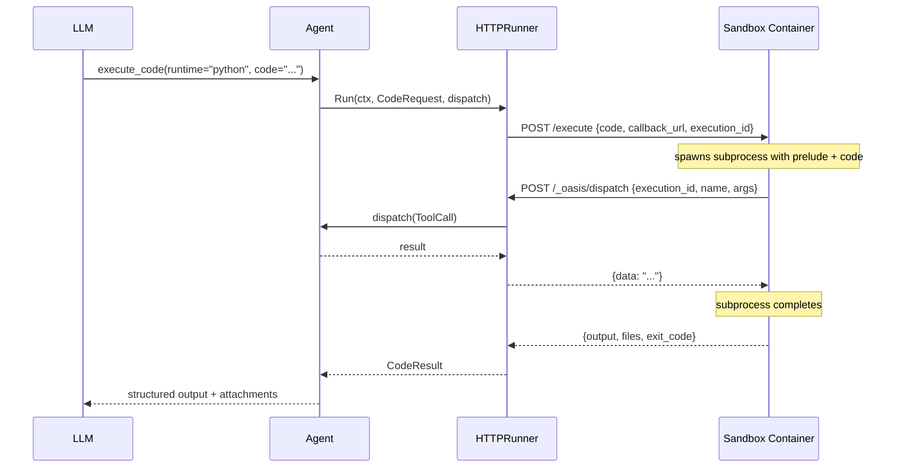
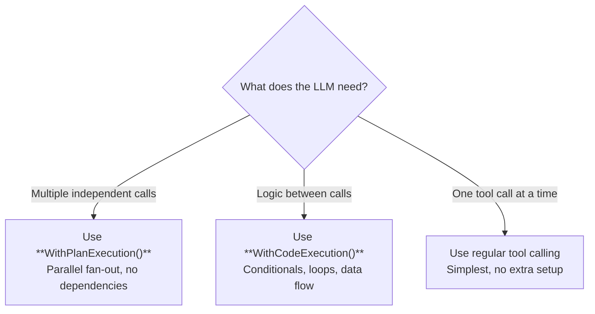

# Code Execution

Code execution lets the LLM write and run code in a sandboxed environment. The LLM can write Python or Node.js code that has full access to the agent's tools via `call_tool()` / `callTool()`, enabling complex logic that plain tool calling can't express — conditionals, loops, data transformation, and multi-step workflows with data flow between steps.

## CodeRunner Interface

**File:** `code.go`

```go
type CodeRunner interface {
    Run(ctx context.Context, req CodeRequest, dispatch DispatchFunc) (CodeResult, error)
}
```

The `dispatch` function bridges code back to the agent's tool registry. When code calls `call_tool("web_search", {"query": "..."})`, the sandbox POSTs to the callback server, which invokes `dispatch` with a `ToolCall`, and returns the result over HTTP.

## Architecture

The code execution system uses a **sidecar sandbox** pattern: a separate container runs user code, communicating with the framework via HTTP. This isolates the app process from arbitrary code execution and enables multi-runtime support.



### Component Overview

```
┌─────────────┐     POST /execute      ┌──────────────────┐
│             │ ───────────────────────►│                  │
│  HTTPRunner │                         │  Sandbox Service │
│  (code/)    │◄─── POST /_oasis/ ────│  (cmd/sandbox/)  │
│             │     dispatch            │                  │
│  callback   │                         │  Python / Node   │
│  server     │ ◄───── response ────── │  subprocess      │
└─────────────┘                         └──────────────────┘
      ▲                                        │
      │ dispatch(ToolCall)                     │
      ▼                                        │
┌─────────────┐                                │
│  Agent      │                         workspace dirs
│  Tool       │                         with TTL cleanup
│  Registry   │
└─────────────┘
```

- **HTTPRunner** (`code/` package) — the `CodeRunner` implementation in the framework. POSTs code to the sandbox, manages callback dispatch, decodes file results.
- **Callback Server** — embedded HTTP server (or externally mounted handler) that routes tool call callbacks from the sandbox back to the agent's dispatch function using correlation IDs.
- **Sandbox Service** (`cmd/sandbox/`) — reference Docker sidecar. Receives code, spawns subprocess with runtime prelude, manages session-scoped workspaces.

## Code vs Plan Execution

Both `WithPlanExecution()` and `WithCodeExecution()` reduce LLM round-trips, but they solve different problems:

| | Plan Execution | Code Execution |
|---|---|---|
| **Model** | Declarative (list of steps) | Imperative (Python/JS code) |
| **Control flow** | Parallel fan-out only | Conditionals, loops, data flow |
| **Data dependencies** | None (steps are independent) | Full (step 2 can use step 1's result) |
| **Error handling** | Partial failure per step | try/except or try/catch |
| **Best for** | "Run these 5 searches at once" | "Search, then filter, then summarize" |
| **Overhead** | None (Go-native) | HTTP + subprocess |



## HTTPRunner

**Package:** `github.com/nevindra/oasis/code`

The framework-side `CodeRunner` implementation. Sends code to a remote sandbox service via HTTP and handles tool callbacks.

```go
import "github.com/nevindra/oasis/code"

runner := code.NewHTTPRunner("http://sandbox:9000",
    code.WithTimeout(30 * time.Second),
)
defer runner.Close()

agent := oasis.NewLLMAgent("analyst", "Data analysis agent", provider,
    oasis.WithTools(searchTool, fileTool),
    oasis.WithCodeExecution(runner),
)
```

### How It Works

1. **Callback server** — on first `Run()`, HTTPRunner auto-starts an HTTP server on a random port. The sandbox POSTs tool call requests to `/_oasis/dispatch` on this server.
2. **POST /execute** — HTTPRunner sends the code, runtime, callback URL, and execution ID to the sandbox's `/execute` endpoint.
3. **Tool dispatch** — the callback server routes incoming tool calls to the correct execution via correlation ID, dispatches through the agent's `DispatchFunc`, and returns results.
4. **File handling** — input files are base64-encoded on the wire; output files declared via `set_result(files=[...])` are returned base64-encoded and decoded into `CodeResult.Files`.
5. **Retry** — transient failures (5xx, timeout, connection refused) are retried with exponential backoff.

### External Callback Mount

For apps that already run an HTTP server, mount the callback handler instead of auto-starting a listener:

```go
runner := code.NewHTTPRunner("http://sandbox:9000",
    code.WithCallbackExternal("http://myapp:8080"),
)
// Mount on your mux:
mux.Handle("/_oasis/dispatch", runner.Handler())
```

## Sandbox Service

**Package:** `cmd/sandbox/`

The reference sandbox is a Docker sidecar that executes code in subprocess isolation. It supports Python and Node.js runtimes.

### HTTP API

| Endpoint | Method | Description |
|----------|--------|-------------|
| `/execute` | POST | Execute code and return results |
| `/health` | GET | Health check |
| `/workspace/{session_id}` | DELETE | Delete a session workspace |

### How It Works

1. **Script assembly** — the sandbox concatenates a runtime-specific prelude, the LLM's code, and a postlude into a temporary file
2. **Subprocess spawn** — `os/exec` runs the appropriate binary (`python3` or `node`) with the temp file
3. **Tool bridge** — code calls `call_tool()`/`callTool()` which POSTs to the callback URL; the sandbox subprocess blocks until the tool result is returned
4. **Output capture** — `print()`/`console.log()` goes to stderr (captured as logs); structured results go through `set_result()`/`setResult()` → stdout JSON protocol
5. **File collection** — files declared in `set_result(files=[...])` are read from the workspace, base64-encoded, and included in the response

### Session Workspaces

Each `session_id` maps to a workspace directory. Files persist across executions within the same session. Workspaces are cleaned up via:
- **TTL eviction** — background goroutine removes workspaces not accessed within the TTL (default 1 hour)
- **Explicit delete** — `DELETE /workspace/{session_id}` for immediate cleanup

### Configuration

Environment variables for the sandbox service:

| Variable | Default | Description |
|----------|---------|-------------|
| `SANDBOX_ADDR` | `:9000` | Listen address |
| `SANDBOX_WORKSPACE` | `/var/sandbox` | Root directory for session workspaces |
| `SANDBOX_PYTHON_BIN` | `python3` | Python binary path |
| `SANDBOX_NODE_BIN` | `node` | Node.js binary path |
| `SANDBOX_MAX_CONCURRENT` | `4` | Max parallel executions (503 if exceeded) |
| `SANDBOX_SESSION_TTL` | `1h` | Workspace TTL before eviction |
| `SANDBOX_MAX_OUTPUT` | `524288` | Max stderr capture in bytes |

## Runtimes

### Python

The Python prelude injects these functions:

#### `call_tool(name, args=None)`

Call a single agent tool. Blocks until the result is returned.

```python
results = call_tool('web_search', {'query': 'Go concurrency patterns'})
content = call_tool('file_read', {'path': 'config.yaml'})
```

Returns the parsed JSON result. Raises `RuntimeError` on tool failure.

#### `call_tools_parallel(calls)`

Call multiple tools in parallel. Returns a list of results in the same order.

```python
results = call_tools_parallel([
    ('web_search', {'query': 'Python async'}),
    ('web_search', {'query': 'Go goroutines'}),
])
```

#### `set_result(data, files=None)`

Set the structured result. Call once at the end. Optionally declare files to return.

```python
set_result({
    "summary": "Found 3 articles",
    "articles": articles,
}, files=["chart.png", "report.csv"])
```

#### `install_package(name)`

Install a Python package at runtime via pip.

```python
install_package('httpx')
import httpx
```

#### `print()`

Goes to stderr → `CodeResult.Logs`. Does **not** appear in structured output.

### Node.js

The Node.js prelude injects equivalent functions. All tool functions are async.

#### `callTool(name, args)`

```javascript
const results = await callTool('web_search', { query: 'Node.js best practices' });
const content = await callTool('file_read', { path: 'config.yaml' });
```

Returns the parsed result. Throws `Error` on tool failure.

#### `callToolsParallel(calls)`

```javascript
const [a, b] = await callToolsParallel([
    ['web_search', { query: 'Python async' }],
    ['web_search', { query: 'Go goroutines' }],
]);
```

#### `setResult(data, files)`

```javascript
setResult({
    summary: 'Found 3 articles',
    articles: articles,
}, ['chart.png', 'report.csv']);
```

#### `installPackage(name)`

Install an npm package at runtime.

```javascript
await installPackage('cheerio');
const cheerio = require('cheerio');
```

#### `console.log()`

Redirected to stderr → `CodeResult.Logs`. Does **not** appear in structured output.

## Safety

The sandbox container is the security boundary — code runs in full isolation from the host app process.

### Container Isolation

Code executes inside a Docker container with its own filesystem, network, and process namespace. The container has no access to the host filesystem or the app's secrets unless explicitly configured.

### Workspace Isolation

Files are scoped to per-session workspace directories. Path traversal is prevented by sanitizing all file paths against the workspace root.

### Timeout

Execution has a configurable timeout (default 30s, max 300s). The subprocess is killed on timeout.

### Concurrency Limiting

The sandbox limits parallel executions via a semaphore. When at capacity, new requests receive HTTP 503 immediately (fail-fast, no queuing).

### Recursion Prevention

`call_tool('execute_code', ...)` from within code is blocked — code cannot spawn nested code execution.

## Options

**Package:** `github.com/nevindra/oasis/code`

| Option | Default | Description |
|--------|---------|-------------|
| `WithTimeout(d time.Duration)` | 30s | Maximum execution duration |
| `WithMaxOutput(bytes int)` | 64KB | Maximum output size. Output beyond this is truncated |
| `WithCallbackAddr(addr string)` | `127.0.0.1:0` | Listen address for auto-started callback server |
| `WithCallbackExternal(addr string)` | — | External callback URL (disables auto-start) |
| `WithMaxFileSize(bytes int64)` | 10MB | Max bytes per returned file. Oversized files degrade to metadata only |
| `WithMaxRetries(n int)` | 2 | Total POST attempts (1 = no retry) |
| `WithRetryDelay(d time.Duration)` | 500ms | Initial backoff delay between retries (doubles each retry) |

## See Also

- [Tool](tool.md) — tool interface, plan execution, parallel execution
- [Code Execution Guide](../guides/code-execution.md) — patterns and recipes
- [Agent](agent.md) — how agents use tools and code execution
- [API Reference: Interfaces](../api/interfaces.md)
