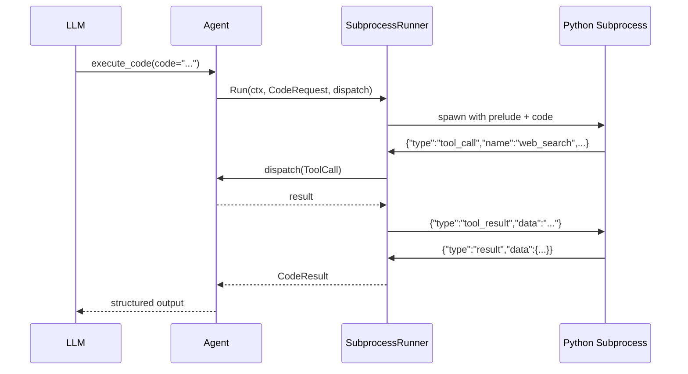
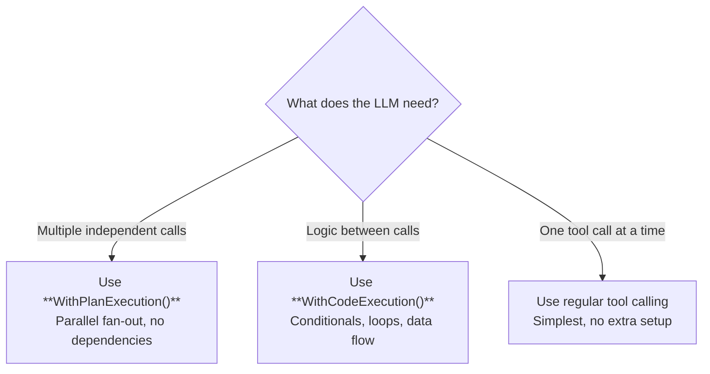

# Code Execution

Code execution lets the LLM write and run Python code in a sandboxed subprocess. The code has full access to the agent's tools via `call_tool()` and `call_tools_parallel()`, enabling complex logic that plain tool calling can't express — conditionals, loops, data transformation, and multi-step workflows with data flow between steps.

## CodeRunner Interface

**File:** `code.go`

```go
type CodeRunner interface {
    Run(ctx context.Context, req CodeRequest, dispatch DispatchFunc) (CodeResult, error)
}
```

The `dispatch` function bridges Python code back to the agent's tool registry. When Python calls `call_tool("web_search", {"query": "..."})`, the runner invokes `dispatch` with a `ToolCall`, waits for the result, and sends it back to Python via stdin.



## Code vs Plan Execution

Both `WithPlanExecution()` and `WithCodeExecution()` reduce LLM round-trips, but they solve different problems:

| | Plan Execution | Code Execution |
|---|---|---|
| **Model** | Declarative (list of steps) | Imperative (Python code) |
| **Control flow** | Parallel fan-out only | Conditionals, loops, data flow |
| **Data dependencies** | None (steps are independent) | Full (step 2 can use step 1's result) |
| **Error handling** | Partial failure per step | Python try/except |
| **Best for** | "Run these 5 searches at once" | "Search, then filter, then summarize" |
| **Overhead** | None (Go-native) | Python subprocess |



## SubprocessRunner

**Package:** `github.com/nevindra/oasis/code`

The default `CodeRunner` implementation. Spawns a Python 3 subprocess for each execution with a JSON-over-pipes protocol.

```go
import "github.com/nevindra/oasis/code"

runner := code.NewSubprocessRunner("python3",
    code.WithTimeout(30 * time.Second),
    code.WithWorkspace("/tmp/sandbox"),
)

agent := oasis.NewLLMAgent("analyst", "Data analysis agent", provider,
    oasis.WithTools(searchTool, fileTool),
    oasis.WithCodeExecution(runner),
)
```

### How It Works

1. **Script assembly** — the runner concatenates an embedded Python prelude, the LLM's code, and a postlude into a temporary `.py` file
2. **Subprocess spawn** — `os/exec` runs `python3 <tmpfile>` with pipes for stdin/stdout/stderr
3. **Protocol loop** — the runner reads JSON messages from stdout (tool calls, results), dispatches them via the agent's `DispatchFunc`, and writes responses to stdin
4. **Output capture** — `print()` output goes to stderr (captured as logs); structured results go through `set_result()` → stdout JSON protocol

```
┌──────────────┐         stdin (JSON)          ┌──────────────┐
│              │ ◄──────────────────────────── │              │
│  Go Runner   │                               │   Python     │
│  (protocol   │ ────────────────────────────► │   Process    │
│   loop)      │         stdout (JSON)         │              │
│              │                               │              │
│              │ ◄─────────────────────────── │  stderr       │
│              │         stderr (print)        │  = print()   │
└──────────────┘                               └──────────────┘
```

## Python API

The prelude injects these functions into every code execution:

### `call_tool(name, args=None)`

Call a single agent tool and block until the result is returned.

```python
# Search the web
results = call_tool('web_search', {'query': 'Go concurrency patterns'})

# Read a file
content = call_tool('file_read', {'path': 'config.yaml'})
```

Returns the parsed JSON result. Raises `RuntimeError` on tool failure.

### `call_tools_parallel(calls)`

Call multiple tools in parallel. Returns a list of results in the same order as the input.

```python
results = call_tools_parallel([
    ('web_search', {'query': 'Python async'}),
    ('web_search', {'query': 'Go goroutines'}),
    ('web_search', {'query': 'Rust async'}),
])
# results[0], results[1], results[2] — in order
```

### `set_result(data)`

Set the structured result to return to the agent. Call this once at the end of your code.

```python
set_result({
    "summary": "Found 3 relevant articles",
    "articles": articles,
    "score": 0.95,
})
```

If `set_result()` is never called, the agent receives a message indicating no result was set.

### `print()`

`print()` output goes to stderr and is captured as logs in `CodeResult.Logs`. It does **not** appear in the structured output — use it for debugging.

```python
print("Processing step 1...")  # appears in logs
data = call_tool('fetch', {'url': url})
print(f"Got {len(data)} items")  # appears in logs
set_result(data)                 # this is the actual output
```

## Safety

The prelude enforces several safety constraints:

### Workspace Isolation

File operations (`open()`, `os.remove()`, `shutil.rmtree()`) are restricted to the workspace directory set via `WithWorkspace()`. Attempting to read or write outside the workspace raises `PermissionError`.

```python
# OK — within workspace
f = open("output.json", "w")

# PermissionError — outside workspace
f = open("/etc/passwd", "r")
```

### Blocked Modules

`os.system()` and `subprocess` are blocked at the Python level. The LLM must use `call_tool()` to interact with the outside world — this keeps all actions auditable through the agent's tool dispatch.

### Pre-execution Blocklist

Before spawning the subprocess, the runner checks the code against a regex blocklist. Code containing `os.system(` or `subprocess.<func>(` patterns is rejected immediately without execution.

### Timeout

Execution has a configurable timeout (default 30s). The subprocess is killed on timeout.

### Recursion Prevention

`call_tool('execute_code', ...)` from within code is blocked — code cannot spawn nested code execution.

## Options

**Package:** `github.com/nevindra/oasis/code`

| Option | Default | Description |
|--------|---------|-------------|
| `WithTimeout(d time.Duration)` | 30s | Maximum execution duration. Subprocess is killed on timeout |
| `WithMaxOutput(bytes int)` | 64KB | Maximum output size. Output beyond this is truncated |
| `WithWorkspace(path string)` | `os.TempDir()` | Working directory. File operations restricted to this path |
| `WithEnv(key, value string)` | — | Set environment variable. Multiple calls accumulate |
| `WithEnvPassthrough()` | minimal env | Pass all host environment variables to subprocess |

## See Also

- [Tool](tool.md) — tool interface, plan execution, parallel execution
- [Code Execution Guide](../guides/code-execution.md) — patterns and recipes
- [Agent](agent.md) — how agents use tools and code execution
- [API Reference: Interfaces](../api/interfaces.md)
