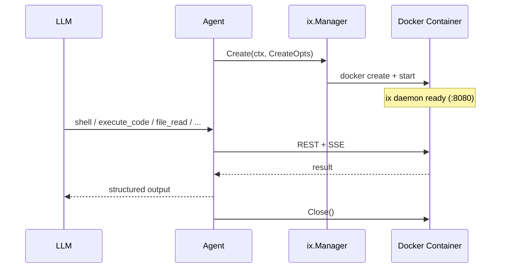
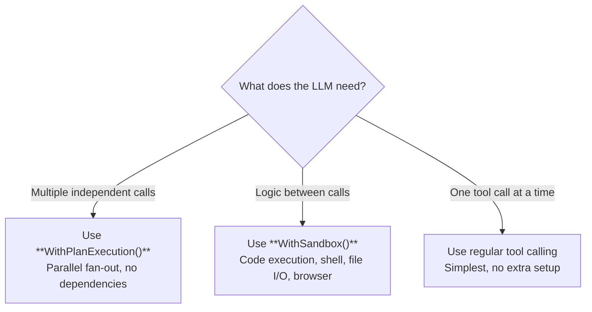

# Code Execution

Code execution lets the LLM write and run code in a sandboxed environment. The sandbox provides a full-featured Docker container with shell access, code execution, file I/O, browser automation, and MCP server integration — all auto-registered as agent tools.

## Sandbox Interface

**Package:** `github.com/nevindra/oasis/sandbox`

```go
type Sandbox interface {
    Shell(ctx context.Context, req ShellRequest) (ShellResult, error)
    ExecCode(ctx context.Context, req CodeRequest) (CodeResult, error)
    ReadFile(ctx context.Context, path string) (FileContent, error)
    WriteFile(ctx context.Context, req WriteFileRequest) error
    EditFile(ctx context.Context, req EditFileRequest) error
    GlobFiles(ctx context.Context, req GlobRequest) ([]string, error)
    GrepFiles(ctx context.Context, req GrepRequest) ([]GrepMatch, error)
    UploadFile(ctx context.Context, path string, r io.Reader) error
    DownloadFile(ctx context.Context, path string) (io.ReadCloser, error)
    BrowserNavigate(ctx context.Context, url string) error
    BrowserScreenshot(ctx context.Context) ([]byte, error)
    BrowserAction(ctx context.Context, action BrowserAction) (BrowserResult, error)
    MCPCall(ctx context.Context, req MCPRequest) (MCPResult, error)
    Close() error
}
```

The `Sandbox` interface exposes all capabilities of a running container. When passed to `WithSandbox`, the framework auto-registers 10 tools that the LLM can call.

## Manager Interface

**Package:** `github.com/nevindra/oasis/sandbox`

```go
type Manager interface {
    Create(ctx context.Context, opts CreateOpts) (Sandbox, error)
    Get(ctx context.Context, sessionID string) (Sandbox, error)
    Shutdown(ctx context.Context) error
    Close() error
}
```

The `Manager` handles sandbox lifecycle — creating Docker containers, retrieving existing ones by session ID, and cleanup on shutdown.

## Architecture

The sandbox system uses a **managed Docker container** pattern: the `ix.Manager` creates and manages containers directly, communicating with an ix daemon inside each container via REST + SSE. No external orchestration service required.


```mermaid
sequenceDiagram
    participant LLM
    participant Agent
    participant Manager as ix.Manager
    participant Container as Docker Container

    Agent->>Manager: Create(ctx, CreateOpts)
    Manager->>Container: docker create + start
    Note over Container: ix daemon ready (:8080)

    LLM->>Agent: shell / execute_code / file_read / ...
    Agent->>Container: REST + SSE
    Container-->>Agent: result
    Agent-->>LLM: structured output

    Agent->>Container: Close()
```

### Component Overview

```
┌─────────────┐     Create / Get        ┌──────────────────┐
│             │ ───────────────────────►│                  │
│ ix.Manager  │                         │  Docker Container │
│  (sandbox/  │◄── REST + SSE ────────│  ix daemon        │
│   ix/)      │                         │                  │
│             │                         │  Python / Node   │
│             │                         │  Browser / MCP   │
└─────────────┘                         └──────────────────┘
      ▲
      │ WithSandbox(sb, tools...)
      ▼
┌─────────────┐
│  Agent      │
│  10 auto-   │
│  registered │
│  tools      │
└─────────────┘
```

- **ix.Manager** (`sandbox/ix/` package) — creates and manages Docker containers directly. No external orchestration service needed.
- **Docker Container** — runs an ix daemon (Go, stdlib-only) that exposes shell, code execution, file I/O, browser, and MCP capabilities via REST + SSE. Shell and code execution use SSE for streaming output; file operations use plain JSON.
- **Auto-registered tools** — `sandbox.Tools(sb)` returns 10 tools that the agent can use.

## Sandbox Tools

When you call `oasis.WithSandbox(sb, sandbox.Tools(sb)...)`, the framework auto-registers these tools:

| Tool | Description |
|---|---|
| `shell` | Execute shell commands |
| `execute_code` | Execute code (Python, JS, Bash) |
| `file_read` | Read file content from the sandbox |
| `file_write` | Write content to a file in the sandbox |
| `file_edit` | Edit a file by replacing an exact string match. More efficient than read+rewrite. |
| `file_glob` | Find files matching a glob pattern with recursive support. |
| `file_grep` | Search file contents for a regex pattern with line numbers. |
| `browser` | Browser interactions (navigate, click, type) |
| `screenshot` | Capture browser/desktop screenshot |
| `mcp_call` | Invoke MCP server tools |

The LLM decides which tool to use based on the task. Code execution via `execute_code` remains available for complex logic with conditionals, loops, and data flow — but the LLM also has direct access to shell, file I/O (including surgical edits, glob, and grep), browser automation, and MCP without writing code.

## Code vs Plan Execution

Both `WithPlanExecution()` and `WithSandbox()` reduce LLM round-trips, but they solve different problems:

| | Plan Execution | Sandbox (Code Execution) |
|---|---|---|
| **Model** | Declarative (list of steps) | Imperative (Python/JS code) |
| **Control flow** | Parallel fan-out only | Conditionals, loops, data flow |
| **Data dependencies** | None (steps are independent) | Full (step 2 can use step 1's result) |
| **Error handling** | Partial failure per step | try/except or try/catch |
| **Best for** | "Run these 5 searches at once" | "Search, then filter, then summarize" |
| **Overhead** | None (Go-native) | Docker container + HTTP |
| **Extra capabilities** | None | Shell, file I/O, browser, MCP |


```mermaid
flowchart TD
    Q{What does the LLM need?}
    Q -->|"Multiple independent calls"| PLAN["Use **WithPlanExecution()**<br/>Parallel fan-out, no dependencies"]
    Q -->|"Logic between calls"| CODE["Use **WithSandbox()**<br/>Code execution, shell, file I/O, browser"]
    Q -->|"One tool call at a time"| DIRECT["Use regular tool calling<br/>Simplest, no extra setup"]
```

## IX Manager

**Package:** `github.com/nevindra/oasis/sandbox/ix`

The `ix.Manager` creates and manages Docker containers directly. No external orchestration service (like OpenSandbox) is needed — just Docker.

```go
import (
    "github.com/nevindra/oasis/sandbox"
    "github.com/nevindra/oasis/sandbox/ix"
)

// Create sandbox manager
mgr, err := ix.NewManager(ctx, ix.ManagerConfig{
    Image: "oasis-ix:latest",
})

// Create a sandbox for a session
sb, err := mgr.Create(ctx, sandbox.CreateOpts{
    SessionID: "conversation-123",
    TTL:       time.Hour,
})
defer sb.Close()

agent := oasis.NewLLMAgent("analyst", "Data analysis agent", provider,
    oasis.WithTools(searchTool, fileTool),
    oasis.WithSandbox(sb, sandbox.Tools(sb)...),
)
```

### How It Works

1. **Container creation** — `Manager.Create()` pulls the Docker image (if needed), creates a container, and starts the ix daemon inside it.
2. **Session reuse** — `Manager.Get()` retrieves an existing sandbox by session ID. Multiple calls with the same session ID reuse the same container.
3. **REST + SSE** — all sandbox operations communicate with the ix daemon inside the container. Shell and code execution use SSE for streaming output; file operations (read, write, edit, glob, grep) use plain JSON request/response.
4. **Cleanup** — `sb.Close()` stops and removes the container. `mgr.Shutdown()` cleans up all managed containers.

### Session Management

Sessions map to entire Docker containers. Same session ID reuses the same container:

```go
// Create with session ID — container persists across calls
sb, err := mgr.Create(ctx, sandbox.CreateOpts{
    SessionID: "user-123",
    TTL:       time.Hour,
})

// Later, retrieve the same sandbox
sb, err = mgr.Get(ctx, "user-123")

// Clean up all session containers
mgr.Shutdown(ctx)
```

## Runtimes

### Python

The Python prelude injects these functions:

#### `call_tool(name, args=None)`

Call a single agent tool. Blocks until the result is returned.

```python
results = call_tool('web_search', {'query': 'Go concurrency patterns'})
content = call_tool('file_read', {'path': 'config.yaml'})
```

Returns the parsed JSON result. Raises `RuntimeError` on tool failure.

#### `call_tools_parallel(calls)`

Call multiple tools in parallel. Returns a list of results in the same order.

```python
results = call_tools_parallel([
    ('web_search', {'query': 'Python async'}),
    ('web_search', {'query': 'Go goroutines'}),
])
```

#### `set_result(data, files=None)`

Set the structured result. Call once at the end. Optionally declare files to return.

```python
set_result({
    "summary": "Found 3 articles",
    "articles": articles,
}, files=["chart.png", "report.csv"])
```

#### `install_package(name)`

Install a Python package at runtime via pip.

```python
install_package('httpx')
import httpx
```

#### `print()`

Goes to stderr → `CodeResult.Logs`. Does **not** appear in structured output.

### Node.js

The Node.js prelude injects equivalent functions. All tool functions are async.

#### `callTool(name, args)`

```javascript
const results = await callTool('web_search', { query: 'Node.js best practices' });
const content = await callTool('file_read', { path: 'config.yaml' });
```

Returns the parsed result. Throws `Error` on tool failure.

#### `callToolsParallel(calls)`

```javascript
const [a, b] = await callToolsParallel([
    ['web_search', { query: 'Python async' }],
    ['web_search', { query: 'Go goroutines' }],
]);
```

#### `setResult(data, files)`

```javascript
setResult({
    summary: 'Found 3 articles',
    articles: articles,
}, ['chart.png', 'report.csv']);
```

#### `installPackage(name)`

Install an npm package at runtime.

```javascript
await installPackage('cheerio');
const cheerio = require('cheerio');
```

#### `console.log()`

Redirected to stderr → `CodeResult.Logs`. Does **not** appear in structured output.

## Safety

The sandbox container is the security boundary — code runs in full isolation from the host app process.

### Container Isolation

Code executes inside a Docker container with its own filesystem, network, and process namespace. The container has no access to the host filesystem or the app's secrets unless explicitly configured.

### Workspace Isolation

Files are scoped to per-session workspace directories. Path traversal is prevented by sanitizing all file paths against the workspace root.

### Timeout

Execution has a configurable timeout (default 30s, max 300s). The subprocess is killed on timeout.

### Concurrency Limiting

The sandbox limits parallel executions via a semaphore. When at capacity, new requests receive HTTP 503 immediately (fail-fast, no queuing).

### Recursion Prevention

`call_tool('execute_code', ...)` from within code is blocked — code cannot spawn nested code execution.

## Options

### ManagerConfig

**Package:** `github.com/nevindra/oasis/sandbox/ix`

| Field | Default | Description |
|-------|---------|-------------|
| `Image` | — | Docker image for sandbox containers (required) |

### CreateOpts

**Package:** `github.com/nevindra/oasis/sandbox`

| Field | Default | Description |
|-------|---------|-------------|
| `SessionID` | — | Session identifier for container reuse |
| `TTL` | — | Time-to-live for the sandbox container |

## See Also

- [Tool](tool.md) — tool interface, plan execution, parallel execution
- [Code Execution Guide](../guides/code-execution.md) — patterns and recipes
- [Agent](agent.md) — how agents use tools and code execution
- [API Reference: Interfaces](../api/interfaces.md)
