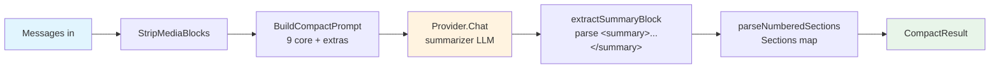

# Compaction

`Compactor` turns a conversation thread into a structured, durable summary via a single LLM call — so long chat sessions stay inside the model's context window without dropping what matters.

## Why Per-Thread Compaction?

Oasis ships two compression primitives. They solve different problems.

**Per-turn compression** (`WithCompressThreshold`, `WithCompressModel`) rewrites old tool results inside the history of a single `Execute` call. It's bounded in scope — the summary lives until the end of that turn and is rebuilt from scratch on the next one. Useful when a single execution bloats on large tool results, but unsafe for skill-heavy agents (skill activation messages can be summarized away) and useless for durable thread state.

**Per-thread compaction** (`Compactor`) summarizes the loaded conversation into a 9-section structured document and hands the model that summary plus the current turn. The summary is assembled on demand during `buildMessages` — the underlying store is unchanged, so the full history remains available for recall, audit, or re-compaction with a different focus hint. This is the right strategy for long-lived assistants: the model sees a dense context while the store keeps the raw record.

Per-turn compression is **disabled by default**. Per-thread compaction is the recommended path for ongoing conversations.

## The Compactor Interface

**File:** `compaction.go`

```go
type Compactor interface {
    Compact(ctx context.Context, req CompactRequest) (CompactResult, error)
}
```

Implementations MUST be safe to call concurrently — the agent loop may invoke `Compact` from background goroutines while a foreground response is assembling.

Input and output shapes live in [`api/types.md`](../api/types.md#compaction-types). Errors are listed in [`api/errors.md`](../api/errors.md#compaction-errors).

## StructuredCompactor (default)

**File:** `compaction_structured.go`

`StructuredCompactor` is the shipped implementation. It calls the summarizer once with a 9-section prompt, strips media attachments before the call (defense-in-depth via `StripMediaBlocks`), and parses the `<summary>...</summary>` block from the response.

```go
compactor := oasis.NewStructuredCompactor(summarizer)
```

The 9 core sections the prompt asks the model to produce:

1. **Primary Request and Intent** — every explicit user request, in detail.
2. **Key Technical Concepts** — frameworks, patterns, and technologies discussed.
3. **Files and Artifacts** — per-artifact: why it matters, changes made, verbatim snippets.
4. **Errors and Fixes** — each error with its resolution and any user feedback.
5. **Problem Solving** — problems solved and ongoing troubleshooting.
6. **All User Messages** — verbatim list of every non-tool-result user message. Critical and intentionally un-summarized.
7. **Pending Tasks** — explicitly assigned but incomplete work.
8. **Current Work** — precisely what was being worked on immediately before this summary.
9. **Optional Next Step** — directly in line with the user's most recent explicit request, with a verbatim quote.

The prompt also forces text-only output — any tool call from the summarizer is rejected and the turn fails — so the Compactor can be safely pointed at a tool-wielding model without worrying about recursive tool invocation.

## Wiring It Up

Pass `WithCompaction` to `WithConversationMemory`:

```go
summarizer := resolve.Provider(resolve.Config{
    Platform: "openai",
    Model:    "gpt-5-mini", // cheaper than the chat model — compaction runs rarely
})

agent := oasis.NewLLMAgent("assistant", "Long-running helper", chatProvider,
    oasis.WithConversationMemory(store,
        oasis.MaxTokens(100_000),
        oasis.WithCompaction(oasis.NewStructuredCompactor(summarizer), 0.80),
    ),
)
```

The threshold (`0.80`) is a fraction of the `MaxTokens` budget configured on the same `WithConversationMemory` call. When the loaded history's estimated tokens cross `threshold × MaxTokens`, the Compactor runs and the loaded history is replaced in-memory with a single `[Prior conversation summary]` system message. If `MaxTokens` is 0 or `MaxTokens` isn't set, auto-compaction is a noop — the threshold has nothing to scale against. Passing `nil` as the Compactor or `threshold ≤ 0` also disables the option.

On Compactor error, the option falls back silently to the existing token-based trim path; a `Warn` is logged.

## Extending the Prompt

Domain-specific callers can append sections via `ExtraSections`:

```go
extras := []oasis.CompactSection{
    {
        Title:        "Active Skills",
        Instructions: "List every skill activated during this thread, verbatim name.",
    },
    {
        Title:        "Layout Decisions",
        Instructions: "Preserve every slide/page layout decision the user approved.",
    },
}

req := oasis.CompactRequest{
    Messages:      history,
    ExtraSections: extras,
}
```

Extras are numbered starting at 10, so the core 9 remain stable. When consumers orchestrate compaction themselves (see below), they construct the `CompactRequest` directly.

## Focus Hints and Re-Compaction

`FocusHint` is an optional user directive injected into the prompt:

```go
req := oasis.CompactRequest{
    Messages:  history,
    FocusHint: "focus on the database schema discussion; other areas may be compressed aggressively",
}
```

The summarizer is told to prioritize the hinted aspects and compress everything else more freely.

`IsRecompact = true` signals that the input already contains a prior summary. The prompt then instructs the model to preserve that prior summary by reference instead of re-summarizing its contents — only NEW decisions, work, and user intent since the prior compact are folded in. This prevents summary explosion when a thread compacts, grows, and compacts again.

## Helpers

`compaction_helpers.go` and `compaction_prompt.go` expose a small toolkit for callers writing their own `Compactor`:

```go
oasis.EstimateContextTokens(messages []ChatMessage, model ModelInfo) int
oasis.StripMediaBlocks(messages []ChatMessage) []ChatMessage
oasis.CompactableToolNames() []string
oasis.BuildCompactPrompt(extras []CompactSection, focusHint string, isRecompact bool) string
```

- `EstimateContextTokens` — model-family-aware heuristic (~10–15% accurate). No network calls. Use `ChatResponse.Usage.InputTokens` for exact counts after a real response.
- `StripMediaBlocks` — returns a copy with image/document attachments replaced by `[image]` / `[document]` text markers. Saves tokens and prevents the compaction request itself from overflowing on media bytes.
- `CompactableToolNames` — fresh-copy whitelist of tool names whose results are safe to summarize away (`shell_exec`, `file_read`, `web_search`, etc.). Tools NOT in this list — `skill_activate`, `ask_user`, etc. — are preserved verbatim by consumers who honor the list.
- `BuildCompactPrompt` — composes the full prompt string from the template constants. Reuse it when building a `Compactor` that calls a non-standard LLM or needs to inspect the prompt before dispatch.

## Pipeline



Token accounting, `PersistsTable` / `LostTable` for UI transparency, and `Warnings` (e.g., `summary_truncated_at_budget`, `partial_sections`) are populated on the way out.

## Errors

`Compact` returns three sentinel errors — detect with `errors.Is`:

- `ErrEmptyMessages` — `req.Messages` length 0.
- `ErrNoProvider` — neither `req.SummarizerProvider` nor the Compactor's default is set.
- `ErrSummaryParseFailed` — the summarizer's response had no parseable `<summary>` block. The wrapping error carries a truncated copy of the raw response for debugging.

See [`api/errors.md`](../api/errors.md#compaction-errors).

## When NOT to Use the Framework's Auto-Trigger

`WithCompaction` is a convenience. It fires the Compactor automatically when the loaded history crosses `threshold × MaxTokens`, inside the conversation-memory load path. The result lives only for that turn — the underlying store is not rewritten.

Consumers that need **persisted** compacts — writing summaries back to the store, merging compacts across threads, handling re-compact ordering, or plumbing compacts into application-specific state — should NOT use `WithCompaction`. They construct pre-compacted message lists at the application layer and hand the agent a ready-to-run history.

The `Compactor` interface and `StructuredCompactor` are useful in that setup too. Call `Compact` directly; skip the agent option.

## See Also

- [Memory](memory.md#per-thread-compaction) — where compaction sits in the memory pipeline.
- [API: Compactor](../api/interfaces.md#compactor) — interface reference.
- [API: Compaction Types](../api/types.md#compaction-types) — `CompactRequest`, `CompactResult`, `CompactSection`.
- [API: Compaction Errors](../api/errors.md#compaction-errors) — sentinel errors.
- [Memory & Recall Guide](../guides/memory-and-recall.md) — practical patterns across all three memory layers.
