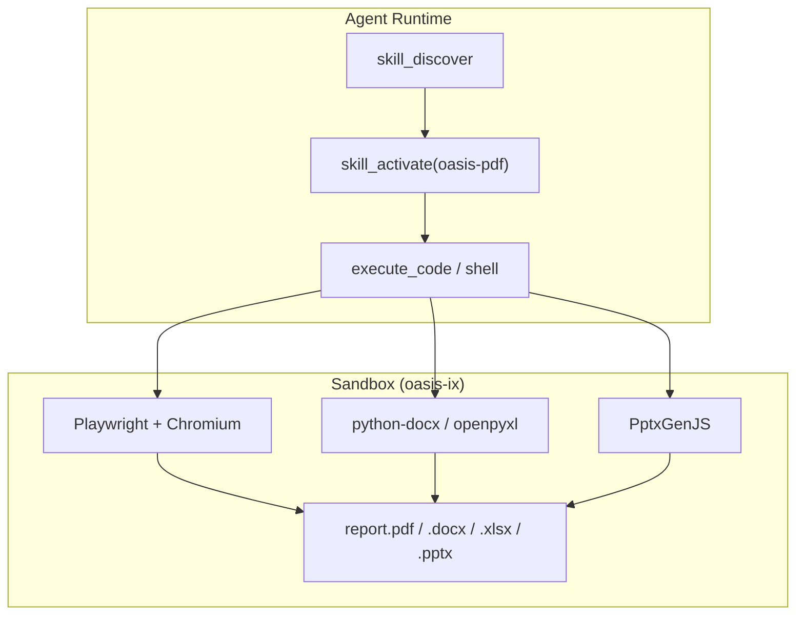
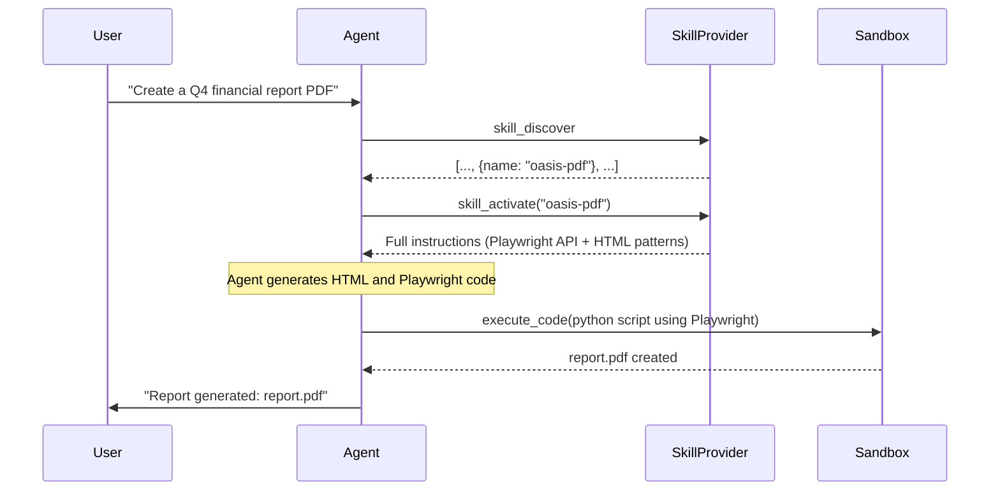

# Document Generation

Document generation in Oasis is a **skill**, not a framework primitive. No new Go types, no new interfaces. Agents learn how to generate documents via SKILL.md instructions, then write code that directly calls the underlying libraries (Playwright, python-docx, openpyxl, PptxGenJS) inside the sandbox.

## Architecture

## How It Works

1. Agent calls `skill_discover` and finds a document skill (e.g., `oasis-pdf`)
2. Agent calls `skill_activate("oasis-pdf")` to load full instructions
3. Instructions teach the agent the library API, patterns, and best practices
4. Agent writes code that directly uses the library (e.g., Playwright for PDF, python-docx for DOCX)
5. Agent runs the code via `execute_code` or `shell` inside the sandbox
6. The library produces the final document

The agent has full creative freedom — it can use any library API feature, conditionals, loops, and data transformations. No intermediate spec format constrains what it can produce.

## Supported Formats

| Format | Skill | Library | Approach |
|--------|-------|---------|----------|
| **PDF** | `oasis-pdf` | Playwright (Chromium) | Agent writes HTML + CSS, Playwright renders to PDF |
| **DOCX** | `oasis-docx` | python-docx | Agent writes Python code using python-docx API |
| **XLSX** | `oasis-xlsx` | openpyxl | Agent writes Python code using openpyxl API |
| **PPTX** | `oasis-pptx` | PptxGenJS | Agent writes JavaScript using PptxGenJS API |

## Why Direct Library Access

- **Full API surface.** The agent can use any library feature — conditional formatting, custom charts, complex layouts — not just what a renderer spec supports.
- **No translation layer.** Removing the intermediate JSON spec eliminates a class of bugs where the spec format cannot express what the library can do.
- **Better error handling.** The agent sees library errors directly and can fix them in code, rather than debugging opaque renderer failures.
- **Composability.** The agent can combine multiple libraries in one script (e.g., fetch data with httpx, process with pandas, render with openpyxl).

## Why Sandbox, Not Host

1. **Heavy dependencies.** Playwright needs Chromium (~400MB). python-docx, openpyxl, PptxGenJS each have dependency trees. Baked into the Docker image once.
2. **Security.** LLM-generated code is executed in full isolation from the host app process.
3. **Chromium is already there.** The sandbox already ships Chromium for the browser tool. Playwright reuses it.
4. **Reproducibility.** Same image = same output everywhere.

## Skills

All document skills reference `oasis-design-system` for consistent color palettes, typography, and spacing.

| Skill | Description |
|-------|-------------|
| `oasis-design-system` | Shared design tokens (colors, fonts, spacing) |
| `oasis-pdf` | HTML + CSS -> PDF via Playwright |
| `oasis-docx` | Word documents via python-docx |
| `oasis-xlsx` | Excel spreadsheets via openpyxl |
| `oasis-pptx` | PowerPoint presentations via PptxGenJS |

## Agent Flow

