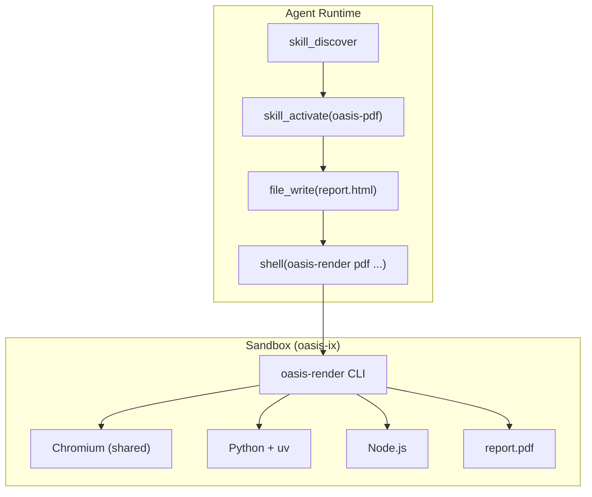
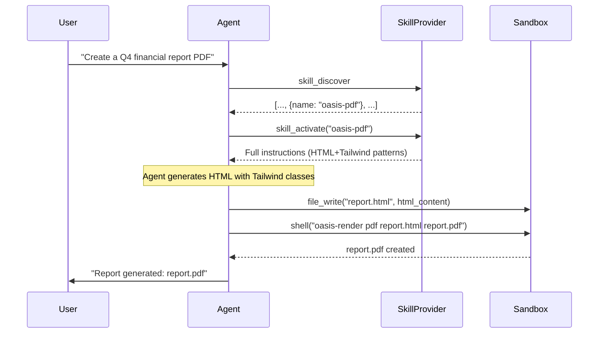

# Document Generation

Document generation in Oasis is a **skill**, not a framework primitive. No new Go types, no new interfaces. Agents learn how to generate documents via SKILL.md instructions, produce structured input (HTML or JSON), and call a pre-installed renderer inside the sandbox.

## Architecture



## How It Works

1. Agent calls `skill_discover` and finds a document skill (e.g., `oasis-pdf`)
2. Agent calls `skill_activate("oasis-pdf")` to load full instructions
3. Instructions teach the agent what format to produce (HTML for PDF, JSON for Office formats)
4. Agent writes the input file using `file_write`
5. Agent calls `oasis-render <format> <input> <output>` via the `shell` tool
6. The renderer (running inside the sandbox) produces the final document

## Supported Formats

| Format | Agent Produces | Renderer | Technology |
|--------|---------------|----------|------------|
| **PDF** | HTML + Tailwind CSS | `oasis-render pdf` | Playwright (Chromium) |
| **PDF Fill** | JSON field values | `oasis-render pdf-fill` | pypdf |
| **DOCX** | JSON content spec | `oasis-render docx` | python-docx |
| **DOCX Fill** | JSON field values | `oasis-render docx-fill` | python-docx |
| **XLSX** | JSON sheet spec | `oasis-render xlsx` | openpyxl |
| **PPTX** | JSON slide spec | `oasis-render pptx` | PptxGenJS |

## Why HTML for PDF, JSON for Office?

- **HTML is the rendering language for PDF.** The agent writes the final visual output directly. Tailwind gives consistent design tokens, CSS gives unlimited expressiveness.
- **Office formats are binary** with complex library APIs. A JSON spec is simpler for the LLM to produce. The renderer script absorbs all library complexity.

## Why Sandbox, Not Host

1. **Heavy dependencies.** Playwright needs Chromium (~400MB). python-docx, openpyxl, PptxGenJS each have dependency trees. Baked into the Docker image once.
2. **Security.** LLM-generated HTML/JSON is processed by scripts. Sandbox isolation contains the blast radius.
3. **Chromium is already there.** The sandbox already ships Chromium for the browser tool. Playwright reuses it.
4. **Reproducibility.** Same image = same output everywhere.

## Skills

All document skills reference `oasis-design-system` for consistent color palettes, typography, and spacing.

| Skill | Description |
|-------|-------------|
| `oasis-design-system` | Shared design tokens (colors, fonts, spacing) |
| `oasis-pdf` | HTML + Tailwind -> PDF via Playwright |
| `oasis-docx` | JSON spec -> Word document via python-docx |
| `oasis-xlsx` | JSON spec -> Excel spreadsheet via openpyxl |
| `oasis-pptx` | JSON spec -> PowerPoint via PptxGenJS |

## oasis-render CLI

Unified entry point installed at `/usr/local/bin/oasis-render` in the sandbox image.

```bash
oasis-render <format> <input> <output> [options]
```

| Command | Input | Output |
|---------|-------|--------|
| `pdf` | HTML file | PDF file |
| `pdf-fill` | PDF + fields JSON | Filled PDF |
| `docx` | JSON spec | DOCX file |
| `docx-fill` | DOCX template + data JSON | Filled DOCX |
| `xlsx` | JSON spec | XLSX file |
| `pptx` | JSON spec | PPTX file |

## Agent Flow


