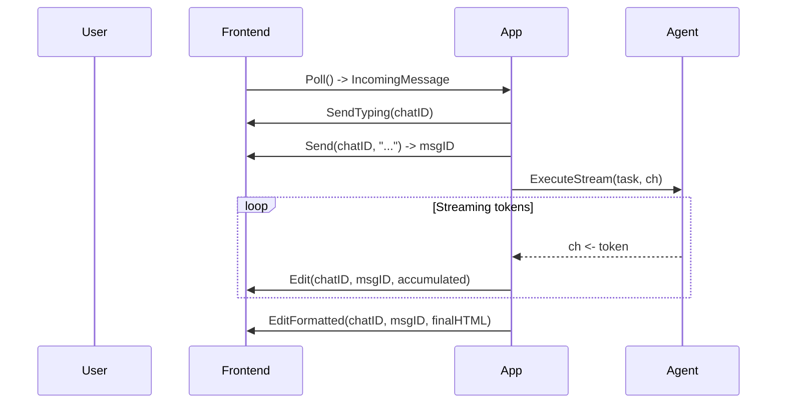

# Frontend

Frontend abstracts the messaging platform — Telegram, Discord, Slack, CLI, HTTP API, or anything else. It handles receiving messages from users and sending responses back.

## Frontend Interface

**File:** `frontend.go`

```go
type Frontend interface {
    Poll(ctx context.Context) (<-chan IncomingMessage, error)
    Send(ctx context.Context, chatID string, text string) (string, error)
    Edit(ctx context.Context, chatID string, msgID string, text string) error
    EditFormatted(ctx context.Context, chatID string, msgID string, text string) error
    SendTyping(ctx context.Context, chatID string) error
    DownloadFile(ctx context.Context, fileID string) ([]byte, string, error)
}
```

The design follows a **poll-send-edit** cycle that enables streaming:



## Methods

| Method | Purpose |
|--------|---------|
| `Poll` | Start long-polling. Returns a channel of `IncomingMessage`. Respects `ctx.Done()` for shutdown. |
| `Send` | Send a new message. Returns the message ID for later editing. |
| `Edit` | Replace message content with plain text |
| `EditFormatted` | Replace message content with rich formatting (HTML input) |
| `SendTyping` | Show typing/processing indicator |
| `DownloadFile` | Download a file attachment — returns raw bytes and filename |

## IncomingMessage

```go
type IncomingMessage struct {
    ID           string
    ChatID       string
    UserID       string
    Text         string
    ReplyToMsgID string
    Document     *FileInfo
    Photos       []FileInfo
    Caption      string
}

type FileInfo struct {
    FileID   string
    FileName string
    MimeType string
    FileSize int64
}
```

## Shipped Implementation

| Package | Constructor | Notes |
|---------|------------|-------|
| `frontend/telegram` | `telegram.New(token)` | Telegram Bot API with long-polling |

## Streaming Pattern

The poll-send-edit cycle is designed for progressive message updates:

1. `Send` a placeholder message (e.g., "thinking...")
2. As LLM tokens arrive, `Edit` the message with accumulated content
3. When done, `EditFormatted` with the final HTML-formatted response

This gives users immediate feedback while the agent works.

## See Also

- [Custom Frontend Guide](../guides/custom-frontend.md)
- [Streaming Guide](../guides/streaming.md)
