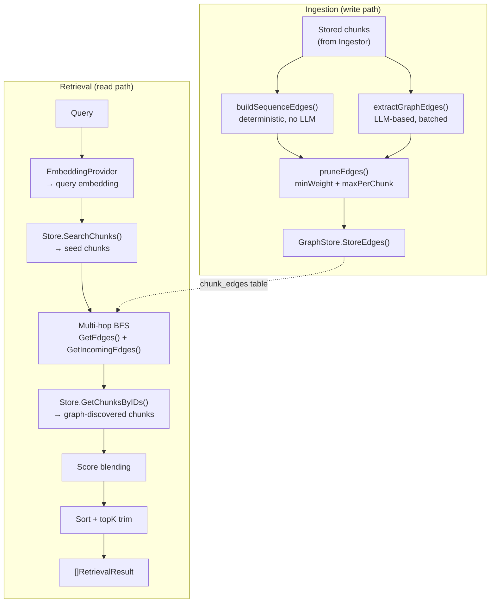
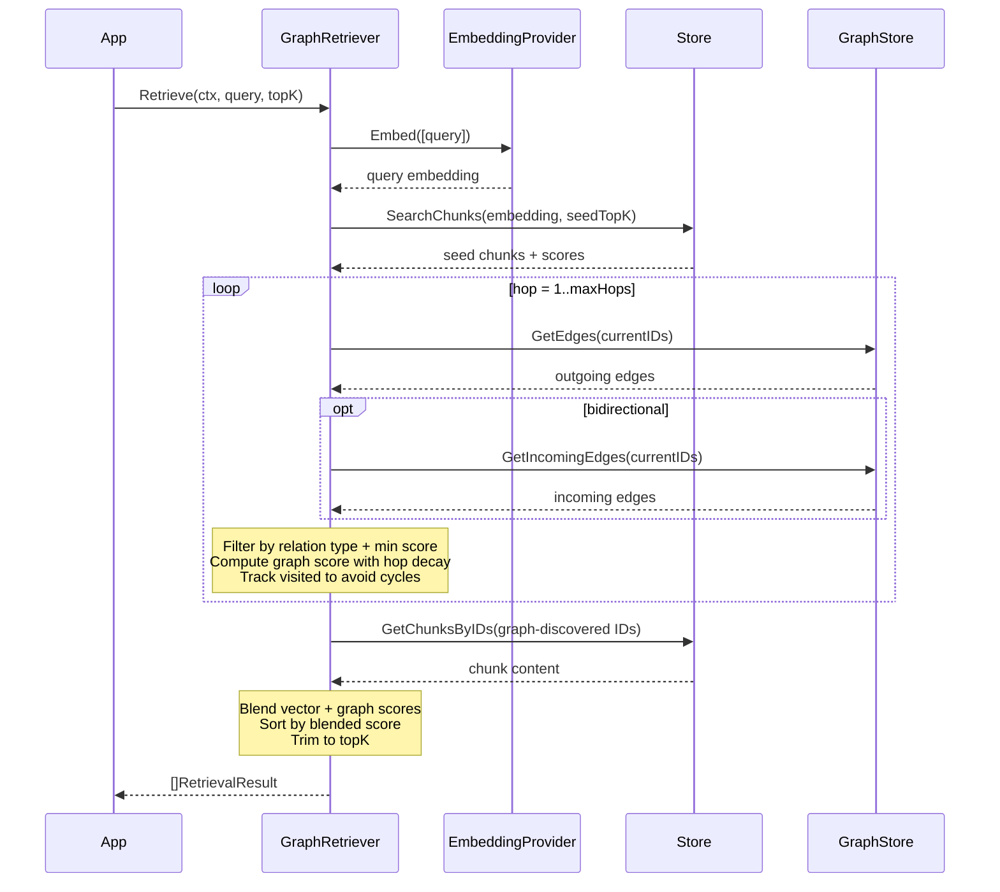

# Graph RAG

Graph RAG adds a knowledge graph layer on top of vector search. During ingestion, relationships between chunks are discovered and stored as weighted, typed edges. During retrieval, `GraphRetriever` traverses these edges to discover contextually related content that vector similarity alone would miss — prerequisite concepts, contradictions, causal chains, and elaborations.

## Architecture



## How Graph Extraction Works

Graph extraction runs automatically after `StoreDocument()` when configured via `WithGraphExtraction` or `WithSequenceEdges`. The pipeline has two independent edge sources:

### 1. LLM-Based Extraction (`WithGraphExtraction`)

The ingestor sends chunks to an LLM in batches and parses the response for relationship edges.

**Step-by-step:**

1. **Batch formation** — chunks are grouped into sliding window batches of `graphBatchSize` (default 5) with configurable overlap (`WithGraphBatchOverlap`). Each batch must contain at least 2 chunks. Overlap allows consecutive batches to share chunks, discovering cross-boundary relationships at the cost of more LLM calls.
2. **Prompt construction** — each batch is formatted into a structured prompt with chunk IDs and content:
   ```
   [chunk_abc123]: Go is a programming language created by Google.
   [chunk_def456]: Go supports concurrency via goroutines.
   ```
3. **Parallel LLM calls** — batches are processed concurrently by a worker pool (`WithGraphExtractionWorkers`, default 3). Each worker sends its batch to the configured `Provider` via `Chat()`. The prompt instructs the LLM to output JSON edges with source, target, relation type, confidence weight, and a brief description of the relationship.
4. **Response parsing** — the JSON response is parsed and validated:
   - Source and target must reference valid chunk IDs from the current batch
   - Self-referencing edges (source == target) are rejected
   - Relation must be one of the 8 defined types
   - Weight must be in the range (0.0, 1.0]
5. **Deduplication** — when overlapping batches produce duplicate edges (same source, target, and relation), only the highest-weight edge is kept.
6. **Context cancellation** — workers check `ctx.Err()` before processing each batch, stopping early if the context is cancelled.
7. **Graceful degradation** — individual batch failures (LLM errors or parse errors) are logged and skipped. The extraction continues with remaining batches. If `WithIngestorLogger` is configured, failures are logged at `WARN` level.

### 2. Sequence Edges (`WithSequenceEdges`)

A lightweight, deterministic alternative that creates `sequence` edges between consecutive chunks — no LLM required.

**Rules:**
- Chunks are sorted by `ChunkIndex`
- Only chunks that share the same `ParentID` are linked (this covers both flat chunks where `ParentID == ""` and children within the same parent group)
- All sequence edges have weight 1.0

```
Flat strategy:     chunk[0] → chunk[1] → chunk[2] → chunk[3]

Parent-child:      parent_A (no edges — different ParentID from children)
                   ├── child_A0 → child_A1 → child_A2
                   parent_B
                   ├── child_B0 → child_B1
```

Both sources can be used independently or combined. Use `WithSequenceEdges(true)` alone for zero-cost graph traversal, or combine with `WithGraphExtraction(llm)` for the richest graph.

### 3. Edge Pruning

After both sources produce edges, pruning is applied if configured:

1. **Weight filter** (`WithMinEdgeWeight`) — edges below the threshold are removed
2. **Per-chunk cap** (`WithMaxEdgesPerChunk`) — for each source chunk, only the top N edges by weight are kept

Pruning happens before `StoreEdges()`, so only high-value edges reach the database.

## Relationship Types

The LLM identifies 8 typed relationships between chunks. Each is a `RelationType` constant:

| Type | Constant | Meaning | Example |
|------|----------|---------|---------|
| `references` | `RelReferences` | Chunk A cites or mentions content from chunk B | "As discussed in the introduction..." |
| `elaborates` | `RelElaborates` | Chunk A provides more detail on chunk B's topic | A detailed explanation expanding on a summary |
| `depends_on` | `RelDependsOn` | Chunk A assumes knowledge from chunk B | "Building on the OAuth flow described above..." |
| `contradicts` | `RelContradicts` | Chunk A conflicts with chunk B | Two sections with conflicting recommendations |
| `part_of` | `RelPartOf` | Chunk A is a component or subset of chunk B | A subsection of a broader topic |
| `similar_to` | `RelSimilarTo` | Chunks cover overlapping topics | Two sections about related features |
| `sequence` | `RelSequence` | Chunk A follows chunk B in logical order | Consecutive paragraphs, tutorial steps |
| `caused_by` | `RelCausedBy` | Chunk A is a consequence of chunk B | "This led to..." or cause-and-effect chains |

Each edge carries a **confidence weight** (0.0–1.0) reflecting the LLM's certainty. Sequence edges always have weight 1.0.

## Data Model

### ChunkEdge

```go
type ChunkEdge struct {
    ID          string       `json:"id"`                    // UUIDv7
    SourceID    string       `json:"source_id"`             // source chunk ID
    TargetID    string       `json:"target_id"`             // target chunk ID
    Relation    RelationType `json:"relation"`              // one of 8 types
    Weight      float32      `json:"weight"`                // confidence in (0, 1]
    Description string       `json:"description,omitempty"` // why this relationship exists
}
```

Edges are **directed** — `SourceID → TargetID`. The `GraphRetriever` can optionally follow edges in both directions via `WithBidirectional(true)`.

The `Description` field stores a human-readable explanation of why the relationship exists, as generated by the LLM during extraction. This description is surfaced in retrieval results via `GraphContext`.

### GraphStore Interface

```go
type GraphStore interface {
    StoreEdges(ctx context.Context, edges []ChunkEdge) error
    GetEdges(ctx context.Context, chunkIDs []string) ([]ChunkEdge, error)
    GetIncomingEdges(ctx context.Context, chunkIDs []string) ([]ChunkEdge, error)
    PruneOrphanEdges(ctx context.Context) (int, error)
}
```

`GraphStore` is an **optional** Store capability, discovered via type assertion. All three shipped backends implement it:

| Backend | Storage | Edge Deletion |
|---------|---------|---------------|
| `store/sqlite` | `chunk_edges` table | Cascade on document delete + orphan pruning |
| `store/postgres` | `chunk_edges` table | Cascade on document delete + orphan pruning |
| `store/libsql` | `chunk_edges` table | Cascade on document delete + orphan pruning |

If the Store doesn't implement `GraphStore`, graph extraction and retrieval silently skip — no error, no configuration needed.

## Ingestion Configuration

```go
ingestor := ingest.NewIngestor(store, embedding,
    // LLM-based graph extraction
    ingest.WithGraphExtraction(llm),           // enable extraction (required for LLM edges)
    ingest.WithGraphBatchSize(10),             // chunks per LLM call (default 5)
    ingest.WithGraphBatchOverlap(2),           // overlap between batches for cross-boundary edges
    ingest.WithGraphExtractionWorkers(3),      // parallel LLM calls (default 3)
    ingest.WithMinEdgeWeight(0.3),             // drop low-confidence edges
    ingest.WithMaxEdgesPerChunk(5),            // cap edges per source chunk

    // Sequence edges (no LLM cost)
    ingest.WithSequenceEdges(true),            // auto-link consecutive chunks

    // Observability
    ingest.WithIngestorLogger(slog.Default()), // log extraction warnings
    ingest.WithIngestorTracer(tracer),         // trace ingest.document spans
)
```

### Ingestion Options Reference

| Option | Default | Description |
|--------|---------|-------------|
| `WithGraphExtraction(p)` | nil | Enable LLM-based graph extraction using this Provider |
| `WithGraphBatchSize(n)` | 5 | Chunks per LLM extraction call. Larger batches discover more cross-chunk relations but produce longer prompts |
| `WithGraphBatchOverlap(n)` | 0 | Number of chunks overlapping between consecutive batches. Higher overlap discovers more cross-boundary relationships at the cost of more LLM calls. Must be less than `graphBatchSize` |
| `WithGraphExtractionWorkers(n)` | 3 | Max concurrent LLM calls for graph extraction. Set to 1 for sequential extraction |
| `WithMinEdgeWeight(w)` | 0 (no filter) | Minimum confidence weight to keep an edge |
| `WithMaxEdgesPerChunk(n)` | 0 (unlimited) | Maximum edges per source chunk (top N by weight) |
| `WithSequenceEdges(b)` | false | Auto-create `sequence` edges between consecutive chunks. No LLM required |
| `WithCrossDocumentEdges(b)` | false | Enable automatic cross-document edge discovery during ingestion |

## Cross-Document Edge Extraction

After ingesting multiple documents, you can discover relationships between chunks from different documents using `ExtractCrossDocumentEdges`. This method:

1. Lists all documents (or a filtered set)
2. For each document's chunks, finds similar chunks from other documents via vector search
3. Sends paired chunks to the LLM for relationship extraction
4. Stores the resulting cross-document edges

```go
// After ingesting several documents:
count, err := ingestor.ExtractCrossDocumentEdges(ctx,
    ingest.CrossDocWithSimilarityThreshold(0.5), // min cosine similarity (default 0.5)
    ingest.CrossDocWithMaxPairsPerChunk(3),       // candidates per chunk (default 3)
    ingest.CrossDocWithBatchSize(5),              // chunks per LLM call (default 5)
    ingest.CrossDocWithDocumentIDs("d1", "d2"),   // scope to specific docs (default: all)
)
fmt.Printf("Created %d cross-document edges\n", count)
```

**Requirements:**
- `WithGraphExtraction` must be configured (provides the LLM)
- Store must implement `GraphStore` (for edge storage)
- Store must implement `DocumentChunkLister` (for listing chunks per document)

All three shipped backends implement both interfaces.

## Retrieval with GraphRetriever

`GraphRetriever` implements the `Retriever` interface, so it works everywhere `HybridRetriever` works — including `KnowledgeTool`.

### How GraphRetriever Works



**Detailed steps:**

1. **Embed the query** — `EmbeddingProvider.Embed()` converts the query to a vector.
2. **Vector search (seed)** — `Store.SearchChunks()` returns `seedTopK` (default 10) seed chunks, scored by cosine similarity.
3. **Score initialization** — each seed chunk gets an initial blended score: `vectorWeight × vectorScore + graphWeight × 1.0`.
4. **BFS traversal** — for up to `maxHops` iterations:
   - Fetch outgoing edges via `GetEdges()` for current frontier chunks
   - Optionally fetch incoming edges via `GetIncomingEdges()` when `bidirectional = true`
   - Filter edges by `relationFilter` and `minTraversalScore`
   - For each unvisited neighbor: compute `graphScore = graphWeight × edgeWeight × hopDecay[hop]`
   - Track the best score per chunk (max of vector and graph scores)
   - Advance the frontier to newly discovered chunks
5. **Fetch content** — graph-discovered chunks that weren't in the seed set are fetched via `GetChunksByIDs()`.
6. **Sort and trim** — results are sorted by blended score descending and trimmed to `topK`.

### Score Blending

The final score for each chunk combines vector similarity and graph traversal:

```
For seed chunks:    score = vectorWeight × vectorScore + graphWeight × 1.0
For graph chunks:   score = graphWeight × edgeWeight × hopDecay[hop]
```

Default weights: `vectorWeight = 0.7`, `graphWeight = 0.3`, `hopDecay = [1.0, 0.7, 0.5]`.

**Example:** A chunk discovered at hop 2 via an edge with weight 0.8:
```
score = 0.3 × 0.8 × 0.5 = 0.12
```

A seed chunk with cosine similarity 0.9:
```
score = 0.7 × 0.9 + 0.3 × 1.0 = 0.93
```

Seed chunks will generally score higher than graph-discovered chunks, but graph chunks add context that vector search would miss entirely.

### Retrieval Configuration

```go
retriever := oasis.NewGraphRetriever(store, embedding,
    oasis.WithMaxHops(2),                               // traversal depth (default 2)
    oasis.WithGraphWeight(0.3),                         // graph score contribution
    oasis.WithVectorWeight(0.7),                        // vector score contribution
    oasis.WithHopDecay([]float32{1.0, 0.7, 0.5}),      // decay per hop level
    oasis.WithBidirectional(true),                      // follow incoming edges too
    oasis.WithRelationFilter(oasis.RelElaborates,       // only follow these types
        oasis.RelDependsOn, oasis.RelReferences),
    oasis.WithMinTraversalScore(0.3),                   // skip weak edges
    oasis.WithSeedTopK(10),                             // seed chunks from vector search
    oasis.WithGraphFilters(oasis.BySource("docs/")),    // scope vector search
    oasis.WithGraphRetrieverTracer(tracer),             // observability
    oasis.WithGraphRetrieverLogger(slog.Default()),
)
```

### Hybrid Seeding

By default, `GraphRetriever` seeds from vector search only. When the Store implements `KeywordSearcher`, you can enable **hybrid seeding** to combine vector and keyword results via Reciprocal Rank Fusion (RRF) before graph traversal:

```go
retriever := oasis.NewGraphRetriever(store, embedding,
    oasis.WithSeedKeywordWeight(0.3), // 30% keyword, 70% vector for seed selection
    oasis.WithMaxHops(2),
)
```

This improves recall for queries that benefit from exact keyword matches (error codes, proper names) while still leveraging semantic similarity.

### GraphContext in Results

When `GraphRetriever` discovers chunks through graph traversal (not from the initial seed search), each `RetrievalResult` includes a `GraphContext` slice explaining how the chunk was found:

```go
type EdgeContext struct {
    FromChunkID string       `json:"from_chunk_id"` // chunk that led to discovery
    Relation    RelationType `json:"relation"`       // edge type followed
    Description string       `json:"description"`    // why this relationship exists
}
```

Seed chunks have an empty `GraphContext`. The `KnowledgeTool` automatically formats edge descriptions in its output:

```
1. OAuth setup flow
   ↳ Related: "requires auth configuration" (depends_on)
   ↳ Related: "expands on setup steps" (elaborates)

2. Token refresh mechanism
```

### Retrieval Options Reference

| Option | Default | Description |
|--------|---------|-------------|
| `WithMaxHops(n)` | 2 | Maximum BFS traversal depth. Higher values discover more distant relationships but add latency |
| `WithGraphWeight(w)` | 0.3 | Weight for graph-derived scores in blending |
| `WithVectorWeight(w)` | 0.7 | Weight for vector similarity scores in blending |
| `WithHopDecay([]float32)` | {1.0, 0.7, 0.5} | Score multiplier per hop level. Index 0 = seed (unused), index 1 = hop 1, etc. |
| `WithBidirectional(b)` | false | Follow both outgoing and incoming edges. Useful for discovering chunks that reference the seed |
| `WithRelationFilter(types...)` | all | Only traverse edges of these relation types. Useful for focusing on specific relationship patterns |
| `WithMinTraversalScore(s)` | 0 | Minimum edge weight to follow during traversal. Prunes weak edges at query time |
| `WithSeedTopK(k)` | 10 | Number of seed chunks from initial vector search |
| `WithSeedKeywordWeight(w)` | 0 (disabled) | Keyword weight for hybrid seed selection via RRF. Set > 0 to enable keyword+vector seed fusion |
| `WithGraphFilters(f...)` | none | Metadata filters passed to the vector search step |
| `WithGraphRetrieverTracer(t)` | nil | Attach a `Tracer` for span creation (`retriever.retrieve`) |
| `WithGraphRetrieverLogger(l)` | nil | Attach a `*slog.Logger` for structured logging |

## Graceful Degradation

Graph RAG is designed to degrade silently at every level:

| Scenario | Behavior |
|----------|----------|
| Store doesn't implement `GraphStore` | Graph extraction and traversal are skipped; vector-only results returned |
| LLM call fails during extraction | Batch is skipped, remaining batches continue. Logged at WARN level if logger is configured |
| LLM returns invalid JSON | Batch is skipped, extraction continues |
| LLM returns invalid edge (bad ID, unknown relation, out-of-range weight) | Individual edge is dropped, others kept |
| Graph traversal `GetEdges()` fails | Traversal stops, seed results returned as-is |
| `GetChunksByIDs()` fails for graph-discovered chunks | Only seed chunks appear in results |

This means enabling graph extraction never causes ingestion or retrieval to fail — it only adds value.

## When to Use Graph RAG

**Good fit:**
- Technical documentation with prerequisites and dependencies
- Legal texts with cross-references between sections
- Scientific papers with citation chains
- Multi-part tutorials where concepts build on each other
- Knowledge bases with cause-and-effect relationships
- API documentation where types reference each other

**Overkill:**
- FAQ lists with independent answers
- Product catalogs with no cross-references
- Simple document collections with no inter-chunk relationships

**Decision guide:**

| Scenario | Recommendation |
|----------|---------------|
| Independent documents, simple lookup | `HybridRetriever` (vector + keyword) |
| Documents with sequential structure only | `WithSequenceEdges(true)` + `GraphRetriever` |
| Rich inter-chunk relationships | `WithGraphExtraction(llm)` + `GraphRetriever` |
| Maximum recall at lowest cost | `WithSequenceEdges(true)` only |
| Maximum recall regardless of cost | Both `WithGraphExtraction` + `WithSequenceEdges` |

## Full Example

End-to-end: ingest with graph extraction, retrieve with graph traversal, wire to an agent.

```go
package main

import (
    "context"
    "fmt"
    "log/slog"

    "github.com/nevindra/oasis"
    "github.com/nevindra/oasis/ingest"
    "github.com/nevindra/oasis/provider/gemini"
    "github.com/nevindra/oasis/store/sqlite"
    "github.com/nevindra/oasis/tools/knowledge"
)

func main() {
    ctx := context.Background()

    // 1. Set up dependencies
    store := sqlite.New("knowledge.db")
    store.Init(ctx)
    defer store.Close()

    llm := gemini.New(apiKey, "gemini-2.0-flash")
    embedding := gemini.NewEmbedding(apiKey, "text-embedding-004", 768)

    // 2. Ingest with graph extraction + sequence edges
    ingestor := ingest.NewIngestor(store, embedding,
        ingest.WithGraphExtraction(llm),
        ingest.WithSequenceEdges(true),
        ingest.WithMinEdgeWeight(0.3),
        ingest.WithMaxEdgesPerChunk(5),
        ingest.WithIngestorLogger(slog.Default()),
    )
    result, _ := ingestor.IngestFile(ctx, docBytes, "architecture.md")
    fmt.Printf("Ingested %d chunks\n", result.ChunkCount)

    // 3. Retrieve with graph traversal
    retriever := oasis.NewGraphRetriever(store, embedding,
        oasis.WithMaxHops(2),
        oasis.WithBidirectional(true),
        oasis.WithRelationFilter(
            oasis.RelDependsOn,
            oasis.RelElaborates,
            oasis.RelReferences,
        ),
    )
    results, _ := retriever.Retrieve(ctx, "what are the system dependencies?", 5)
    for _, r := range results {
        fmt.Printf("[%.3f] %s\n", r.Score, r.Content[:80])
    }

    // 4. Wire to agent via KnowledgeTool
    knowledgeTool := knowledge.New(store, embedding,
        knowledge.WithRetriever(retriever),
        knowledge.WithTopK(5),
    )
    agent := oasis.NewLLMAgent("assistant",
        "Answer questions using your knowledge base. Cite sources.",
        llm, oasis.WithTools(knowledgeTool),
    )
    agentResult, _ := agent.Execute(ctx, oasis.AgentTask{
        Input: "Explain the system architecture and its dependencies",
    })
    fmt.Println(agentResult.Output)
}
```

## See Also

- [Ingest](ingest.md) — the ingestion pipeline that feeds graph extraction
- [Retrieval](retrieval.md) — `GraphRetriever` and `HybridRetriever` details
- [Store](store.md) — `GraphStore` interface and backend implementations
- [RAG Pipeline Guide](../guides/rag-pipeline.md) — end-to-end RAG walkthrough
- [Ingesting Documents Guide](../guides/ingesting-documents.md) — ingestion examples
