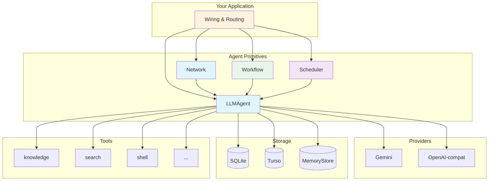

# Concepts

This section explains how Oasis works — one page per primitive. Each page covers what the component is, how it behaves, and how it connects to the rest of the framework.

## Architecture Overview

Every box is a Go interface (except Scheduler, which is a concrete struct wrapping an Agent). You can swap any implementation without affecting the others.

## Pages

### Core Interfaces

| Page | Interface | What it does |
|------|-----------|-------------|
| [Provider](provider.md) | `Provider`, `EmbeddingProvider` | LLM chat, tool calling, streaming, text embedding |
| [Store](store.md) | `Store` | Persistence with vector search |
| [Tool](tool.md) | `Tool` | Pluggable agent capabilities |

### Agent Primitives

| Page | Type | What it does |
|------|------|-------------|
| [Agent](agent.md) | `Agent`, `LLMAgent` | Single-provider tool-calling loop |
| [Network](network.md) | `Network` | Multi-agent coordination via LLM router |
| [Workflow](workflow.md) | `Workflow` | Deterministic DAG-based orchestration |
| [Scheduler](scheduler.md) | `Scheduler` | Time-based proactive execution |

### Memory & Processing

| Page | Interface | What it does |
|------|-----------|-------------|
| [Memory](memory.md) | `MemoryStore` | Long-term user facts with semantic dedup |
| [Processor](processor.md) | `PreProcessor`, `PostProcessor`, `PostToolProcessor` | Middleware hooks in the agent loop |
| [InputHandler](input-handler.md) | `InputHandler` | Human-in-the-loop interactions |

### RAG Pipeline

| Page | Interface/Package | What it does |
|------|-------------------|-------------|
| [Ingest](ingest.md) | `ingest` | Document chunking and embedding pipeline |
| [Retrieval](retrieval.md) | `Retriever`, `Reranker` | Hybrid search, RRF, re-ranking |

### Infrastructure

| Page | Package | What it does |
|------|---------|-------------|
| [Observability](observability.md) | `observer` | OpenTelemetry wrappers with cost tracking |

## Key Design Decisions

- **No LLM SDKs** — all providers use raw `net/http`
- **Interface-driven** — every major component is a Go interface
- **Constructor injection** — no global state, dependencies via structs
- **Parallel tool execution** — multiple tool calls run concurrently
- **Pure-Go SQLite** — `modernc.org/sqlite`, no CGO required
