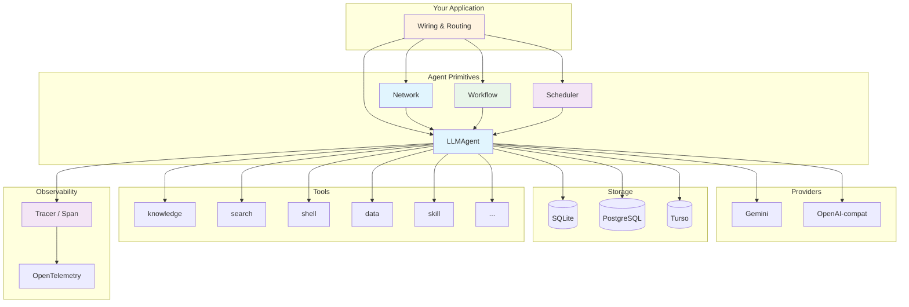
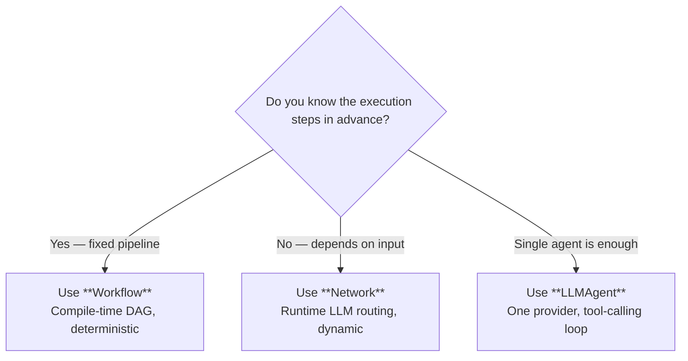

# Concepts

This section explains how Oasis works — one page per primitive. Each page covers what the component is, how it behaves, and how it connects to the rest of the framework.

## Architecture Overview

Every box is a Go interface (except Scheduler, which is a concrete struct wrapping an Agent). You can swap any implementation without affecting the others.

## Pages

### Core Interfaces

| Page | Interface | What it does |
| ---- | --------- | ------------ |
| [Provider](provider.md) | `Provider`, `EmbeddingProvider`, `BatchProvider` | LLM chat, tool calling, streaming, embedding, batch processing |
| [Store](store.md) | `Store`, `KeywordSearcher`, `GraphStore` | Persistence with vector search, full-text search, and graph edges |
| [Tool](tool.md) | `Tool` | Pluggable agent capabilities |

### Agent Primitives

| Page | Type | What it does |
| ---- | ---- | ------------ |
| [Agent](agent.md) | `Agent`, `LLMAgent` | Single-provider tool-calling loop |
| [Network](network.md) | `Network` | Multi-agent coordination via LLM router |
| [Workflow](workflow.md) | `Workflow` | Deterministic DAG-based orchestration |
| [Scheduler](scheduler.md) | `Scheduler` | Time-based proactive execution |

#### Network vs Workflow — Which One?

Both Network and Workflow orchestrate multiple steps, but the routing decision happens at different times:

- **Network** — **runtime routing.** An LLM router decides which agents to call, in what order, based on the input. The execution path varies per request. Use when the task is open-ended and the LLM needs to improvise.
- **Workflow** — **compile-time routing.** You declare a DAG of steps and dependencies at construction time. The execution path is fixed. Use when you know the exact pipeline in advance.

|   | Network | Workflow |
| - | ------- | -------- |
| **Routing** | Runtime (LLM decides) | Compile-time (you declare) |
| **Execution path** | Varies per request | Same DAG every time |
| **Cost** | Extra LLM calls for routing | No routing overhead |
| **Best for** | Open-ended tasks, ambiguous input | Pipelines, ETL, multi-step processing |
| **Parallelism** | LLM can call multiple agents at once | Steps without dependencies run concurrently |
| **Composition** | Contains Agents and Networks | Contains Steps, Agents, Tools, and Workflows |

Both implement `Agent`, so they compose with each other — a Network can contain a Workflow as a subagent, and a Workflow can orchestrate a Network via `AgentStep`.

### Execution Capabilities

| Page | Feature | What it does |
| ---- | ------- | ------------ |
| [Code Execution](code-execution.md) | `CodeRunner`, `WithCodeExecution` | LLM writes Python, framework executes in sandbox with tool bridge |

### Memory & Processing

| Page | Interface | What it does |
| ---- | --------- | ------------ |
| [Memory](memory.md) | `MemoryStore` | Long-term user facts with semantic dedup |
| [Processor](processor.md) | `PreProcessor`, `PostProcessor`, `PostToolProcessor` | Middleware hooks in the agent loop |
| [InputHandler](input-handler.md) | `InputHandler` | Human-in-the-loop interactions |

### RAG Pipeline

| Page | Interface/Package | What it does |
| ---- | ----------------- | ------------ |
| [Ingest](ingest.md) | `ingest` | Document chunking, embedding, and graph extraction pipeline |
| [Retrieval](retrieval.md) | `Retriever`, `Reranker`, `GraphRetriever` | Hybrid search, RRF, graph traversal, re-ranking |
| [Graph RAG](graph-rag.md) | `GraphStore`, `GraphRetriever` | Knowledge graph extraction, edge types, multi-hop traversal, score blending |

### Infrastructure

| Page | Package | What it does |
| ---- | ------- | ------------ |
| [Observability](observability.md) | `Tracer`, `Span`, `observer` | Core tracing interfaces + OpenTelemetry implementation with cost tracking |

## Key Design Decisions

- **No LLM SDKs** — all providers use raw `net/http`
- **Interface-driven** — every major component is a Go interface
- **Constructor injection** — no global state, dependencies via structs
- **Parallel tool execution** — multiple tool calls run concurrently (capped at 10)
- **Pure-Go SQLite** — `modernc.org/sqlite`, no CGO required
- **Deep observability** — `Tracer`/`Span` interfaces in root package, zero OTEL imports in your code
- **Graph RAG** — persistent knowledge graph with typed relations across all store backends
