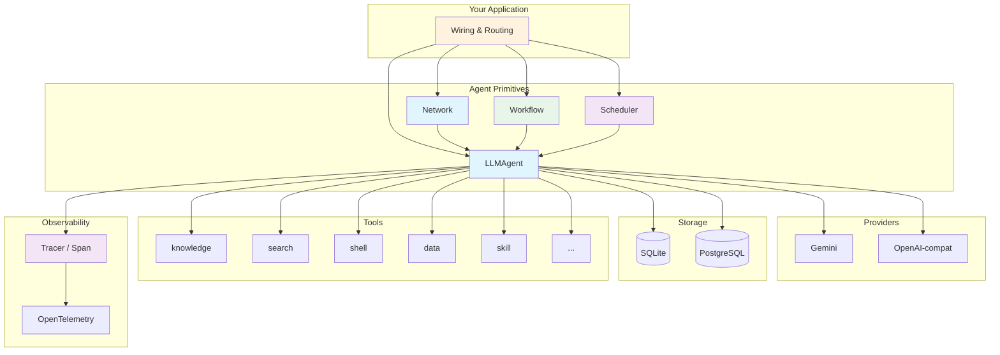
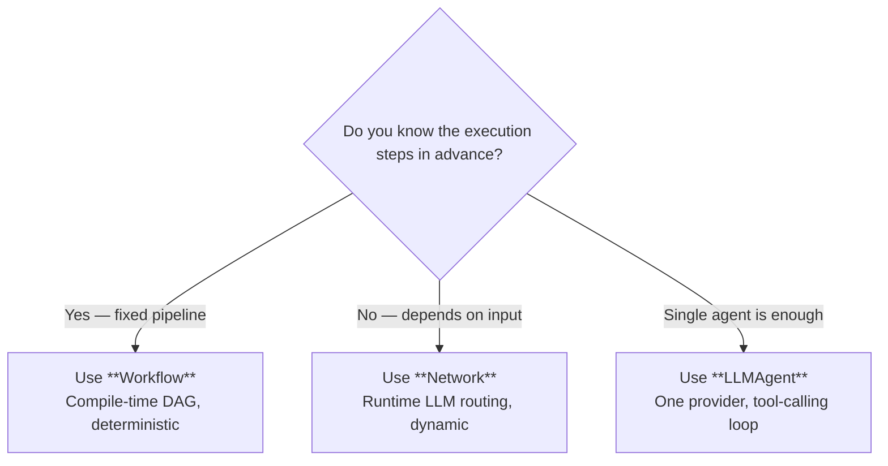

# Concepts

This section explains how Oasis works — one page per primitive. Each page covers what the component is, how it behaves, and how it connects to the rest of the framework.

## Architecture Overview

```mermaid
graph TB
    subgraph "Your Application"
        APP[Wiring & Routing]
    end

    subgraph "Agent Primitives"
        AGENT[LLMAgent]
        NET[Network]
        WF[Workflow]
        SCHED[Scheduler]
    end

    subgraph Providers
        GEM[Gemini]
        OAI[OpenAI-compat]
    end

    subgraph Storage
        SQLITE[(SQLite)]
        PG[(PostgreSQL)]
    end

    subgraph Tools
        KNOW[knowledge]
        SEARCH[search]
        SHELL[shell]
        DATA[data]
        SKILL[skill]
        MORE[...]
    end

    subgraph "Observability"
        TRACER["Tracer / Span"]
        OTEL[OpenTelemetry]
    end

    APP --> AGENT
    APP --> NET
    APP --> WF
    APP --> SCHED
    AGENT --> GEM
    AGENT --> OAI
    NET --> AGENT
    WF --> AGENT
    SCHED --> AGENT
    AGENT --> SQLITE
    AGENT --> PG
    AGENT --> KNOW
    AGENT --> SEARCH
    AGENT --> SHELL
    AGENT --> DATA
    AGENT --> SKILL
    AGENT --> MORE
    AGENT --> TRACER
    TRACER --> OTEL

    style APP fill:#fff3e0
    style AGENT fill:#e1f5fe
    style NET fill:#e1f5fe
    style WF fill:#e8f5e9
    style SCHED fill:#f3e5f5
    style TRACER fill:#f3e5f5
```

Every box is a Go interface (except Scheduler, which is a concrete struct wrapping an Agent). You can swap any implementation without affecting the others.

## Pages

### Agent Primitives

| Primitive | Doc | Source Files | Related Guide |
|-----------|-----|-------------|---------------|
| Agent | [agent.md](agent.md) | agent.go, llmagent.go | [custom-agent](../guides/custom-agent.md) |
| Network | [network.md](network.md) | network.go | — |
| Workflow | [workflow.md](workflow.md) | workflow.go, workflow_exec.go, workflow_steps.go, workflow_definition.go | [execution-plans](../guides/execution-plans.md) |
| Scheduler | [scheduler.md](scheduler.md) | scheduler.go | — |

#### Network vs Workflow — Which One?

Both Network and Workflow orchestrate multiple steps, but the routing decision happens at different times:

- **Network** — **runtime routing.** An LLM router decides which agents to call, in what order, based on the input. The execution path varies per request. Use when the task is open-ended and the LLM needs to improvise.
- **Workflow** — **compile-time routing.** You declare a DAG of steps and dependencies at construction time. The execution path is fixed. Use when you know the exact pipeline in advance.

```mermaid
flowchart TD
    Q{Do you know the execution steps in advance?}
    Q -->|Yes — fixed pipeline| WF["Use **Workflow**<br/>Compile-time DAG, deterministic"]
    Q -->|No — depends on input| NET["Use **Network**<br/>Runtime LLM routing, dynamic"]
    Q -->|Single agent is enough| AGENT["Use **LLMAgent**<br/>One provider, tool-calling loop"]
```

|   | Network | Workflow |
| - | ------- | -------- |
| **Routing** | Runtime (LLM decides) | Compile-time (you declare) |
| **Execution path** | Varies per request | Same DAG every time |
| **Cost** | Extra LLM calls for routing | No routing overhead |
| **Best for** | Open-ended tasks, ambiguous input | Pipelines, ETL, multi-step processing |
| **Parallelism** | LLM can call multiple agents at once | Steps without dependencies run concurrently |
| **Composition** | Contains Agents and Networks | Contains Steps, Agents, Tools, and Workflows |

Both implement `Agent`, so they compose with each other — a Network can contain a Workflow as a subagent, and a Workflow can orchestrate a Network via `AgentStep`.

### LLM & Tools

| Primitive | Doc | Source Files | Related Guide |
|-----------|-----|-------------|---------------|
| Provider | [provider.md](provider.md) | provider.go, provider/ | [custom-provider](../guides/custom-provider.md) |
| Tool | [tool.md](tool.md) | tool.go, tools/ | [custom-tool](../guides/custom-tool.md) |
| Skill | [skill.md](skill.md) | skill.go, skill_builtin.go, skill_scan.go, tools/skill/ | [skills](../guides/skills.md) |

### Memory & Processing

| Primitive | Doc | Source Files | Related Guide |
|-----------|-----|-------------|---------------|
| Store | [store.md](store.md) | store.go, store/ | [custom-store](../guides/custom-store.md) |
| Memory | [memory.md](memory.md) | memory.go, agentmemory.go, memory/ | [memory-and-recall](../guides/memory-and-recall.md) |
| Compaction | [compaction.md](compaction.md) | compaction.go, compaction_helpers.go, compaction_prompt.go, compaction_structured.go | [memory-and-recall](../guides/memory-and-recall.md) |
| Processor | [processor.md](processor.md) | processor.go | [processors-and-guardrails](../guides/processors-and-guardrails.md) |
| Input Handler | [input-handler.md](input-handler.md) | input.go | [human-in-the-loop](../guides/human-in-the-loop.md) |

### Data Pipeline

| Primitive | Doc | Source Files | Related Guide |
|-----------|-----|-------------|---------------|
| Ingest | [ingest.md](ingest.md) | ingest/ | [ingesting-documents](../guides/ingesting-documents.md) |
| RAG | [rag.md](rag.md) | retriever.go | [rag-pipeline](../guides/rag-pipeline.md) |
| Graph RAG | [graph-rag.md](graph-rag.md) | ingest/ | [rag-pipeline](../guides/rag-pipeline.md) |

### Infrastructure

| Primitive | Doc | Source Files | Related Guide |
|-----------|-----|-------------|---------------|
| Observability | [observability.md](observability.md) | observer/ | — |
| Sandbox | [sandbox.md](sandbox.md) | sandbox/, cmd/ix/ | [code-execution](../guides/code-execution.md), [document-generation](../guides/document-generation.md) |

## Key Design Decisions

- **No LLM SDKs** — all providers use raw `net/http`
- **Interface-driven** — every major component is a Go interface
- **Constructor injection** — no global state, dependencies via structs
- **Parallel tool execution** — multiple tool calls run concurrently (capped at 10)
- **Pure-Go SQLite** — `modernc.org/sqlite`, no CGO required
- **Deep observability** — `Tracer`/`Span` interfaces in root package, zero OTEL imports in your code
- **Graph RAG** — persistent knowledge graph with typed relations across all store backends
- **Model Catalog** — static registry (CI-refreshed) + live API calls for model discovery, validation, and pricing
