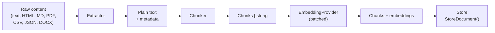
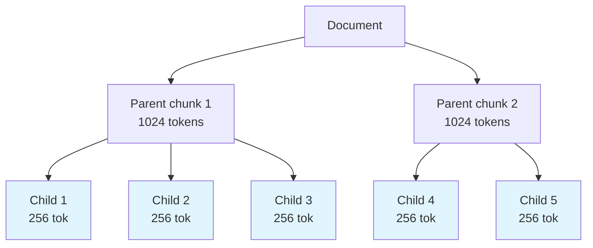

# Ingest

The ingest pipeline handles the full journey from raw content to searchable vector-indexed chunks: **extract → chunk → embed → store**.

## Pipeline



## Quick Usage

**Package:** `github.com/nevindra/oasis/ingest`

```go
ingestor := ingest.NewIngestor(store, embedding)

// From text
result, _ := ingestor.IngestText(ctx, content, "source-url", "Document Title")

// From file (auto-detects content type by extension)
result, _ := ingestor.IngestFile(ctx, fileBytes, "report.md")

// From io.Reader
result, _ := ingestor.IngestReader(ctx, resp.Body, "page.html")
```

Returns:

```go
type IngestResult struct {
    DocumentID string
    Document   oasis.Document
    ChunkCount int
}
```

## Extractors

Convert raw bytes to plain text:

| Extractor | Content Types |
|-----------|--------------|
| `PlainTextExtractor` | `text/plain` |
| `HTMLExtractor` | `text/html` — strips tags, scripts, styles |
| `MarkdownExtractor` | `text/markdown` |
| `pdf.NewExtractor()` | PDF (opt-in, `ingest/pdf` subpackage) |
| `csv.NewExtractor()` | CSV (opt-in, `ingest/csv` subpackage) |
| `json.NewExtractor()` | JSON (opt-in, `ingest/json` subpackage) |
| `docx.NewExtractor()` | DOCX (opt-in, `ingest/docx` subpackage) |

Content type is detected from file extension via `ContentTypeFromExtension()`.

### MetadataExtractor

Extractors may optionally implement `MetadataExtractor` to return structured metadata alongside text. When an extractor provides `ExtractWithMeta()`, the ingestor uses it instead of `Extract()` and assigns page-level metadata (page number, section heading, images) to each chunk via byte-range overlap matching.

Built-in metadata extractors: `pdf.Extractor`, `docx.Extractor`.

## Chunk Metadata

Each chunk can carry a `ChunkMeta` with:

- **PageNumber** — source page (from PDF or DOCX)
- **SectionHeading** — nearest heading
- **SourceURL** — file path or URL
- **Images** — extracted images (base64-encoded)

Metadata is stored as JSON in the `metadata` column and flows through the retrieval pipeline.

## Chunkers

Split text into chunks suitable for embedding:

### RecursiveChunker (default)

Splits by paragraphs → sentences → words. Improved sentence boundaries: abbreviation-aware (Mr., Dr.), decimal-safe (3.14), CJK punctuation.

```go
ingest.NewRecursiveChunker(
    ingest.WithMaxTokens(512),
    ingest.WithOverlapTokens(50),
)
```

### MarkdownChunker

Splits at heading boundaries, preserves headings in chunks for LLM context. Falls back to RecursiveChunker for oversized sections.

```go
ingest.NewMarkdownChunker(ingest.WithMaxTokens(1024))
```

## Chunking Strategies

### Flat (default)

Single-level chunking. Each chunk is independently embedded and searched.

### Parent-Child

Two-level hierarchical. Small child chunks (~256 tokens) are embedded for precise matching. Large parent chunks (~1024 tokens) provide full context on retrieval.



On retrieval: match children → resolve `ParentID` → return parent content.

```go
ingestor := ingest.NewIngestor(store, embedding,
    ingest.WithStrategy(ingest.StrategyParentChild),
)
```

## Ingestor Options

| Option | Default | Description |
|--------|---------|-------------|
| `WithChunker(c)` | RecursiveChunker | Custom chunker for flat strategy |
| `WithParentChunker(c)` | — | Parent-level chunker |
| `WithChildChunker(c)` | — | Child-level chunker |
| `WithStrategy(s)` | `StrategyFlat` | `StrategyFlat` or `StrategyParentChild` |
| `WithParentTokens(n)` | 1024 | Parent chunk size |
| `WithChildTokens(n)` | 256 | Child chunk size |
| `WithBatchSize(n)` | 64 | Chunks per `Embed()` call |
| `WithExtractor(ct, e)` | — | Register custom extractor for content type |

## Batched Embedding

Large documents are embedded in configurable batches (default 64 chunks per `Embed()` call) to respect provider rate limits.

## See Also

- [Retrieval](retrieval.md) — the search pipeline that reads ingested chunks
- [Store](store.md) — where documents and chunks are stored
- [RAG Pipeline Guide](../guides/rag-pipeline.md) — end-to-end walkthrough
- [Ingesting Documents Guide](../guides/ingesting-documents.md)
