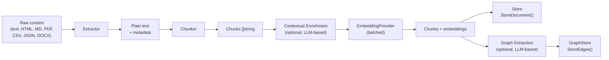
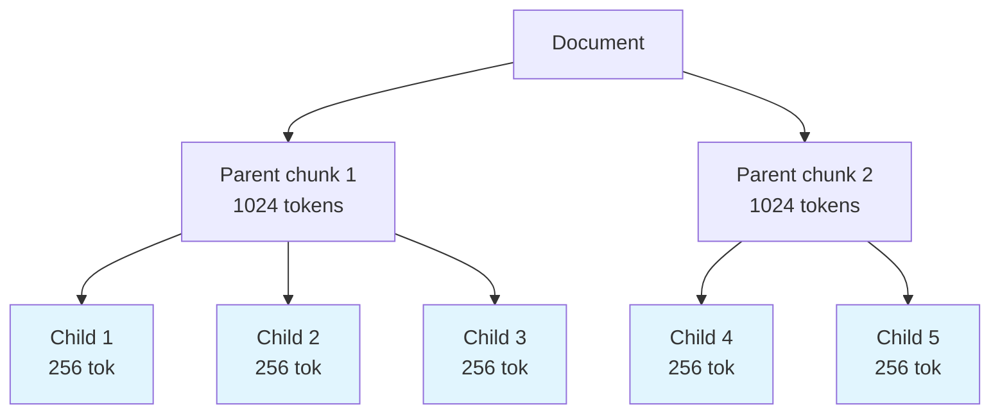

# Ingest

The ingest pipeline handles the full journey from raw content to searchable vector-indexed chunks: **extract → chunk → embed → store**.

A **checkpoint** is saved after each pipeline stage. If the process crashes or the context is cancelled mid-run, `ResumeIngest` restarts from the last completed stage — no work is repeated.

## Pipeline


```mermaid
flowchart LR
    RAW["Raw content<br>(text, HTML, MD, PDF,<br>CSV, JSON, DOCX)"] --> EXTRACT[Extractor]
    EXTRACT --> PLAIN["Plain text<br>+ metadata"]
    PLAIN --> CHUNK[Chunker]
    CHUNK --> CHUNKS["Chunks []string"]
    CHUNKS --> CONTEXT["Contextual Enrichment<br>(optional, LLM-based)"]
    CONTEXT --> EMBED["EmbeddingProvider<br>(batched)"]
    EMBED --> VECTORS["Chunks + embeddings"]
    VECTORS --> STORE["Store<br>StoreDocument()"]
    VECTORS --> GRAPH["Graph Extraction<br>(optional, LLM-based)"]
    GRAPH --> EDGES["GraphStore<br>StoreEdges()"]
```

## Quick Usage

**Package:** `github.com/nevindra/oasis/ingest`

```go
ingestor := ingest.NewIngestor(store, embedding)

// From text
result, _ := ingestor.IngestText(ctx, content, "source-url", "Document Title")

// From file (auto-detects content type by extension)
result, _ := ingestor.IngestFile(ctx, fileBytes, "report.md")

// From io.Reader
result, _ := ingestor.IngestReader(ctx, resp.Body, "page.html")
```

Returns `IngestResult`:

```go
type IngestResult struct {
    DocumentID string          // unique ID for the stored document
    Document   oasis.Document  // full Document (ID, Title, Source, Content, CreatedAt)
    ChunkCount int             // total chunks created (flat) or parents + children combined
}
```

Use `result.DocumentID` to reference the document later (e.g., in upload responses or `Store.DeleteDocument`).

## Extractors

Convert raw bytes to plain text:

| Extractor | Content Types |
|-----------|--------------|
| `PlainTextExtractor` | `text/plain` |
| `HTMLExtractor` | `text/html` — strips tags, scripts, styles |
| `MarkdownExtractor` | `text/markdown` |
| `NewCSVExtractor()` | CSV — first row as headers, rows as labeled paragraphs |
| `NewJSONExtractor()` | JSON — recursive key flattening with dotted paths |
| `NewDOCXExtractor()` | DOCX — paragraphs, headings, tables, images (pure Go) |
| `NewPDFExtractor()` | PDF — page-by-page text extraction (pure Go) |

All extractors are registered by default in `NewIngestor`. Content type is detected from file extension via `ContentTypeFromExtension()`. Use `WithExtractor` to override a built-in or add a custom extractor:

```go
ingestor := ingest.NewIngestor(store, embedding,
    ingest.WithExtractor(ingest.TypePDF, myCustomPDFExtractor{}),
)
```

### Extractor Retry

Custom extractors often call external services (OCR APIs, LLM-based document conversion). Use `WithExtractRetries` so transient failures are retried with exponential backoff before the ingestion aborts:

```go
ingestor := ingest.NewIngestor(store, embedding,
    ingest.WithExtractor(ingest.TypePDF, myOCRExtractor{}),
    ingest.WithExtractRetries(3), // up to 3 total attempts
)
```

Context cancellation (`context.Canceled`, `context.DeadlineExceeded`) bypasses the retry loop immediately. Built-in extractors are deterministic and are not affected by this setting.

### MetadataExtractor

Extractors may optionally implement `MetadataExtractor` to return structured metadata alongside text. When an extractor provides `ExtractWithMeta()`, the ingestor uses it instead of `Extract()` and assigns page-level metadata (page number, section heading, images) to each chunk via byte-range overlap matching.

Built-in metadata extractors: `PDFExtractor`, `DOCXExtractor`.

### Panic Recovery

The ingestor recovers panics from extractor calls and converts them into errors (wrapped with "extractor panicked: …"). This prevents a misbehaving third-party parser from crashing the entire process.

## Chunk Metadata

Each chunk can carry a `ChunkMeta` with:

- **PageNumber** — source page (from PDF or DOCX)
- **SectionHeading** — nearest heading
- **SourceURL** — file path or URL
- **Images** — extracted images (base64-encoded)
- **ContentType** — chunk content type (`"image"` for image chunks, empty for text)
- **BlobRef** — external storage reference (set when `BlobStore` is configured)

Metadata is stored as JSON in the `metadata` column and flows through the retrieval pipeline.

## Chunkers

Split text into chunks suitable for embedding. All chunkers implement the `Chunker` interface:

```go
type Chunker interface {
    Chunk(text string) []string
}
```

### RecursiveChunker (default)

Splits by paragraphs → sentences → words. Improved sentence boundaries: abbreviation-aware (Mr., Dr.), decimal-safe (3.14), CJK punctuation.

```go
ingest.NewRecursiveChunker(
    ingest.WithMaxTokens(512),
    ingest.WithOverlapTokens(50),
)
```

### MarkdownChunker

Splits at heading boundaries, preserves headings in chunks for LLM context. Falls back to RecursiveChunker for oversized sections.

```go
ingest.NewMarkdownChunker(ingest.WithMaxTokens(1024))
```

### SemanticChunker

Splits text at semantic boundaries detected by embedding similarity drops between consecutive sentences. Uses percentile-based breakpoint detection: when cosine similarity between two consecutive sentences falls below the Nth percentile of all consecutive similarities, the chunker inserts a boundary.

```go
ingest.NewSemanticChunker(embedding.Embed,
    ingest.WithMaxTokens(512),
    ingest.WithBreakpointPercentile(25), // default: split at 25th percentile
)
```

The first argument is an `EmbedFunc` — a function with signature `func(context.Context, []string) ([][]float32, error)`. This matches `EmbeddingProvider.Embed`, so you can pass `embedding.Embed` directly.

`SemanticChunker` implements `ContextChunker` (see below), which means the `Ingestor` will automatically pass context through to the embedding call. On embedding errors, it falls back to `RecursiveChunker` — no error is returned.

### ContextChunker

`ContextChunker` extends `Chunker` with a context-aware method for chunkers that call external services (embedding APIs, databases):

```go
type ContextChunker interface {
    Chunker
    ChunkContext(ctx context.Context, text string) ([]string, error)
}
```

The `Ingestor` auto-detects this capability via type assertion. When the chunker implements `ContextChunker`, the ingestor calls `ChunkContext` (passing request context for cancellation and tracing). Otherwise it falls back to `Chunk`.

## Chunking Strategies

### Flat (default)

Single-level chunking. Each chunk is independently embedded and searched.

### Parent-Child

Two-level hierarchical. Small child chunks (~256 tokens) are embedded for precise matching. Large parent chunks (~1024 tokens) provide full context on retrieval.


```mermaid
graph TB
    DOC[Document] --> P1[Parent chunk 1<br>1024 tokens]
    DOC --> P2[Parent chunk 2<br>1024 tokens]
    P1 --> C1[Child 1<br>256 tok]
    P1 --> C2[Child 2<br>256 tok]
    P1 --> C3[Child 3<br>256 tok]
    P2 --> C4[Child 4<br>256 tok]
    P2 --> C5[Child 5<br>256 tok]

    style C1 fill:#e1f5fe
    style C2 fill:#e1f5fe
    style C3 fill:#e1f5fe
    style C4 fill:#e1f5fe
    style C5 fill:#e1f5fe
```

On retrieval: match children → resolve `ParentID` → return parent content.

```go
ingestor := ingest.NewIngestor(store, embedding,
    ingest.WithStrategy(ingest.StrategyParentChild),
)
```

#### Semantic Parent Boundaries

By default, parent chunks are split by token count (RecursiveChunker). For documents where topics don't align with fixed-size boundaries, use `SemanticChunker` as the parent chunker — parent boundaries will follow natural topic shifts instead of arbitrary token limits.

```go
ingestor := ingest.NewIngestor(store, embedding,
    ingest.WithStrategy(ingest.StrategyParentChild),
    ingest.WithParentChunker(ingest.NewSemanticChunker(embedding.Embed,
        ingest.WithMaxTokens(1024),
        ingest.WithBreakpointPercentile(25),
    )),
)
```

This produces semantically coherent parents — each parent covers a complete topic rather than cutting mid-paragraph. Children are still split with RecursiveChunker for precise embedding.

## Contextual Enrichment

When enabled, each chunk is sent to an LLM alongside the full document text. The LLM returns a 1-2 sentence context prefix that is prepended to `chunk.Content` before embedding. This embeds document-level positional context into each chunk's vector, improving retrieval precision by ~35% (per Anthropic's research).

```go
ingestor := ingest.NewIngestor(store, embedding,
    ingest.WithContextualEnrichment(llm),      // enable contextual enrichment
    ingest.WithContextWorkers(5),               // concurrent LLM calls (default 3)
    ingest.WithContextMaxDocBytes(100_000),     // doc truncation limit (default 100KB)
)
```

**How it works:** After chunking but before embedding, each chunk's content is enriched:

```
// Before enrichment:
chunk.Content = "OAuth tokens expire after 1 hour."

// After enrichment:
chunk.Content = "This chunk is from the Authentication section of the API reference, discussing token lifecycle.\n\nOAuth tokens expire after 1 hour."
```

**Parent-child strategy:** Only child chunks are enriched (they're the ones embedded and searched). Parent chunks are left unchanged.

**Graceful degradation:** Individual LLM failures are logged but don't block ingestion — the chunk keeps its original content.

**Document truncation:** Documents exceeding `WithContextMaxDocBytes` (default 100KB) are truncated at the nearest word boundary before being sent to the LLM.

## Graph Extraction

When enabled, the ingestor discovers relationships between chunks and stores them as weighted edges for [GraphRetriever](rag.md) traversal at query time. Two independent edge sources are available:

- **LLM-based extraction** (`WithGraphExtraction`) — sends chunks to an LLM in batches, discovers 8 relationship types with confidence weights
- **Sequence edges** (`WithSequenceEdges`) — deterministic, links consecutive chunks with no LLM cost

```go
ingestor := ingest.NewIngestor(store, embedding,
    ingest.WithGraphExtraction(llm),          // enable LLM-based graph extraction
    ingest.WithMinEdgeWeight(0.5),            // minimum confidence for edges
    ingest.WithMaxEdgesPerChunk(10),          // cap edges per chunk
    ingest.WithGraphBatchSize(5),             // chunks per LLM call
    ingest.WithSequenceEdges(true),           // add sequence edges between consecutive chunks
    ingest.WithIngestorLogger(slog.Default()), // log extraction warnings
)
```

Graph extraction runs after embedding and storage. The Store must implement `GraphStore` (both shipped backends do). Extraction degrades gracefully — individual batch failures are logged and skipped, stores without `GraphStore` skip silently.

For the full deep-dive — extraction internals, relationship types, edge pruning, score blending, `GraphRetriever` configuration, and decision guides — see **[Graph RAG](graph-rag.md)**.

## Retry

The ingest pipeline has two independent retry layers that complement each other.

### Provider-level retry (embedding + LLM)

Wrap providers before passing them to `NewIngestor`. This handles transient HTTP errors (429 rate limits, 503 unavailable) for all embedding calls, contextual enrichment, and graph extraction:

```go
llm := oasis.WithRetry(gemini.New(apiKey, model), oasis.RetryMaxAttempts(3))
emb := oasis.WithEmbeddingRetry(gemini.NewEmbedding(apiKey, embModel), oasis.RetryMaxAttempts(3))

ingestor := ingest.NewIngestor(store, emb,
    ingest.WithContextualEnrichment(llm),
    ingest.WithGraphExtraction(llm),
)
```

### Extractor-level retry (custom extractors)

Custom extractors that call external services get their own retry via `WithExtractRetries`:

```go
ingestor := ingest.NewIngestor(store, emb,
    ingest.WithExtractor(ingest.TypePDF, myOCRExtractor{}),
    ingest.WithExtractRetries(3),
)
```

## Checkpoints & Resume

The ingest pipeline automatically saves a checkpoint to the store after each stage. If the process crashes (e.g., embedding API timeout at batch 49/50), you can resume from the last saved stage rather than restarting from scratch.

**Requirements:** The Store must implement `CheckpointStore` (`store/sqlite` and `store/postgres` both do). If the Store doesn't implement it, checkpointing is silently disabled — retry still works, but crashed ingestions cannot be resumed.

### Checkpoint stages

The checkpoint `Status` field tracks which stage completed last:

| Status | Meaning | Can resume? |
|--------|---------|-------------|
| `extracting` | Crash before extraction finished | No — original bytes not persisted; re-run `IngestFile` |
| `chunking` | Extraction done, text saved | Yes — re-chunks and re-embeds from saved text |
| `storing` | All embedding done | Yes — re-stores and re-graphs from saved chunks |
| `graphing` | Document stored | Yes — re-runs graph extraction only |
| *(deleted)* | Fully complete | N/A |

### Resuming a single document

```go
// List all incomplete ingestions
checkpoints, _ := ingestor.ListCheckpoints(ctx)
for _, cp := range checkpoints {
    fmt.Printf("stalled: %s (stage: %s)\n", cp.Source, cp.Status)
}

// Resume the first stalled ingestion
result, err := ingestor.ResumeIngest(ctx, checkpoints[0].ID)
```

`ResumeIngest` skips all completed stages and continues from the first unfinished one. For example, if the pipeline crashed mid-embedding, it restores the saved chunks and resumes embedding from the right batch.

## Batch Ingestion

`IngestBatch` ingests multiple documents in a single call with per-document tracking. One document failing doesn't abort the rest.

```go
items := []ingest.BatchItem{
    {Data: pdfBytes,  Filename: "report.pdf"},
    {Data: mdBytes,   Filename: "readme.md", Title: "README"},
    {Data: jsonBytes, Filename: "data.json"},
}

result, err := ingestor.IngestBatch(ctx, items)

fmt.Printf("succeeded: %d, failed: %d\n", len(result.Succeeded), len(result.Failed))
for _, fe := range result.Failed {
    fmt.Printf("  %s: %v\n", fe.Item.Filename, fe.Error)
}
```

`BatchResult` fields:

```go
type BatchResult struct {
    Succeeded  []IngestResult // documents that completed successfully
    Failed     []BatchError   // documents that failed after all retries
    Checkpoint string         // non-empty if any documents failed or batch was interrupted
}
```

### Resuming an interrupted batch

If the batch is interrupted (context cancelled, process crash), `result.Checkpoint` is non-empty. Pass it with the original item list to continue:

```go
if result.Checkpoint != "" {
    result, err = ingestor.ResumeBatch(ctx, result.Checkpoint, items)
}
```

`ResumeBatch` skips documents already recorded as completed. Documents that were mid-pipeline (e.g., mid-embedding) resume from their own single-doc checkpoint.

### Concurrent batch processing

```go
ingestor := ingest.NewIngestor(store, emb,
    ingest.WithBatchConcurrency(4), // process 4 documents in parallel
)
result, err := ingestor.IngestBatch(ctx, items)
```

**Sequential mode advantage (default):** In sequential mode, chunks from multiple documents are pooled into shared embedding batches. Document A (30 chunks) + Document B (34 chunks) = 1 embedding call of 64 chunks instead of 2 calls.

### Cross-document edges after a batch

```go
ingestor := ingest.NewIngestor(store, emb,
    ingest.WithGraphExtraction(llm),
    ingest.WithBatchCrossDocEdges(true), // run ExtractCrossDocumentEdges automatically
)
result, err := ingestor.IngestBatch(ctx, items)
```

## Cross-Document Edge Extraction

Discovers semantic relationships between chunks from different documents. Requires `WithGraphExtraction` and a Store that implements `DocumentChunkLister`.

When the Store also implements `BatchSearcher` (SQLite does), all chunk embeddings in a document are searched in a single pass over the vector index instead of N separate calls — significantly faster for documents with many chunks.

```go
count, err := ingestor.ExtractCrossDocumentEdges(ctx,
    ingest.CrossDocWithSimilarityThreshold(0.6),
    ingest.CrossDocWithMaxPairsPerChunk(5),
    ingest.CrossDocWithProgressFunc(func(processed, total int) {
        fmt.Printf("cross-doc: %d/%d documents\n", processed, total)
    }),
)
fmt.Printf("created %d cross-document edges\n", count)
```

### Resuming cross-doc extraction

For large document sets that may be interrupted:

```go
// First run — tracks progress per document
count, err := ingestor.ExtractCrossDocumentEdges(ctx,
    ingest.CrossDocWithResume(true),
)

// If interrupted, find the checkpoint and resume
checkpoints, _ := ingestor.ListCheckpoints(ctx)
for _, cp := range checkpoints {
    if cp.Type == "crossdoc" {
        count, err = ingestor.ResumeCrossDocExtraction(ctx, cp.ID)
    }
}
```

## Ingestor Options

| Option | Default | Description |
| ------ | ------- | ----------- |
| `WithChunker(c)` | RecursiveChunker | Custom chunker for flat strategy (disables auto-selection by content type) |
| `WithParentChunker(c)` | — | Parent-level chunker |
| `WithChildChunker(c)` | — | Child-level chunker |
| `WithStrategy(s)` | `StrategyFlat` | `StrategyFlat` or `StrategyParentChild` |
| `WithParentTokens(n)` | 1024 | Parent chunk size |
| `WithChildTokens(n)` | 256 | Child chunk size |
| `WithBatchSize(n)` | 64 | Chunks per `Embed()` call |
| `WithMaxContentSize(n)` | 50 MB | Max input content size in bytes (0 to disable) |
| `WithExtractor(ct, e)` | — | Override or add a custom extractor for a content type |
| `WithExtractRetries(n)` | 1 (no retry) | Max attempts for custom extractor calls; uses exponential backoff |
| `WithOnSuccess(fn)` | nil | Callback invoked after each successful ingestion with the `IngestResult` |
| `WithOnError(fn)` | nil | Callback invoked when ingestion fails with `(source string, err error)` |
| `WithBatchConcurrency(n)` | 1 (sequential) | Parallel document limit for `IngestBatch` |
| `WithBatchCrossDocEdges(b)` | false | Run `ExtractCrossDocumentEdges` automatically after `IngestBatch` |
| `WithGraphExtraction(p)` | disabled | Enable LLM-based graph edge extraction |
| `WithMinEdgeWeight(w)` | 0.0 | Minimum weight threshold for storing edges |
| `WithMaxEdgesPerChunk(n)` | unlimited | Cap on edges extracted per chunk |
| `WithGraphBatchSize(n)` | 5 | Chunks per graph extraction LLM call |
| `WithSequenceEdges(b)` | false | Add sequence edges between consecutive chunks |
| `WithContextualEnrichment(p)` | disabled | Enable LLM-based contextual enrichment per chunk |
| `WithContextWorkers(n)` | 3 | Max concurrent LLM calls for contextual enrichment |
| `WithContextMaxDocBytes(n)` | 100,000 | Max document bytes sent to LLM for context (0 = unlimited) |
| `WithLLMTimeout(d)` | 2 min | Max duration per LLM call (graph extraction + contextual enrichment). Prevents deadlocks from hung providers |
| `WithImageEmbedding(p)` | nil | Enable image chunk creation from extracted images. `p` must implement `MultimodalEmbeddingProvider` |
| `WithBlobStore(bs)` | nil | Store image bytes externally; chunks hold `BlobRef` instead of inline data |
| `WithIngestorTracer(t)` | nil | Attach a `Tracer` for span creation (`ingest.document`) |
| `WithIngestorLogger(l)` | nil | Attach a `*slog.Logger` for structured logging |

Chunker options (shared by all chunker constructors):

| Option | Default | Description |
| --- | --- | --- |
| `WithMaxTokens(n)` | 512 | Max tokens per chunk (approximated as n*4 bytes) |
| `WithOverlapTokens(n)` | 50 | Overlap between consecutive chunks |
| `WithBreakpointPercentile(p)` | 25 | Similarity percentile for semantic split detection (SemanticChunker only) |

CrossDoc options (passed to `ExtractCrossDocumentEdges` and `ResumeCrossDocExtraction`):

| Option | Default | Description |
| --- | --- | --- |
| `CrossDocWithDocumentIDs(ids...)` | all docs | Scope extraction to specific document IDs |
| `CrossDocWithSimilarityThreshold(t)` | 0.5 | Minimum cosine similarity to consider a chunk pair |
| `CrossDocWithMaxPairsPerChunk(n)` | 3 | Max cross-document candidates per chunk |
| `CrossDocWithBatchSize(n)` | 5 | Chunks per LLM extraction call |
| `CrossDocWithResume(b)` | false | Track progress per document; enables `ResumeCrossDocExtraction` |

## Image Embedding

When a `MultimodalEmbeddingProvider` is configured, the ingestor creates dedicated image chunks from images extracted by `MetadataExtractor`s (DOCX, PDF). Each image becomes a separate chunk with `ContentType: "image"` in its metadata. Image chunks are embedded via `EmbedMultimodal`, placing them in the same vector space as text — enabling cross-modal retrieval (text queries finding images).

```go
import "github.com/nevindra/oasis/provider/openaicompat"

// Multimodal embedding provider (e.g., Qwen3-VL-Embedding via vLLM)
imageEmb := openaicompat.NewEmbedding(
    "", "Qwen3-VL-Embedding-8B", "http://localhost:8000/v1", 4096,
)

ingestor := ingest.NewIngestor(store, embedding,
    ingest.WithImageEmbedding(imageEmb), // enable image chunks
)

// With blob storage for large images
ingestor := ingest.NewIngestor(store, embedding,
    ingest.WithImageEmbedding(imageEmb),
    ingest.WithBlobStore(myBlobStore), // images stored externally, chunks hold refs
)
```

**How it works:** After text chunks are embedded, the ingestor collects images from page metadata, creates a `MultimodalInput` per image, embeds them in batches via `EmbedMultimodal`, and stores each as a chunk with `ContentType: "image"`. When a `BlobStore` is configured, image bytes are stored externally and chunks hold a `BlobRef` instead of inline data.

**Graceful degradation:** If image embedding fails for a batch, the error is logged and text chunks are still stored — image embedding never blocks text ingestion.

## Batched Embedding

Large documents are embedded in configurable batches (default 64 chunks per `Embed()` call) to respect provider rate limits.

## See Also

- [Graph RAG](graph-rag.md) — graph extraction internals, `GraphRetriever`, score blending
- [Retrieval](rag.md) — the search pipeline that reads ingested chunks
- [Store](store.md) — where documents and chunks are stored
- [RAG Pipeline Guide](../guides/rag-pipeline.md) — end-to-end walkthrough
- [Ingesting Documents Guide](../guides/ingesting-documents.md)
