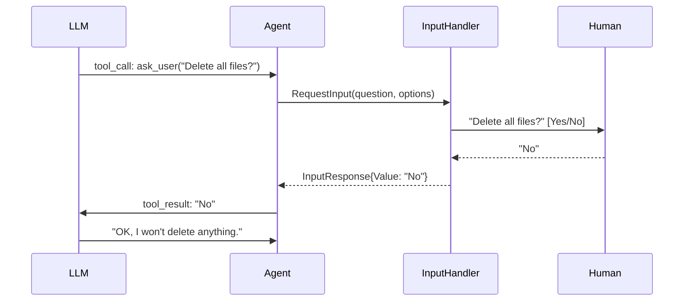

# InputHandler

InputHandler is the human-in-the-loop mechanism. It lets agents pause mid-execution to ask a human for input — for clarification, confirmation, or approval.

## How It Works



## Interface

**File:** `input.go`

```go
type InputHandler interface {
    RequestInput(ctx context.Context, req InputRequest) (InputResponse, error)
}

type InputRequest struct {
    Question string            // "Delete all files in /tmp?"
    Options  []string          // ["Yes", "No"] — empty means free-form
    Metadata map[string]string // {"agent": "assistant", "source": "llm"}
}

type InputResponse struct {
    Value string  // the human's text response
}
```

## Two Patterns

### 1. LLM-Driven (ask_user tool)

When `WithInputHandler` is set, the agent gains a built-in `ask_user` tool. The LLM decides when to call it:

```go
agent := oasis.NewLLMAgent("assistant", "Helpful assistant", llm,
    oasis.WithTools(shellTool),
    oasis.WithInputHandler(myHandler),
)
```

The `ask_user` tool is a special case in the execution loop — it can't be shadowed by user tools.

### 2. Programmatic (processor gates)

Processors can access the handler via context to build approval gates:

```go
handler, ok := oasis.InputHandlerFromContext(ctx)
if ok {
    resp, _ := handler.RequestInput(ctx, oasis.InputRequest{
        Question: "Allow shell_exec?",
        Options:  []string{"Yes", "No"},
    })
    if resp.Value != "Yes" {
        // block the action
    }
}
```

## Context Helpers

```go
// Inject handler into context
ctx = oasis.WithInputHandlerContext(ctx, handler)

// Retrieve from context
handler, ok := oasis.InputHandlerFromContext(ctx)
```

Networks automatically propagate the handler to subagents via context.

## Key Behaviors

- **Optional** — agents without a handler work identically (no `ask_user` tool, processors skip gracefully)
- **Blocking** — `RequestInput` blocks until a response arrives or `ctx` is cancelled
- **Metadata auto-populated** — the framework sets `"agent"` and `"source": "llm"` for `ask_user` calls
- **Network propagation** — the handler flows through the entire agent hierarchy

## See Also

- [Human-in-the-Loop Guide](../guides/human-in-the-loop.md) — implementation examples
- [Processor](processor.md) — approval gates via PostProcessor
