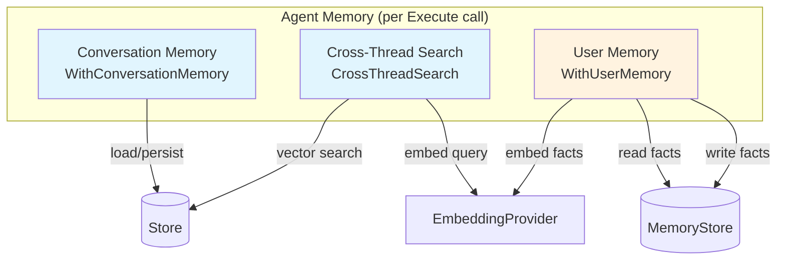
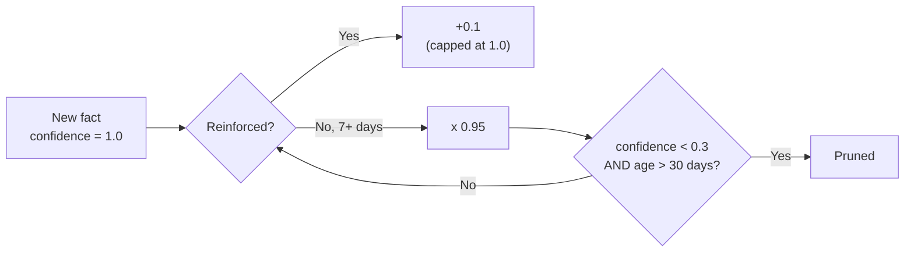
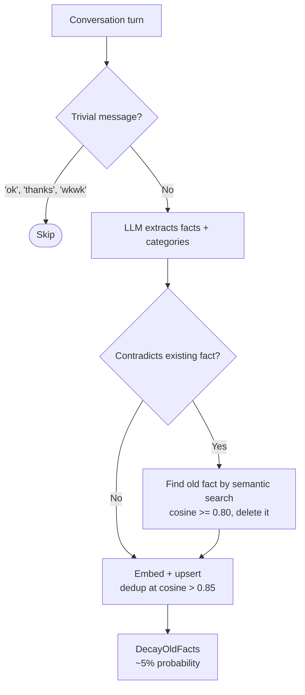

# Memory

Oasis agents are stateless by default. Memory features are opt-in — enable them to give agents conversation history, cross-thread recall, and long-term user understanding.

## Memory Architecture



## Three Memory Layers

### 1. Conversation Memory

Loads recent messages before the LLM call, persists the exchange afterward. By default, the last 10 messages are loaded.

```go
agent := oasis.NewLLMAgent("assistant", "Helpful assistant", llm,
    oasis.WithConversationMemory(store),
)

// Custom history limit
agent := oasis.NewLLMAgent("assistant", "Helpful assistant", llm,
    oasis.WithConversationMemory(store, oasis.MaxHistory(30)),
)

// Token budget — trim history oldest-first to fit within N estimated tokens
agent := oasis.NewLLMAgent("assistant", "Helpful assistant", llm,
    oasis.WithConversationMemory(store, oasis.MaxTokens(4000)),
)

// Both limits compose — whichever triggers first wins
agent := oasis.NewLLMAgent("assistant", "Helpful assistant", llm,
    oasis.WithConversationMemory(store, oasis.MaxHistory(50), oasis.MaxTokens(4000)),
)
```

Activated when `task.TaskThreadID()` returns a non-empty value. Without a thread ID, the agent runs stateless.

### 2. Cross-Thread Search

Embeds the user's input and searches all stored messages for semantically similar content from other threads. Requires an EmbeddingProvider.

```go
agent := oasis.NewLLMAgent("assistant", "Helpful assistant", llm,
    oasis.WithConversationMemory(store,
        oasis.CrossThreadSearch(embedding),
    ),
)

// Custom similarity threshold (default: 0.60)
oasis.CrossThreadSearch(embedding, oasis.MinScore(0.7))
```

Messages below the minimum score are silently dropped.

### 3. User Memory

Long-term semantic memory for user facts. Two paths:

**Read path** (every call): embeds input, retrieves relevant facts via `BuildContext`, injects into system prompt.

**Write path** (background, after each turn): uses the agent's own LLM to extract durable facts from the conversation and persists them via `UpsertFact`.

```go
agent := oasis.NewLLMAgent("assistant", "Helpful assistant", llm,
    oasis.WithConversationMemory(store),
    oasis.WithUserMemory(memoryStore, embedding),
)
```

Write requires `WithConversationMemory` — without it, extraction is silently skipped.

## MemoryStore Interface

**File:** `memory.go`

```go
type MemoryStore interface {
    UpsertFact(ctx, fact, category string, embedding []float32) error
    SearchFacts(ctx, embedding []float32, topK int) ([]ScoredFact, error)
    BuildContext(ctx, queryEmbedding []float32) (string, error)
    DeleteFact(ctx, factID string) error
    DeleteMatchingFacts(ctx, pattern string) error
    DecayOldFacts(ctx) error
    Init(ctx) error
}
```

**Shipped implementations:** `store/sqlite` (`sqlite.NewMemoryStore(store.DB())`), `store/libsql` (`libsql.NewMemoryStore(store.DB())`), `store/postgres` (`postgres.NewMemoryStore(pool)`)

## Confidence System

Facts have a confidence score that changes over time:



- **New facts** start at `confidence = 1.0`
- **Re-extracted facts** get `+0.1` (capped at 1.0)
- **Decay**: `confidence *= 0.95` for facts not reinforced in 7+ days
- **Pruning**: facts with `confidence < 0.3` and `age > 30 days` are removed
- `DecayOldFacts` runs probabilistically (~5% per conversation turn)

## Auto-Extraction Pipeline

When `WithUserMemory` is set, the agent automatically extracts user facts after each conversation turn:



This runs in a background goroutine using the agent's own LLM. No extra configuration needed.

## Semantic Deduplication

`UpsertFact` checks for semantically similar existing facts (cosine similarity > 0.85). If found, the existing fact is reinforced rather than creating a duplicate.

## Memory Wiring Example

Full setup with all three memory layers:

```go
agent := oasis.NewLLMAgent("assistant", "Helpful assistant", llm,
    oasis.WithTools(searchTool),
    oasis.WithConversationMemory(store,
        oasis.CrossThreadSearch(embedding, oasis.MinScore(0.7)),
    ),
    oasis.WithUserMemory(memoryStore, embedding),
)

result, _ := agent.Execute(ctx, oasis.AgentTask{
    Input: "What did we discuss yesterday?",
    Context: map[string]any{
        oasis.ContextThreadID: "thread-123",
        oasis.ContextUserID:   "user-42",
    },
})
```

What happens during `Execute`:

1. Embed the input once (reused by both user memory and cross-thread search)
2. Retrieve relevant user facts from MemoryStore, inject into system prompt
3. Load recent conversation history from Store
4. Search for relevant messages across all threads (reuses embedding from step 1)
5. Run the tool-calling loop
6. Persist user and assistant messages
7. (Background) Extract and upsert user facts from the conversation turn

## Execution Trace Persistence

When `WithConversationMemory` is enabled, assistant messages automatically include execution traces in their `Metadata` field. After each agent execution, `result.Steps` (the `[]StepTrace` from `AgentResult`) is stored under the `"steps"` key:

```go
// Automatically set by the memory pipeline — no user action needed
assistantMsg.Metadata = map[string]any{"steps": result.Steps}
```

This means any Oasis app with conversation memory gets persisted execution traces for free. Query them back via `Store.GetMessages` or `Store.SearchMessages`:

```go
messages, _ := store.GetMessages(ctx, threadID, 10)
for _, m := range messages {
    if steps, ok := m.Metadata["steps"]; ok {
        fmt.Printf("Assistant used %d tool calls\n", len(steps.([]any)))
    }
}
```

Metadata is stored as JSON TEXT (SQLite/libSQL) or JSONB (PostgreSQL). The `Metadata` field is `map[string]any`, so you can also store custom per-message metadata by setting it before calling `Store.StoreMessage` directly.

## See Also

- [Store](store.md) — persistence layer
- [Memory & Recall Guide](../guides/memory-and-recall.md) — practical patterns
