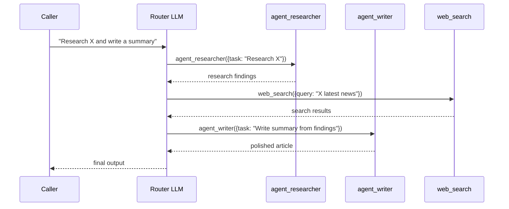
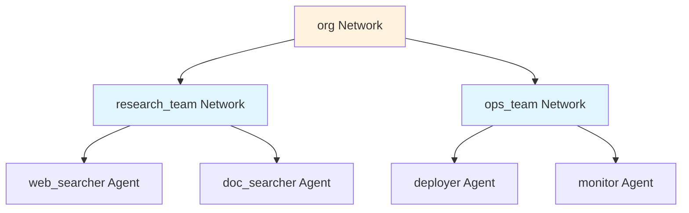

# Network

Network is a multi-agent coordinator. An LLM router decides which subagents to invoke, in what order, and with what data. It's like an LLMAgent where the "tools" include other agents.

## How It Works



The router LLM sees subagents as tools named `agent_<name>`. It decides which to call, and can freely mix agent calls with regular tool calls.

## Creating a Network

```go
researcher := oasis.NewLLMAgent("researcher", "Searches for information", llm,
    oasis.WithTools(searchTool),
)
writer := oasis.NewLLMAgent("writer", "Writes polished content", llm,
    oasis.WithPrompt("You are a skilled technical writer."),
)

coordinator := oasis.NewNetwork("coordinator", "Routes research and writing", llm,
    oasis.WithAgents(researcher, writer),
    oasis.WithTools(knowledgeTool),  // direct tools also available to the router
)

result, err := coordinator.Execute(ctx, oasis.AgentTask{
    Input: "Research Go generics and write a summary",
})
```

## Recursive Composition

Network implements `Agent`, so it can be a subagent of another Network:



```go
researchTeam := oasis.NewNetwork("research_team", "Coordinates research", router,
    oasis.WithAgents(webSearcher, docSearcher),
)

opsTeam := oasis.NewNetwork("ops_team", "Coordinates operations", router,
    oasis.WithAgents(deployer, monitor),
)

org := oasis.NewNetwork("org", "Top-level coordinator", ceo,
    oasis.WithAgents(researchTeam, opsTeam),
)
```

## Shared Execution Loop

Internally, Network uses the same `runLoop` as LLMAgent. The only difference is the **dispatch function**: when the router calls `agent_researcher`, the Network dispatches to that subagent's `Execute` method instead of to a tool.

This means Networks get all the same features as LLMAgent: processors, memory, streaming, parallel dispatch.

## Context Propagation

When a Network dispatches to a subagent, it propagates:
- `AgentTask.Context` (thread ID, user ID, chat ID)
- `AgentTask.Attachments` (photos, PDFs)
- `InputHandler` (via context — subagents can ask users for input)

This ensures memory and human-in-the-loop work correctly inside nested agent hierarchies.

## Key Behaviors

- The router LLM's `Description` of each subagent becomes the tool description — write good descriptions
- The subagent tool schema requires a single `task` field (the user's message, passed verbatim)
- Token usage from subagent executions is accumulated into the Network's total
- When the router produces an empty final response after delegating, the Network falls back to the last subagent's output
- Network implements `StreamingAgent` — streaming works the same as LLMAgent

## When to Use Network vs Workflow

The key distinction is **when the routing decision happens**:

- **Network = runtime routing.** The LLM router reads the input and decides which agents to call. Different inputs produce different execution paths.
- **Workflow = compile-time routing.** You declare the DAG of steps and dependencies when constructing the Workflow. The execution path is fixed regardless of input.

| Network | Workflow |
|---------|---------|
| LLM decides routing at runtime | You declare routing at construction time |
| Dynamic — different paths per request | Deterministic — same DAG every time |
| Good for open-ended, ambiguous tasks | Good for pipelines, ETL, multi-step processing |
| Router can improvise and adapt | Steps run in declared order |
| Extra LLM calls for routing decisions | No routing overhead |

**Use Network when** the agent needs to figure out what to do: "Research this topic and write a summary" — the router decides whether to search first, which subagents to invoke, and how to combine results.

**Use Workflow when** you already know the steps: "Extract text → chunk → embed → store" — a fixed pipeline that runs the same way every time.

## Observability

Network supports the same tracing and logging options as LLMAgent:

```go
team := oasis.NewNetwork("team", "Research team", router,
    oasis.WithAgents(researcher, writer),
    oasis.WithTracer(observer.NewTracer()),
    oasis.WithLogger(slog.Default()),
)
```

Network adds `agent.delegate` spans for sub-agent routing in the trace hierarchy. See [Observability](observability.md).

## Suspend/Resume

Network supports suspend/resume — processors can return `Suspend(payload)` to pause execution. Conversation history is preserved across suspend/resume cycles. See [Agent](agent.md#suspendresume) and [Processor](processor.md#suspend).

## See Also

- [Agent](agent.md) — the underlying interface and shared options
- [Workflow](workflow.md) — deterministic alternative
- [Processor](processor.md) — middleware hooks work the same way
- [Observability](observability.md) — tracing and structured logging
