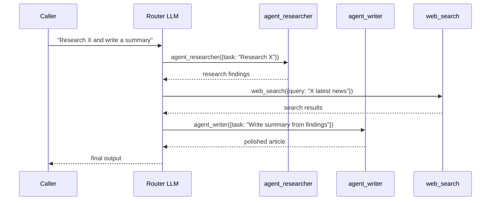
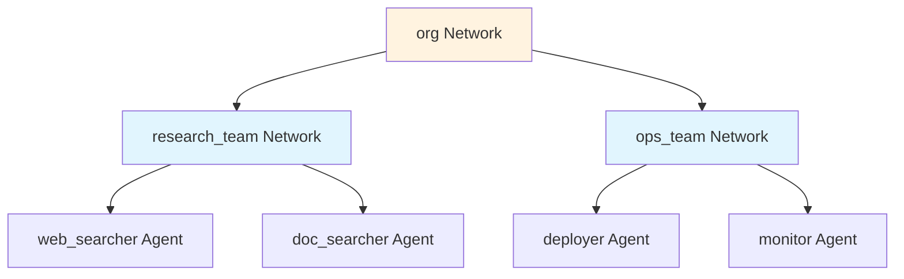
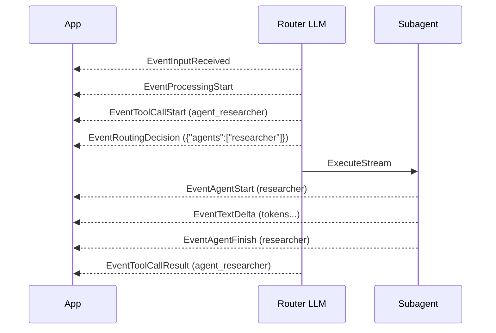

# Network

Network is a multi-agent coordinator. An LLM router decides which subagents to invoke, in what order, and with what data. It's like an LLMAgent where the "tools" include other agents.

## How It Works


```mermaid
sequenceDiagram
    participant Caller
    participant Router as Router LLM
    participant R as agent_researcher
    participant W as agent_writer
    participant T as web_search

    Caller->>Router: "Research X and write a summary"
    Router->>R: agent_researcher({task: "Research X"})
    R-->>Router: research findings
    Router->>T: web_search({query: "X latest news"})
    T-->>Router: search results
    Router->>W: agent_writer({task: "Write summary from findings"})
    W-->>Router: polished article
    Router-->>Caller: final output
```

The router LLM sees subagents as tools named `agent_<name>`. It decides which to call, and can freely mix agent calls with regular tool calls.

## Creating a Network

```go
researcher := oasis.NewLLMAgent("researcher", "Searches for information", llm,
    oasis.WithTools(searchTool),
)
writer := oasis.NewLLMAgent("writer", "Writes polished content", llm,
    oasis.WithPrompt("You are a skilled technical writer."),
)

coordinator := oasis.NewNetwork("coordinator", "Routes research and writing", llm,
    oasis.WithAgents(researcher, writer),
    oasis.WithTools(knowledgeTool),  // direct tools also available to the router
)

result, err := coordinator.Execute(ctx, oasis.AgentTask{
    Input: "Research Go generics and write a summary",
})
```

## Recursive Composition

Network implements `Agent`, so it can be a subagent of another Network:


```mermaid
graph TD
    ORG[org Network] --> RESEARCH[research_team Network]
    ORG --> OPS[ops_team Network]
    RESEARCH --> WEB[web_searcher Agent]
    RESEARCH --> DOC[doc_searcher Agent]
    OPS --> DEPLOY[deployer Agent]
    OPS --> MONITOR[monitor Agent]

    style ORG fill:#fff3e0
    style RESEARCH fill:#e1f5fe
    style OPS fill:#e1f5fe
```

```go
researchTeam := oasis.NewNetwork("research_team", "Coordinates research", router,
    oasis.WithAgents(webSearcher, docSearcher),
)

opsTeam := oasis.NewNetwork("ops_team", "Coordinates operations", router,
    oasis.WithAgents(deployer, monitor),
)

org := oasis.NewNetwork("org", "Top-level coordinator", ceo,
    oasis.WithAgents(researchTeam, opsTeam),
)
```

## Shared Execution Loop

Internally, Network uses the same `runLoop` as LLMAgent. The only difference is the **dispatch function**: when the router calls `agent_researcher`, the Network dispatches to that subagent's `Execute` method instead of to a tool.

This means Network inherits **every execution behavior** from the shared loop:

| Behavior | Default | Details |
|----------|---------|---------|
| Parallel tool/agent dispatch | max 10 goroutines | Agent calls and tool calls run concurrently |
| Max iterations + synthesis | 10 iterations | When reached, forces a final LLM summary (no tools) |
| Tool result truncation | 100K runes | Subagent outputs truncated in message history; step traces retain full content |
| Context compression | 200K rune threshold | Old messages summarized via LLM when threshold exceeded |
| Attachment accumulation | 50 items / 50 MB | Subagent attachments subject to same caps as tool attachments |
| Thinking visibility | automatic | Router's chain-of-thought captured in `AgentResult.Thinking` |
| Processor hooks | PreLLM, PostLLM, PostTool | All three hook points fire in the same order as LLMAgent |
| Suspend/resume | 20 snapshots / 256 MB | Router can be suspended by processors |
| Tool panic recovery | automatic | Panicking tools/subagents return error results, never crash the Network |

All `AgentOption` values accepted by `NewLLMAgent` also work on `NewNetwork`, including:

- **Memory:** `WithConversationMemory`, `WithUserMemory`, `WithSemanticTrimming`, `CrossThreadSearch`
- **Skills:** `WithActiveSkills`, `WithSkills`
- **Generation params:** `WithTemperature`, `WithTopP`, `WithTopK`, `WithMaxTokens`
- **Execution:** `WithPlanExecution`, `WithSubAgentSpawning`, `WithSandbox`
- **Compression:** `WithCompressModel`, `WithCompressThreshold`
- **Limits:** `WithMaxIter`, `WithMaxAttachmentBytes`, `WithSuspendBudget`
- **Dynamic:** `WithDynamicPrompt`, `WithDynamicModel`, `WithDynamicTools`
- **Observability:** `WithTracer`, `WithLogger`

See [Agent](agent.md#agentoptions) for the full options table.

## Context Propagation

When a Network dispatches to a subagent, it propagates:
- `AgentTask.Context` (thread ID, user ID, chat ID)
- `AgentTask.Attachments` (photos, PDFs)
- `InputHandler` (via context — subagents can ask users for input)

This ensures memory and human-in-the-loop work correctly inside nested agent hierarchies.

## Streaming Events

Network implements `StreamingAgent`. When streaming, events are emitted in a specific order for subagent calls:


```mermaid
sequenceDiagram
    participant App
    participant Network as Router LLM
    participant Sub as Subagent

    Network-->>App: EventInputReceived
    Network-->>App: EventProcessingStart
    Network-->>App: EventToolCallStart (agent_researcher)
    Network-->>App: EventRoutingDecision ({"agents":["researcher"]})
    Network->>Sub: ExecuteStream
    Sub-->>App: EventAgentStart (researcher)
    Sub-->>App: EventTextDelta (tokens...)
    Sub-->>App: EventAgentFinish (researcher)
    Network-->>App: EventToolCallResult (agent_researcher)
```

### EventRoutingDecision

Emitted when the router calls one or more `agent_*` tools, providing visibility into routing decisions:

```go
for ev := range ch {
    if ev.Type == oasis.EventRoutingDecision {
        // ev.Content is JSON: {"agents":["researcher","writer"],"tools":["web_search"]}
        fmt.Printf("Router decided: %s\n", ev.Content)
    }
}
```

### Text-Delta Suppression

When a subagent already streamed output to the parent channel, the router's final text-delta is suppressed to prevent duplication. If the router produces meaningful text after delegation, it flows through normally.

### Subagent Event Filtering

`EventInputReceived` from subagents is filtered — the parent Network emits its own `EventInputReceived` for the original request. `EventAgentStart` is the canonical signal for subagent delegation.

See [Agent](agent.md#streamingagent) for the full event type reference.

## Key Behaviors

- **Good descriptions matter** — the router LLM's `Description()` of each subagent becomes the tool description. Poor descriptions lead to bad routing decisions. Example: `"Searches the web for recent information"` is better than `"Researcher"`
- **Deterministic tool ordering** — agent names are sorted alphabetically at construction time, ensuring consistent tool presentation to the LLM across calls
- **Single-field dispatch** — the subagent tool schema requires a single `task` field (the user's message, passed verbatim). If the LLM sends malformed args, the router receives `"error: invalid agent call args: <detail>"`
- **Subagent error format** — when a subagent fails (error or panic), the router receives `"error: <message>"` as the tool result. The router can then decide to retry, try a different agent, or report the failure
- **Usage accumulation** — token usage from subagent executions is accumulated into the Network's total `AgentResult.Usage`
- **Empty response fallback** — when the router produces an empty final response after delegating, the Network falls back to the last subagent's output. This fallback is not re-emitted as `EventTextDelta` (prevents duplication)
- **Panic safety** — all subagent `Execute`/`ExecuteStream` calls are wrapped with `recover()`. A panicking subagent returns an error to the router instead of crashing the parent Network. For streaming subagents, the internal forwarding channel is closed on panic to prevent goroutine leaks
- **Drain timeout** — when a streaming subagent's context is cancelled, the event-forwarding goroutine drains any remaining events with a 60-second timeout. If the subagent ignores cancellation and never closes its channel, the drain goroutine closes `subCh` after the timeout, causing the subagent's next send to panic and get caught by the existing `recover` wrapper — converting a potential permanent goroutine leak into a clean error

## Graceful Shutdown

When using conversation memory, call `Drain()` before process exit to ensure background persistence completes:

```go
result, err := network.Execute(ctx, task)
// ... use result ...
network.Drain() // wait for background memory writes
```

Without `Drain()`, messages from the last execution may not be persisted. See [Agent](agent.md#graceful-shutdown).

## When to Use Network vs Workflow

The key distinction is **when the routing decision happens**:

- **Network = runtime routing.** The LLM router reads the input and decides which agents to call. Different inputs produce different execution paths.
- **Workflow = compile-time routing.** You declare the DAG of steps and dependencies when constructing the Workflow. The execution path is fixed regardless of input.

| Network | Workflow |
|---------|---------|
| LLM decides routing at runtime | You declare routing at construction time |
| Dynamic — different paths per request | Deterministic — same DAG every time |
| Good for open-ended, ambiguous tasks | Good for pipelines, ETL, multi-step processing |
| Router can improvise and adapt | Steps run in declared order |
| Extra LLM calls for routing decisions | No routing overhead |

**Use Network when** the agent needs to figure out what to do: "Research this topic and write a summary" — the router decides whether to search first, which subagents to invoke, and how to combine results.

**Use Workflow when** you already know the steps: "Extract text → chunk → embed → store" — a fixed pipeline that runs the same way every time.

## Observability

```go
team := oasis.NewNetwork("team", "Research team", router,
    oasis.WithAgents(researcher, writer),
    oasis.WithConversationMemory(store),
    oasis.WithActiveSkills(researchSkill),
    oasis.WithTracer(observer.NewTracer()),
    oasis.WithLogger(slog.Default()),
)
```

Network adds `agent.delegate` spans for sub-agent routing in the trace hierarchy. See [Observability](observability.md).

## Suspend/Resume

Network supports suspend/resume — processors can return `Suspend(payload)` to pause execution. Conversation history is preserved across suspend/resume cycles. See [Agent](agent.md#suspendresume) and [Processor](processor.md#suspend).

## See Also

- [Agent](agent.md) — the underlying interface, shared options, and full event reference
- [Workflow](workflow.md) — deterministic alternative
- [Processor](processor.md) — middleware hooks work the same way
- [Memory](memory.md) — conversation and user memory (works on Network too)
- [Skills Guide](../guides/skills.md) — skill discovery and activation
- [Observability](observability.md) — tracing and structured logging
