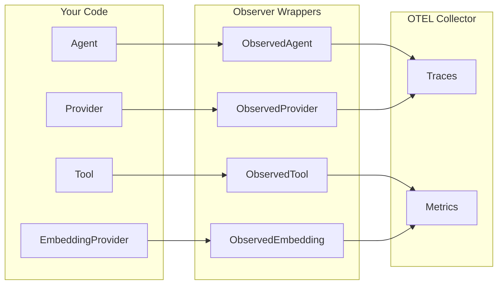

# Observability

The `observer` package wraps framework components with OpenTelemetry instrumentation — traces, metrics, and cost tracking. Zero changes to existing implementations, zero overhead when disabled.

## Architecture



All wrappers implement their respective interfaces, so they plug into existing code with no changes.

## Setup

**Package:** `github.com/nevindra/oasis/observer`

```go
inst, shutdown, err := observer.Init(ctx, pricingOverrides)
defer shutdown(ctx)
```

## Wrapping Components

```go
// Provider — emits llm.chat, llm.chat_with_tools, llm.chat_stream spans
observed := observer.WrapProvider(provider, modelName, inst)

// EmbeddingProvider — emits llm.embed spans
observed := observer.WrapEmbedding(embedding, modelName, inst)

// Tool — emits tool.execute spans
observed := observer.WrapTool(tool, inst)

// Agent — emits agent.execute parent span + lifecycle events
observed := observer.WrapAgent(agent, inst)
```

Compose with `WithRetry`:

```go
// Retry happens inside, before observer records the call
llm := observer.WrapProvider(
    oasis.WithRetry(gemini.New(apiKey, model)),
    modelName, inst,
)
```

## Traces

| Span Name | Key Attributes |
|-----------|---------------|
| `llm.chat` | model, provider, input_tokens, output_tokens, cost_usd |
| `llm.chat_with_tools` | model, provider, tokens, cost_usd, tool_count, tool_names |
| `llm.chat_stream` | model, provider, tokens, cost_usd, stream_chunks |
| `llm.embed` | model, provider, text_count, dimensions |
| `tool.execute` | tool_name, status, result_length |
| `agent.execute` | agent_name, agent_type, agent_status, tokens |

`ObservedAgent` creates a parent span that contains all inner operations as child spans via context propagation.

## Metrics

| Metric | Type | Description |
|--------|------|-------------|
| `llm.token.usage` | Counter | Tokens consumed (by model, provider, direction) |
| `llm.cost.total` | Counter | Cumulative cost in USD |
| `llm.requests` | Counter | Request count (by model, method, status) |
| `llm.duration` | Histogram | Call latency in ms |
| `tool.executions` | Counter | Tool call count (by name, status) |
| `tool.duration` | Histogram | Tool latency in ms |
| `embedding.requests` | Counter | Embedding call count |
| `embedding.duration` | Histogram | Embedding latency in ms |
| `agent.executions` | Counter | Agent execution count (by name, status) |
| `agent.duration` | Histogram | Agent execution latency in ms |

## Cost Tracking

```go
calc := observer.NewCostCalculator(overrides)
cost := calc.Calculate("gemini-2.5-flash", inputTokens, outputTokens)
```

Built-in pricing for common Gemini, OpenAI, and Anthropic models. Unknown models return `0.0`. Override or extend via config:

```toml
[observer.pricing."gpt-4o"]
input = 2.50
output = 10.00

[observer.pricing."my-custom-model"]
input = 1.00
output = 3.00
```

## OTEL Configuration

Standard environment variables:

| Variable | Description |
|----------|-------------|
| `OTEL_EXPORTER_OTLP_ENDPOINT` | Collector endpoint (e.g., `http://localhost:4318`) |
| `OTEL_SERVICE_NAME` | Service name (defaults to `"oasis"`) |
| `OTEL_TRACES_SAMPLER` | Trace sampling strategy |
| `OTEL_EXPORTER_OTLP_PROTOCOL` | `grpc` or `http/protobuf` |

Enable via config:

```toml
[observer]
enabled = true
```

Or environment variable: `OASIS_OBSERVER_ENABLED=true`

## Built-in Execution Traces (No OTEL Required)

Every `AgentResult` includes a `Steps` field — a chronological `[]StepTrace` of every tool call and agent delegation that occurred during execution. This works out of the box with no observer setup:

```go
result, _ := network.Execute(ctx, task)

for _, step := range result.Steps {
    fmt.Printf("%-6s %-20s %5dms  in=%-4d out=%d\n",
        step.Type, step.Name, step.Duration.Milliseconds(),
        step.Usage.InputTokens, step.Usage.OutputTokens)
}
// agent  researcher           1234ms  in=500  out=200
// tool   web_search            456ms  in=0    out=0
// agent  writer               2100ms  in=800  out=400
```

`StepTrace.Type` is `"tool"` for direct tool calls, `"agent"` for Network subagent delegations, and `"step"` for Workflow steps.

Streaming consumers get the same data via `Usage` and `Duration` fields on `EventToolCallResult` and `EventAgentFinish` events.

## See Also

- [Configuration Reference](../configuration/reference.md) — observer config section
- [Provider](provider.md) — what gets observed
- [Streaming](../guides/streaming.md) — StreamEvent usage/duration fields
