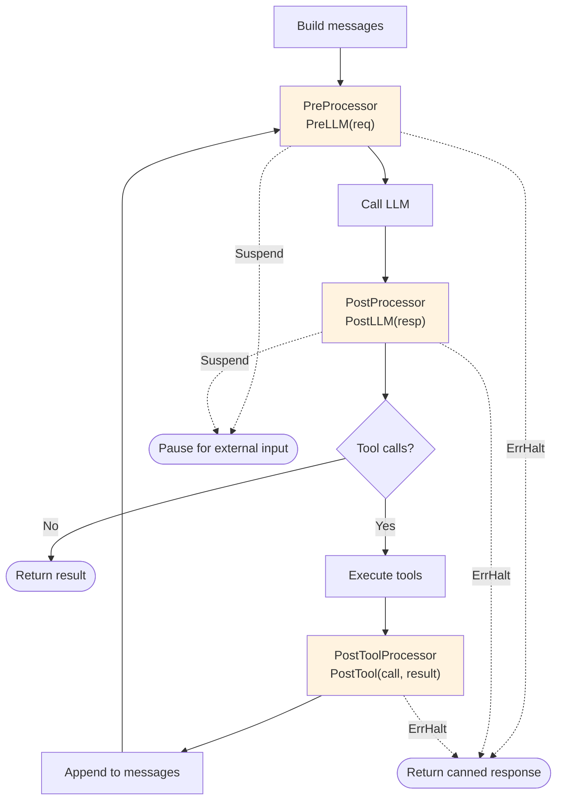

# Processor

Processors are middleware hooks in the agent execution loop. They transform, validate, or control messages at three points: before the LLM call, after the LLM response, and after each tool execution.

## Hook Points



## Three Interfaces

**File:** `processor.go`

```go
// Before LLM call — modify the request
type PreProcessor interface {
    PreLLM(ctx context.Context, req *ChatRequest) error
}

// After LLM response — modify/filter the response
type PostProcessor interface {
    PostLLM(ctx context.Context, resp *ChatResponse) error
}

// After each tool execution — modify the result
type PostToolProcessor interface {
    PostTool(ctx context.Context, call ToolCall, result *ToolResult) error
}
```

A processor implements whichever phases it needs. A guardrail only needs `PreProcessor`. A redactor may need all three.

## ErrHalt

Return `ErrHalt` from any processor to short-circuit execution:

```go
type ErrHalt struct {
    Response string
}
```

The agent loop catches `ErrHalt` and returns `AgentResult{Output: halt.Response}` with a nil error. Other errors propagate as infrastructure failures.

## Suspend

Return `Suspend(payload)` from any processor to pause agent execution:

```go
func (g *ApprovalGate) PostLLM(ctx context.Context, resp *oasis.ChatResponse) error {
    if hasDangerousToolCalls(resp) {
        return oasis.Suspend(json.RawMessage(`{"reason": "dangerous tool calls need approval"}`))
    }
    return nil
}
```

The agent returns `ErrSuspended` with the payload. The caller can inspect the payload, collect external input, and resume:

```go
result, err := agent.Execute(ctx, task)
var suspended *oasis.ErrSuspended
if errors.As(err, &suspended) {
    // show payload to human, collect approval
    result, err = suspended.Resume(ctx, approvalData)
}
```

`Suspend` works in `LLMAgent`, `Network`, and `Workflow`. Conversation history and DAG state are preserved across suspend/resume cycles. `Resume` is single-use; call `Release()` to free the captured snapshot when the suspend will not be resumed (timeout, user abandonment). See [InputHandler](input-handler.md) for the related `ask_user` pattern.

## Registration

```go
agent := oasis.NewLLMAgent("safe-agent", "Agent with guardrails", provider,
    oasis.WithTools(searchTool),
    oasis.WithProcessors(&guardrail, &piiRedactor, &tokenBudget),
)
```

Processors run in registration order at each hook point. An empty chain is a no-op.

## Use Cases

| Use Case | Interface | What it does |
|----------|-----------|-------------|
| Injection detection | PreProcessor | **Built-in:** `InjectionGuard` — multi-layer prompt injection detection (phrases, role override, delimiters, encoding with NFKC normalization, custom regex). Supports `ScanAllMessages()` for full-history scanning |
| Content length limits | PreProcessor + PostProcessor | **Built-in:** `ContentGuard` — enforce max rune count on input and output |
| Keyword blocking | PreProcessor | **Built-in:** `KeywordGuard` — block messages containing specified keywords or regex patterns |
| Tool call limiting | PostProcessor | **Built-in:** `MaxToolCallsGuard` — cap tool calls per LLM response (trims, doesn't halt) |
| PII redaction | All three | Redact sensitive data at every stage |
| Content moderation | PostProcessor | Filter harmful LLM output |
| Tool filtering | PostProcessor | Remove/block specific tool calls |
| Token budget | PreProcessor | Trim message history to fit budget |
| Logging | PostProcessor + PostToolProcessor | Log LLM responses, token usage, and tool executions |
| Audit logging | PostToolProcessor | Log all tool executions |
| Approval gates | PostProcessor | Ask human before executing dangerous tools (use `Suspend` for structured gates) |

## What Processors Don't Do

Processors handle per-iteration hooks inside the agent loop. For other cross-cutting concerns:

- **Retries on transient HTTP errors** — use `oasis.WithRetry(provider)` at the Provider level
- **Retries on step failure** — use `oasis.Retry(n, delay)` on Workflow steps
- **Post-execution analysis** (which agent ran, per-step token counts, latency) — use `result.Steps` ([execution traces](observability.md#built-in-execution-traces-no-otel-required))
- **Distributed tracing and metrics** — use the `observer` package ([observability](observability.md))

## ProcessorChain

Holds and runs processors in order:

```go
chain := oasis.NewProcessorChain()
chain.Add(processor)
chain.Len()

err := chain.RunPreLLM(ctx, &req)
err := chain.RunPostLLM(ctx, &resp)
err := chain.RunPostTool(ctx, toolCall, &result)
```

## Key Behaviors

- Processors receive pointers and modify in place (`*ChatRequest`, `*ChatResponse`, `*ToolResult`)
- Must be safe for concurrent use — multiple agent executions may share instances
- A processor that implements none of the three interfaces causes a panic at registration
- Processors are pre-bucketed by interface at `Add()` time — no per-call type assertions in the hot path
- The chain skips processors that don't implement a given phase

## See Also

- [Processors & Guardrails Guide](../guides/processors-and-guardrails.md) — examples
- [Agent](agent.md) — the execution loop
- [InputHandler](input-handler.md) — approval gates via processor + handler
