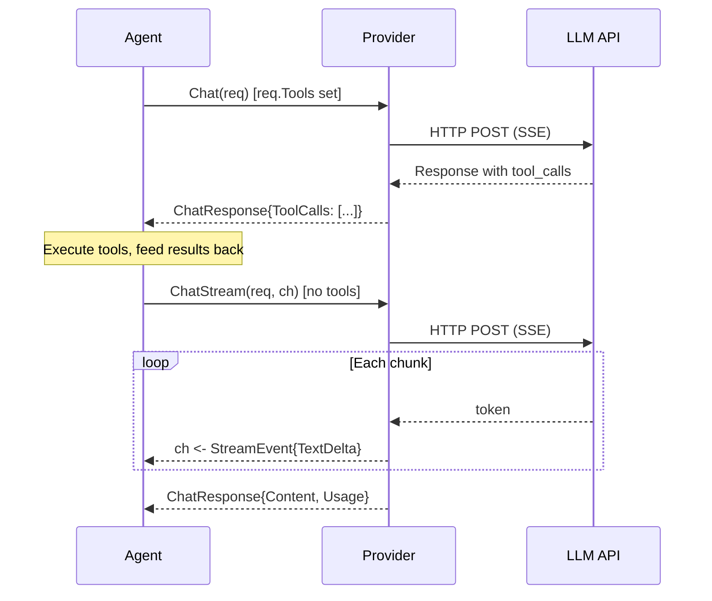

# Provider

Providers are the LLM backend — they turn messages into responses. Every agent in Oasis ultimately talks to a Provider.

## Provider Interface

**File:** `provider.go`

```go
type Provider interface {
    Chat(ctx context.Context, req ChatRequest) (ChatResponse, error)
    ChatStream(ctx context.Context, req ChatRequest, ch chan<- StreamEvent) (ChatResponse, error)
    Name() string
}
```

Two methods handle all interaction patterns:

| Method | When it's used |
|--------|---------------|
| `Chat` | Blocking request/response. When `req.Tools` is non-empty, the response may contain `ToolCalls` |
| `ChatStream` | Like Chat but emits `StreamEvent` values into `ch` as content is generated. When `req.Tools` is non-empty, emits `EventToolCallDelta` events. The channel is NOT closed by the provider — the caller owns its lifecycle |

Tools are passed via `ChatRequest.Tools` — no separate method needed.



## EmbeddingProvider Interface

**File:** `provider.go`

```go
type EmbeddingProvider interface {
    Embed(ctx context.Context, texts []string) ([][]float32, error)
    Dimensions() int
    Name() string
}
```

Converts text to vectors for semantic search. Used by Store (vector search), MemoryStore (fact deduplication), and agents (cross-thread recall).

## Shipped Implementations

| Package | Provider | EmbeddingProvider | Notes |
|---------|----------|-------------------|-------|
| `provider/gemini` | `gemini.New(apiKey, model)` | `gemini.NewEmbedding(apiKey, model, dims)` | Google Gemini. Raw HTTP + SSE. |
| `provider/openaicompat` | `openaicompat.NewProvider(apiKey, model, baseURL)` | — | Any OpenAI-compatible API (OpenAI, Groq, Together, Fireworks, DeepSeek, Mistral, Ollama, vLLM, LM Studio, OpenRouter, Azure OpenAI) |

Both use raw HTTP with SSE parsing — no SDK dependencies.

### Gemini Provider

```go
import "github.com/nevindra/oasis/provider/gemini"

llm := gemini.New(apiKey, "gemini-2.0-flash")

// With options
llm := gemini.New(apiKey, "gemini-2.0-flash",
    gemini.WithTemperature(0.7),
    gemini.WithGoogleSearch(true),
)

// Image generation model
llm := gemini.New(apiKey, "gemini-2.0-flash-exp-image-generation",
    gemini.WithResponseModalities("TEXT", "IMAGE"),
)

// Thinking model
llm := gemini.New(apiKey, "gemini-2.5-flash-thinking",
    gemini.WithThinking(true),
)

// With structured logger (warns on unsupported GenerationParams fields)
llm := gemini.New(apiKey, "gemini-2.0-flash",
    gemini.WithLogger(slog.Default()),
)
```

See [API Reference: Options — Gemini Options](../api/options.md#gemini-options) for the full option list.

#### Context Caching

Gemini supports explicit context caching — upload large content once, then reference the cached tokens in subsequent requests for reduced cost and latency.

```go
import "github.com/nevindra/oasis/provider/gemini"

llm := gemini.New(apiKey, "gemini-2.5-flash")

// 1. Create a cache with a system instruction (or conversation content)
cc, err := llm.CreateCachedContent(ctx, gemini.NewTextCachedContent(
    "models/gemini-2.5-flash",
    "You are an expert on the Go programming language. [long reference docs...]",
    1*time.Hour, // TTL
))

// 2. Use the cache in a new provider instance
cachedLLM := gemini.New(apiKey, "gemini-2.5-flash",
    gemini.WithCachedContent(cc.Name),
)

// 3. Subsequent requests use cached tokens — check usage
result, _ := agent.Execute(ctx, oasis.AgentTask{Input: "Explain interfaces"})
fmt.Println(result.Usage.CachedTokens) // tokens served from cache

// 4. Manage cache lifecycle
caches, _ := llm.ListCachedContents(ctx)
llm.DeleteCachedContent(ctx, cc.Name)
```

The cache is immutable after creation — only the expiration can be updated via `UpdateCachedContent`. Minimum token count varies by model (1,024–4,096).

### OpenAI-Compatible Provider

Most LLM providers implement the OpenAI chat completions API. Use `openaicompat.NewProvider` to connect to any of them:

```go
import "github.com/nevindra/oasis/provider/openaicompat"

// OpenAI
llm := openaicompat.NewProvider("sk-xxx", "gpt-4o", "https://api.openai.com/v1")

// Groq
llm := openaicompat.NewProvider("gsk-xxx", "llama-3.3-70b-versatile", "https://api.groq.com/openai/v1")

// Together AI
llm := openaicompat.NewProvider("xxx", "meta-llama/Llama-3.3-70B-Instruct-Turbo", "https://api.together.xyz/v1")

// DeepSeek
llm := openaicompat.NewProvider("sk-xxx", "deepseek-chat", "https://api.deepseek.com/v1")

// Ollama (local, no API key)
llm := openaicompat.NewProvider("", "llama3", "http://localhost:11434/v1")

// OpenRouter
llm := openaicompat.NewProvider("sk-xxx", "anthropic/claude-sonnet-4", "https://openrouter.ai/api/v1")
```

Configure with provider-level options:

```go
llm := openaicompat.NewProvider("sk-xxx", "gpt-4o", "https://api.openai.com/v1",
    openaicompat.WithName("openai"),              // for logs/observability
    openaicompat.WithLogger(slog.Default()),      // warns on unsupported GenerationParams
    openaicompat.WithOptions(                     // applied to every request
        openaicompat.WithTemperature(0.7),
        openaicompat.WithMaxTokens(4096),
    ),
)
```

See [API Reference: Options — OpenAI-Compatible Options](../api/options.md#openai-compatible-options) for the full option list.

#### Context Caching

Some OpenAI-compatible providers (Anthropic, Qwen) support explicit cache control markers on messages. Use `WithCacheControl` to mark messages as cache breakpoints:

```go
llm := openaicompat.NewProvider(apiKey, model, baseURL,
    openaicompat.WithOptions(
        openaicompat.WithCacheControl(0, 1), // cache system prompt (0) and context (1)
    ),
)
```

The provider adds `cache_control: {"type": "ephemeral"}` to the last content block of each marked message. Cached tokens appear in `Usage.CachedTokens`. Providers without cache support silently ignore the markers.

## Provider Resolution

**Package:** `provider/resolve`

The `resolve` package creates providers from provider-agnostic configuration, eliminating hard-coded provider constructors. Useful when the provider choice comes from config files or environment variables.

```go
import "github.com/nevindra/oasis/provider/resolve"

// Create a chat provider from config
llm, err := resolve.Provider(resolve.Config{
    Provider: "openai",       // "gemini", "openai", "groq", "deepseek", "together", "mistral", "ollama"
    APIKey:   "sk-xxx",
    Model:    "gpt-4o",
})

// With options
llm, err := resolve.Provider(resolve.Config{
    Provider:    "gemini",
    APIKey:      apiKey,
    Model:       "gemini-2.5-flash",
    Temperature: ptr(0.7),
    TopP:        ptr(0.95),
    Thinking:    ptr(true),
})

// Create an embedding provider
embed, err := resolve.EmbeddingProvider(resolve.EmbeddingConfig{
    Provider:   "gemini",
    APIKey:     apiKey,
    Model:      "gemini-embedding-001",
    Dimensions: 768,
})
```

### Config

| Field | Type | Description |
|-------|------|-------------|
| `Provider` | `string` | Required. Provider name (see table below) |
| `APIKey` | `string` | API key |
| `Model` | `string` | Model identifier |
| `BaseURL` | `string` | Override base URL (auto-filled for known providers) |
| `Temperature` | `*float64` | Sampling temperature (nil = provider default) |
| `TopP` | `*float64` | Nucleus sampling (nil = provider default) |
| `Thinking` | `*bool` | Thinking mode — Gemini only, silently ignored for others |

### Supported Providers and Default Base URLs

| Provider | Default Base URL |
|----------|-----------------|
| `"gemini"` | Uses Gemini API directly |
| `"openai"` | `https://api.openai.com/v1` |
| `"groq"` | `https://api.groq.com/openai/v1` |
| `"deepseek"` | `https://api.deepseek.com/v1` |
| `"together"` | `https://api.together.xyz/v1` |
| `"mistral"` | `https://api.mistral.ai/v1` |
| `"ollama"` | `http://localhost:11434/v1` |

For unlisted OpenAI-compatible providers, use one of the known names with a custom `BaseURL`, or use `openaicompat.NewProvider` directly.

### EmbeddingConfig

| Field | Type | Description |
|-------|------|-------------|
| `Provider` | `string` | Currently only `"gemini"` is supported |
| `APIKey` | `string` | API key |
| `Model` | `string` | Embedding model identifier |
| `Dimensions` | `int` | Output vector dimensions |

## WithRetry Middleware

Wraps any Provider with automatic retry on transient HTTP errors (429, 503):

```go
llm := oasis.WithRetry(gemini.New(apiKey, model))

// Custom limits
llm := oasis.WithRetry(gemini.New(apiKey, model),
    oasis.RetryMaxAttempts(5),
    oasis.RetryBaseDelay(500*time.Millisecond),
)
```

Uses exponential backoff with jitter. `ChatStream` only retries if no tokens have been forwarded yet.

## WithRateLimit Middleware

Wraps any Provider with proactive rate limiting. Requests block until the sliding-window budget allows them to proceed:

```go
// RPM only
llm := oasis.WithRateLimit(gemini.New(apiKey, model), oasis.RPM(60))

// RPM + TPM
llm := oasis.WithRateLimit(gemini.New(apiKey, model),
    oasis.RPM(60),
    oasis.TPM(100000),
)

// Compose with retry — rate limit first, retry inside
llm := oasis.WithRateLimit(
    oasis.WithRetry(gemini.New(apiKey, model)),
    oasis.RPM(60),
)
```

`RPM(n)` uses a sliding window of request timestamps — when the window is full, the next request blocks until the oldest entry expires. `TPM(n)` is a soft limit — the request that exceeds the budget completes, but subsequent requests block until the token window slides. Both respect context cancellation.

## LLM Protocol Types

```go
type ChatRequest struct {
    Messages         []ChatMessage
    ResponseSchema   *ResponseSchema   // optional: enforce structured JSON output
    GenerationParams *GenerationParams  // optional: per-request sampling overrides
}

type ChatResponse struct {
    Content     string
    Thinking    string          // LLM reasoning/chain-of-thought (e.g., Gemini thought parts)
    Attachments []Attachment    // multimodal content from LLM response
    ToolCalls   []ToolCall
    Usage       Usage
}

type ChatMessage struct {
    Role        string          // "system", "user", "assistant", "tool"
    Content     string
    Attachments []Attachment    // multimodal content (images, PDFs)
    ToolCalls   []ToolCall
    ToolCallID  string
}

type Usage struct {
    InputTokens  int
    OutputTokens int
    CachedTokens int // input tokens served from provider cache (zero when no caching)
}
```

Convenience constructors:

```go
oasis.UserMessage("hello")
oasis.SystemMessage("You are a helpful assistant.")
oasis.AssistantMessage("Hi there!")
oasis.ToolResultMessage(callID, "result content")
```

## Batch Interfaces

**File:** `batch.go`

Optional capabilities for asynchronous batch processing at reduced cost. Discovered via type assertion.

```go
type BatchProvider interface {
    BatchChat(ctx context.Context, requests []ChatRequest) (BatchJob, error)
    BatchStatus(ctx context.Context, jobID string) (BatchJob, error)
    BatchChatResults(ctx context.Context, jobID string) ([]ChatResponse, error)
    BatchCancel(ctx context.Context, jobID string) error
}

type BatchEmbeddingProvider interface {
    BatchEmbed(ctx context.Context, texts [][]string) (BatchJob, error)
    BatchEmbedStatus(ctx context.Context, jobID string) (BatchJob, error)
    BatchEmbedResults(ctx context.Context, jobID string) ([][]float32, error)
}
```

Batch jobs are processed offline — create with `BatchChat`/`BatchEmbed`, poll with `BatchStatus`, retrieve results when `BatchSucceeded`. Trade-off: higher latency (minutes to hours) for lower cost (50% for Gemini).

```go
// Check if provider supports batching
if bp, ok := provider.(oasis.BatchProvider); ok {
    job, _ := bp.BatchChat(ctx, requests)
    // Poll status...
    status, _ := bp.BatchStatus(ctx, job.ID)
    if status.State == oasis.BatchSucceeded {
        results, _ := bp.BatchChatResults(ctx, job.ID)
    }
}
```

| Package           | BatchProvider              | BatchEmbeddingProvider                     |
|-------------------|----------------------------|--------------------------------------------|
| `provider/gemini` | `gemini.New(apiKey, model)` | `gemini.NewEmbedding(apiKey, model, dims)` |

## Key Behaviors

- `ChatStream` does **NOT close `ch`** — the caller owns the channel's lifecycle
- When `req.Tools` is non-empty, `Chat` may populate `ChatResponse.ToolCalls`. Each `ToolCall` needs an `ID`, `Name`, and `Args` (JSON)
- When `req.Tools` is non-empty, `ChatStream` emits `EventToolCallDelta` events with incremental argument chunks, then returns the assembled `ToolCalls` in the response
- Both implementations parse SSE streams in-process — no goroutine leaks
- `Name()` returns a string identifier used in logging and observability
- **Generation params** — when `req.GenerationParams` is non-nil, providers map the fields to their native API (Gemini: `generationConfig`, OpenAI: top-level request fields). Unsupported fields (e.g., TopK on OpenAI-compat) emit a warning via the provider's `WithLogger` logger. Providers that don't read `GenerationParams` continue to work unchanged
- **Thinking capture** — Gemini captures `thought` parts from responses into `ChatResponse.Thinking`. OpenAI-compat maps reasoning tokens when available. Models without thinking support return an empty string

## See Also

- [Custom Provider Guide](../guides/custom-provider.md) — implement your own
- [Observability](observability.md) — OTEL wrappers for providers
- [API Reference: Interfaces](../api/interfaces.md)
- [API Reference: Options](../api/options.md#ratelimitoption) — rate limit configuration
