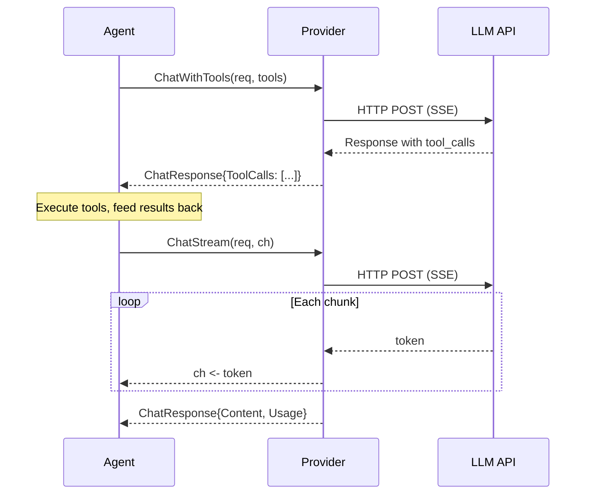

# Provider

Providers are the LLM backend — they turn messages into responses. Every agent in Oasis ultimately talks to a Provider.

## Provider Interface

**File:** `provider.go`

```go
type Provider interface {
    Chat(ctx context.Context, req ChatRequest) (ChatResponse, error)
    ChatWithTools(ctx context.Context, req ChatRequest, tools []ToolDefinition) (ChatResponse, error)
    ChatStream(ctx context.Context, req ChatRequest, ch chan<- string) (ChatResponse, error)
    Name() string
}
```

Three capabilities, all on one interface:

| Method | When it's used |
|--------|---------------|
| `Chat` | Simple request/response — no tools, no streaming |
| `ChatWithTools` | Request with tool definitions — response may contain `ToolCalls` |
| `ChatStream` | Stream tokens into a channel, return final aggregated response |



## EmbeddingProvider Interface

**File:** `provider.go`

```go
type EmbeddingProvider interface {
    Embed(ctx context.Context, texts []string) ([][]float32, error)
    Dimensions() int
    Name() string
}
```

Converts text to vectors for semantic search. Used by Store (vector search), MemoryStore (fact deduplication), and agents (cross-thread recall).

## Shipped Implementations

| Package | Provider | EmbeddingProvider | Notes |
|---------|----------|-------------------|-------|
| `provider/gemini` | `gemini.New(apiKey, model)` | `gemini.NewEmbedding(apiKey, model, dims)` | Google Gemini. Raw HTTP + SSE. |
| `provider/openaicompat` | `openaicompat.New(apiKey, model, baseURL)` | — | OpenAI, Anthropic, Ollama, any compatible API |

Both use raw HTTP with SSE parsing — no SDK dependencies.

## WithRetry Middleware

Wraps any Provider with automatic retry on transient HTTP errors (429, 503):

```go
llm := oasis.WithRetry(gemini.New(apiKey, model))

// Custom limits
llm := oasis.WithRetry(gemini.New(apiKey, model),
    oasis.RetryMaxAttempts(5),
    oasis.RetryBaseDelay(500*time.Millisecond),
)
```

Uses exponential backoff with jitter. `ChatStream` only retries if no tokens have been forwarded yet.

## LLM Protocol Types

```go
type ChatRequest struct {
    Messages       []ChatMessage
    ResponseSchema *ResponseSchema  // optional: enforce structured JSON output
}

type ChatResponse struct {
    Content   string
    ToolCalls []ToolCall
    Usage     Usage
}

type ChatMessage struct {
    Role        string          // "system", "user", "assistant", "tool"
    Content     string
    Attachments []Attachment    // multimodal content (images, PDFs)
    ToolCalls   []ToolCall
    ToolCallID  string
}

type Usage struct {
    InputTokens  int
    OutputTokens int
}
```

Convenience constructors:

```go
oasis.UserMessage("hello")
oasis.SystemMessage("You are a helpful assistant.")
oasis.AssistantMessage("Hi there!")
oasis.ToolResultMessage(callID, "result content")
```

## Key Behaviors

- `ChatStream` **must close `ch`** when done — callers rely on this for cleanup
- `ChatWithTools` populates `ChatResponse.ToolCalls` when the LLM wants to call tools. Each `ToolCall` needs an `ID`, `Name`, and `Args` (JSON)
- Both implementations parse SSE streams in-process — no goroutine leaks
- `Name()` returns a string identifier used in logging and observability

## See Also

- [Custom Provider Guide](../guides/custom-provider.md) — implement your own
- [Observability](observability.md) — OTEL wrappers for providers
- [API Reference: Interfaces](../api/interfaces.md)
