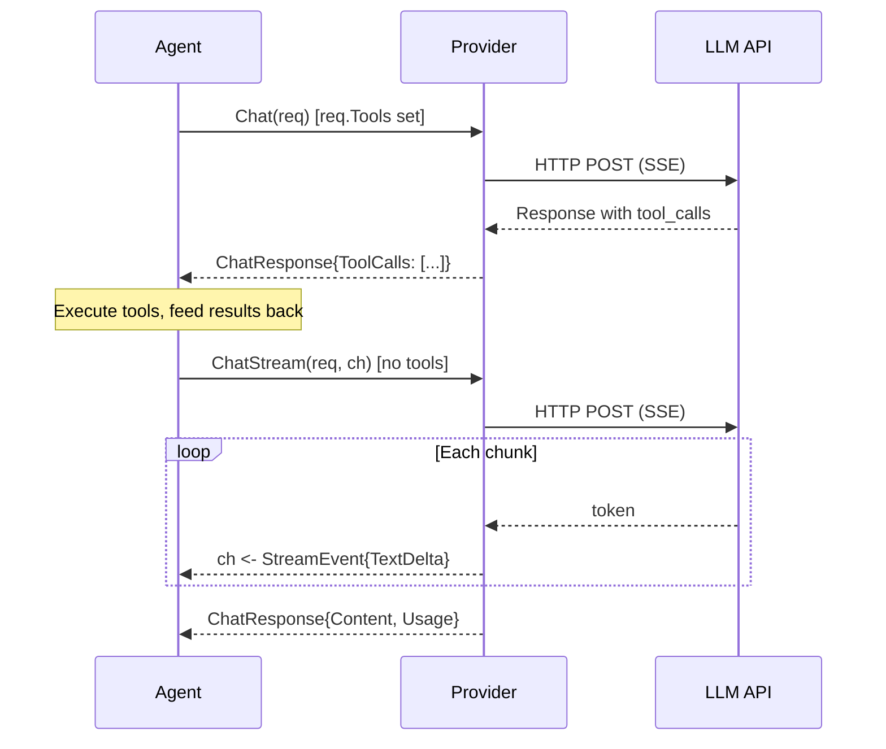
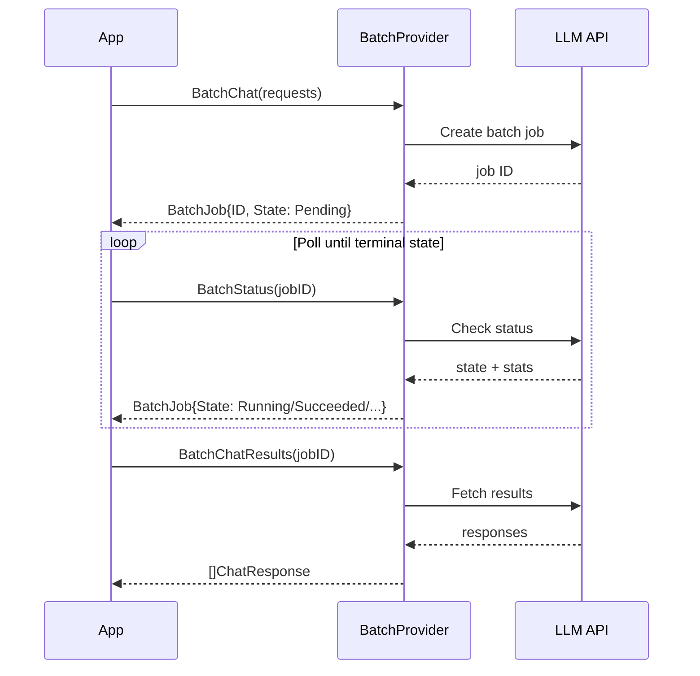

# Provider

Providers are the LLM backend — they turn messages into responses. Every agent in Oasis ultimately talks to a Provider.

## Provider Interface

**File:** `provider.go`

```go
type Provider interface {
    Chat(ctx context.Context, req ChatRequest) (ChatResponse, error)
    ChatStream(ctx context.Context, req ChatRequest, ch chan<- StreamEvent) (ChatResponse, error)
    Name() string
}
```

Two methods handle all interaction patterns:

| Method | When it's used |
|--------|---------------|
| `Chat` | Blocking request/response. When `req.Tools` is non-empty, the response may contain `ToolCalls` |
| `ChatStream` | Like Chat but emits `StreamEvent` values into `ch` as content is generated. When `req.Tools` is non-empty, emits `EventToolCallDelta` events. **The provider closes `ch` before returning** — both shipped implementations (Gemini, OpenAI-compat) close the channel on all paths (success, error, context cancellation). The caller should range over the channel, not close it |

Tools are passed via `ChatRequest.Tools` — no separate method needed.


```mermaid
sequenceDiagram
    participant Agent
    participant Provider
    participant LLM API

    Agent->>Provider: Chat(req) [req.Tools set]
    Provider->>LLM API: HTTP POST (SSE)
    LLM API-->>Provider: Response with tool_calls
    Provider-->>Agent: ChatResponse{ToolCalls: [...]}

    Note over Agent: Execute tools, feed results back

    Agent->>Provider: ChatStream(req, ch) [no tools]
    Provider->>LLM API: HTTP POST (SSE)
    loop Each chunk
        LLM API-->>Provider: token
        Provider-->>Agent: ch <- StreamEvent{TextDelta}
    end
    Provider-->>Agent: ChatResponse{Content, Usage}
```

## EmbeddingProvider Interface

**File:** `provider.go`

```go
type EmbeddingProvider interface {
    Embed(ctx context.Context, texts []string) ([][]float32, error)
    Dimensions() int
    Name() string
}
```

Converts text to vectors for semantic search. Used by Store (vector search), MemoryStore (fact deduplication), and agents (cross-thread recall).

## MultimodalEmbeddingProvider Interface

**File:** `types.go`

Optional capability for embedding providers that support both text and image inputs in a shared vector space:

```go
type MultimodalEmbeddingProvider interface {
    EmbedMultimodal(ctx context.Context, inputs []MultimodalInput) ([][]float32, error)
}

type MultimodalInput struct {
    Text        string
    Attachments []Attachment // images, etc.
}
```

Discovered via type assertion on `EmbeddingProvider`. When available, text queries naturally match images via cosine similarity (e.g., "black shirt" matches a photo of a black shirt).

The OpenAI-compatible embedding provider implements this for multimodal models like Qwen3-VL-Embedding served via vLLM. See [Multimodal Embedding](#multimodal-embedding) for usage.

## Shipped Implementations

| Package | Provider | EmbeddingProvider | Notes |
|---------|----------|-------------------|-------|
| `provider/gemini` | `gemini.New(apiKey, model)` | `gemini.NewEmbedding(apiKey, model, dims)` | Google Gemini. Raw HTTP + SSE. |
| `provider/openaicompat` | `openaicompat.NewProvider(apiKey, model, baseURL)` | `openaicompat.NewEmbedding(apiKey, model, baseURL, dims)` | Any OpenAI-compatible API (OpenAI, Groq, Together, Fireworks, DeepSeek, Mistral, Ollama, vLLM, LM Studio, OpenRouter, Azure OpenAI) |

Both use raw HTTP with SSE parsing — no SDK dependencies.

### Gemini Provider

```go
import "github.com/nevindra/oasis/provider/gemini"

llm := gemini.New(apiKey, "gemini-2.0-flash")

// With options
llm := gemini.New(apiKey, "gemini-2.0-flash",
    gemini.WithTemperature(0.7),
    gemini.WithGoogleSearch(true),
)

// Image generation model
llm := gemini.New(apiKey, "gemini-2.0-flash-exp-image-generation",
    gemini.WithResponseModalities("TEXT", "IMAGE"),
)

// Thinking model
llm := gemini.New(apiKey, "gemini-2.5-flash-thinking",
    gemini.WithThinking(true),
)

// With structured logger (warns on unsupported GenerationParams fields)
llm := gemini.New(apiKey, "gemini-2.0-flash",
    gemini.WithLogger(slog.Default()),
)
```

See [API Reference: Options — Gemini Options](../api/options.md#gemini-options) for the full option list.

#### Context Caching

Gemini supports explicit context caching — upload large content once, then reference the cached tokens in subsequent requests for reduced cost and latency.

```go
import "github.com/nevindra/oasis/provider/gemini"

llm := gemini.New(apiKey, "gemini-2.5-flash")

// 1. Create a cache with a system instruction (or conversation content)
cc, err := llm.CreateCachedContent(ctx, gemini.NewTextCachedContent(
    "models/gemini-2.5-flash",
    "You are an expert on the Go programming language. [long reference docs...]",
    1*time.Hour, // TTL
))

// 2. Use the cache in a new provider instance
cachedLLM := gemini.New(apiKey, "gemini-2.5-flash",
    gemini.WithCachedContent(cc.Name),
)

// 3. Subsequent requests use cached tokens — check usage
result, _ := agent.Execute(ctx, oasis.AgentTask{Input: "Explain interfaces"})
fmt.Println(result.Usage.CachedTokens) // tokens served from cache

// 4. Manage cache lifecycle
caches, _ := llm.ListCachedContents(ctx)
llm.DeleteCachedContent(ctx, cc.Name)
```

The cache is immutable after creation — only the expiration can be updated via `UpdateCachedContent`. Minimum token count varies by model (1,024–4,096).

### OpenAI-Compatible Provider

Most LLM providers implement the OpenAI chat completions API. Use `openaicompat.NewProvider` to connect to any of them:

```go
import "github.com/nevindra/oasis/provider/openaicompat"

// OpenAI
llm := openaicompat.NewProvider("sk-xxx", "gpt-4o", "https://api.openai.com/v1")

// Groq
llm := openaicompat.NewProvider("gsk-xxx", "llama-3.3-70b-versatile", "https://api.groq.com/openai/v1")

// Together AI
llm := openaicompat.NewProvider("xxx", "meta-llama/Llama-3.3-70B-Instruct-Turbo", "https://api.together.xyz/v1")

// DeepSeek
llm := openaicompat.NewProvider("sk-xxx", "deepseek-chat", "https://api.deepseek.com/v1")

// Ollama (local, no API key)
llm := openaicompat.NewProvider("", "llama3", "http://localhost:11434/v1")

// OpenRouter
llm := openaicompat.NewProvider("sk-xxx", "anthropic/claude-sonnet-4", "https://openrouter.ai/api/v1")
```

Configure with provider-level options:

```go
llm := openaicompat.NewProvider("sk-xxx", "gpt-4o", "https://api.openai.com/v1",
    openaicompat.WithName("openai"),              // for logs/observability
    openaicompat.WithLogger(slog.Default()),      // warns on unsupported GenerationParams
    openaicompat.WithOptions(                     // applied to every request
        openaicompat.WithTemperature(0.7),
        openaicompat.WithMaxTokens(4096),
    ),
)
```

See [API Reference: Options — OpenAI-Compatible Options](../api/options.md#openai-compatible-options) for the full option list.

#### Context Caching

Some OpenAI-compatible providers (Anthropic, Qwen) support explicit cache control markers on messages. Use `WithCacheControl` to mark messages as cache breakpoints:

```go
llm := openaicompat.NewProvider(apiKey, model, baseURL,
    openaicompat.WithOptions(
        openaicompat.WithCacheControl(0, 1), // cache system prompt (0) and context (1)
    ),
)
```

The provider adds `cache_control: {"type": "ephemeral"}` to the last content block of each marked message. Cached tokens appear in `Usage.CachedTokens`. Providers without cache support silently ignore the markers.

## Provider Resolution

**Package:** `provider/resolve`

The `resolve` package creates providers from provider-agnostic configuration, eliminating hard-coded provider constructors. Useful when the provider choice comes from config files or environment variables.

```go
import "github.com/nevindra/oasis/provider/resolve"

// Create a chat provider from config
llm, err := resolve.Provider(resolve.Config{
    Provider: "openai",       // "gemini", "openai", "groq", "deepseek", "together", "mistral", "ollama"
    APIKey:   "sk-xxx",
    Model:    "gpt-4o",
})

// With options
llm, err := resolve.Provider(resolve.Config{
    Provider:    "gemini",
    APIKey:      apiKey,
    Model:       "gemini-2.5-flash",
    Temperature: ptr(0.7),
    TopP:        ptr(0.95),
    Thinking:    ptr(true),
})

// Create an embedding provider
embed, err := resolve.EmbeddingProvider(resolve.EmbeddingConfig{
    Provider:   "gemini",
    APIKey:     apiKey,
    Model:      "gemini-embedding-001",
    Dimensions: 768,
})
```

### Config

| Field | Type | Description |
|-------|------|-------------|
| `Provider` | `string` | Required. Provider name (see table below) |
| `APIKey` | `string` | API key |
| `Model` | `string` | Model identifier |
| `BaseURL` | `string` | Override base URL (auto-filled for known providers). Required for unknown providers — treated as OpenAI-compatible. |
| `Temperature` | `*float64` | Sampling temperature (nil = provider default) |
| `TopP` | `*float64` | Nucleus sampling (nil = provider default) |
| `Thinking` | `*bool` | Thinking mode — Gemini only, silently ignored for others |

### Supported Providers and Default Base URLs

| Provider | Default Base URL |
|----------|-----------------|
| `"gemini"` | Uses Gemini API directly |
| `"openai"` | `https://api.openai.com/v1` |
| `"groq"` | `https://api.groq.com/openai/v1` |
| `"deepseek"` | `https://api.deepseek.com/v1` |
| `"together"` | `https://api.together.xyz/v1` |
| `"mistral"` | `https://api.mistral.ai/v1` |
| `"ollama"` | `http://localhost:11434/v1` |

For unlisted OpenAI-compatible providers, provide a custom `BaseURL` with any provider name — the resolver treats unknown providers with a BaseURL as OpenAI-compatible. Alternatively, use `openaicompat.NewProvider` directly.

### Multimodal Embedding

For cross-modal retrieval (text queries matching images), use a provider that implements `MultimodalEmbeddingProvider`. The OpenAI-compatible embedding provider supports multimodal models like Qwen3-VL-Embedding served via vLLM:

```go
emb := openaicompat.NewEmbedding(
    "",                        // no API key for local vLLM
    "Qwen3-VL-Embedding-8B",
    "http://localhost:8000/v1",
    4096,                      // Qwen3-VL-Embedding-8B dimensions
)

// Text embedding (EmbeddingProvider interface)
vecs, err := emb.Embed(ctx, []string{"black shirt"})

// Multimodal embedding (MultimodalEmbeddingProvider interface)
vecs, err = emb.EmbedMultimodal(ctx, []oasis.MultimodalInput{
    {Attachments: []oasis.Attachment{{MimeType: "image/jpeg", Data: imageBytes}}},
})
```

Both text and image embeddings live in the same vector space — a text query "black shirt" naturally matches a photo of a black shirt via cosine similarity.

### EmbeddingConfig

| Field | Type | Description |
|-------|------|-------------|
| `Provider` | `string` | `"gemini"`, `"openai"`, `"vllm"`, `"ollama"`, `"together"`, `"mistral"`, `"qwen"`, `"qwen-cn"` |
| `APIKey` | `string` | API key |
| `Model` | `string` | Embedding model identifier |
| `BaseURL` | `string` | Override base URL (auto-filled for known providers). Required for unknown providers — treated as OpenAI-compatible. |
| `Dimensions` | `int` | Output vector dimensions |

> **For dynamic model discovery**, see [Model Catalog](#model-catalog) — it wraps provider resolution with model browsing, validation, and metadata enrichment. Use `resolve.Provider` when you know the exact provider and model. Use the catalog when end users need to discover and pick models at runtime.

## WithRetry Middleware

**File:** `retry.go`

Wraps any Provider (or EmbeddingProvider) with automatic retry on transient HTTP errors. Only errors with HTTP status 429 (Too Many Requests) or 503 (Service Unavailable) trigger a retry — all other errors pass through immediately.

### Options

| Option | Default | Description |
|--------|---------|-------------|
| `RetryMaxAttempts(n)` | 3 | Maximum number of total attempts (initial + retries) |
| `RetryBaseDelay(d)` | 1s | Initial backoff delay before the second attempt |
| `RetryTimeout(d)` | 0 (disabled) | Overall timeout across all attempts. When exceeded, the retry loop returns the last error |
| `RetryLogger(l)` | no-op | Structured `*slog.Logger` for retry events. Retries log at WARN, final exhaustion at ERROR |

### Exponential Backoff

Delays grow exponentially with random jitter to avoid thundering herd:

```
delay = baseDelay * 2^attempt + rand(0, baseDelay * 2^attempt / 2)
```

For the default `baseDelay` of 1s, the schedule looks like:

| Attempt | Base | Delay range (with jitter) |
|---------|------|--------------------------|
| 1st retry | 1s | 1.0s -- 1.5s |
| 2nd retry | 2s | 2.0s -- 3.0s |
| 3rd retry | 4s | 4.0s -- 6.0s |

### Retry-After Header

When the server returns a `Retry-After` header, the provider's `ErrHTTP` carries the parsed duration. The retry delay becomes `max(backoff, retryAfter)` — the server's requested wait time is always respected, but the exponential backoff is used as a floor so delays never decrease between attempts.

### Streaming Behavior

`ChatStream` only retries if no tokens have been forwarded to the caller yet. Once a `StreamEvent` has been sent on `ch`, errors pass through immediately to avoid sending duplicate content. The retry middleware always closes `ch` before returning.

### Usage

```go
// Defaults: 3 attempts, 1s base delay
llm := oasis.WithRetry(gemini.New(apiKey, model))

// Custom retry configuration
llm := oasis.WithRetry(gemini.New(apiKey, model),
    oasis.RetryMaxAttempts(5),
    oasis.RetryBaseDelay(500*time.Millisecond),
    oasis.RetryTimeout(30*time.Second),
    oasis.RetryLogger(slog.Default()),
)

// Retry for embedding providers
emb := oasis.WithEmbeddingRetry(
    gemini.NewEmbedding(apiKey, "gemini-embedding-001", 768),
    oasis.RetryMaxAttempts(5),
)
```

Compose with rate limiting — rate limit on the outside, retry on the inside:

```go
llm := oasis.WithRateLimit(
    oasis.WithRetry(gemini.New(apiKey, model)),
    oasis.RPM(60),
)
```

This way, a 429 from the LLM triggers a retry, and the rate limiter prevents hitting 429s in the first place.

## WithRateLimit Middleware

**File:** `ratelimit.go`

Wraps any Provider with proactive rate limiting. Requests block until the sliding-window budget allows them to proceed — this prevents 429s rather than reacting to them.

### Options

| Option | Description |
|--------|-------------|
| `RPM(n)` | Maximum requests per minute. Uses a sliding window of request timestamps — when the window contains `n` entries, the next call blocks until the oldest entry is more than 1 minute old |
| `TPM(n)` | Maximum tokens per minute (input + output combined). Soft limit — the request that exceeds the budget completes normally, but subsequent requests block until the token window slides below the limit |

Both limits use a 1-minute sliding window. Setting either to 0 (or omitting it) disables that dimension. Both respect context cancellation — a cancelled context unblocks immediately with `ctx.Err()`.

### How the Sliding Window Works

RPM and TPM each maintain a time-ordered list of events from the last 60 seconds:

1. **Before each request**, expired entries (older than 1 minute) are pruned.
2. **RPM check**: if the number of remaining request timestamps is less than the RPM limit, the request proceeds. Otherwise, the caller sleeps until the oldest entry expires.
3. **TPM check**: if the sum of token counts in the window is below the TPM limit, the request proceeds. Otherwise, the caller sleeps until enough entries expire to free budget.
4. **After each request**, the response's `Usage.InputTokens + Usage.OutputTokens` is recorded in the TPM window.

Because TPM is recorded after the response, it is a soft limit: one request can temporarily exceed the budget, but the next request will wait.

### Usage

```go
// RPM only — 60 requests per minute
llm := oasis.WithRateLimit(gemini.New(apiKey, model), oasis.RPM(60))

// RPM + TPM — 60 requests per minute, 100k tokens per minute
llm := oasis.WithRateLimit(gemini.New(apiKey, model),
    oasis.RPM(60),
    oasis.TPM(100_000),
)
```

### Composing with Retry

Rate limit on the outside, retry on the inside:

```go
llm := oasis.WithRateLimit(
    oasis.WithRetry(gemini.New(apiKey, model),
        oasis.RetryMaxAttempts(5),
        oasis.RetryLogger(slog.Default()),
    ),
    oasis.RPM(60),
    oasis.TPM(100_000),
)
```

The rate limiter gates outgoing requests to stay within budget. If a request still gets a 429 (e.g., from a shared quota), the retry middleware handles the backoff. This layering gives you both prevention and recovery.

## LLM Protocol Types

```go
type ChatRequest struct {
    Messages         []ChatMessage
    Tools            []ToolDefinition   // tool definitions for function calling
    ResponseSchema   *ResponseSchema    // optional: enforce structured JSON output
    GenerationParams *GenerationParams  // optional: per-request sampling overrides
}

type ChatResponse struct {
    Content     string
    Thinking    string          // LLM reasoning/chain-of-thought (e.g., Gemini thought parts)
    Attachments []Attachment    // multimodal content from LLM response
    ToolCalls   []ToolCall
    Usage       Usage
}

type ChatMessage struct {
    Role        string          // "system", "user", "assistant", "tool"
    Content     string
    Attachments []Attachment    // multimodal content (images, PDFs)
    ToolCalls   []ToolCall
    ToolCallID  string
    Metadata    json.RawMessage // provider-specific metadata (e.g., Gemini thinking signatures)
}

type Usage struct {
    InputTokens  int
    OutputTokens int
    CachedTokens int // input tokens served from provider cache (zero when no caching)
}
```

`GenerationParams` uses pointer fields — `nil` means "use provider default", while `0` is a valid explicit value:

```go
type GenerationParams struct {
    Temperature *float64 // nil = provider default, 0.0 = deterministic
    TopP        *float64
    TopK        *int
    MaxTokens   *int
}
```

Providers map these fields to their native API format (Gemini: `generationConfig`, OpenAI: top-level request fields). Unsupported fields (e.g., `TopK` on OpenAI-compat) emit a warning via the provider's logger and are silently skipped.

Convenience constructors:

```go
oasis.UserMessage("hello")
oasis.SystemMessage("You are a helpful assistant.")
oasis.AssistantMessage("Hi there!")
oasis.ToolResultMessage(callID, "result content")
```

## Batch Interfaces

**File:** `batch.go`

Optional capabilities for asynchronous batch processing at reduced cost (typically 50% for supported providers). Batch interfaces are not part of the core `Provider` or `EmbeddingProvider` contracts — they are discovered via type assertion at runtime.

### Interfaces

```go
type BatchProvider interface {
    BatchChat(ctx context.Context, requests []ChatRequest) (BatchJob, error)
    BatchStatus(ctx context.Context, jobID string) (BatchJob, error)
    BatchChatResults(ctx context.Context, jobID string) ([]ChatResponse, error)
    BatchCancel(ctx context.Context, jobID string) error
}

type BatchEmbeddingProvider interface {
    BatchEmbed(ctx context.Context, texts [][]string) (BatchJob, error)
    BatchEmbedStatus(ctx context.Context, jobID string) (BatchJob, error)
    BatchEmbedResults(ctx context.Context, jobID string) ([][]float32, error)
}
```

### BatchJob and BatchState

Every batch operation returns a `BatchJob` that tracks the lifecycle of the work:

```go
type BatchJob struct {
    ID          string     // provider-assigned job identifier
    State       BatchState // current lifecycle state
    DisplayName string     // optional human-readable name
    Stats       BatchStats // aggregate counts
    CreateTime  time.Time
    UpdateTime  time.Time
}

type BatchStats struct {
    TotalCount     int // total requests in the batch
    SucceededCount int // requests that completed successfully
    FailedCount    int // requests that failed
}
```

A batch job moves through these states:

| State | Constant | Description |
|-------|----------|-------------|
| Pending | `BatchPending` | Submitted, waiting for processing to begin |
| Running | `BatchRunning` | Provider is actively processing the requests |
| Succeeded | `BatchSucceeded` | All requests completed — results are available |
| Failed | `BatchFailed` | The job failed (partial results may be available via `BatchStats`) |
| Cancelled | `BatchCancelled` | Cancelled via `BatchCancel` |
| Expired | `BatchExpired` | Provider discarded the job after its retention period |

### Workflow: Submit, Poll, Collect

Batch jobs are processed offline — higher latency (minutes to hours) in exchange for lower cost. The workflow is always the same: submit requests, poll for completion, retrieve results.


```mermaid
sequenceDiagram
    participant App
    participant BatchProvider
    participant LLM API

    App->>BatchProvider: BatchChat(requests)
    BatchProvider->>LLM API: Create batch job
    LLM API-->>BatchProvider: job ID
    BatchProvider-->>App: BatchJob{ID, State: Pending}

    loop Poll until terminal state
        App->>BatchProvider: BatchStatus(jobID)
        BatchProvider->>LLM API: Check status
        LLM API-->>BatchProvider: state + stats
        BatchProvider-->>App: BatchJob{State: Running/Succeeded/...}
    end

    App->>BatchProvider: BatchChatResults(jobID)
    BatchProvider->>LLM API: Fetch results
    LLM API-->>BatchProvider: responses
    BatchProvider-->>App: []ChatResponse
```

### Batch Chat Example

```go
// Discover batch capability via type assertion
bp, ok := provider.(oasis.BatchProvider)
if !ok {
    log.Fatal("provider does not support batch processing")
}

// 1. Submit a batch of chat requests
requests := []oasis.ChatRequest{
    {Messages: []oasis.ChatMessage{oasis.UserMessage("Summarize quantum computing")}},
    {Messages: []oasis.ChatMessage{oasis.UserMessage("Summarize machine learning")}},
    {Messages: []oasis.ChatMessage{oasis.UserMessage("Summarize distributed systems")}},
}

job, err := bp.BatchChat(ctx, requests)
if err != nil {
    log.Fatal(err)
}
fmt.Println("submitted batch:", job.ID)

// 2. Poll until the job reaches a terminal state
ticker := time.NewTicker(30 * time.Second)
defer ticker.Stop()
for range ticker.C {
    job, err = bp.BatchStatus(ctx, job.ID)
    if err != nil {
        log.Fatal(err)
    }
    fmt.Printf("state=%s succeeded=%d/%d\n",
        job.State, job.Stats.SucceededCount, job.Stats.TotalCount)
    if job.State == oasis.BatchSucceeded || job.State == oasis.BatchFailed {
        break
    }
}

// 3. Collect results
if job.State == oasis.BatchSucceeded {
    results, err := bp.BatchChatResults(ctx, job.ID)
    if err != nil {
        log.Fatal(err)
    }
    for i, r := range results {
        fmt.Printf("--- Response %d ---\n%s\n", i, r.Content)
    }
}
```

### Batch Embedding Example

```go
bep, ok := embeddingProvider.(oasis.BatchEmbeddingProvider)
if !ok {
    log.Fatal("embedding provider does not support batch processing")
}

// Each element is a group of texts to embed
texts := [][]string{
    {"quantum computing basics", "quantum entanglement explained"},
    {"neural network architectures", "transformer models"},
}

job, err := bep.BatchEmbed(ctx, texts)
if err != nil {
    log.Fatal(err)
}

// Poll for completion (same pattern as batch chat)
for {
    job, _ = bep.BatchEmbedStatus(ctx, job.ID)
    if job.State == oasis.BatchSucceeded {
        break
    }
    time.Sleep(30 * time.Second)
}

// Retrieve vectors — one per input text group
vectors, err := bep.BatchEmbedResults(ctx, job.ID)
if err != nil {
    log.Fatal(err)
}
```

### Supported Providers

| Package           | BatchProvider              | BatchEmbeddingProvider                     |
|-------------------|----------------------------|--------------------------------------------|
| `provider/gemini` | `gemini.New(apiKey, model)` | `gemini.NewEmbedding(apiKey, model, dims)` |

## Model Catalog

**Package:** `provider/catalog`

The Model Catalog provides dynamic model discovery across LLM providers. It merges a static registry (compiled into the binary, updated via CI every 6 hours) with live provider API calls to give a complete picture: pricing and capabilities from static data, availability from live APIs.

### Why

Without the catalog, users manually specify provider + model as strings — typos only surface when the first API call fails, deprecated models cause silent runtime failures, and there's no way to browse available models programmatically.

### Architecture: Three-Layer Merge

```
Layer 1: Static Data (models_gen.go)
    Compiled into the binary. Rich metadata: pricing, capabilities, context windows.
    Sources: OpenRouter + models.dev, refreshed every 6 hours via CI.

Layer 2: Live API Data (per-provider /v1/models)
    Called when user has added an API key and requests the model list.
    Authoritative for what the user's key can actually access.

Layer 3: Merge
    Static metadata + live availability = complete picture.
    Model in both     → full metadata + available
    Model in static only → full metadata + unavailable (deprecated/removed)
    Model in live only   → minimal metadata + available (brand new)
```

### Quick Start

```go
import "github.com/nevindra/oasis/provider/catalog"

cat := catalog.NewModelCatalog()

// End user picks a platform from the built-in list, enters API key
cat.Add("qwen", apiKey)

// Browse available models with metadata
models, _ := cat.ListProvider(ctx, "qwen")
// → []oasis.ModelInfo with ID, context window, capabilities, pricing, status

// Create a provider directly from the catalog
llm, _ := cat.CreateProvider(ctx, "qwen/qwen-turbo")

// Use it like any other provider
agent := oasis.NewLLMAgent("chat", "You are helpful.", llm)
```

### Built-in Platforms

The catalog ships with 10 known platforms. End users see these in the UI without any developer code:

| Platform | Protocol | Default Base URL |
|----------|----------|-----------------|
| OpenAI | OpenAI-compat | `https://api.openai.com/v1` |
| Gemini | Gemini | `https://generativelanguage.googleapis.com/v1beta` |
| Groq | OpenAI-compat | `https://api.groq.com/openai/v1` |
| DeepSeek | OpenAI-compat | `https://api.deepseek.com` |
| Qwen | OpenAI-compat | `https://dashscope.aliyuncs.com/compatible-mode/v1` |
| Together | OpenAI-compat | `https://api.together.xyz/v1` |
| Mistral | OpenAI-compat | `https://api.mistral.ai/v1` |
| Fireworks | OpenAI-compat | `https://api.fireworks.ai/inference/v1` |
| Cerebras | OpenAI-compat | `https://api.cerebras.ai/v1` |
| Ollama | OpenAI-compat | `http://localhost:11434/v1` |

Custom platforms can be registered at runtime via `RegisterPlatform`, and custom providers (self-hosted Ollama, vLLM, etc.) via `AddCustom`.

### Model Identifier Format

Models use the `"provider/model"` format:

```
openai/gpt-4o
gemini/gemini-2.5-flash
qwen/qwen-turbo
```

Parse with `oasis.ParseModelID`:

```go
provider, model := oasis.ParseModelID("openai/gpt-4o")
// provider = "openai", model = "gpt-4o"
```

### Validation

The catalog validates models before creating providers:

```go
err := cat.Validate(ctx, "openai/gpt-4o")
// nil if valid, actionable error if deprecated or not found
// e.g., "catalog: model \"gemini/gemini-1.0-pro\" is deprecated (use gemini-2.5-flash instead)"
```

`CreateProvider` calls `Validate` automatically — invalid models are caught before the first Chat call.

### Custom / Self-Hosted Providers

For providers not in the built-in list (Ollama on a remote host, vLLM, internal proxies):

```go
cat.AddCustom("my-ollama", "http://192.168.1.50:11434/v1", "")
cat.AddCustom("company-llm", "https://llm.internal.corp/v1", corpKey)
```

These are assumed OpenAI-compatible. For non-standard protocols, register a platform first:

```go
cat.RegisterPlatform(oasis.Platform{
    Name:     "MyGeminiProxy",
    Protocol: oasis.ProtocolGemini,
    BaseURL:  "https://gemini-proxy.internal/v1beta",
})
cat.Add("mygeminiproxy", apiKey)
```

### Caching and Refresh

Live API results are cached with a configurable TTL (default: 1 hour). Three refresh strategies:

| Strategy | Behavior |
|----------|----------|
| `RefreshOnDemand` (default) | Live call on `List`/`ListProvider`, cached with TTL |
| `RefreshNone` | Static data only — no network calls. For air-gapped environments |

```go
cat := catalog.NewModelCatalog(
    catalog.WithCatalogTTL(30 * time.Minute),
    catalog.WithRefresh(catalog.RefreshNone), // offline mode
)
```

### See Also

- [Custom Provider Guide](../guides/custom-provider.md) — implement your own provider
- [API Reference: Types](../api/types.md#model-catalog-types) — ModelInfo, ModelCapabilities, ModelPricing

## Key Behaviors

- `ChatStream` **closes `ch` before returning** — both shipped providers close the channel on all paths. The caller should range over the channel, not close it
- When `req.Tools` is non-empty, `Chat` may populate `ChatResponse.ToolCalls`. Each `ToolCall` needs an `ID`, `Name`, and `Args` (JSON)
- When `req.Tools` is non-empty, `ChatStream` emits `EventToolCallDelta` events with incremental argument chunks, then returns the assembled `ToolCalls` in the response
- Both implementations parse SSE streams in-process — no goroutine leaks
- `Name()` returns a string identifier used in logging and observability
- **Generation params** — when `req.GenerationParams` is non-nil, providers map the fields to their native API (Gemini: `generationConfig`, OpenAI: top-level request fields). Unsupported fields (e.g., TopK on OpenAI-compat) emit a warning via the provider's `WithLogger` logger. Providers that don't read `GenerationParams` continue to work unchanged
- **Thinking capture** — Gemini captures `thought` parts from responses into `ChatResponse.Thinking`. OpenAI-compat maps reasoning tokens when available. Models without thinking support return an empty string

## See Also

- [Custom Provider Guide](../guides/custom-provider.md) — implement your own
- [Observability](observability.md) — OTEL wrappers for providers
- [API Reference: Interfaces](../api/interfaces.md)
- [API Reference: Options](../api/options.md#ratelimitoption) — rate limit configuration
