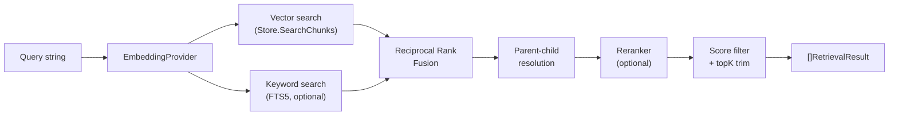
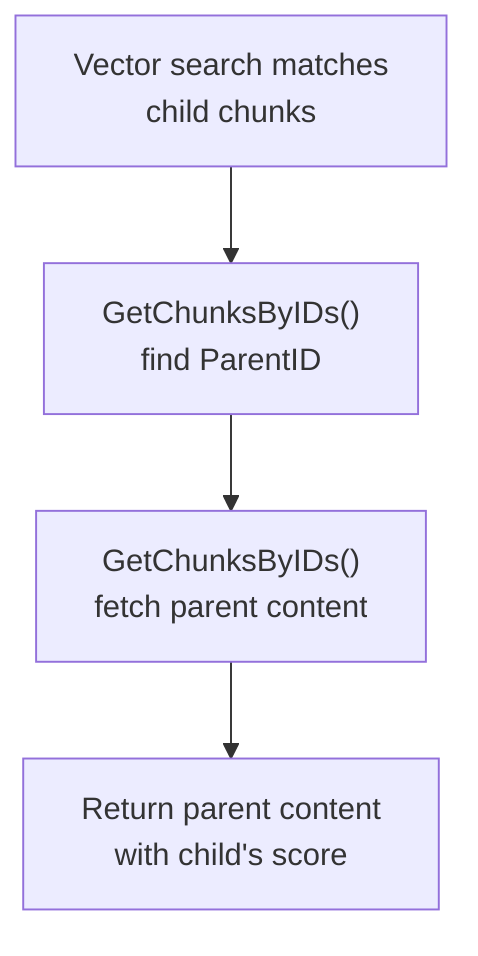

# Retrieval

The retrieval pipeline searches ingested documents and returns ranked, context-rich results. It composes vector search, full-text keyword search (FTS5), parent-child chunk resolution, and optional re-ranking into a single `Retriever.Retrieve()` call.

## Pipeline



## Retriever Interface

**File:** `retriever.go`

```go
type Retriever interface {
    Retrieve(ctx context.Context, query string, topK int) ([]RetrievalResult, error)
}
```

Any component that needs search results depends on `Retriever` — not on a specific implementation. The `KnowledgeTool`, for example, accepts any `Retriever` via its constructor.

### RetrievalResult

```go
type RetrievalResult struct {
    Content        string        `json:"content"`
    Score          float32       `json:"score"`
    ChunkID        string        `json:"chunk_id"`
    DocumentID     string        `json:"document_id"`
    DocumentTitle  string        `json:"document_title"`
    DocumentSource string        `json:"document_source"`
    GraphContext   []EdgeContext `json:"graph_context,omitempty"`
}
```

Score is in [0, 1]; higher means more relevant. The exact range depends on the scoring method (cosine similarity, RRF, or reranker output).

`GraphContext` is populated by `GraphRetriever` for chunks discovered via graph traversal (not from the initial seed search). Each `EdgeContext` describes the edge that led to the chunk's discovery, including a human-readable description of the relationship. Seed chunks have an empty `GraphContext`.

## HybridRetriever (Default)

`HybridRetriever` is the shipped implementation. It combines multiple search strategies for better recall than vector-only search.

```go
retriever := oasis.NewHybridRetriever(store, embedding,
    oasis.WithKeywordWeight(0.3),
    oasis.WithOverfetchMultiplier(3),
    oasis.WithReranker(oasis.NewScoreReranker(0.1)),
    oasis.WithMinRetrievalScore(0.05),
    oasis.WithFilters(oasis.ByDocument("doc-abc")), // optional: scope to specific documents
)
```

### How It Works

1. **Embed the query** — calls `EmbeddingProvider.Embed()` on the query string.
2. **Vector search** — `Store.SearchChunks()` returns top candidates by cosine similarity.
3. **Keyword search** (optional) — if the Store implements `KeywordSearcher`, FTS5 results are fetched in parallel.
4. **Reciprocal Rank Fusion** — merges vector and keyword results by rank position, not raw scores. This avoids score-scale mismatches between the two search methods.
5. **Parent-child resolution** — child chunks matched by embedding are replaced with their parent's richer content. If multiple children share a parent, the highest-scored child wins.
6. **Re-ranking** (optional) — a `Reranker` re-scores results for precision.
7. **Score filter + trim** — drops results below `minScore` and trims to `topK`.

### Overfetching

The retriever fetches `topK * overfetchMultiplier` candidates from each search method, then trims after merging and re-ranking. This ensures enough candidates survive filtering. Default multiplier is 3.

## Reciprocal Rank Fusion (RRF)

RRF merges two ranked lists using the formula:

```
score(d) = Σ weight / (k + rank + 1)
```

Where `k = 60` (standard constant). This produces stable scores regardless of the original scoring scales. The `keywordWeight` parameter (default 0.3) controls the balance — vector search gets weight `1 - keywordWeight`.

## KeywordSearcher (FTS5)

Keyword search is an optional Store capability discovered via type assertion:

```go
type KeywordSearcher interface {
    SearchChunksKeyword(ctx context.Context, query string, topK int, filters ...ChunkFilter) ([]ScoredChunk, error)
}
```

Both `store/sqlite` and `store/libsql` implement this interface using SQLite FTS5. The FTS index is populated automatically when documents are stored via `StoreDocument()`.

`SearchChunksKeyword` accepts optional `ChunkFilter` arguments with the same semantics as `Store.SearchChunks` — see [Store: Chunk Filtering](store.md#chunk-filtering).

If a Store doesn't implement `KeywordSearcher`, `HybridRetriever` falls back to vector-only search — no error, no configuration needed.

## Reranker Interface

```go
type Reranker interface {
    Rerank(ctx context.Context, query string, results []RetrievalResult, topK int) ([]RetrievalResult, error)
}
```

The returned slice must be sorted by Score descending and trimmed to topK.

### ScoreReranker

Filters results below a minimum score and re-sorts. No external calls — useful as a baseline.

```go
reranker := oasis.NewScoreReranker(0.1) // drop results below 0.1
```

### LLMReranker

Uses an LLM to score query-document relevance on a 0-10 scale, then normalizes and re-sorts. On LLM failure, results pass through unmodified (graceful degradation).

```go
reranker := oasis.NewLLMReranker(llmProvider)
```

## GraphRetriever (Graph RAG)

`GraphRetriever` combines vector search with knowledge graph traversal. It performs an initial vector search to find seed chunks, then walks stored chunk edges via multi-hop BFS to discover contextually related content that vector similarity alone would miss.

```go
retriever := oasis.NewGraphRetriever(store, embedding,
    oasis.WithMaxHops(2),
    oasis.WithGraphWeight(0.3),
    oasis.WithVectorWeight(0.7),
    oasis.WithBidirectional(true),
)
```

### How It Works

1. **Embed the query** — calls `EmbeddingProvider.Embed()` on the query string.
2. **Vector search** — `Store.SearchChunks()` returns seed chunks scored by cosine similarity.
3. **Graph traversal** — if the Store implements `GraphStore`, outgoing (and optionally incoming) edges are followed for up to `maxHops` hops. Each hop applies a decay factor to scores.
4. **Fetch content** — graph-discovered chunks that weren't in the seed set are fetched via `Store.GetChunksByIDs()`.
5. **Score blending** — final score = `vectorWeight * vectorScore + graphWeight * hopDecay * edgeWeight`.
6. **Sort + trim** — results are sorted by blended score and trimmed to `topK`.

If the Store doesn't implement `GraphStore`, `GraphRetriever` falls back to vector-only search — no error.

For the full deep-dive — extraction internals, relationship types, score blending math, decision guides, and end-to-end examples — see **[Graph RAG](graph-rag.md)**.

### GraphRetriever Options

| Option | Default | Description |
|--------|---------|-------------|
| `WithMaxHops(n)` | 2 | Maximum graph traversal depth |
| `WithGraphWeight(w)` | 0.3 | Weight for graph-derived scores |
| `WithVectorWeight(w)` | 0.7 | Weight for vector similarity scores |
| `WithHopDecay([]float32)` | {1.0, 0.7, 0.5} | Score decay per hop level |
| `WithBidirectional(b)` | false | Traverse both outgoing and incoming edges |
| `WithRelationFilter(types...)` | all | Restrict traversal to specific relation types |
| `WithMinTraversalScore(s)` | 0 | Minimum edge weight to follow |
| `WithSeedTopK(k)` | 10 | Seed chunks from initial vector search |
| `WithSeedKeywordWeight(w)` | 0 (disabled) | Keyword weight for hybrid seed selection via RRF |
| `WithGraphFilters(f...)` | none | Metadata filters for vector search |
| `WithGraphRetrieverTracer(t)` | nil | Attach a `Tracer` for span creation |
| `WithGraphRetrieverLogger(l)` | nil | Attach a `*slog.Logger` for structured logging |

## Parent-Child Resolution

When using `StrategyParentChild` during [ingestion](ingest.md), child chunks are small and precisely embedded, while parent chunks are large and context-rich. The retriever resolves this automatically:



- If a child has no `ParentID`, it passes through unchanged.
- If multiple children map to the same parent, only the highest-scored child's result is kept.
- On any error, results pass through unmodified (graceful degradation).

## Configuration Options

| Option | Default | Description |
|--------|---------|-------------|
| `WithReranker(r)` | nil | Re-ranking stage after hybrid merge |
| `WithMinRetrievalScore(s)` | 0 | Drop results below this score |
| `WithKeywordWeight(w)` | 0.3 | Keyword weight in RRF (vector gets 1-w) |
| `WithOverfetchMultiplier(n)` | 3 | Fetch topK*n candidates before trim |
| `WithFilters(f...)` | none | Metadata filters passed to both search paths |
| `WithRetrieverTracer(t)` | nil | Attach a `Tracer` for span creation (`retriever.retrieve`) |
| `WithRetrieverLogger(l)` | nil | Attach a `*slog.Logger` for structured logging |

## Filtering

`WithFilters` passes `ChunkFilter` arguments through to both `Store.SearchChunks` and `KeywordSearcher.SearchChunksKeyword`, scoping the search to matching chunks. Filters are combined with AND logic.

```go
// Retrieve only from a specific document
retriever := oasis.NewHybridRetriever(store, embedding,
    oasis.WithFilters(oasis.ByDocument("doc-abc")),
)

// Combine filters: source + time range
retriever := oasis.NewHybridRetriever(store, embedding,
    oasis.WithFilters(
        oasis.BySource("https://docs.example.com"),
        oasis.CreatedAfter(1700000000),
    ),
)
```

See [Store: Chunk Filtering](store.md#chunk-filtering) for the full list of filter constructors and backend implementation details.

## See Also

- [Graph RAG](graph-rag.md) — graph extraction internals, edge types, score blending, decision guides
- [Ingest](ingest.md) — the ingestion pipeline that creates searchable chunks
- [Store](store.md) — persistence and vector search
- [RAG Pipeline Guide](../guides/rag-pipeline.md) — end-to-end walkthrough
- [Provider](provider.md) — EmbeddingProvider for query embedding
