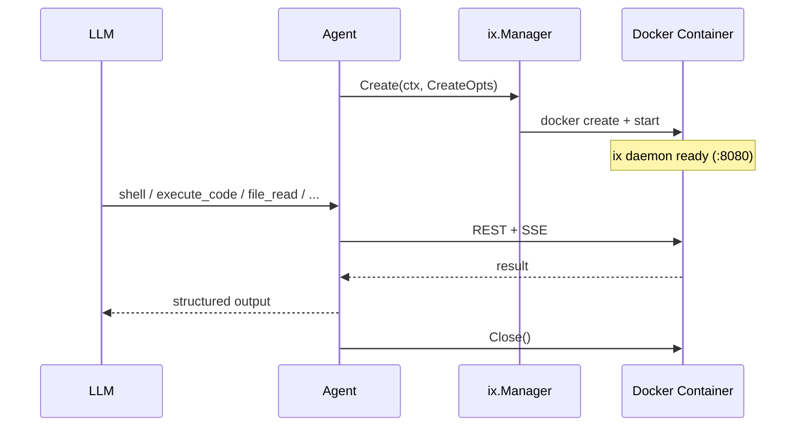
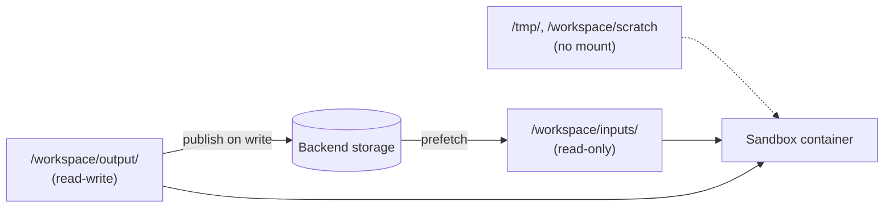
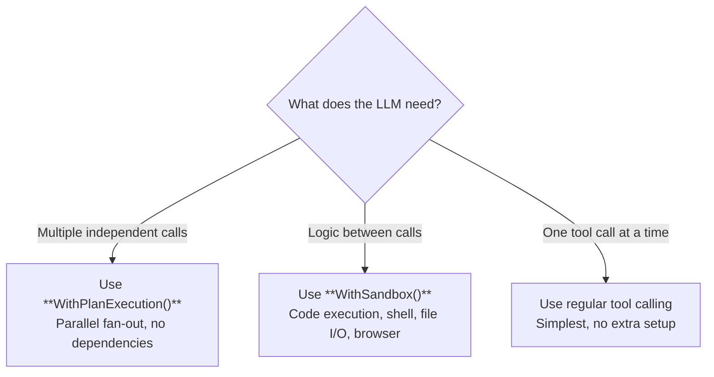

# Sandbox

The sandbox is a managed Docker container that gives agents access to a full execution environment — shell, code execution, file I/O, browser automation, and MCP server integration. It powers both [code execution](../guides/code-execution.md) and [document generation](../guides/document-generation.md) capabilities.

## Sandbox Interface

**Package:** `github.com/nevindra/oasis/sandbox`

```go
type Sandbox interface {
    Shell(ctx context.Context, req ShellRequest) (ShellResult, error)
    ExecCode(ctx context.Context, req CodeRequest) (CodeResult, error)
    ReadFile(ctx context.Context, path string) (FileContent, error)
    WriteFile(ctx context.Context, req WriteFileRequest) error
    EditFile(ctx context.Context, req EditFileRequest) error
    GlobFiles(ctx context.Context, req GlobRequest) ([]string, error)
    GrepFiles(ctx context.Context, req GrepRequest) ([]GrepMatch, error)
    UploadFile(ctx context.Context, path string, r io.Reader) error
    DownloadFile(ctx context.Context, path string) (io.ReadCloser, error)
    BrowserNavigate(ctx context.Context, url string) error
    BrowserScreenshot(ctx context.Context) ([]byte, error)
    BrowserAction(ctx context.Context, action BrowserAction) (BrowserResult, error)
    MCPCall(ctx context.Context, req MCPRequest) (MCPResult, error)
    Close() error
}
```

The `Sandbox` interface exposes all capabilities of a running container. When passed to `WithSandbox`, the framework auto-registers 19 tools that the LLM can call.

## Manager Interface

**Package:** `github.com/nevindra/oasis/sandbox`

```go
type Manager interface {
    Create(ctx context.Context, opts CreateOpts) (Sandbox, error)
    Get(ctx context.Context, sessionID string) (Sandbox, error)
    Shutdown(ctx context.Context) error
    Close() error
}
```

The `Manager` handles sandbox lifecycle — creating Docker containers, retrieving existing ones by session ID, and cleanup on shutdown.

## Architecture

The sandbox system uses a **managed Docker container** pattern: the `ix.Manager` creates and manages containers directly, communicating with an ix daemon inside each container via REST + SSE. No external orchestration service required.



### Component Overview

```
┌─────────────┐     Create / Get        ┌──────────────────┐
│             │ ───────────────────────►│                  │
│ ix.Manager  │                         │  Docker Container │
│  (sandbox/  │◄── REST + SSE ────────│  ix daemon        │
│   ix/)      │                         │                  │
│             │                         │  Python / Node   │
│             │                         │  Browser / MCP   │
└─────────────┘                         └──────────────────┘
      ▲
      │ WithSandbox(sb, tools...)
      ▼
┌─────────────┐
│  Agent      │
│  13 auto-   │
│  registered │
│  tools      │
└─────────────┘
```

- **ix.Manager** (`sandbox/ix/` package) — creates and manages Docker containers directly. No external orchestration service needed.
- **Docker Container** — runs an ix daemon (Go, stdlib-only) that exposes shell, code execution, file I/O, browser, and MCP capabilities via REST + SSE. Shell and code execution use SSE for streaming output; file operations use plain JSON.
- **Auto-registered tools** — `sandbox.Tools(sb)` returns 19 tools that the agent can use.

## Sandbox Tools

When you call `oasis.WithSandbox(sb, sandbox.Tools(sb)...)`, the framework auto-registers these tools:

| Tool | Description |
|---|---|
| `shell` | Execute shell commands |
| `execute_code` | Execute code (Python, JS, Bash) |
| `file_read` | Read file content from the sandbox |
| `file_write` | Write content to a file in the sandbox |
| `file_edit` | Edit a file by replacing an exact string match. More efficient than read+rewrite. |
| `file_glob` | Find files matching a glob pattern with recursive support. |
| `file_grep` | Search file contents for a regex pattern with line numbers. |
| `file_tree` | Recursive directory listing. |
| `http_fetch` | Fetch URL and extract readable text. Falls back to browser for bot-protected sites. |
| `workspace_info` | Get sandbox environment info (OS, tools, browser availability). |
| `browser` | Browser interactions (navigate, click, type, fill, scroll, select, focus) with element ref support |
| `screenshot` | Capture browser screenshot |
| `snapshot` | Get accessibility tree with element refs for precise interaction |
| `page_text` | Extract readable text from the page (token-efficient alternative to screenshots) |
| `export_pdf` | Export current page as PDF |
| `browser_eval` | Execute JavaScript in the current browser tab |
| `browser_find` | Find element ref using natural-language description |
| `web_search` | Web search via Startpage — returns structured results (title, URL, snippet) |
| `mcp_call` | Invoke MCP server tools |

The LLM decides which tool to use based on the task. Code execution via `execute_code` remains available for complex logic with conditionals, loops, and data flow — but the LLM also has direct access to shell, file I/O (including surgical edits, glob, and grep), browser automation, and MCP without writing code.

## Filesystem Mounts

By default, the sandbox filesystem is **ephemeral** — anything the agent writes lives only inside the container and disappears when the sandbox is reaped. **Filesystem mounts** let an app back specific paths inside the sandbox with external storage (S3, GCS, local disk, etc.) so files can be pre-loaded at start, persisted at write time, and outlive the container.



A mount is declared with a `MountSpec` and bound to a path inside the sandbox. The framework runs three layers of mechanism on the app's behalf:

1. **Layer 1 — `FilesystemMount` interface.** A small Go interface in `sandbox/` that abstracts the backend (`List`, `Open`, `Put`, `Delete`, `Stat`). Apps implement it once per backend.
2. **Layer 2 — Tool-level interception.** When the agent uses `file_write`, `file_edit`, or `deliver_file` and the path falls under a writeable mount, the tool wrapper publishes the change to the backend immediately with optimistic version checks. Conflicts surface as tool errors.
3. **Layer 3 — Lifecycle hooks.** `PrefetchMounts` copies backend files into the sandbox at start so shell, subprocess, and `python open()` can read them. `FlushMounts` scans the sandbox at close and publishes any deltas the tool layer didn't catch (e.g. files written by `make build` or `python script.py > out.csv`).

There's also an opt-in **Layer 4 — `FilesystemMounter` capability** for sandbox runtimes that want to add live FUSE/virtio-fs mounting later. No runtime ships with this today; the seam exists so the framework doesn't need refactoring to add it.

### Mount Modes

```go
const (
    MountReadOnly  MountMode = iota // host → sandbox (prefetch only)
    MountWriteOnly                  // sandbox → host (publish only)
    MountReadWrite                  // bidirectional
)
```

### Declaring a Mount

```go
import "github.com/nevindra/oasis/sandbox"

mount := myFilesystemMount() // implements sandbox.FilesystemMount

specs := []sandbox.MountSpec{
    {
        Path:            "/workspace/inputs",
        Backend:         mount,
        Mode:            sandbox.MountReadOnly,
        PrefetchOnStart: true,
    },
    {
        Path:         "/workspace/output",
        Backend:      mount,
        Mode:         sandbox.MountReadWrite,
        FlushOnClose: true,
        Exclude:      []string{"*.tmp", "**/__pycache__/**"},
    },
}

manifest := sandbox.NewManifest()

// Prefetch readable mounts before the agent runs.
sb, _ := mgr.Create(ctx, sandbox.CreateOpts{SessionID: "run-123", TTL: time.Hour})
if err := sandbox.PrefetchMounts(ctx, sb, specs, manifest); err != nil {
    // Fatal — sandbox is not ready if its inputs aren't there.
    return err
}
defer sandbox.FlushMounts(context.Background(), sb, specs, manifest)

agent := oasis.NewLLMAgent("worker", "Data agent", provider,
    oasis.WithSandbox(sb, sandbox.Tools(sb, sandbox.WithMounts(specs, manifest))...),
)
```

The same `specs` slice and `manifest` are passed to BOTH `Tools(sb, WithMounts(...))` (so Layer 2 publishes work) AND `PrefetchMounts` / `FlushMounts` (so Layers 1 and 3 share state).

### Single Canonical File Model

Mounts are **shared** — there is exactly one canonical file at one key in the backend, and every sandbox that prefetches the mount sees the same content. Writes from any sandbox replace the canonical file in place. The framework does **not** auto-namespace per sandbox or per run; if two runs need separate output files, they should write distinct filenames (or the host app should use a per-run prefix when constructing the `FilesystemMount`).

This is the same mental model as a git remote: one branch at one ref, multiple clones, writes are conditional pushes, conflicts are errors.

### Concurrency — Optimistic Version Checks

When the framework prefetches a file from the backend, it records the version (etag, mtime, or backend equivalent) in a private per-sandbox `Manifest`. When the framework publishes a write — either via Layer 2 (tool-time) or Layer 3 (close-time) — it sends the recorded version as a precondition. If the backend has moved on (because another sandbox wrote first), the publish is rejected with a `VersionMismatchError` (which matches `ErrVersionMismatch` via `errors.Is`).

A rejected write surfaces to the agent as a tool error: *"the file changed under you, re-read before retrying"*. The framework does not auto-retry, does not auto-merge, and does not write to a sibling key. The agent decides how to resolve — typically by re-reading the file, inspecting the new content, deciding whether its previous edit is still applicable, and writing again.

This is the same loop a developer follows when `git push` is rejected.

### Sub-Agent Inheritance

When a parent agent in a [Network](network.md) delegates to a child subagent, the child inherits the parent's mount configuration. Parent and children share one filesystem view, because they conceptually share one task. The framework shares a single sandbox across all nodes in a tree by default; pass the same `specs` and `manifest` to every node's `WithSandbox` call.

### Failure Modes

| Layer | Failure | Behavior |
|-------|---------|----------|
| **Prefetch (Layer 3 start)** | Backend unreachable | Fatal — sandbox not ready, return from `PrefetchMounts` |
| **Tool publish (Layer 2)** | Network error | Tool error returned to agent (write succeeded locally, publish failed) |
| **Tool publish (Layer 2)** | Version conflict | `VersionMismatchError` returned as tool error; agent should re-read |
| **Flush (Layer 3 close)** | Network error | **Warning, not fatal** — local sandbox FS is the canonical result. Host logs it |
| **Flush (Layer 3 close)** | Version conflict | Same — warning, host logs it. Agent's local copy is the source of truth |

The asymmetry between prefetch and flush is deliberate: a 30-minute run shouldn't be killed because the storage backend hiccupped at the very end.

### `MountSpec` Reference

| Field | Type | Description |
|-------|------|-------------|
| `Path` | `string` | Absolute path inside the sandbox where the mount is rooted (e.g. `/workspace/inputs`) |
| `Backend` | `FilesystemMount` | The implementation that owns the data |
| `Mode` | `MountMode` | `MountReadOnly`, `MountWriteOnly`, or `MountReadWrite` |
| `PrefetchOnStart` | `bool` | If true, `PrefetchMounts` copies matching backend entries into the sandbox at start |
| `FlushOnClose` | `bool` | If true, `FlushMounts` scans the sandbox at close and publishes deltas |
| `MirrorDeletes` | `bool` | If true, files removed locally are deleted from the backend at flush. Default `false` because accidental deletion is much worse than a stale leftover file |
| `Include` | `[]string` | Optional glob filters; empty = everything |
| `Exclude` | `[]string` | Glob patterns to skip (e.g. `"*.tmp"`, `"**/__pycache__/**"`). Both full key and basename are tested |

### Backward Compatibility

`FileDelivery` is still supported but **deprecated** in favor of `FilesystemMount` with `MountWriteOnly` mode. When passed to `WithFileDelivery`, it acts as a fallback inside `deliver_file` for paths that fall under no mount — letting legacy callers continue to work while new code adopts the mount system.

## Code vs Plan Execution

Both `WithPlanExecution()` and `WithSandbox()` reduce LLM round-trips, but they solve different problems:

| | Plan Execution | Sandbox (Code Execution) |
|---|---|---|
| **Model** | Declarative (list of steps) | Imperative (Python/JS code) |
| **Control flow** | Parallel fan-out only | Conditionals, loops, data flow |
| **Data dependencies** | None (steps are independent) | Full (step 2 can use step 1's result) |
| **Error handling** | Partial failure per step | try/except or try/catch |
| **Best for** | "Run these 5 searches at once" | "Search, then filter, then summarize" |
| **Overhead** | None (Go-native) | Docker container + HTTP |
| **Extra capabilities** | None | Shell, file I/O, browser, MCP |



## IX Manager

**Package:** `github.com/nevindra/oasis/sandbox/ix`

The `ix.Manager` creates and manages Docker containers directly. No external orchestration service (like OpenSandbox) is needed — just Docker.

```go
import (
    "github.com/nevindra/oasis/sandbox"
    "github.com/nevindra/oasis/sandbox/ix"
)

// Create sandbox manager
mgr, err := ix.NewManager(ctx, ix.ManagerConfig{
    Image: "oasis-ix:latest",
})

// Create a sandbox for a session
sb, err := mgr.Create(ctx, sandbox.CreateOpts{
    SessionID: "conversation-123",
    TTL:       time.Hour,
})
defer sb.Close()

agent := oasis.NewLLMAgent("analyst", "Data analysis agent", provider,
    oasis.WithTools(searchTool, fileTool),
    oasis.WithSandbox(sb, sandbox.Tools(sb)...),
)
```

### How It Works

1. **Container creation** — `Manager.Create()` pulls the Docker image (if needed), creates a container, and starts the ix daemon inside it.
2. **Session reuse** — `Manager.Get()` retrieves an existing sandbox by session ID. Multiple calls with the same session ID reuse the same container.
3. **REST + SSE** — all sandbox operations communicate with the ix daemon inside the container. Shell and code execution use SSE for streaming output; file operations (read, write, edit, glob, grep) use plain JSON request/response.
4. **Cleanup** — `sb.Close()` stops and removes the container. `mgr.Shutdown()` cleans up all managed containers.

### Session Management

Sessions map to entire Docker containers. Same session ID reuses the same container:

```go
// Create with session ID — container persists across calls
sb, err := mgr.Create(ctx, sandbox.CreateOpts{
    SessionID: "user-123",
    TTL:       time.Hour,
})

// Later, retrieve the same sandbox
sb, err = mgr.Get(ctx, "user-123")

// Clean up all session containers
mgr.Shutdown(ctx)
```

## Runtimes

### Python

The Python prelude injects these functions:

#### `call_tool(name, args=None)`

Call a single agent tool. Blocks until the result is returned.

```python
results = call_tool('web_search', {'query': 'Go concurrency patterns'})
content = call_tool('file_read', {'path': 'config.yaml'})
```

Returns the parsed JSON result. Raises `RuntimeError` on tool failure.

#### `call_tools_parallel(calls)`

Call multiple tools in parallel. Returns a list of results in the same order.

```python
results = call_tools_parallel([
    ('web_search', {'query': 'Python async'}),
    ('web_search', {'query': 'Go goroutines'}),
])
```

#### `set_result(data, files=None)`

Set the structured result. Call once at the end. Optionally declare files to return.

```python
set_result({
    "summary": "Found 3 articles",
    "articles": articles,
}, files=["chart.png", "report.csv"])
```

#### `install_package(name)`

Install a Python package at runtime via pip.

```python
install_package('httpx')
import httpx
```

#### `print()`

Goes to stderr → `CodeResult.Logs`. Does **not** appear in structured output.

### Node.js

The Node.js prelude injects equivalent functions. All tool functions are async.

#### `callTool(name, args)`

```javascript
const results = await callTool('web_search', { query: 'Node.js best practices' });
const content = await callTool('file_read', { path: 'config.yaml' });
```

Returns the parsed result. Throws `Error` on tool failure.

#### `callToolsParallel(calls)`

```javascript
const [a, b] = await callToolsParallel([
    ['web_search', { query: 'Python async' }],
    ['web_search', { query: 'Go goroutines' }],
]);
```

#### `setResult(data, files)`

```javascript
setResult({
    summary: 'Found 3 articles',
    articles: articles,
}, ['chart.png', 'report.csv']);
```

#### `installPackage(name)`

Install an npm package at runtime.

```javascript
await installPackage('cheerio');
const cheerio = require('cheerio');
```

#### `console.log()`

Redirected to stderr → `CodeResult.Logs`. Does **not** appear in structured output.

## Safety

The sandbox container is the security boundary — code runs in full isolation from the host app process.

### Container Isolation

Code executes inside a Docker container with its own filesystem, network, and process namespace. The container has no access to the host filesystem or the app's secrets unless explicitly configured.

### Workspace Isolation

Files are scoped to per-session workspace directories. Path traversal is prevented by sanitizing all file paths against the workspace root.

### Timeout

Execution has a configurable timeout (default 30s, max 300s). The subprocess is killed on timeout.

### Concurrency Limiting

The sandbox limits parallel executions via a semaphore. When at capacity, new requests receive HTTP 503 immediately (fail-fast, no queuing).

### Recursion Prevention

`call_tool('execute_code', ...)` from within code is blocked — code cannot spawn nested code execution.

## Options

### ManagerConfig

**Package:** `github.com/nevindra/oasis/sandbox/ix`

| Field | Default | Description |
|-------|---------|-------------|
| `Image` | — | Docker image for sandbox containers (required) |

### CreateOpts

**Package:** `github.com/nevindra/oasis/sandbox`

| Field | Default | Description |
|-------|---------|-------------|
| `SessionID` | — | Session identifier for container reuse |
| `TTL` | — | Time-to-live for the sandbox container |

## See Also

- [Code Execution Guide](../guides/code-execution.md) — patterns and recipes for code execution
- [Document Generation Guide](../guides/document-generation.md) — PDF, DOCX, XLSX, PPTX via sandbox
- [Tool](tool.md) — tool interface, plan execution, parallel execution
- [Agent](agent.md) — how agents use tools and sandbox
- [API Reference: Interfaces](../api/interfaces.md)
