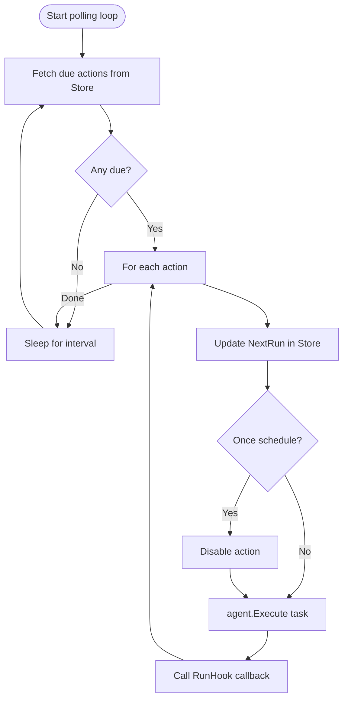

# Scheduler

Scheduler is a proactive execution primitive. While LLMAgent and Network wait for user input, Scheduler polls the store for due actions and fires them on schedule.

## How It Works



## Creating a Scheduler

**File:** `scheduler.go`

```go
scheduler := oasis.NewScheduler(store, agent,
    oasis.WithSchedulerInterval(time.Minute),
    oasis.WithSchedulerTZOffset(7),  // UTC+7
    oasis.WithOnRun(func(action oasis.ScheduledAction, result oasis.AgentResult, err error) {
        if err != nil {
            log.Printf("action %q failed: %v", action.Description, err)
            return
        }
        frontend.Send(ctx, chatID, result.Output)
    }),
)

// Start blocks until ctx is cancelled
g.Go(func() error { return scheduler.Start(ctx) })
```

## Components

- **Store** — source of `ScheduledAction` records
- **Agent** — executes each due action (LLMAgent, Network, Workflow, or custom)
- **RunHook** — callback after each execution — routes output without coupling Scheduler to a destination

## Options

| Option | Default | Description |
|--------|---------|-------------|
| `WithSchedulerInterval(d)` | 1 minute | Polling interval |
| `WithSchedulerTZOffset(h)` | 0 (UTC) | UTC offset for schedule computation |
| `WithOnRun(hook)` | nil | Hook called after each action |

## Schedule Format

Used by `ScheduledAction.Schedule`:

```
Format: "HH:MM <recurrence>"

Recurrence types:
  once                     — run once, then disable
  daily                    — every day
  weekly(monday)           — every week on the specified day
  custom(mon,wed,fri)      — on specific days
  monthly(15)              — on the 15th of every month

Examples:
  "08:00 daily"
  "09:30 weekly(monday)"
  "07:00 custom(mon,wed,fri)"
  "14:00 once"
```

## Error Handling

| Error | Behavior |
|-------|----------|
| Agent execution error | Log + call hook + continue to next action |
| Store query error | Log + skip this tick |
| Store update error | Log + still fire agent |

Scheduler never crashes on recoverable errors. It degrades and continues.

## Scheduler is Not an Agent

Scheduler wraps an Agent but doesn't implement Agent itself. It's a framework primitive for driving execution from time-based triggers, not a unit of work that takes input and returns output.

## See Also

- [Agent](agent.md) — what Scheduler wraps
- [Store](store.md) — where ScheduledAction records live
