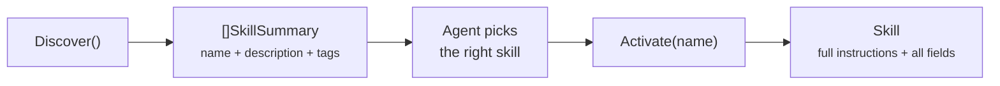

# Skill

Skills are file-based instruction packages that specialize agent behavior. They live on disk as folders containing a `SKILL.md` file and can be created, discovered, and activated at runtime — by both humans and agents.

## Interfaces

**File:** `types.go`

### SkillProvider

Read-only discovery and activation. All implementations must be safe for concurrent use.

```go
type SkillProvider interface {
    Discover(ctx context.Context) ([]SkillSummary, error)
    Activate(ctx context.Context, name string) (Skill, error)
}
```

- **Discover** returns lightweight summaries (name, description, tags, compatibility) — no instruction text loaded
- **Activate** loads the full skill by name, including instructions and all metadata

### SkillWriter

Optional capability for providers that support creating and modifying skills. Check via type assertion:

```go
type SkillWriter interface {
    CreateSkill(ctx context.Context, skill Skill) error
    UpdateSkill(ctx context.Context, name string, skill Skill) error
    DeleteSkill(ctx context.Context, name string) error
}

if w, ok := provider.(SkillWriter); ok {
    // provider supports skill creation
}
```

## Types

### Skill

```go
type Skill struct {
    Name          string            // unique identifier (matches folder name)
    Description   string            // short summary for discovery
    Instructions  string            // full markdown body injected into system prompt
    Tools         []string          // recommended tools when skill is active
    Model         string            // optional LLM override
    Tags          []string          // categorization labels
    References    []string          // names of other skills this builds on
    Dir           string            // absolute path to skill directory (set at activation)
    Compatibility string            // runtime requirements (e.g. "oasis >= 0.13")
    License       string            // SPDX identifier (e.g. "MIT")
    Metadata      map[string]string // arbitrary key-value pairs
}
```

### SkillSummary

Lightweight view returned by `Discover` — no instructions loaded:

```go
type SkillSummary struct {
    Name          string
    Description   string
    Tags          []string
    Compatibility string
}
```

## Progressive Disclosure

Skills use a two-phase access pattern to keep discovery cheap:



A skill library with 50 skills could have thousands of lines of instructions total. Discovery returns only summaries — a few hundred tokens. The agent picks the right skill, then activates exactly one.

## SKILL.md Format

Each skill is a folder containing a `SKILL.md` file with YAML frontmatter and a markdown body:

```
skills/
├── code-reviewer/
│   ├── SKILL.md          # required — frontmatter + instructions
│   ├── scripts/          # optional — helper scripts
│   └── references/       # optional — external docs, examples
└── sql-optimizer/
    └── SKILL.md
```

```markdown
---
name: code-reviewer
description: Review code changes and suggest improvements
compatibility: oasis >= 0.13
license: MIT
tools:
  - shell_exec
  - file_read
tags:
  - dev
  - review
references:
  - frontend-review
  - backend-review
metadata:
  author: team-name
  version: "1.0"
---

You are a code reviewer. Analyze code for style, correctness, and performance.
```

**`{dir}` placeholder:** Any occurrence of `{dir}` in the instruction body is replaced with the absolute path to the skill's directory at activation time. This lets skills reference their own files (e.g., `{dir}/templates/report.html`).

The `Compatibility`, `License`, and `Metadata` fields align with the [AgentSkills open specification](https://agentskills.io).

## Implementations

### FileSkillProvider

**File:** `skill.go`

Reads skills from directories on disk. No database, no caching — reads from disk on every call, which means hot reload for free. Also implements `SkillWriter`.

```go
provider := oasis.NewFileSkillProvider("./skills")
```

Accepts multiple directories — scanned in order, first match wins:

```go
provider := oasis.NewFileSkillProvider("./project-skills", "~/.agents/skills")
```

### BuiltinSkillProvider

**File:** `skill_builtin.go`

Serves framework-embedded skills (e.g., `oasis-pdf`, `oasis-docx`) via `//go:embed`. Read-only — does not implement `SkillWriter`.

```go
builtin := oasis.NewBuiltinSkillProvider()
```

### ChainedSkillProvider

**File:** `skill.go`

Merges multiple providers. Earlier providers take priority on name collisions:

```go
combined := oasis.ChainSkillProviders(fileProvider, builtinProvider)
```

`Discover` returns the union of all providers (first provider wins on duplicate names, sorted alphabetically). `Activate` searches providers in order.

## Helper Functions

### ActivateWithReferences

Loads a skill and prepends instructions from all referenced skills. References are resolved one level deep — missing references are silently skipped.

```go
skill, err := oasis.ActivateWithReferences(ctx, provider, "oasis-pdf")
// skill.Instructions = "## design-system\n\n...\n\n---\n\n<pdf instructions>"
```

### DefaultSkillDirs

Returns [AgentSkills](https://agentskills.io)-compatible scan paths:

```go
dirs := oasis.DefaultSkillDirs()
// ["<cwd>/.agents/skills/", "~/.agents/skills/"]
```

## Agent Integration

Two options control how skills reach agents:

| Option | When to use | Effect |
|--------|-------------|--------|
| `WithActiveSkills(skills...)` | Always-on capabilities | Instructions appended to system prompt with `---` separators |
| `WithSkills(provider)` | Runtime discovery | Adds `skill_discover` + `skill_activate` tools. If provider implements `SkillWriter`, also adds `skill_create` + `skill_update` |

Both options work on `LLMAgent` and `Network`.

See [Skills Guide](../guides/skills.md) for integration patterns, agent-driven creation, and composability.

## See Also

- [Skills Guide](../guides/skills.md) — integration patterns and agent self-improvement
- [Tool](tool.md) — tool interface (skills add tools to agents)
- [Agent](agent.md#skills) — `WithActiveSkills` and `WithSkills` options
- [AgentSkills specification](https://agentskills.io) — open specification for cross-tool compatibility
