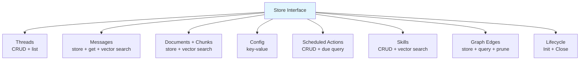

# Store

Store is the persistence layer — messages, documents, threads, scheduled actions, skills, and vector search. Everything that needs to survive a restart goes through Store.

## Store Interface

**File:** `store.go`

The interface is grouped by domain:



### Threads

```go
CreateThread(ctx, thread) error
GetThread(ctx, id) (Thread, error)
ListThreads(ctx, chatID, limit) ([]Thread, error)
UpdateThread(ctx, thread) error
DeleteThread(ctx, id) error
```

### Messages

```go
StoreMessage(ctx, msg) error
GetMessages(ctx, threadID, limit) ([]Message, error)
SearchMessages(ctx, embedding, topK) ([]ScoredMessage, error)
```

`SearchMessages` performs cosine similarity search across all messages. Returns `ScoredMessage` with a `Score` field in [0, 1].

Messages within a thread are ordered by `created_at` descending, then by ID descending (UUIDv7). When persisting a conversation turn, the assistant message gets `created_at = now + 1` to ensure consistent ordering even when persistence is fast.

## Conversation Model

Oasis organizes conversations in a three-level hierarchy:

```text
ChatID (room/channel)
 └─ ThreadID (conversation)
     └─ Messages (turns)
```

| Concept | Context Key | Struct Field | Meaning |
| ------- | ----------- | ------------ | ------- |
| **ChatID** | `ContextChatID` | `Thread.ChatID` | The room, channel, or DM scope. In Telegram this is the chat. In a SaaS app it could be a workspace or user account. |
| **UserID** | `ContextUserID` | — | The individual person. Multiple users can share a ChatID (group chats). Not stored on Thread — it's request-scoped metadata. |
| **ThreadID** | `ContextThreadID` | `Thread.ID` / `Message.ThreadID` | A single conversation. `ListThreads(ctx, chatID, limit)` returns all threads in a chat. `GetMessages(ctx, threadID, limit)` returns turns within a thread. |

Pass all three via `AgentTask.Context` using the typed accessors:

```go
task := oasis.AgentTask{
    Input: userMessage,
    Context: map[string]any{
        oasis.ContextThreadID: thread.ID,
        oasis.ContextUserID:   userID,
        oasis.ContextChatID:   chatID,
    },
}

// Type-safe reads inside processors/tools:
tid := task.TaskThreadID()
uid := task.TaskUserID()
cid := task.TaskChatID()
```

### Common Patterns

**Single-user app** — ChatID and UserID are the same value. One thread per conversation.

**Multi-user group** — Shared ChatID, each user identified by UserID. Threads can be per-user or shared.

**Ownership checks** — `DeleteThread` takes only the thread ID (it's a data-access method, not an authorization layer). For user-facing APIs, verify ownership at the service layer:

```go
thread, err := store.GetThread(ctx, threadID)
if err != nil { return err }
if thread.ChatID != expectedChatID {
    return fmt.Errorf("thread not found")
}
store.DeleteThread(ctx, threadID)
```

### Documents + Chunks

```go
StoreDocument(ctx, doc, chunks) error
ListDocuments(ctx, limit) ([]Document, error)
DeleteDocument(ctx, id) error  // cascade deletes chunks + FTS
SearchChunks(ctx, embedding, topK, filters ...ChunkFilter) ([]ScoredChunk, error)
GetChunksByIDs(ctx, ids) ([]Chunk, error)
```

Used by the [ingest pipeline](ingest.md) and knowledge search tool. `ListDocuments` returns documents ordered by creation time (newest first). `DeleteDocument` removes a document and all its chunks in a single transaction.

`SearchChunks` accepts optional `ChunkFilter` arguments to scope results by document, source, metadata, or time range. When no filters are passed, behavior is unchanged (search all chunks). See [Chunk Filtering](#chunk-filtering) below.

### Scheduled Actions

```go
CreateScheduledAction(ctx, action) error
ListScheduledActions(ctx) ([]ScheduledAction, error)
GetDueScheduledActions(ctx, now) ([]ScheduledAction, error)
UpdateScheduledAction(ctx, action) error
UpdateScheduledActionEnabled(ctx, id, enabled) error
DeleteScheduledAction(ctx, id) error
DeleteAllScheduledActions(ctx) (int, error)
FindScheduledActionsByDescription(ctx, pattern) ([]ScheduledAction, error)
```

### Skills

```go
CreateSkill(ctx, skill) error
GetSkill(ctx, id) (Skill, error)
ListSkills(ctx) ([]Skill, error)
UpdateSkill(ctx, skill) error
DeleteSkill(ctx, id) error
SearchSkills(ctx, embedding, topK) ([]ScoredSkill, error)
```

### Lifecycle

```go
Init(ctx) error  // create tables and indexes
Close() error    // clean up connections
```

## Shipped Implementations

| Package | Constructor | Notes |
| ------- | ----------- | ----- |
| `store/sqlite` | `sqlite.New(path)` | Local pure-Go SQLite (`modernc.org/sqlite`) |
| `store/libsql` | `libsql.New(path, opts...)` | Local/remote Turso/libSQL with DiskANN |
| `store/postgres` | `postgres.New(pool, opts...)` | PostgreSQL + pgvector (HNSW indexes) |

All three packages also ship a `MemoryStore` implementation in the same package — see [Memory](memory.md).

**SQLite / libSQL:**

- Store embeddings as JSON-serialized `[]float32` (SQLite) or `F32_BLOB(N)` (libSQL)
- Perform brute-force cosine similarity in-process (SQLite) or DiskANN (libSQL)
- Create tables via `CREATE TABLE IF NOT EXISTS` in `Init()`
- libSQL options: `WithEmbeddingDimension(dim)` — default 1536

**PostgreSQL (pgvector):**

- Uses native `vector` columns with HNSW indexes for cosine distance search
- Full-text search via `tsvector`/`tsquery` with GIN index (no FTS5 virtual table)
- Accepts an externally-owned `*pgxpool.Pool` — share one pool across Store, MemoryStore, and your app
- Also implements `MemoryStore` in the same package (`postgres.NewMemoryStore(pool, opts...)`)
- Requires PostgreSQL with the `pgvector` extension installed
- Options: `WithEmbeddingDimension(dim)`, `WithHNSWM(m)`, `WithEFConstruction(ef)`, `WithEFSearch(ef)`

## Vector Search

Search methods return scored results sorted by cosine similarity descending:

```go
type ScoredMessage struct {
    Message
    Score float32  // cosine similarity in [0, 1]
}

type ScoredChunk struct {
    Chunk
    Score float32
}
```

All store backends compute cosine similarity scores. Higher scores mean more relevant results.

## Chunk Filtering

`SearchChunks` accepts variadic `ChunkFilter` arguments to narrow results without post-filtering. Filters are combined with AND logic — a chunk must match all filters.

```go
// Search only within specific documents
results, _ := store.SearchChunks(ctx, queryEmb, 10,
    oasis.ByDocument("doc-abc", "doc-def"),
)

// Search by source and time range
results, _ := store.SearchChunks(ctx, queryEmb, 10,
    oasis.BySource("https://example.com/guide"),
    oasis.CreatedAfter(1700000000),
)

// Search by chunk metadata
results, _ := store.SearchChunks(ctx, queryEmb, 10,
    oasis.ByMeta("section_heading", "Introduction"),
)
```

Five convenience constructors cover common patterns:

| Constructor | Field | Op | Description |
| --- | --- | --- | --- |
| `ByDocument(ids...)` | `document_id` | `OpIn` | Chunks belonging to specific documents |
| `BySource(source)` | `source` | `OpEq` | Chunks from documents with a given source |
| `ByMeta(key, value)` | `meta.<key>` | `OpEq` | Chunks where JSON metadata key equals value |
| `CreatedAfter(unix)` | `created_at` | `OpGt` | Chunks from documents created after timestamp |
| `CreatedBefore(unix)` | `created_at` | `OpLt` | Chunks from documents created before timestamp |

### Backend Implementation Notes

- **SQLite / PostgreSQL** — filters are translated to SQL WHERE clauses with conditional JOINs to the `documents` table when filtering on source or time. Metadata filters use `json_extract` (SQLite) or `->>'key'` (Postgres).
- **LibSQL** — `vector_top_k()` doesn't support WHERE clauses, so the store overfetches `topK * 3` candidates and applies filters in-memory after retrieval.

When no filters are passed, all backends behave exactly as before (search all chunks).

## Full-Text Search

All shipped Store implementations implement the `KeywordSearcher` interface for full-text keyword search:

```go
type KeywordSearcher interface {
    SearchChunksKeyword(ctx context.Context, query string, topK int, filters ...ChunkFilter) ([]ScoredChunk, error)
}
```

`SearchChunksKeyword` also accepts `...ChunkFilter` with the same semantics as `SearchChunks`.

SQLite/libSQL use an FTS5 virtual table (`chunks_fts`) synchronized in `StoreDocument()`. PostgreSQL uses a GIN expression index on `to_tsvector('english', content)` — no manual sync needed. The [HybridRetriever](retrieval.md) discovers this capability via type assertion and uses it for hybrid vector + keyword search.

## Database Schema

Quick reference (column names only):

```sql
-- Threads
threads  (id, chat_id, title, metadata, created_at, updated_at)
messages (id, thread_id, role, content, embedding, metadata, created_at)

-- Knowledge base
documents (id, title, source, content, created_at)
chunks    (id, document_id, parent_id, content, chunk_index, embedding, metadata)

-- Knowledge graph
chunk_edges (id, source_id, target_id, relation, weight)

-- Config
config (key PRIMARY KEY, value)

-- Scheduling
scheduled_actions (id, description, schedule, tool_calls, synthesis_prompt,
                   next_run, enabled, skill_id, created_at)

-- Skills
skills (id, name, description, instructions, tools, model, tags,
        created_by, refs, embedding, created_at, updated_at)

-- User memory (MemoryStore)
user_facts (id, fact, category, confidence, embedding,
            source_message_id, created_at, updated_at)
```

### PostgreSQL Schema (pgvector)

Full DDL as created by `Store.Init()` and `MemoryStore.Init()`. Requires the `pgvector` extension.

```sql
-- Extension
CREATE EXTENSION IF NOT EXISTS vector;

-- Threads
CREATE TABLE IF NOT EXISTS threads (
    id         TEXT PRIMARY KEY,
    chat_id    TEXT NOT NULL,
    title      TEXT NOT NULL DEFAULT '',
    metadata   JSONB,
    created_at BIGINT NOT NULL,
    updated_at BIGINT NOT NULL
);

-- Messages
CREATE TABLE IF NOT EXISTS messages (
    id         TEXT PRIMARY KEY,
    thread_id  TEXT NOT NULL,
    role       TEXT NOT NULL,
    content    TEXT NOT NULL,
    embedding  vector,          -- vector(N) when WithEmbeddingDimension is set
    metadata   JSONB,
    created_at BIGINT NOT NULL
);
CREATE INDEX IF NOT EXISTS messages_thread_idx    ON messages(thread_id);
CREATE INDEX IF NOT EXISTS messages_embedding_idx ON messages USING hnsw (embedding vector_cosine_ops);

-- Documents
CREATE TABLE IF NOT EXISTS documents (
    id         TEXT PRIMARY KEY,
    title      TEXT NOT NULL,
    source     TEXT NOT NULL,
    content    TEXT NOT NULL,
    created_at BIGINT NOT NULL
);

-- Chunks
CREATE TABLE IF NOT EXISTS chunks (
    id           TEXT PRIMARY KEY,
    document_id  TEXT NOT NULL,
    content      TEXT NOT NULL,
    chunk_index  INTEGER NOT NULL,
    embedding    vector,        -- vector(N) when WithEmbeddingDimension is set
    parent_id    TEXT,
    metadata     JSONB
);
CREATE INDEX IF NOT EXISTS chunks_document_idx  ON chunks(document_id);
CREATE INDEX IF NOT EXISTS chunks_embedding_idx ON chunks USING hnsw (embedding vector_cosine_ops);
CREATE INDEX IF NOT EXISTS chunks_fts_idx       ON chunks USING gin(to_tsvector('english', content));

-- Config (key-value)
CREATE TABLE IF NOT EXISTS config (
    key   TEXT PRIMARY KEY,
    value TEXT NOT NULL
);

-- Scheduled Actions
CREATE TABLE IF NOT EXISTS scheduled_actions (
    id               TEXT PRIMARY KEY,
    description      TEXT NOT NULL DEFAULT '',
    schedule         TEXT NOT NULL DEFAULT '',
    tool_calls       TEXT NOT NULL DEFAULT '',
    synthesis_prompt TEXT NOT NULL DEFAULT '',
    next_run         BIGINT NOT NULL DEFAULT 0,
    enabled          BOOLEAN NOT NULL DEFAULT TRUE,
    skill_id         TEXT NOT NULL DEFAULT '',
    created_at       BIGINT NOT NULL DEFAULT 0
);

-- Skills
CREATE TABLE IF NOT EXISTS skills (
    id           TEXT PRIMARY KEY,
    name         TEXT NOT NULL,
    description  TEXT NOT NULL,
    instructions TEXT NOT NULL,
    tools        TEXT NOT NULL DEFAULT '',
    model        TEXT NOT NULL DEFAULT '',
    tags         TEXT NOT NULL DEFAULT '',
    created_by   TEXT NOT NULL DEFAULT '',
    refs         TEXT NOT NULL DEFAULT '',
    embedding    vector,        -- vector(N) when WithEmbeddingDimension is set
    created_at   BIGINT NOT NULL,
    updated_at   BIGINT NOT NULL
);
CREATE INDEX IF NOT EXISTS skills_embedding_idx ON skills USING hnsw (embedding vector_cosine_ops);

-- Knowledge Graph Edges
CREATE TABLE IF NOT EXISTS chunk_edges (
    id        TEXT PRIMARY KEY,
    source_id TEXT NOT NULL,
    target_id TEXT NOT NULL,
    relation  TEXT NOT NULL,
    weight    REAL NOT NULL,
    UNIQUE(source_id, target_id, relation)
);
CREATE INDEX IF NOT EXISTS idx_chunk_edges_source ON chunk_edges(source_id);
CREATE INDEX IF NOT EXISTS idx_chunk_edges_target ON chunk_edges(target_id);

-- User Facts (MemoryStore — created by MemoryStore.Init())
CREATE TABLE IF NOT EXISTS user_facts (
    id                TEXT PRIMARY KEY,
    fact              TEXT NOT NULL,
    category          TEXT NOT NULL,
    confidence        REAL DEFAULT 1.0,
    embedding         vector,  -- vector(N) when WithEmbeddingDimension is set
    source_message_id TEXT,
    created_at        BIGINT NOT NULL,
    updated_at        BIGINT NOT NULL
);
CREATE INDEX IF NOT EXISTS user_facts_embedding_idx ON user_facts USING hnsw (embedding vector_cosine_ops);
```

### PostgreSQL Notes

| Topic | Detail |
| ----- | ------ |
| **Vector columns** | Untyped `vector` by default. Use `WithEmbeddingDimension(N)` to get `vector(N)` — enables dimension mismatch detection at insert time and better index optimization. Only affects new tables. |
| **HNSW indexes** | Created on `messages.embedding`, `chunks.embedding`, `skills.embedding`, and `user_facts.embedding`. Tunable via `WithHNSWM(m)` and `WithEFConstruction(ef)` — appended as `WITH (m = M, ef_construction = EF)` on `CREATE INDEX`. |
| **ef_search** | Set via `WithEFSearch(ef)`. Applied as `SET hnsw.ef_search = N` (session-level) during `Init()`. Higher values improve recall at the cost of latency. |
| **Full-text search** | GIN expression index on `to_tsvector('english', content)` — no separate FTS table (unlike SQLite's FTS5 virtual table). Queries use `plainto_tsquery`. |
| **Metadata** | Stored as `JSONB`. Chunk metadata filters use `metadata->>'key'` operator. Message/thread metadata stored as `JSONB` with `::jsonb` casts on insert. |
| **Timestamps** | All `created_at` / `updated_at` columns are `BIGINT` (Unix seconds), not SQL timestamps. |
| **Connection pool** | Both `Store` and `MemoryStore` accept an externally-owned `*pgxpool.Pool`. The caller creates and closes the pool. `Store.Close()` is a no-op. |
| **Idempotent init** | All DDL uses `IF NOT EXISTS`. Safe to call `Init()` on every startup. |
| **Transactions** | `StoreDocument` (doc + chunks), `DeleteDocument` (edges + chunks + doc), `DeleteThread` (messages + thread), and `StoreEdges` (batch) run in transactions. |

### SQLite / libSQL Differences

| Feature | SQLite / libSQL | PostgreSQL |
| ------- | --------------- | ---------- |
| Vector storage | JSON `[]float32` (SQLite) / `F32_BLOB(N)` (libSQL) | Native `vector` column |
| Vector search | Brute-force in-process (SQLite) / DiskANN (libSQL) | HNSW index |
| Full-text search | FTS5 virtual table (`chunks_fts`) | GIN index on `tsvector` |
| Metadata | JSON TEXT, queried via `json_extract()` | JSONB, queried via `->>'key'` |
| Message metadata | TEXT (JSON-serialized) | JSONB |

## GraphStore

`GraphStore` is an optional Store capability for storing and querying knowledge graph edges between chunks. Discovered via type assertion — all three shipped backends implement it.

```go
type GraphStore interface {
    StoreEdges(ctx context.Context, edges []ChunkEdge) error
    GetEdges(ctx context.Context, chunkID string) ([]ChunkEdge, error)
    GetIncomingEdges(ctx context.Context, chunkID string) ([]ChunkEdge, error)
    PruneOrphanEdges(ctx context.Context) (int, error)
}
```

### ChunkEdge

```go
type ChunkEdge struct {
    SourceChunkID string
    TargetChunkID string
    Relation      RelationType  // references, elaborates, depends_on, contradicts, part_of, similar_to, sequence, caused_by
    Weight        float64       // edge strength [0, 1]
}
```

Eight relationship types are extracted during ingestion via `WithGraphExtraction(provider)` on the Ingestor. Edges are stored in the `chunk_edges` table and cascade-deleted when the parent document is removed. Orphan edges (where one side's chunk no longer exists) are cleaned up by `PruneOrphanEdges`.

The [GraphRetriever](retrieval.md) uses `GraphStore` to perform multi-hop BFS traversal, discovering related content that vector similarity alone would miss.

### Discovering GraphStore

```go
if gs, ok := store.(oasis.GraphStore); ok {
    edges, _ := gs.GetEdges(ctx, chunkID)
    // traverse the graph
}
```

See [Ingest](ingest.md) for graph extraction during ingestion and [Retrieval](retrieval.md) for graph-augmented search.

## See Also

- [Memory](memory.md) — MemoryStore for user facts (separate interface)
- [Ingest](ingest.md) — document chunking pipeline that writes to Store
- [Retrieval](retrieval.md) — search pipeline that reads from Store
- [Custom Store Guide](../guides/custom-store.md)
