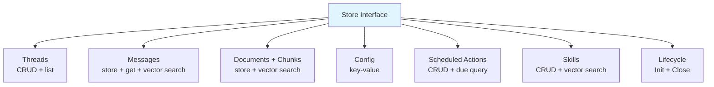

# Store

Store is the persistence layer — messages, documents, threads, scheduled actions, skills, and vector search. Everything that needs to survive a restart goes through Store.

## Store Interface

**File:** `store.go`

The interface is grouped by domain:



### Threads

```go
CreateThread(ctx, thread) error
GetThread(ctx, id) (Thread, error)
ListThreads(ctx, chatID, limit) ([]Thread, error)
UpdateThread(ctx, thread) error
DeleteThread(ctx, id) error
```

### Messages

```go
StoreMessage(ctx, msg) error
GetMessages(ctx, threadID, limit) ([]Message, error)
SearchMessages(ctx, embedding, topK) ([]ScoredMessage, error)
```

`SearchMessages` performs cosine similarity search across all messages. Returns `ScoredMessage` with a `Score` field in [0, 1].

## Conversation Model

Oasis organizes conversations in a three-level hierarchy:

```text
ChatID (room/channel)
 └─ ThreadID (conversation)
     └─ Messages (turns)
```

| Concept | Context Key | Struct Field | Meaning |
|---------|-------------|--------------|---------|
| **ChatID** | `ContextChatID` | `Thread.ChatID` | The room, channel, or DM scope. In Telegram this is the chat. In a SaaS app it could be a workspace or user account. |
| **UserID** | `ContextUserID` | — | The individual person. Multiple users can share a ChatID (group chats). Not stored on Thread — it's request-scoped metadata. |
| **ThreadID** | `ContextThreadID` | `Thread.ID` / `Message.ThreadID` | A single conversation. `ListThreads(ctx, chatID, limit)` returns all threads in a chat. `GetMessages(ctx, threadID, limit)` returns turns within a thread. |

Pass all three via `AgentTask.Context` using the typed accessors:

```go
task := oasis.AgentTask{
    Input: userMessage,
    Context: map[string]any{
        oasis.ContextThreadID: thread.ID,
        oasis.ContextUserID:   userID,
        oasis.ContextChatID:   chatID,
    },
}

// Type-safe reads inside processors/tools:
tid := task.TaskThreadID()
uid := task.TaskUserID()
cid := task.TaskChatID()
```

### Common Patterns

**Single-user app** — ChatID and UserID are the same value. One thread per conversation.

**Multi-user group** — Shared ChatID, each user identified by UserID. Threads can be per-user or shared.

**Ownership checks** — `DeleteThread` takes only the thread ID (it's a data-access method, not an authorization layer). For user-facing APIs, verify ownership at the service layer:

```go
thread, err := store.GetThread(ctx, threadID)
if err != nil { return err }
if thread.ChatID != expectedChatID {
    return fmt.Errorf("thread not found")
}
store.DeleteThread(ctx, threadID)
```

### Documents + Chunks

```go
StoreDocument(ctx, doc, chunks) error
SearchChunks(ctx, embedding, topK) ([]ScoredChunk, error)
GetChunksByIDs(ctx, ids) ([]Chunk, error)
```

Used by the [ingest pipeline](ingest.md) and knowledge search tool.

### Scheduled Actions

```go
CreateScheduledAction(ctx, action) error
ListScheduledActions(ctx) ([]ScheduledAction, error)
GetDueScheduledActions(ctx, now) ([]ScheduledAction, error)
UpdateScheduledAction(ctx, action) error
UpdateScheduledActionEnabled(ctx, id, enabled) error
DeleteScheduledAction(ctx, id) error
DeleteAllScheduledActions(ctx) (int, error)
FindScheduledActionsByDescription(ctx, pattern) ([]ScheduledAction, error)
```

### Skills

```go
CreateSkill(ctx, skill) error
GetSkill(ctx, id) (Skill, error)
ListSkills(ctx) ([]Skill, error)
UpdateSkill(ctx, skill) error
DeleteSkill(ctx, id) error
SearchSkills(ctx, embedding, topK) ([]ScoredSkill, error)
```

### Lifecycle

```go
Init(ctx) error  // create tables and indexes
Close() error    // clean up connections
```

## Shipped Implementations

| Package | Constructor | Notes |
|---------|------------|-------|
| `store/sqlite` | `sqlite.New(path)` | Local pure-Go SQLite (`modernc.org/sqlite`) |
| `store/libsql` | `libsql.New(url, token)` | Remote Turso/libSQL |
| `store/postgres` | `postgres.New(pool)` | PostgreSQL + pgvector (HNSW indexes) |

All three packages also ship a `MemoryStore` implementation in the same package — see [Memory](memory.md).

**SQLite / libSQL:**
- Store embeddings as JSON-serialized `[]float32`
- Perform brute-force cosine similarity in-process (SQLite) or DiskANN (libSQL)
- Create tables via `CREATE TABLE IF NOT EXISTS` in `Init()`

**PostgreSQL (pgvector):**
- Uses native `vector` columns with HNSW indexes for cosine distance search
- Full-text search via `tsvector`/`tsquery` with GIN index (no FTS5 virtual table)
- Accepts an externally-owned `*pgxpool.Pool` — share one pool across Store, MemoryStore, and your app
- Also implements `MemoryStore` in the same package (`postgres.NewMemoryStore(pool)`)
- Requires PostgreSQL with the `pgvector` extension installed

## Vector Search

Search methods return scored results sorted by cosine similarity descending:

```go
type ScoredMessage struct {
    Message
    Score float32  // 0 = unknown, (0,1] = similarity
}

type ScoredChunk struct {
    Chunk
    Score float32
}
```

A score of 0 means the store doesn't compute similarity (e.g., ANN indexes). Callers should treat `score == 0` as "relevance unknown" and skip threshold filtering.

## Full-Text Search

All shipped Store implementations implement the `KeywordSearcher` interface for full-text keyword search:

```go
type KeywordSearcher interface {
    SearchChunksKeyword(ctx context.Context, query string, topK int) ([]ScoredChunk, error)
}
```

SQLite/libSQL use an FTS5 virtual table (`chunks_fts`) synchronized in `StoreDocument()`. PostgreSQL uses a GIN expression index on `to_tsvector('english', content)` — no manual sync needed. The [HybridRetriever](retrieval.md) discovers this capability via type assertion and uses it for hybrid vector + keyword search.

## Database Schema

```sql
-- Threads
threads  (id, chat_id, title, metadata, created_at, updated_at)
messages (id, thread_id, role, content, embedding, created_at)

-- Knowledge base
documents (id, title, source, content, created_at)
chunks    (id, document_id, parent_id, content, chunk_index, embedding)
chunks_fts USING fts5(chunk_id UNINDEXED, content)  -- FTS5 keyword search

-- Config
config (key PRIMARY KEY, value)

-- Scheduling
scheduled_actions (id, description, schedule, tool_calls, synthesis_prompt,
                   next_run, enabled, skill_id, created_at)

-- Skills
skills (id, name, description, instructions, tools, model, embedding,
        created_at, updated_at)
```

## See Also

- [Memory](memory.md) — MemoryStore for user facts (separate interface)
- [Ingest](ingest.md) — document chunking pipeline that writes to Store
- [Retrieval](retrieval.md) — search pipeline that reads from Store
- [Custom Store Guide](../guides/custom-store.md)
