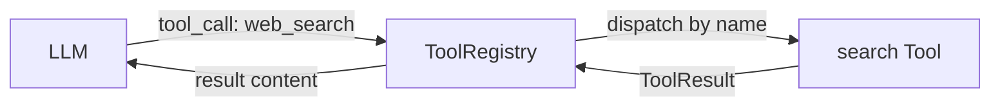
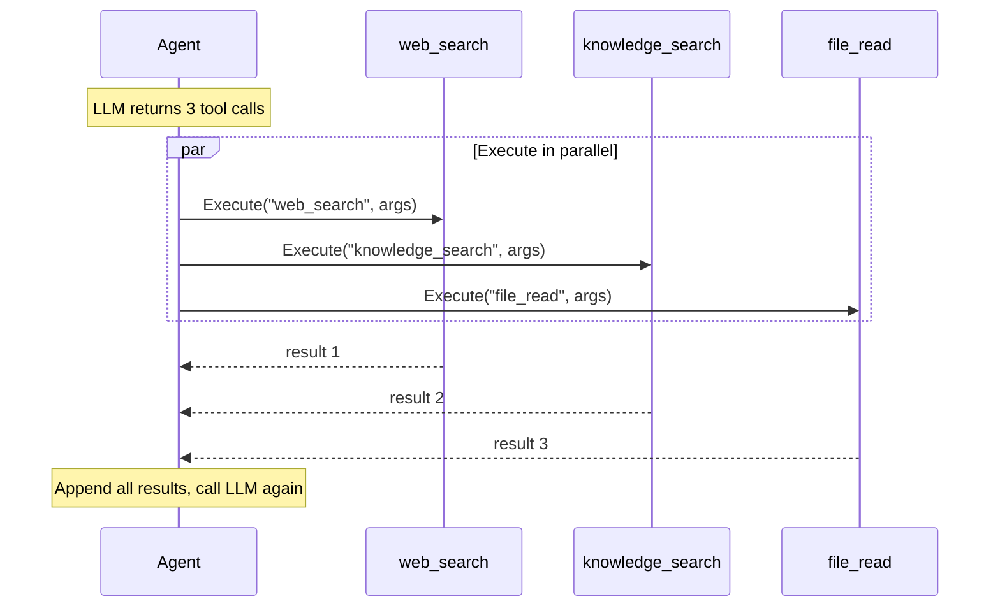

# Tool

Tools give agents the ability to take actions — search the web, read files, call APIs, schedule tasks. The LLM decides when and how to call them.

## Tool Interface

**File:** `tool.go`

```go
type Tool interface {
    Definitions() []ToolDefinition
    Execute(ctx context.Context, name string, args json.RawMessage) (ToolResult, error)
}
```

A single `Tool` can expose multiple functions via `Definitions()`. The `Execute` method dispatches by `name`.



## ToolDefinition

Describes a tool function for the LLM:

```go
type ToolDefinition struct {
    Name        string          // "web_search"
    Description string          // "Search the web for information"
    Parameters  json.RawMessage // JSON Schema
}
```

The `Parameters` field is a JSON Schema that tells the LLM what arguments to generate:

```json
{
    "type": "object",
    "properties": {
        "query": {
            "type": "string",
            "description": "Search query"
        },
        "limit": {
            "type": "integer",
            "description": "Max results (default 10)"
        }
    },
    "required": ["query"]
}
```

## ToolResult

```go
type ToolResult struct {
    Content string  // success: the result content
    Error   string  // failure: error message for the LLM
}
```

**Important:** business errors go in `ToolResult.Error`, not as a Go `error` return. The Go `error` return is for infrastructure failures only.

```go
// Correct — business error in ToolResult
return oasis.ToolResult{Error: "city not found: " + city}, nil

// Wrong — don't use Go error for expected failures
return oasis.ToolResult{}, fmt.Errorf("city not found: %s", city)
```

## ToolRegistry

Holds all registered tools and dispatches execution by name:

```go
registry := oasis.NewToolRegistry()
registry.Add(searchTool)
registry.Add(knowledgeTool)

// Get all definitions (for passing to LLM)
defs := registry.AllDefinitions()

// Execute a tool call
result, err := registry.Execute(ctx, "web_search", argsJSON)
```

## Built-in Tools

| Package | Functions | Dependencies |
|---------|-----------|-------------|
| `tools/knowledge` | `knowledge_search` | Store, EmbeddingProvider |
| `tools/remember` | `remember` | Store, EmbeddingProvider |
| `tools/search` | `web_search` | EmbeddingProvider, Brave API key |
| `tools/schedule` | `schedule_create`, `schedule_list`, `schedule_update`, `schedule_delete` | Store |
| `tools/shell` | `shell_exec` | workspace path |
| `tools/file` | `file_read`, `file_write`, `file_list` | workspace path |
| `tools/http` | `http_fetch` | (none) |

## Parallel Execution

When an LLM returns multiple tool calls in a single response, the agent executes them concurrently:



## See Also

- [Custom Tool Guide](../guides/custom-tool.md) — build your own tool step by step
- [Agent](agent.md) — how agents use tools
- [API Reference: Interfaces](../api/interfaces.md)
