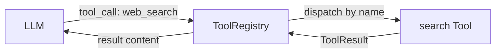
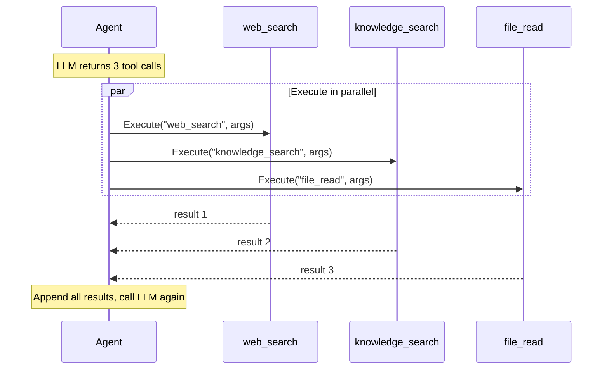
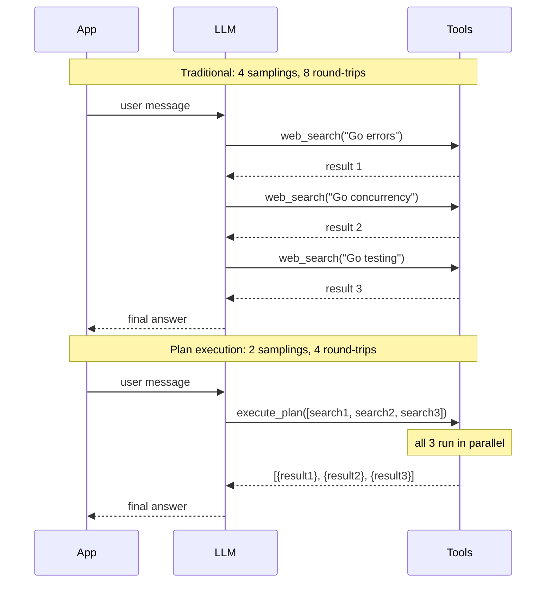

# Tool

Tools give agents the ability to take actions — search the web, read files, call APIs, schedule tasks. The LLM decides when and how to call them.

## Tool Interface

**File:** `tool.go`

```go
type Tool interface {
    Definitions() []ToolDefinition
    Execute(ctx context.Context, name string, args json.RawMessage) (ToolResult, error)
}
```

A single `Tool` can expose multiple functions via `Definitions()`. The `Execute` method dispatches by `name`.



## ToolDefinition

Describes a tool function for the LLM:

```go
type ToolDefinition struct {
    Name        string          // "web_search"
    Description string          // "Search the web for information"
    Parameters  json.RawMessage // JSON Schema
}
```

The `Parameters` field is a JSON Schema that tells the LLM what arguments to generate:

```json
{
    "type": "object",
    "properties": {
        "query": {
            "type": "string",
            "description": "Search query"
        },
        "limit": {
            "type": "integer",
            "description": "Max results (default 10)"
        }
    },
    "required": ["query"]
}
```

## ToolResult

```go
type ToolResult struct {
    Content string  // success: the result content
    Error   string  // failure: error message for the LLM
}
```

**Important:** business errors go in `ToolResult.Error`, not as a Go `error` return. The Go `error` return is for infrastructure failures only.

```go
// Correct — business error in ToolResult
return oasis.ToolResult{Error: "city not found: " + city}, nil

// Wrong — don't use Go error for expected failures
return oasis.ToolResult{}, fmt.Errorf("city not found: %s", city)
```

## ToolRegistry

Holds all registered tools and dispatches execution by name:

```go
registry := oasis.NewToolRegistry()
registry.Add(searchTool)
registry.Add(knowledgeTool)

// Get all definitions (for passing to LLM)
defs := registry.AllDefinitions()

// Execute a tool call
result, err := registry.Execute(ctx, "web_search", argsJSON)
```

## Built-in Tools

| Package | Functions | Dependencies |
|---------|-----------|-------------|
| `tools/knowledge` | `knowledge_search` | Store, EmbeddingProvider |
| `tools/remember` | `remember` | Store, EmbeddingProvider |
| `tools/search` | `web_search` | EmbeddingProvider, Brave API key |
| `tools/schedule` | `schedule_create`, `schedule_list`, `schedule_update`, `schedule_delete` | Store |
| `tools/shell` | `shell_exec` | workspace path |
| `tools/file` | `file_read`, `file_write`, `file_list`, `file_delete`, `file_stat` | workspace path |
| `tools/http` | `http_fetch` | (none) |
| `tools/data` | `data_parse`, `data_filter`, `data_aggregate`, `data_transform` | (none) |
| `tools/skill` | `skill_search`, `skill_create`, `skill_update` | Store, EmbeddingProvider |

## Parallel Execution

When an LLM returns multiple tool calls in a single response, the agent executes them concurrently using a fixed worker pool (capped at 10 workers). Single calls run inline without goroutine overhead:



## Plan Execution

When the LLM knows all the tool calls it needs upfront, re-sampling between each one wastes latency and tokens. Plan execution eliminates this by batching multiple calls in a single LLM turn.

Enable with `WithPlanExecution()`:

```go
agent := oasis.NewLLMAgent("researcher", "Researches topics", provider,
    oasis.WithTools(searchTool, knowledgeTool),
    oasis.WithPlanExecution(), // injects execute_plan tool
)
```

The framework auto-injects an `execute_plan` tool. The LLM can call it with an array of steps:

```json
{
    "name": "execute_plan",
    "input": {
        "steps": [
            {"tool": "web_search", "args": {"query": "Go error handling"}},
            {"tool": "web_search", "args": {"query": "Go concurrency patterns"}},
            {"tool": "web_search", "args": {"query": "Go testing best practices"}}
        ]
    }
}
```

All steps execute in parallel. The result is a structured JSON array:

```json
[
    {"step": 0, "tool": "web_search", "status": "ok", "result": "..."},
    {"step": 1, "tool": "web_search", "status": "ok", "result": "..."},
    {"step": 2, "tool": "web_search", "status": "error", "error": "timeout"}
]
```

### Traditional vs Plan Execution



### Constraints

- **Parallel only** — all steps run concurrently, no sequential ordering
- **No data flow** — step 2 cannot reference step 1's result
- **No recursion** — steps cannot call `execute_plan` itself
- **Max 50 steps** — capped at 50 steps per call to prevent resource exhaustion
- **Partial failures** — a failed step reports its error without aborting the others
- **Opt-in** — the tool is only available when `WithPlanExecution()` is set

Works with both `LLMAgent` and `Network`. Provider-agnostic — any LLM can use it.

## Code Execution

When the LLM needs more than parallel fan-out — conditionals, loops, data flow between tool calls — use code execution. The LLM writes Python code that runs in a sandboxed subprocess with full access to agent tools via `call_tool()`.

Enable with `WithCodeExecution()`:

```go
import "github.com/nevindra/oasis/code"

runner := code.NewSubprocessRunner("python3")

agent := oasis.NewLLMAgent("analyst", "Data analyst", provider,
    oasis.WithTools(searchTool, fileTool),
    oasis.WithCodeExecution(runner), // injects execute_code tool
)
```

The framework auto-injects an `execute_code` tool. The LLM writes Python code that can call tools:

```json
{
    "name": "execute_code",
    "input": {
        "code": "results = call_tool('web_search', {'query': 'Go frameworks'})\nfiltered = [r for r in results if r.get('score', 0) > 0.8]\nset_result({'top_results': filtered})"
    }
}
```

### Plan vs Code Execution

| | `execute_plan` | `execute_code` |
|---|---|---|
| **Control flow** | Parallel only | Conditionals, loops, data flow |
| **Data dependencies** | None | Full |
| **Overhead** | None (Go-native) | Python subprocess |
| **Best for** | Independent fan-out | Complex logic |

Both can be enabled on the same agent — the LLM picks the right tool for each task.

See [Code Execution](code-execution.md) for the full architecture, safety model, and Python API reference.

## See Also

- [Custom Tool Guide](../guides/custom-tool.md) — build your own tool step by step
- [Code Execution](code-execution.md) — sandboxed Python execution with tool bridge
- [Code Execution Guide](../guides/code-execution.md) — patterns and recipes
- [Agent](agent.md) — how agents use tools
- [API Reference: Interfaces](../api/interfaces.md)
