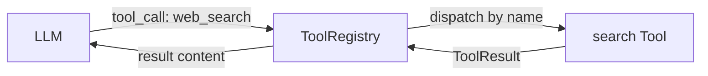
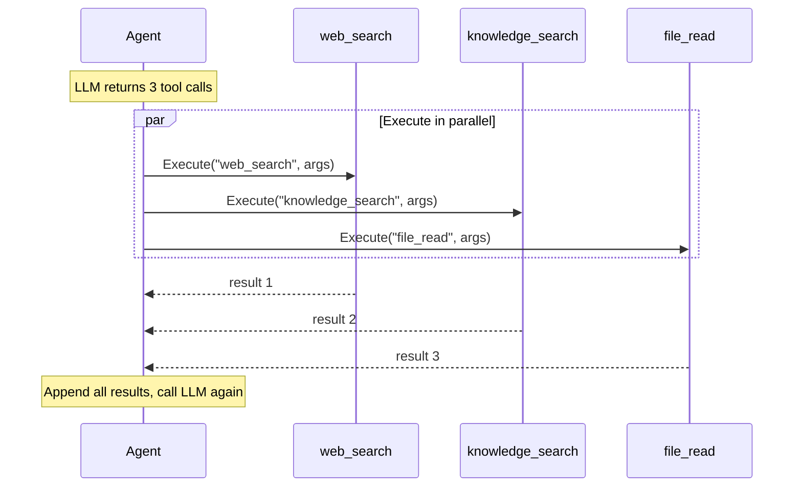
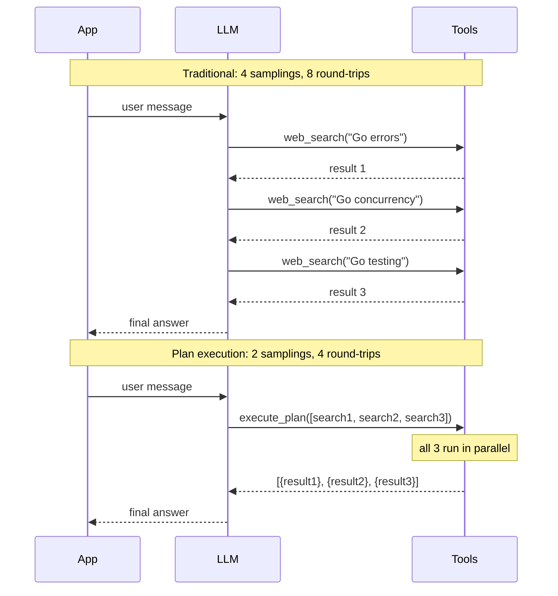

# Tool

Tools give agents the ability to take actions — search the web, read files, call APIs, schedule tasks. The LLM decides when and how to call them.

## Tool Interface

**File:** `tool.go`

```go
type Tool interface {
    Definitions() []ToolDefinition
    Execute(ctx context.Context, name string, args json.RawMessage) (ToolResult, error)
}
```

A single `Tool` can expose multiple functions via `Definitions()`. The `Execute` method dispatches by `name`.


```mermaid
flowchart LR
    LLM -->|"tool_call: web_search"| REGISTRY[ToolRegistry]
    REGISTRY -->|"dispatch by name"| TOOL[search Tool]
    TOOL -->|ToolResult| REGISTRY
    REGISTRY -->|"result content"| LLM
```

## ToolDefinition

Describes a tool function for the LLM:

```go
type ToolDefinition struct {
    Name        string          // "web_search"
    Description string          // "Search the web for information"
    Parameters  json.RawMessage // JSON Schema
}
```

The `Parameters` field is a JSON Schema that tells the LLM what arguments to generate:

```json
{
    "type": "object",
    "properties": {
        "query": {
            "type": "string",
            "description": "Search query"
        },
        "limit": {
            "type": "integer",
            "description": "Max results (default 10)"
        }
    },
    "required": ["query"]
}
```

## ToolResult

```go
type ToolResult struct {
    Content string  // success: the result content
    Error   string  // failure: error message for the LLM
}
```

**Important:** business errors go in `ToolResult.Error`, not as a Go `error` return. The Go `error` return is for infrastructure failures only.

```go
// Correct — business error in ToolResult
return oasis.ToolResult{Error: "city not found: " + city}, nil

// Wrong — don't use Go error for expected failures
return oasis.ToolResult{}, fmt.Errorf("city not found: %s", city)
```

## ToolRegistry

Holds all registered tools and dispatches execution by name:

```go
registry := oasis.NewToolRegistry()
registry.Add(searchTool)
registry.Add(knowledgeTool)

// Get all definitions (for passing to LLM)
defs := registry.AllDefinitions()

// Execute a tool call — O(1) lookup via internal map index
result, err := registry.Execute(ctx, "web_search", argsJSON)
```

`ToolRegistry` maintains a `map[string]Tool` index built during `Add()`, providing O(1) dispatch lookups. When agents use `WithDynamicTools`, they build tool definitions and a lookup index directly from the returned `[]Tool` slice, avoiding intermediate `ToolRegistry` allocation.

## Built-in Tools

| Package | Functions | Dependencies |
|---------|-----------|-------------|
| `tools/knowledge` | `knowledge_search` | Store, EmbeddingProvider |
| `tools/remember` | `remember` | Store, EmbeddingProvider |
| `tools/search` | `web_search` | EmbeddingProvider, Brave API key |
| `tools/schedule` | `schedule_create`, `schedule_list`, `schedule_update`, `schedule_delete` | Store |
| `tools/shell` | `shell_exec` | workspace path |
| `tools/file` | `file_read`, `file_write`, `file_list`, `file_delete`, `file_stat` | workspace path |
| `tools/http` | `http_fetch` | (none) |
| `tools/data` | `data_parse`, `data_filter`, `data_aggregate`, `data_transform` | (none) |
| `tools/skill` | `skill_search`, `skill_create`, `skill_update` | Store, EmbeddingProvider |

## Built-in Tool Reference

### knowledge — Knowledge Search

**Package:** `tools/knowledge`
**Constructor:** `knowledge.New(store, embedding, ...Option)`

Searches the knowledge base (ingested documents) and past conversations. Embeds the query once and reuses the vector for both chunk retrieval and message search.

**Options:**

| Option | Default | Description |
|--------|---------|-------------|
| `WithRetriever(r)` | `HybridRetriever` | Inject a custom `Retriever`. When omitted, a default `HybridRetriever` is created from the provided store and embedding provider. |
| `WithTopK(n)` | `5` | Number of knowledge-base chunks to retrieve. |

**Tool schema — `knowledge_search`:**

| Parameter | Type | Required | Description |
|-----------|------|----------|-------------|
| `query` | string | yes | Search query |

**Behavior:**

- Embeds the query via `EmbeddingProvider.Embed` once per call.
- If the injected retriever implements `RetrieveWithEmbedding`, the pre-computed embedding is passed directly, avoiding a redundant embed call inside the retriever.
- Retrieves up to `topK` chunks from the knowledge base.
- Separately searches past conversation messages via `Store.SearchMessages` (hardcoded top 5).
- Results include graph context — related entities discovered via GraphRAG are appended as `Related: "description" (relation)` lines.
- Returns `"No relevant information found for \"<query>\"."` when both sources return empty.

**Example:**

```go
import "github.com/nevindra/oasis/tools/knowledge"

// Default: HybridRetriever, top 5 results
tool := knowledge.New(store, embedding)

// Custom retriever with tuned thresholds
retriever := oasis.NewHybridRetriever(store, embedding,
    oasis.WithMinRetrievalScore(0.05),
    oasis.WithKeywordWeight(0.4),
    oasis.WithReranker(oasis.NewScoreReranker(0.1)),
)
tool := knowledge.New(store, embedding,
    knowledge.WithRetriever(retriever),
    knowledge.WithTopK(10),
)
```

---

### remember — Save to Knowledge Base

**Package:** `tools/remember`
**Constructor:** `remember.New(store, embedding)`

Saves content to the knowledge base by chunking, embedding, and storing it via an internal `ingest.Ingestor`. The LLM calls this when the user asks to remember or save something.

**Tool schema — `remember`:**

| Parameter | Type | Required | Description |
|-----------|------|----------|-------------|
| `content` | string | yes | The content to save |

**Behavior:**

- Delegates to `ingest.Ingestor.IngestText` with source `"message"`.
- Content is chunked, embedded, and stored as knowledge-base chunks.
- Returns `"Saved and indexed N chunk(s) to knowledge base."` on success.

**App-layer methods:**

These methods are exported for use by application code (e.g., ingesting files uploaded by users, indexing URLs from messages):

| Method | Description |
|--------|-------------|
| `IngestText(ctx, content, source)` | Chunk, embed, and store text content. |
| `IngestFile(ctx, content, filename)` | Chunk, embed, and store a file's content. Filename determines chunker behavior. |
| `IngestURL(ctx, html, sourceURL)` | Ingest HTML content from a URL. Wraps `IngestFile` with `.html` suffix. |

**Example:**

```go
import "github.com/nevindra/oasis/tools/remember"

tool := remember.New(store, embedding)

// App-layer: ingest a user-uploaded file
result, err := tool.IngestFile(ctx, fileContent, "report.pdf")

// App-layer: ingest a web page
result, err := tool.IngestURL(ctx, htmlBody, "https://example.com/article")
```

---

### search — Web Search

**Package:** `tools/search`
**Constructor:** `search.New(embedding, braveAPIKey)`

Searches the web via the Brave Search API, fetches result pages, chunks the content, and re-ranks all chunks by semantic similarity to the query.

**Tool schema — `web_search`:**

| Parameter | Type | Required | Description |
|-----------|------|----------|-------------|
| `query` | string | yes | Search query optimized for search engines |

**Behavior:**

1. Calls Brave Search API with `count=8` results.
2. Fetches each result URL concurrently (8-second timeout per fetch, 512 KB body limit per page).
3. Strips HTML from fetched pages and truncates extracted text to 8,000 characters per page.
4. Includes each Brave result's snippet as a standalone chunk. Then chunks all extracted page content using a `RecursiveChunker` (125 max tokens, 0 overlap). Page-body chunks shorter than 50 characters are discarded.
5. Embeds the query plus all chunks in a single batch call, then ranks by cosine similarity.
6. If the top score is below `0.35`, retries with `count=12` results, deduplicates by URL, and re-ranks.
7. Returns the top 8 ranked chunks with scores and source URLs.
8. On embedding failure, falls back to unranked results (first 8 chunks).

**Limits and safety:**

| Limit | Value |
|-------|-------|
| HTTP client timeout | 10 seconds (Brave API) |
| Per-page fetch timeout | 8 seconds |
| Per-page body limit | 512 KB |
| Per-page text truncation | 8,000 characters |
| Chunk size | 125 tokens max |
| Min chunk length | 50 characters |
| Initial result count | 8 |
| Retry result count | 12 |
| Output limit | Top 8 chunks |
| Retry threshold | Top score < 0.35 |
| User-Agent | `Mozilla/5.0 (compatible; OasisBot/1.0)` |

**App-layer method:**

| Method | Description |
|--------|-------------|
| `Search(ctx, query)` | Full search pipeline — returns formatted results string. |

**Example:**

```go
import "github.com/nevindra/oasis/tools/search"

tool := search.New(embedding, os.Getenv("BRAVE_API_KEY"))

// App-layer: search directly
content, err := tool.Search(ctx, "latest Go release features")
```

---

### schedule — Scheduled Actions

**Package:** `tools/schedule`
**Constructor:** `schedule.New(store, tzOffset)`

Manages scheduled and recurring actions. The `tzOffset` parameter is the user's timezone offset in hours from UTC (e.g., `7` for WIB/UTC+7). Exposes four tool functions for full CRUD.

**Tool schema — `schedule_create`:**

| Parameter | Type | Required | Description |
|-----------|------|----------|-------------|
| `description` | string | yes | Human-readable description of the action |
| `time` | string | yes | Time in `HH:MM` format (24-hour, user's local timezone) |
| `recurrence` | string | yes | One of: `once`, `daily`, `custom`, `weekly`, `monthly` |
| `day` | string | no | For `weekly`: day name. For `custom`: comma-separated day names. For `monthly`: day number (1-31). |
| `tools` | array | yes | Tool calls to execute when the schedule fires. Each element: `{tool, params}`. |
| `synthesis_prompt` | string | no | How to format/summarize results after tool execution |

**Tool schema — `schedule_list`:**

No parameters. Returns all scheduled actions with status (`active`/`paused`), schedule string, and next run time.

**Tool schema — `schedule_update`:**

| Parameter | Type | Required | Description |
|-----------|------|----------|-------------|
| `description_query` | string | yes | Substring to match the action description |
| `enabled` | boolean | no | Enable or disable (pause) the action |
| `time` | string | no | New time in `HH:MM` format |
| `recurrence` | string | no | New recurrence pattern |
| `day` | string | no | New day(s) for weekly/custom/monthly |

**Tool schema — `schedule_delete`:**

| Parameter | Type | Required | Description |
|-----------|------|----------|-------------|
| `description_query` | string | yes | Substring to match, or `*` to delete all |

**Behavior:**

- Schedule strings are stored as `"HH:MM recurrence"` — e.g., `"08:00 daily"`, `"09:30 weekly(monday)"`, `"14:00 custom(monday,wednesday,friday)"`, `"10:00 monthly(15)"`.
- Default time when omitted: `08:00`.
- Default day when omitted: `monday` (weekly), `monday,wednesday,friday` (custom), `1` (monthly).
- Update matches by description substring. Returns an error if multiple actions match (asks the LLM to be more specific).
- Delete with `*` removes all scheduled actions and returns the count.
- `ComputeNextRun` calculates the next fire time from the schedule string and timezone offset.

**Example:**

```go
import "github.com/nevindra/oasis/tools/schedule"

tool := schedule.New(store, 7) // UTC+7
```

---

### shell — Shell Execution

**Package:** `tools/shell`
**Constructor:** `shell.New(workspacePath, defaultTimeout)`

Executes shell commands in a sandboxed workspace directory. Commands run via `sh -c` with the working directory set to `workspacePath`.

**Tool schema — `shell_exec`:**

| Parameter | Type | Required | Description |
|-----------|------|----------|-------------|
| `command` | string | yes | Shell command to execute |
| `timeout` | integer | no | Timeout in seconds (default: constructor value, max: 300) |

**Behavior:**

- Default timeout: the value passed to the constructor (falls back to `30` seconds if `<= 0`).
- Maximum timeout: `300` seconds (5 minutes). Values above this are clamped.
- Stdout and stderr are captured separately. If both are non-empty, stderr is appended after a `--- stderr ---` separator.
- Output is truncated to `4,000` characters.
- Returns `"(no output)"` when both stdout and stderr are empty and the command succeeds.
- On timeout, returns both the partial output and a `"command timed out after Ns"` error.
- On non-zero exit, returns the output with an `"exit: ..."` error.

**Safety — command blocklist:**

The following substrings are blocked (case-insensitive match):

| Blocked pattern | Reason |
|-----------------|--------|
| `rm -rf /` | Prevents recursive root deletion |
| `sudo ` | Prevents privilege escalation |
| `mkfs` | Prevents filesystem formatting |
| `> /dev/` | Prevents writing to device files |
| `dd if=` | Prevents raw disk operations |

Commands containing any blocked pattern return `"command blocked for safety: <pattern>"` without execution.

**Example:**

```go
import "github.com/nevindra/oasis/tools/shell"

tool := shell.New("/home/user/workspace", 30) // 30s default timeout
```

---

### file — File Operations

**Package:** `tools/file`
**Constructor:** `file.New(workspacePath)`

Provides sandboxed file operations within a workspace directory. All paths are relative to the workspace root. Exposes five tool functions.

**Sandboxing:**

All paths are resolved relative to `workspacePath` with the following restrictions:

- **Absolute paths rejected** — paths starting with `/` return an error.
- **Path traversal rejected** — paths containing `..` return an error.
- **Escape detection** — after `filepath.Join`, the resolved path must still have `workspacePath` as a prefix.

**Tool schema — `file_read`:**

| Parameter | Type | Required | Description |
|-----------|------|----------|-------------|
| `path` | string | yes | File path relative to workspace |

Returns the file content, truncated to `8,000` characters with `"... (truncated)"` appended if exceeded.

**Tool schema — `file_write`:**

| Parameter | Type | Required | Description |
|-----------|------|----------|-------------|
| `path` | string | yes | File path relative to workspace |
| `content` | string | yes | Content to write |

Creates parent directories automatically (`os.MkdirAll` with `0755`). Files are written with `0644` permissions.

**Tool schema — `file_list`:**

| Parameter | Type | Required | Description |
|-----------|------|----------|-------------|
| `path` | string | no | Directory path relative to workspace (default: `.`) |

Returns one entry per line: `file\tname` or `dir\tname`.

**Tool schema — `file_delete`:**

| Parameter | Type | Required | Description |
|-----------|------|----------|-------------|
| `path` | string | yes | File or directory path |

Uses `os.Remove` — only deletes files and empty directories.

**Tool schema — `file_stat`:**

| Parameter | Type | Required | Description |
|-----------|------|----------|-------------|
| `path` | string | yes | File or directory path |

Returns JSON with `name`, `size` (bytes), `type` (`"file"` or `"directory"`), and `modified` (UTC ISO 8601).

**Example:**

```go
import "github.com/nevindra/oasis/tools/file"

tool := file.New("/home/user/workspace")
```

---

### http — HTTP Fetch

**Package:** `tools/http`
**Constructor:** `http.New()`

Fetches a URL and extracts readable text content. No dependencies required.

**Tool schema — `http_fetch`:**

| Parameter | Type | Required | Description |
|-----------|------|----------|-------------|
| `url` | string | yes | URL to fetch |

**Behavior:**

1. Fetches the URL with a `15-second` HTTP client timeout.
2. Reads the response body up to `1 MB`.
3. Attempts readability extraction via `go-readability` (extracts article text from HTML).
4. If readability fails or returns empty, falls back to `ingest.StripHTML` (simple tag stripping).
5. Truncates the final output to `8,000` characters.
6. Returns HTTP errors (status >= 400) as `"HTTP <code> from <url>"`.

**Limits:**

| Limit | Value |
|-------|-------|
| HTTP client timeout | 15 seconds |
| Response body limit | 1 MB |
| Output truncation | 8,000 characters |
| User-Agent | `Mozilla/5.0 (compatible; OasisBot/1.0)` |

**App-layer method:**

| Method | Description |
|--------|-------------|
| `Fetch(ctx, url)` | Download and extract readable text. Returns the raw extracted text (not truncated to 8,000 — truncation only applies to the tool result). |

**Example:**

```go
import oasishttp "github.com/nevindra/oasis/tools/http"

tool := oasishttp.New()

// App-layer: fetch and extract content
text, err := tool.Fetch(ctx, "https://example.com/article")
```

---

### data — Data Transforms

**Package:** `tools/data`
**Constructor:** `data.New()`

Provides structured data transform functions for CSV, JSON, and JSONL processing. The LLM composes four functions — parse, filter, aggregate, transform — as building blocks for data pipelines without Python subprocess overhead.

**Constants:**

| Constant | Value | Description |
|----------|-------|-------------|
| `defaultLimit` | 1,000 | Default max records for `data_parse` |
| `maxOutputSize` | 32 KB | Max JSON output size. When exceeded, records are halved repeatedly until under the limit. |

#### data_parse

| Parameter | Type | Required | Description |
|-----------|------|----------|-------------|
| `content` | string | yes | Raw text content (CSV, JSON array, or JSONL) |
| `format` | string | no | `csv`, `json`, or `jsonl`. Auto-detected if omitted. |
| `limit` | integer | no | Max records to return (default 1,000) |

**Auto-detection:** content starting with `[` or `{` is treated as JSON. If it starts with `{` and the second line (index 1) also starts with `{`, it is treated as JSONL. Everything else defaults to CSV.

**CSV parsing:** uses `csv.Reader` with `LazyQuotes` and `TrimLeadingSpace` enabled. First row is treated as headers.

Returns `{records, columns, count}` where `count` is the total record count (may exceed `limit`).

#### data_filter

| Parameter | Type | Required | Description |
|-----------|------|----------|-------------|
| `records` | array | yes | Array of record objects to filter |
| `where` | array | yes | Conditions: `[{column, op, value}, ...]` |

All conditions are AND-ed. Available operators:

| Operator | Description |
|----------|-------------|
| `==` | Equal (numeric-aware) |
| `!=` | Not equal |
| `>`, `<`, `>=`, `<=` | Comparison (numeric strings auto-coerced) |
| `contains` | Case-insensitive substring match |
| `in` | Value exists in array |

Returns `{records, count}`.

#### data_aggregate

| Parameter | Type | Required | Description |
|-----------|------|----------|-------------|
| `records` | array | yes | Array of record objects |
| `group_by` | array | no | Columns to group by. Omit to aggregate all records as one group. |
| `metrics` | array | yes | Aggregation metrics: `[{column, op}, ...]` |

Available metric operations: `sum`, `count`, `avg`, `min`, `max`. Non-numeric values are silently skipped for `sum`/`avg`/`min`/`max`. Metric results are named `<op>_<column>` (e.g., `sum_revenue`). Groups are sorted alphabetically by group-by columns for deterministic output.

Returns `{groups, count}`.

#### data_transform

| Parameter | Type | Required | Description |
|-----------|------|----------|-------------|
| `records` | array | yes | Array of record objects |
| `select` | array | no | Columns to keep (omit to keep all) |
| `rename` | object | no | Rename map: `{old_name: new_name}` |
| `sort_by` | string | no | Column to sort by (numeric-aware, stable sort) |
| `sort_desc` | boolean | no | Sort descending (default `false`) |
| `limit` | integer | no | Max records to return |

Operations are applied in order: select, rename, sort, limit.

Returns `{records, count}`.

**Example:**

```go
import "github.com/nevindra/oasis/tools/data"

tool := data.New()
```

---

### skill — Skill Management

**Package:** `tools/skill`
**Constructor:** `skill.New(store, embedding)`

Manages skills — stored instruction packages that specialize agent behavior. Agents can search, create, and update skills at runtime, enabling self-improvement loops where learned patterns are encoded as reusable instructions.

**Tool schema — `skill_search`:**

| Parameter | Type | Required | Description |
|-----------|------|----------|-------------|
| `query` | string | yes | Natural language query to find relevant skills |

Embeds the query and searches via `Store.SearchSkills` (top 5 results). Returns skill name, score, ID, description, tags, creator, and full instructions.

**Tool schema — `skill_create`:**

| Parameter | Type | Required | Description |
|-----------|------|----------|-------------|
| `name` | string | yes | Short identifier (e.g., `code-reviewer`, `data-analyst`) |
| `description` | string | yes | What this skill does — used for semantic search matching |
| `instructions` | string | yes | Detailed instructions injected into the agent system prompt |
| `tags` | array of strings | no | Categorization labels |
| `tools` | array of strings | no | Tool names this skill should use (empty = all) |
| `model` | string | no | Model override |
| `references` | array of strings | no | Skill IDs this skill builds on |

The description is embedded at creation time for semantic search. The `createdBy` field is automatically set from the task context's user ID.

**Tool schema — `skill_update`:**

| Parameter | Type | Required | Description |
|-----------|------|----------|-------------|
| `id` | string | yes | ID of the skill to update |
| `name` | string | no | New name |
| `description` | string | no | New description (triggers re-embedding) |
| `instructions` | string | no | New instructions |
| `tags` | array of strings | no | New tags (replaces existing) |
| `tools` | array of strings | no | New tool list (replaces existing) |
| `model` | string | no | New model override |
| `references` | array of strings | no | New skill references (replaces existing) |

Only provided fields are changed. When `description` is updated, the embedding is automatically recomputed.

**Example:**

```go
import "github.com/nevindra/oasis/tools/skill"

tool := skill.New(store, embedding)
```

## Parallel Execution

When an LLM returns multiple tool calls in a single response, the agent executes them concurrently using a fixed worker pool (capped at 10 workers). Single calls run inline without goroutine overhead:


```mermaid
sequenceDiagram
    participant Agent
    participant T1 as web_search
    participant T2 as knowledge_search
    participant T3 as file_read

    Note over Agent: LLM returns 3 tool calls
    par Execute in parallel
        Agent->>T1: Execute("web_search", args)
        Agent->>T2: Execute("knowledge_search", args)
        Agent->>T3: Execute("file_read", args)
    end
    T1-->>Agent: result 1
    T2-->>Agent: result 2
    T3-->>Agent: result 3
    Note over Agent: Append all results, call LLM again
```

## Plan Execution

When the LLM knows all the tool calls it needs upfront, re-sampling between each one wastes latency and tokens. Plan execution eliminates this by batching multiple calls in a single LLM turn.

Enable with `WithPlanExecution()`:

```go
agent := oasis.NewLLMAgent("researcher", "Researches topics", provider,
    oasis.WithTools(searchTool, knowledgeTool),
    oasis.WithPlanExecution(), // injects execute_plan tool
)
```

The framework auto-injects an `execute_plan` tool. The LLM can call it with an array of steps:

```json
{
    "name": "execute_plan",
    "input": {
        "steps": [
            {"tool": "web_search", "args": {"query": "Go error handling"}},
            {"tool": "web_search", "args": {"query": "Go concurrency patterns"}},
            {"tool": "web_search", "args": {"query": "Go testing best practices"}}
        ]
    }
}
```

All steps execute in parallel. The result is a structured JSON array:

```json
[
    {"step": 0, "tool": "web_search", "status": "ok", "result": "..."},
    {"step": 1, "tool": "web_search", "status": "ok", "result": "..."},
    {"step": 2, "tool": "web_search", "status": "error", "error": "timeout"}
]
```

### Traditional vs Plan Execution


```mermaid
sequenceDiagram
    participant App
    participant LLM
    participant Tools

    Note over App,Tools: Traditional: 4 samplings, 8 round-trips
    App->>LLM: user message
    LLM->>Tools: web_search("Go errors")
    Tools-->>LLM: result 1
    LLM->>Tools: web_search("Go concurrency")
    Tools-->>LLM: result 2
    LLM->>Tools: web_search("Go testing")
    Tools-->>LLM: result 3
    LLM-->>App: final answer

    Note over App,Tools: Plan execution: 2 samplings, 4 round-trips
    App->>LLM: user message
    LLM->>Tools: execute_plan([search1, search2, search3])
    Note over Tools: all 3 run in parallel
    Tools-->>LLM: [{result1}, {result2}, {result3}]
    LLM-->>App: final answer
```

### Constraints

- **Parallel only** — all steps run concurrently, no sequential ordering
- **No data flow** — step 2 cannot reference step 1's result
- **No recursion** — steps cannot call `execute_plan` itself
- **Max 50 steps** — capped at 50 steps per call to prevent resource exhaustion
- **Partial failures** — a failed step reports its error without aborting the others
- **Opt-in** — the tool is only available when `WithPlanExecution()` is set

Works with both `LLMAgent` and `Network`. Provider-agnostic — any LLM can use it.

## Code Execution

When the LLM needs more than parallel fan-out — conditionals, loops, data flow between tool calls — use code execution. The LLM writes Python code that runs in a sandboxed subprocess with full access to agent tools via `call_tool()`.

Enable with `WithCodeExecution()`:

```go
import "github.com/nevindra/oasis/code"

runner := code.NewSubprocessRunner("python3")

agent := oasis.NewLLMAgent("analyst", "Data analyst", provider,
    oasis.WithTools(searchTool, fileTool),
    oasis.WithCodeExecution(runner), // injects execute_code tool
)
```

The framework auto-injects an `execute_code` tool. The LLM writes Python code that can call tools:

```json
{
    "name": "execute_code",
    "input": {
        "code": "results = call_tool('web_search', {'query': 'Go frameworks'})\nfiltered = [r for r in results if r.get('score', 0) > 0.8]\nset_result({'top_results': filtered})"
    }
}
```

### Plan vs Code Execution

| | `execute_plan` | `execute_code` |
|---|---|---|
| **Control flow** | Parallel only | Conditionals, loops, data flow |
| **Data dependencies** | None | Full |
| **Overhead** | None (Go-native) | Python subprocess |
| **Best for** | Independent fan-out | Complex logic |

Both can be enabled on the same agent — the LLM picks the right tool for each task.

See [Code Execution](code-execution.md) for the full architecture, safety model, and Python API reference.

## See Also

- [Custom Tool Guide](../guides/custom-tool.md) — build your own tool step by step
- [Code Execution](code-execution.md) — sandboxed Python execution with tool bridge
- [Code Execution Guide](../guides/code-execution.md) — patterns and recipes
- [Agent](agent.md) — how agents use tools
- [API Reference: Interfaces](../api/interfaces.md)
