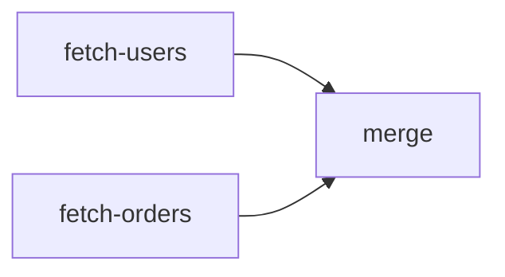
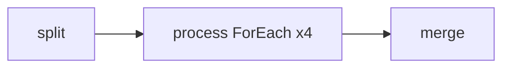

# Workflow

Workflow is deterministic, DAG-based task orchestration. Unlike Network (LLM-routed), a Workflow follows explicit step sequences and dependency edges defined at construction time. Parallel execution emerges naturally when multiple steps share a predecessor.

Workflow implements `Agent`, so it composes with everything: Networks can contain Workflows, Workflows can contain Agents, and Workflows nest inside other Workflows.

## When to Use Workflow vs Network

The key distinction is **when the routing decision happens**:

- **Workflow = compile-time routing.** You declare steps and dependencies at construction time. The execution path is fixed — same DAG every time, regardless of input.
- **Network = runtime routing.** An LLM router reads the input and decides which agents to call. Different inputs produce different execution paths.

| Workflow | Network |
|----------|---------|
| You declare routing at construction time | LLM decides routing at runtime |
| Deterministic — same DAG every time | Dynamic — different paths per request |
| Good for pipelines, ETL, orchestration | Good for open-ended tasks |
| Steps run in declared order | Router can improvise |
| No routing overhead | Extra LLM calls for routing decisions |

**Use Workflow when** you already know the steps: "Extract text → chunk → embed → store" — a fixed pipeline that runs the same way every time.

**Use Network when** the agent needs to figure out what to do: "Research this topic and write a summary" — the router decides whether to search first, which subagents to invoke, and how to combine results.

## Quick Start

```go
wf, err := oasis.NewWorkflow("greet", "Greets a user",
    oasis.Step("prepare", func(ctx context.Context, wCtx *oasis.WorkflowContext) error {
        wCtx.Set("greeting", "Hello, "+wCtx.Input()+"!")
        return nil
    }),
    oasis.Step("format", func(ctx context.Context, wCtx *oasis.WorkflowContext) error {
        g, _ := wCtx.Get("greeting")
        wCtx.Set("format.output", ">> "+g.(string)+" <<")
        return nil
    }, oasis.After("prepare")),
)

result, _ := wf.Execute(ctx, oasis.AgentTask{Input: "Alice"})
// result.Output == ">> Hello, Alice! <<"
```

## Step Types

### Step (function)

The most flexible — runs a `StepFunc` that reads/writes context directly:

```go
oasis.Step("transform", func(ctx context.Context, wCtx *oasis.WorkflowContext) error {
    raw, _ := wCtx.Get("data")
    wCtx.Set("transform.output", strings.ToUpper(raw.(string)))
    return nil
}, oasis.After("fetch"))
```

### AgentStep

Delegates to an Agent. Input comes from `InputFrom()`, output goes to `"{name}.output"`:

```go
oasis.AgentStep("research", researcher,
    oasis.InputFrom("query"),
    oasis.After("prepare"),
)
```

AgentTask.Context and Attachments are propagated to the sub-agent.

### ToolStep

Calls a single tool function. Args from `ArgsFrom()`, result to `"{name}.result"`:

```go
oasis.ToolStep("search", searchTool, "web_search",
    oasis.ArgsFrom("search_params"),
    oasis.After("prepare"),
)
```

### ForEach

Iterates over a `[]any` collection with optional concurrency:

```go
oasis.ForEach("process", func(ctx context.Context, wCtx *oasis.WorkflowContext) error {
    item, _ := oasis.ForEachItem(ctx)
    idx, _ := oasis.ForEachIndex(ctx)
    // process item...
    return nil
},
    oasis.IterOver("items"),
    oasis.Concurrency(4),
    oasis.After("fetch"),
)
```

### DoUntil / DoWhile

Loop primitives with safety caps:

```go
oasis.DoUntil("poll", pollFn,
    oasis.Until(func(wCtx *oasis.WorkflowContext) bool {
        s, _ := wCtx.Get("status")
        return s == "ready"
    }),
    oasis.MaxIter(20),
)
```

## Control Flow Patterns

### Sequential

```go
oasis.Step("a", fnA),
oasis.Step("b", fnB, oasis.After("a")),
oasis.Step("c", fnC, oasis.After("b")),
```

### Parallel

Steps without dependencies run concurrently:



```go
oasis.Step("fetch-users", fetchUsers),
oasis.Step("fetch-orders", fetchOrders),
oasis.Step("merge", mergeData, oasis.After("fetch-users", "fetch-orders")),
```

### Conditional

```go
oasis.Step("classify", classifyInput),
oasis.Step("handle-text", handleText,
    oasis.After("classify"),
    oasis.When(func(wCtx *oasis.WorkflowContext) bool {
        t, _ := wCtx.Get("type")
        return t == "text"
    }),
),
```

Skipped steps are treated as satisfied — their dependents still run.

### Fan-out / Fan-in



```go
oasis.Step("split", splitFn),
oasis.ForEach("process", processFn, oasis.IterOver("chunks"), oasis.Concurrency(4), oasis.After("split")),
oasis.Step("merge", mergeFn, oasis.After("process")),
```

## Data Flow

### WorkflowContext

Shared state map between steps. All methods are concurrent-safe.

```go
wCtx.Set("key", value)        // write
value, ok := wCtx.Get("key")  // read
input := wCtx.Input()         // original AgentTask.Input
```

### Default Output Keys

| Step Type | Default Output Key |
|-----------|-------------------|
| Step | (writes explicitly via `wCtx.Set`) |
| AgentStep | `"{name}.output"` |
| ToolStep | `"{name}.result"` |

Override with `OutputTo("custom_key")`.

## Error Handling

### WorkflowError

When a step fails, `Execute` returns a `*WorkflowError`:

```go
var wfErr *oasis.WorkflowError
if errors.As(err, &wfErr) {
    fmt.Println("failed step:", wfErr.StepName)
    fmt.Println("cause:", wfErr.Err)
    for name, step := range wfErr.Result.Steps {
        fmt.Printf("  %s: %s\n", name, step.Status)
    }
}
```

### Fail-fast

First failure cancels the workflow context. Downstream steps are marked `StepSkipped`.

### Retry

```go
oasis.Step("flaky", flakyFn, oasis.Retry(3, 2*time.Second))       // per-step
oasis.WithDefaultRetry(2, time.Second)                              // workflow-wide
```

## Suspend/Resume

Steps can pause execution to await external input (human approval, async data, etc.):

```go
oasis.Step("gate", func(ctx context.Context, wCtx *oasis.WorkflowContext) error {
    if data, ok := oasis.ResumeData(wCtx); ok {
        // Resumed — data contains the human's response.
        wCtx.Set("gate.approved", true)
        return nil
    }
    return oasis.Suspend(json.RawMessage(`{"needs": "approval"}`))
}, oasis.After("prepare"))
```

When a step calls `Suspend`, the workflow:
1. Returns `*ErrSuspended` from `Execute` (not `WorkflowError` — suspension is not a failure)
2. Preserves all completed step results and context values
3. Does **not** call `OnFinish` or `OnError` callbacks

Resume with the human's response:

```go
result, err := wf.Execute(ctx, task)

var suspended *oasis.ErrSuspended
if errors.As(err, &suspended) {
    fmt.Println("Waiting for:", string(suspended.Payload))
    // Later, with human input:
    result, err = suspended.Resume(ctx, json.RawMessage(`"approved"`))
}
```

On resume, completed steps are skipped (not re-executed). The suspended step re-runs with `ResumeData` available. Multiple suspend points work — each `Resume` advances to the next `Suspend` or completion.

## DAG Validation

`NewWorkflow` validates at construction time:
- Duplicate step names
- Unknown dependencies (After references non-existent step)
- Cycles (detected via topological sort)

## Composition

Workflows compose recursively via `AgentStep`:

```go
inner, _ := oasis.NewWorkflow("inner", "Sub-pipeline", ...)
outer, _ := oasis.NewWorkflow("outer", "Main pipeline",
    oasis.Step("prepare", prepareFn),
    oasis.AgentStep("sub", inner, oasis.After("prepare")),
    oasis.Step("finalize", finalizeFn, oasis.After("sub")),
)
```

## Step Options Reference

| Option | Applies To | Description |
|--------|-----------|-------------|
| `After(steps...)` | All | Dependency edges |
| `When(fn)` | All | Condition gate |
| `InputFrom(key)` | AgentStep | Context key for input |
| `ArgsFrom(key)` | ToolStep | Context key for args |
| `OutputTo(key)` | AgentStep, ToolStep | Override output key |
| `Retry(n, delay)` | All | Retry on failure |
| `IterOver(key)` | ForEach | Collection key |
| `Concurrency(n)` | ForEach | Max parallel (default 1) |
| `Until(fn)` | DoUntil | Exit condition |
| `While(fn)` | DoWhile | Continue condition |
| `MaxIter(n)` | DoUntil, DoWhile | Safety cap (default 10) |

## Workflow Options Reference

| Option | Description |
|--------|-------------|
| `WithOnFinish(fn)` | Callback after workflow completes |
| `WithOnError(fn)` | Callback when a step fails |
| `WithDefaultRetry(n, delay)` | Default retry for all steps |
| `WithWorkflowTracer(t)` | Attach a `Tracer` for span creation (`workflow.execute` → `workflow.step`) |
| `WithWorkflowLogger(l)` | Attach a `*slog.Logger` for structured logging |

## Runtime Workflow Definitions

Workflows can be defined from JSON at runtime using `WorkflowDefinition` and `FromDefinition`. This bridges the gap between compile-time Go workflows and visual workflow builders (like Dify, n8n, Langflow). A JSON definition is parsed and converted into the same `*Workflow` that `NewWorkflow` produces — same DAG engine, same execution semantics.

```text
JSON → WorkflowDefinition (parsed)
     → FromDefinition(def, registry)
     → NewWorkflow(name, desc, ...generatedOptions)
     → *Workflow (identical to compile-time)
```

### Node Types

| Node Type | Purpose | Output Key |
|-----------|---------|------------|
| `llm` | Delegates to a registered Agent | `{id}.output` |
| `tool` | Calls a registered Tool function | `{id}.result` |
| `condition` | Evaluates an expression, routes to branches | `{id}.result` (`"true"` or `"false"`) |
| `template` | Performs string interpolation | `{id}.output` |

### Example

```go
def := oasis.WorkflowDefinition{
    Name:        "research-pipeline",
    Description: "Search then summarize",
    Nodes: []oasis.NodeDefinition{
        {ID: "search", Type: oasis.NodeTool, Tool: "searcher", ToolName: "web_search",
            Args: map[string]any{"query": "{{input}}"}},
        {ID: "summarize", Type: oasis.NodeLLM, Agent: "writer",
            Input: "Summarize these results: {{search.result}}"},
    },
    Edges: [][2]string{{"search", "summarize"}},
}

reg := oasis.DefinitionRegistry{
    Agents: map[string]oasis.Agent{"writer": writerAgent},
    Tools:  map[string]oasis.Tool{"searcher": searchTool},
}

wf, err := oasis.FromDefinition(def, reg)
// wf is a normal *Workflow — Execute, compose, nest as usual.
result, err := wf.Execute(ctx, oasis.AgentTask{Input: "Go concurrency patterns"})
```

### Template Resolution

Node inputs and tool args support `{{key}}` placeholders that resolve against `WorkflowContext` at runtime:

```text
"Summarize: {{search.result}}"  → "Summarize: <actual search output>"
"{{input}}"                     → the original AgentTask.Input
"{{missing}}"                   → "" (empty string, no error)
```

`Resolve` and `ResolveJSON` are also available on `WorkflowContext` for compile-time workflows:

```go
oasis.Step("format", func(_ context.Context, wCtx *oasis.WorkflowContext) error {
    text := wCtx.Resolve("Hello, {{user.name}}! Your order: {{order.id}}")
    wCtx.Set("format.output", text)
    return nil
}, oasis.After("fetch"))
```

### Condition Branching

Condition nodes evaluate a simple expression and route to `true_branch` or `false_branch` targets:

```go
{ID: "check", Type: oasis.NodeCondition,
    Expression:  "{{score.result}} >= 0.8",
    TrueBranch:  []string{"approve"},
    FalseBranch: []string{"reject"},
},
```

Supported operators: `==`, `!=`, `>`, `<`, `>=`, `<=`, `contains`. Numeric comparison is attempted first; falls back to string. The `contains` operator is always string-based (`strings.Contains`).

For complex logic, register a Go function as an escape hatch:

```go
reg := oasis.DefinitionRegistry{
    Conditions: map[string]func(*oasis.WorkflowContext) bool{
        "is_premium": func(wCtx *oasis.WorkflowContext) bool {
            tier, _ := wCtx.Get("user.tier")
            return tier == "premium" || tier == "enterprise"
        },
    },
}
// Then reference by name: Expression: "is_premium"
```

### Validation

`FromDefinition` validates at construction time:

- All node IDs are unique
- Edge targets reference existing nodes
- Condition branch targets exist in the node list
- LLM nodes reference agents that exist in the registry
- Tool nodes reference tools that exist in the registry
- Cycle detection (delegated to `NewWorkflow`)

Runtime errors (expression eval failure, agent/tool errors) follow the same retry + fail-fast behavior as compile-time workflows.

## See Also

- [Agent](agent.md) — the interface Workflow implements
- [Network](network.md) — LLM-routed alternative
