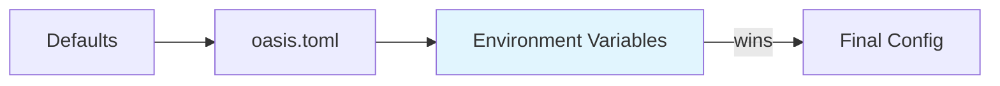

# Configuration

Oasis configuration follows a three-layer cascade:



**Defaults → TOML file → Environment variables.** Environment variables always win.

## Quick Setup

For Gemini with everything on defaults, you only need three env vars:

```bash
export OASIS_TELEGRAM_TOKEN="..."
export OASIS_LLM_API_KEY="your-gemini-key"
export OASIS_EMBEDDING_API_KEY="your-gemini-key"
```

## Loading

```go
// In cmd/bot_example/main.go:
cfg := LoadConfig("")              // loads from oasis.toml
cfg := LoadConfig("/path/to.toml") // loads from specific file
cfg := DefaultConfig()             // defaults only
```

The config file path can also be set via `OASIS_CONFIG` env var.

## Three LLM Model Strategy

Oasis uses three separately configurable LLM models:

| Role | Config | Default | Purpose |
|------|--------|---------|---------|
| **Chat** | `[llm]` | gemini-2.5-flash | Streaming conversational responses |
| **Intent** | `[intent]` | gemini-2.5-flash-lite | Intent classification + fact extraction |
| **Action** | `[action]` | (same as `[llm]`) | Agentic tool-use loop |

This separation lets you optimize cost: use a fast/cheap model for intent (runs every message), and a capable model for chat and tools.

## API Key Fallback

```
Intent: OASIS_INTENT_API_KEY → [intent].api_key → [llm].api_key
Action: OASIS_ACTION_API_KEY → [action].api_key → [llm].api_key
```

One API key works for everything if you use Gemini.

## Conditional Features

| Feature | Required Config | When missing |
|---------|----------------|-------------|
| Web search | `OASIS_BRAVE_API_KEY` | `web_search` tool not registered |
| Long-term memory | MemoryStore passed to App | Fact extraction disabled |
| Observability | `OASIS_OBSERVER_ENABLED=true` | No traces/metrics |

## Pages

- [Configuration Reference](reference.md) — all config sections, fields, and defaults
