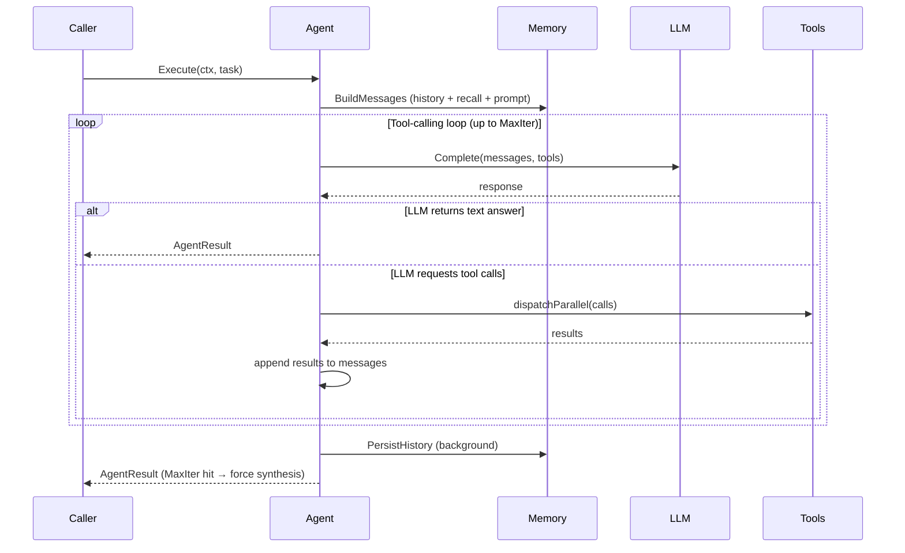
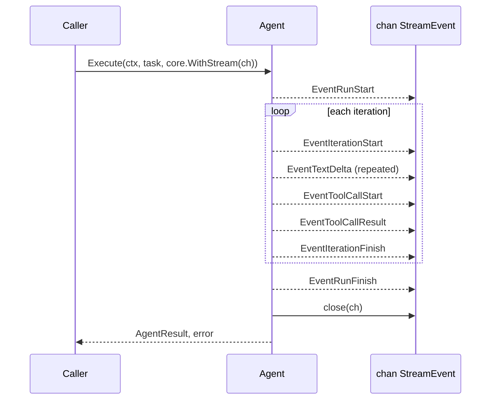

# Agent

## TL;DR

`LLMAgent` is one LLM paired with a set of tools, running in a loop until the model
produces a final answer. Build one in ten lines; add memory, streaming, or
human-in-the-loop as your needs grow.

---

## When to use it

- You need a single AI assistant that can call tools and produce text answers.
- You want streaming output delivered to a browser or terminal in real time.
- You need per-request knobs — different prompt, tool set, or iteration limit per
  user or tenant.
- You want the agent to pause mid-run and wait for human confirmation before
  proceeding.
- **Use `Network` instead** when you need multiple agents coordinated by a router LLM
  that decides which specialist to invoke.
- **Use `Workflow` instead** when you need a deterministic sequence of steps — a DAG
  where you control the execution order in code, not the LLM.

---

## Architecture



Reading the diagram in plain English: when you call `Execute`, the agent first loads
conversation history and any recalled memories from the store. It then enters a loop:
call the LLM, look at what came back. If the LLM produced a final text response, the
loop ends immediately and the result is returned. If the LLM requested tool calls
instead, all requested tools run in parallel, their results are appended to the
message history, and the loop runs again with the enriched history. History is
persisted to the store in a background goroutine after the loop exits, so it does not
block the caller.

If `MaxIter` iterations pass without a natural stop (default: 25), the agent makes
one final LLM call explicitly asking for a synthesis answer — a forced conclusion
rather than a silent truncation.

---

## Mental model

Think of `LLMAgent` as a **conversation manager with a job queue**. It holds a system
prompt, a list of tools the LLM can call, and resource limits. When you call
`Execute`, it creates a fresh conversation for that call — loads prior history from
the store if you provided a `ThreadID`, runs the loop, saves the result, and returns.
The agent struct itself carries no per-call state; it is safe to call `Execute`
concurrently from multiple goroutines.

The shape — loop + parallel tool dispatch — reflects a specific design choice. The
LLM is the decision-maker; the framework is the executor. Every iteration, the model
looks at everything it knows and decides what to do next. Parallelizing tool calls is
a performance optimization: if the LLM asks for three tools at once, running them
sequentially would triple the latency for no reason. The framework uses a bounded
worker pool (capped at `MaxParallelDispatch`, default 10) so a chatty model can't
spawn unbounded goroutines.

An `LLMAgent` composes upward. When used inside a `Network`, the router LLM delegates
to individual agents via `agent_*` tools — each agent runs its own loop inside a
single iteration of the network loop. When used inside a `Workflow`, the agent is a
step node that the DAG calls once and waits for. The agent has no knowledge of being
embedded; the Network/Workflow layer routes inputs and collects outputs.

From a developer's perspective: build one agent per role, not one agent for everything.
Narrow tools and a focused prompt make the LLM more reliable. Use `WithOverrides` to
handle per-request variation rather than spawning a new agent per user.

---

## How it works step by step

What happens when you call `agent.Execute(ctx, task)`:

1. **Build the initial message list.** `Memory.BuildMessages` assembles the system
   prompt, any pinned facts, semantically recalled memories, and the full conversation
   history for the given `ThreadID`. For suspend/resume calls this step is skipped —
   the snapshot messages are used directly.
2. **Emit `EventRunStart`** into the streaming channel (if `WithStream` is active).
3. **Enter the iteration loop** (`for i := 0; i < MaxIter; i++`).
4. **Run pre-processors.** Each registered `PreProcessor` runs in order. Any of them
   can mutate the request, halt with `*ErrHalt`, or pause with `Suspend(payload)`
   which surfaces as `*ErrSuspended` to the caller.
5. **Call the LLM.** The current message list and resolved tool definitions are sent
   to the provider via `Complete`. Text deltas stream into the channel as
   `EventTextDelta` events if streaming is on.
6. **Inspect the response.** If the model returned a `stop` finish reason with no
   tool calls, the loop ends and proceeds to step 10. If the model requested tool
   calls, continue to step 7.
7. **Dispatch tool calls in parallel.** `dispatchParallel` fans out all requested
   calls to a bounded worker pool. Each worker calls the tool's `ExecuteRaw` method,
   then emits `EventToolCallStart` and `EventToolCallResult` events.
8. **Run post-tool processors.** Each `PostToolProcessor` sees the tool result before
   it is appended to history. A post-tool processor can transform, redact, or block a
   result.
9. **Append results to history.** Tool results are added as `tool` role messages.
   The loop continues at step 4 with the extended message list.
10. **Finalize.** `EventRunFinish` is emitted with the `FinishReason`. The streaming
    channel is closed exactly once.
11. **Persist history in the background.** A goroutine saves the updated conversation
    history to the store (if memory is configured) without blocking the return.

If `MaxIter` is reached without a natural stop, the agent makes one additional
LLM call with an explicit instruction to produce a final answer. The result's
`FinishReason` is `FinishMaxIter`.

---

## Streaming

`Execute` accepts an optional `core.WithStream(ch)` run option that wires up a
channel. When passed, the agent emits `StreamEvent` values into that channel
throughout execution — you see text as it is generated rather than waiting for the
complete response. `Execute` always closes the channel before returning; do not close
it from the caller side.



The channel **must be buffered** (recommended: 64+).

For HTTP delivery, `ServeSSE` handles all the plumbing: it sets SSE headers, runs the
agent in a background goroutine, and flushes each event to the response writer.
`WriteSSEEvent` is available for custom SSE loops.

For multi-reader fan-out (multiple websocket connections, analytics sinks, logging),
use `Subscribe`. It runs the agent in a background goroutine, maintains a replay
buffer for late subscribers, and exposes typed callbacks:

```go
stream := oasis.Subscribe(ctx, ag, task)
stream.OnTextDelta(func(chunk string) { fmt.Print(chunk) })
result, err := stream.Result() // blocks until done
```

Structured output (set via `WithResponseSchema`) emits `EventObjectDelta` and
`EventObjectFinish` events in addition to text deltas.

---

## Scheduler / time-based execution

There is no built-in `Scheduler` type. Scheduling is a **store-level dispatch
pattern**: your application reads `core.ScheduledAction` records from a
`core.ScheduledActionStore` and calls `agent.Execute` on each due action.

`core.ScheduledActionStore` is an optional capability interface — stores that support
scheduling implement it, and callers discover it via type assertion.

```go
func runScheduler(ctx context.Context, store core.ScheduledActionStore, ag *agent.LLMAgent) {
    ticker := time.NewTicker(1 * time.Minute)
    defer ticker.Stop()
    for {
        select {
        case <-ctx.Done():
            return
        case <-ticker.C:
            actions, _ := store.GetDueScheduledActions(ctx, time.Now().Unix())
            for _, action := range actions {
                go func(a core.ScheduledAction) {
                    ag.Execute(ctx, core.AgentTask{
                        Input:    a.Description,
                        ThreadID: a.ID,
                    })
                }(action)
            }
        }
    }
}
```

Using `action.ID` as `ThreadID` gives each scheduled job its own memory thread so
previous run outputs are visible on the next execution.

---

## Common patterns and gotchas

**1. Tool dispatch is always parallel, not serial.**
When the LLM requests multiple tools in one response, they all run at the same time
via a bounded worker pool. If your tools share mutable state (a counter, a DB
transaction) you must protect it with a mutex — do not assume serial execution.

**2. `ToolResult.Error` is not a Go error.**
Business failures from a tool (city not found, API quota exceeded) go in
`ToolResult.Error` as a string. The LLM sees that string and can adapt. Returning a
Go error from `ExecuteRaw` signals an infrastructure failure — network down, timeout,
panic recovery. Mixing these up causes the LLM to receive no feedback on tool
failures, breaking the loop's ability to recover.

**3. History persistence runs in a background goroutine.**
After `Execute` returns, the updated history is still being written to the store.
Calling `Execute` again with the same `ThreadID` immediately is safe — the memory
layer handles ordering — but if you shut down the process immediately after
`Execute` returns you may lose the last turn's history. Allow the process to drain.

**4. Per-call overrides use `WithOverrides(opts)`.**
Pass `core.WithStream(ch)` for streaming, `agent.WithOverrides(&agent.RunOptions{...})`
for prompt/limits/tool overrides, and `core.WithDeadline(d)` for per-call time caps.
Passing `Tools: []core.AnyTool{}` (empty slice, not nil) replaces the tool set with
nothing — the LLM gets no tools for that call. Passing `Tools: nil` means "keep the
agent's configured tools."

**5. `ErrSuspended` holds a full message snapshot in memory.**
When `Execute` returns `*ErrSuspended`, the entire conversation history up to the
suspension point is captured in the closure. In a server environment, set a TTL
immediately after catching it (`suspended.WithSuspendTTL(5 * time.Minute)`) so
abandoned sessions do not leak memory indefinitely. Call `suspended.Release()` when
you know a user has left without resuming.

---

## Quick example

```go
package main

import (
    "context"
    "fmt"
    "os"

    "github.com/nevindra/oasis/agent"
    "github.com/nevindra/oasis/provider/gemini"
)

func main() {
    llm := gemini.New(os.Getenv("GEMINI_API_KEY"), "gemini-2.0-flash")

    ag := agent.New(
        "helper",
        "A general-purpose assistant",
        llm,
        agent.WithPrompt("You are a helpful assistant."),
    )

    result, err := ag.Execute(context.Background(), core.AgentTask{
        Input: "What is 12 × 7?",
    })
    if err != nil {
        panic(err)
    }
    fmt.Println(result.Output)
}
```

Line-by-line walkthrough:

1. `gemini.New(...)` — creates an LLM provider that speaks to Gemini over raw HTTP.
   No vendor SDK involved.
2. `agent.New(name, description, provider, ...options)` — builds the agent.
   Name and description are required; everything else is optional functional options.
   The umbrella package re-exports this as `oasis.NewAgent`.
3. `agent.WithPrompt(...)` — sets the system prompt sent to the LLM on every call.
4. `ag.Execute(ctx, task)` — runs the loop and blocks until done. No tools are
   registered here, so the LLM answers on the first iteration without calling
   anything.
5. `result.Output` — the final text the model produced. `result.Steps` would be empty
   here because no tools were called. `result.FinishReason` would be `FinishStop`.

---

## Next

- [API reference](./api.md)
- [Examples](./examples.md)
