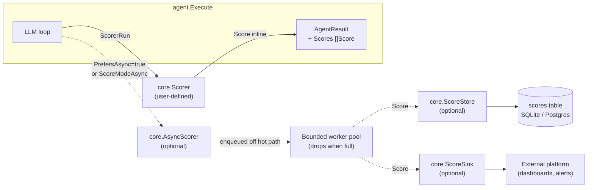

# Eval

## TL;DR

The eval system lets you attach quality scorers to an agent and collect scored results alongside every run. You define a scorer (or a fleet of them) by implementing `core.Scorer`; the framework handles sampling, execution scheduling, persistence, and fan-out — your scorer only needs to look at a `ScorerRun` and return a `Score`.

| Concept | What it means |
|---|---|
| **Scorer** | A user-supplied implementation of `core.Scorer` that examines a run and returns a quality signal in `[0, 1]` |
| **Score** | A `float64` value in `[0, 1]` plus a human-readable reason and optional structured details |
| **ScorerRun** | A read-only snapshot of the agent run (input, output, thinking, ground truth, tool steps, expected trajectory) passed to every scorer |
| **ScoreMode** | Whether a scorer runs inline (blocking), in a background worker pool (non-blocking), or let the framework choose automatically |
| **Sampling** | A fractional rate controlling how often a scorer fires on live traffic — test runs always score regardless |
| **ScoreStore** | An optional capability on both store drivers that persists `ScoreRow` records for later analysis |
| **ScoreSink** | An optional forwarding hook that streams each score to an external platform |

---

## Operational telemetry vs. quality evaluation

Oasis already provides operational telemetry via `AgentResult.Steps`, structured `slog` logs, and distributed OTEL traces. These answer *what happened* and *how long it took*.

The eval system answers a different question: *how good was the output?* Quality signals are inherently domain-specific — correctness, relevance, tone, citation accuracy, or trajectory faithfulness all require knowledge the framework cannot provide. The eval system therefore supplies the plumbing (scheduling, sampling, persistence, fan-out) and leaves the scoring logic to you.

---

## Architecture



The solid path is the hot path: sampling is checked first, then deterministic scorers run inline and their `Score` values are attached to `AgentResult.Scores` before `Execute` returns. The dotted path is the async path: scorers that implement `core.AsyncScorer` (or that are forced async via `ScoreModeAsync`) are enqueued into a bounded worker pool that runs off the hot path. Async scores post-date the return of `Execute` and go directly to the `ScoreStore` / `ScoreSink`; they do not appear in `AgentResult.Scores`.

---

## Hybrid execution model

Live scoring must not add latency to the agent hot path — that is the core constraint.

**Inline scoring** (the default for plain `core.Scorer` implementations) runs synchronously before `Execute` returns. It is appropriate for scorers that are cheap: regex matches, token counts, rule-based heuristics, embedding cosine similarity computed locally.

**Async scoring** runs in a bounded background worker pool that the framework manages. A scorer opts in by implementing `core.AsyncScorer` and returning `true` from `PrefersAsync()`. When the queue is full, the framework drops the work rather than blocking — this is a hard memory ceiling, not a soft preference. Dropped work is not retried. Async scores are persisted via `ScoreStore` and / or forwarded via `ScoreSink`; they never appear in `AgentResult.Scores` because they may not complete before the caller reads the result. The pool drains on `agent.Close`.

**`ScoreMode`** lets you override the default per scorer:

- `ScoreModeAuto` (default) — inline for plain `Scorer`, async for `AsyncScorer`.
- `ScoreModeInline` — force inline regardless of `PrefersAsync`.
- `ScoreModeAsync` — force background regardless of `PrefersAsync`.

A failing scorer — one whose `Score` method returns an error — never crashes the run. The error is logged and the scorer's result is omitted from `AgentResult.Scores` and the store. A low-quality output is a low `Value`, not an error.

---

## Sampling

Sampling controls what fraction of *live* traffic is scored. Set `Sampling.Rate` in the scorer's `ScorerConfig`:

- `Rate` in `(0, 1]` — scored that fraction of the time (e.g. `0.1` = 10 %).
- `Rate <= 0` — treated as always-on (`1.0`); every live run is scored.
- To stop scoring entirely, remove the scorer from `WithScorers` rather than setting `Rate` to `0`.

Test runs (source `ScorerSourceTest`) always score, regardless of `Rate`. This lets you run deterministic regression suites without sampling noise.

Sampling is checked before any scorer work begins, so the cost of evaluation is proportional to `Rate` on the hot path.

---

## Persistence via ScoreStore

`core.ScoreStore` is an optional capability, not part of the base `core.Store` interface. Both `store/sqlite` and `store/postgres` implement it — they grow a `scores` table when you call `Init`. Wire it in with `agent.WithScoreStore(s)`:

```go
s := sqlite.New("data/agent.db")
_ = s.Init(ctx)

a := agent.New("assistant", "Helpful assistant", provider,
    agent.WithScorers(myScorerConfig),
    agent.WithScoreStore(s),  // explicit — not auto-detected from WithStore
)
```

The store is **not** auto-detected from the agent's memory store in this release. You must pass it explicitly via `WithScoreStore`. This keeps the dependency optional and avoids surprising writes when you attach a `ScoreStore`-capable driver but do not want eval persistence.

After runs, query the store with `ListScores` to retrieve historical score data for analysis and dashboards.

---

## Built-in scorers

The `eval` package ships ready-made scorers — import `github.com/nevindra/oasis/eval`.

**Deterministic scorers** (inline by default; implement `core.Scorer`):

- `eval.ExactMatch()` — output equals ground truth (trimmed); ID `exact_match`
- `eval.Contains()` — ground truth is a substring of output; ID `contains`
- `eval.RegexMatch(re *regexp.Regexp)` — regexp matches output; ID `regex_match`
- `eval.KeywordCoverage(keywords ...string)` — fraction of keywords present in output (case-insensitive); ID `keyword_coverage`
- `eval.Completeness(elements ...string)` — fraction of required elements present (case-insensitive); ID `completeness`
- `eval.ContentSimilarity()` — token-set Jaccard overlap of output vs ground truth; ID `content_similarity`
- `eval.ToolCallAccuracy(expected ...core.ExpectedStep)` — fraction of expected tool calls (by name) found among actual tool calls; ID `tool_call_accuracy`
- `eval.Trajectory(expected core.ExpectedTrajectory)` — compares actual tool-call sequence to expected using `expected.Strategy` (`ExactMatch`/`OrderedSubset` → 1 or 0; `UnorderedSubset` → fraction); ID `trajectory`

**LLM-judge scorers** (each takes a `core.Provider`; each implements both `core.Scorer` and `core.AsyncScorer`, so they run async under `ScoreModeAuto`):

- `eval.AnswerRelevancy(provider)` — ID `answer_relevancy`
- `eval.Faithfulness(provider)` — ID `faithfulness`
- `eval.Hallucination(provider)` — ID `hallucination`
- `eval.AnswerSimilarity(provider)` — ID `answer_similarity`
- `eval.ContextPrecision(provider)` — ID `context_precision`
- `eval.ContextRelevance(provider)` — ID `context_relevance`
- `eval.Bias(provider)` — ID `bias`
- `eval.Toxicity(provider)` — ID `toxicity`
- `eval.PromptAlignment(provider)` — ID `prompt_alignment`
- `eval.ToolCallAccuracyLLM(provider)` — ID `tool_call_accuracy_llm` (distinct from deterministic `tool_call_accuracy`)
- `eval.TrajectoryLLM(provider)` — ID `trajectory_llm` (distinct from deterministic `trajectory`)
- `eval.Rubric(provider, criteria string)` — ID `rubric`

Custom scorers implementing `core.Scorer` directly are still fully supported and compose alongside the built-ins.

---

## Batch evaluation with RunEvals

`eval.RunEvals` drives any `core.Agent` over a `[]eval.EvalItem` dataset. It runs at bounded concurrency (default 4) and scores every item with `Source = ScorerSourceTest` (bypassing sampling). Agent run failures are recorded in `EvalResult.Err` and counted in `EvalReport.Failed` — they are not fatal to the batch. The function returns a non-nil error only on context cancellation.

The returned `EvalReport` contains per-scorer `Mean`, `Min`, `Max`, `P50`, and `P95` maps keyed by scorer ID, making it straightforward to gate CI on quality regressions:

```go
rep, err := eval.RunEvals(ctx, eval.RunEvalsConfig{
    Agent:   myAgent, // any core.Agent
    Data:    cases,   // []eval.EvalItem{{Input, GroundTruth, Context, Expected}}
    Scorers: []core.Scorer{eval.ExactMatch(), eval.Faithfulness(judgeProvider)},
})
if err != nil {
    log.Fatal(err)
}
if rep.Mean["faithfulness"] < 0.8 {
    log.Fatalf("faithfulness regressed: %.2f", rep.Mean["faithfulness"])
}
```

Retrospective scoring over stored runs and an external `ScoreSink` integration (such as Braintrust) are planned for a follow-up release (eval P2).

---

## Next

- [API reference](./api.md)
- [Examples](./examples.md)
