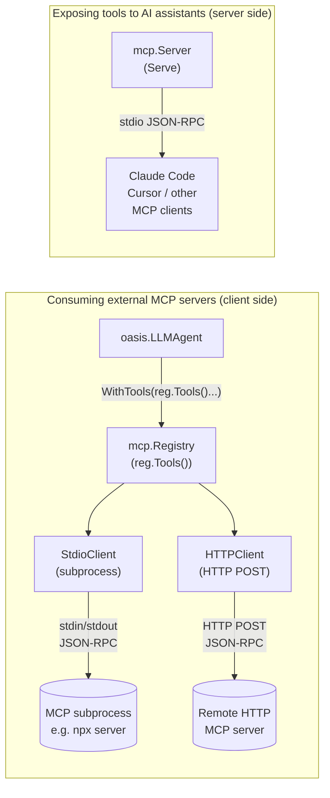

# MCP

## TL;DR

The `mcp` package is two things at once: a server you expose so AI assistants can call your tools, and a client system that lets your agents call into external MCP servers. A Registry manages a pool of client connections and surfaces them as ordinary Oasis tools — agents never know the difference.

| Concept | What it does | When you need it |
|---|---|---|
| **Server** | Stdio JSON-RPC 2.0 process that exposes tools/resources | You want Claude Code, Cursor, or another AI assistant to call your agent's tools |
| **StdioClient** | Spawns a subprocess and speaks MCP | Your agent needs to call a locally-installed MCP server (e.g. `npx @modelcontextprotocol/server-github`) |
| **HTTPClient** | Stateless HTTP/JSON-RPC client | Your agent needs to call a remote MCP endpoint |
| **Registry** | Pool of MCP connections; exposes them as `[]oasis.AnyTool` | You have multiple MCP servers and want to hand all their tools to an agent in one call |
| **Deferred schemas** | Advertise tools by name only; load input schemas on-demand | You have 20+ MCP tools and want to save context-window tokens |

---

## When to use server vs client vs registry

- **Server** — build an MCP server when you want to expose Oasis agent capabilities to the outside world: Claude Code slash-commands, IDE plugins, or any MCP-aware client.
- **Client (StdioClient / HTTPClient)** — use a client directly when you have a single MCP server to connect to and do not need auto-reconnect, connection pooling, or tool namespacing.
- **Registry** — use the Registry when you have two or more MCP servers, need automatic reconnect with exponential backoff, or want all tools from all servers merged into one slice for `agent.WithTools`.

---

## Transport types

### Stdio (subprocess)

The MCP server runs as a child process. Communication is newline-delimited JSON-RPC over the process's stdin/stdout. The client spawns the process with `exec.Cmd` and kills it on `Close`. This is the most common transport for locally-installed MCP servers.

### HTTP

The MCP server is a remote HTTP endpoint. Each method call (`initialize`, `tools/list`, `tools/call`) is an independent stateless POST. The client adds `Content-Type: application/json`, any extra headers you provide, and optional bearer token authentication. Per-request timeout is configurable; default is 30 seconds. The HTTP client is safe for concurrent use from multiple goroutines.

---

## The Registry pattern

The Registry is the high-level entry point for consuming multiple MCP servers. You register each server by config (`StdioConfig` or `HTTPConfig`), and the Registry:

1. Spawns or connects to the transport.
2. Runs the MCP initialize handshake.
3. Fetches the server's tool list.
4. Wraps each tool as an `oasis.AnyTool` with a namespaced name: `mcp__<serverName>__<toolName>`.
5. Returns the merged list via `reg.Tools()`.

Tools from the Registry are passed to an agent via `agent.WithTools(reg.Tools()...)`. The agent's tool-calling loop invokes them the same way it invokes any other Oasis tool — no special-casing required.

If a server disconnects, the Registry triggers automatic reconnection with exponential backoff (up to 10 attempts, 500 ms base delay, 30 s cap). Tools from the disconnected server remain in the list but return errors until reconnected.

Multiple agents can share a single Registry by passing `reg.Tools()` to each.

---

## Deferred schema loading

Tool input schemas are the largest per-tool token cost when sending a tool list to an LLM. With 30+ MCP tools, the schema block alone can consume thousands of context tokens on every request — most of them for tools the agent will never call in this turn.

Deferred schemas solve this: the Registry advertises each MCP tool by name and description only. Input schemas are loaded on-demand via the auto-injected `ToolSearch` tool. When the LLM wants to call an MCP tool it has not loaded yet, it first calls `ToolSearch(query="...")`, receives the schema, then calls the actual tool. This adds one extra LLM round-trip but saves all unloaded schema tokens.

**Break-even:** approximately 20 tools. Below 10 tools the extra round-trip is a net loss. Above 20 tools (typical for setups consuming several MCP servers) deferred schemas save 600–900 tokens per tool per request.

Enable it with `WithDeferredSchemas` on `NewRegistry`. Inject the mandatory system-prompt section with `DeferredToolsPromptSection()` so the model knows to use `ToolSearch` before calling deferred tools.

---

## Architecture

---

## Mental model

**Two personas, one package.** The `mcp` package wears two hats. As a server it makes your Oasis tools visible to the outside world — any MCP-aware AI assistant that supports the stdio transport can call them. As a client and Registry it pulls external tool ecosystems into your agent's tool list. You pick the hat (or wear both at once) based on what you are building.

**Registry as tool adapter.** From the agent's perspective, MCP tools are just `oasis.AnyTool` values with long namespaced names (`mcp__github__create_issue`). The Registry is the translation layer: it speaks MCP on one side and Oasis's tool interface on the other. Swap a server from stdio to HTTP by changing its config; the agent code does not change.

**Tool namespacing prevents collisions.** The `mcp__<serverName>__<toolName>` naming scheme ensures that two different MCP servers can both expose a tool named `search` without conflict. The `serverName` comes from `StdioConfig.Name` or `HTTPConfig.Name` — you choose it, so keep it short and slug-like.

**Deferred schemas are a context budget optimization.** The LLM sees tool names and descriptions on every request regardless. Schemas only flow when needed. Think of it as lazy-loading for tool metadata: you pay the round-trip cost exactly once per novel tool per agent session, not on every turn.

---

## How it works step by step

### Server path

1. **Construct the server.** Call `mcp.New("name", "1.0.0")`. The server reads from `os.Stdin` and writes to `os.Stdout` by default.
2. **Register tools and resources.** Call `s.AddTool` and `s.AddResource` for each capability. Registration must happen before `Serve`.
3. **Start serving.** Call `s.Serve(ctx)`. This blocks, scanning stdin line-by-line and dispatching JSON-RPC requests. Cancel the context to stop.
4. **AI assistant connects.** Any MCP-capable client (Claude Code, Cursor, etc.) runs your binary and speaks MCP over its stdio. The server responds to `initialize`, `tools/list`, and `tools/call` automatically.

### Client / Registry path

1. **Construct the Registry.** Call `mcp.NewRegistry(opts...)`.
2. **Register each server.** Call `reg.Register(ctx, StdioConfig{...})` or `reg.Register(ctx, HTTPConfig{...})`. Each call performs the handshake and tool fetch synchronously; it returns an error if the server is unreachable.
3. **Hand tools to the agent.** Pass `reg.Tools()` to `agent.WithTools`. The Registry's tool list is a snapshot — safe to pass at construction time.
4. **Agent calls MCP tools.** The agent's tool loop invokes an MCP tool; the Registry dispatches the call to the correct server's transport.
5. **Reconnect on disconnect.** If a transport fails, the Registry background-retries with jittered exponential backoff. Tools remain registered; calls during reconnection return errors.

---

## Common patterns and gotchas

- **Register before `Serve`.** `AddTool` and `AddResource` have no effect after `Serve` starts. Build the tool list first.
- **Tool names are namespaced.** The Registry wraps tool names as `mcp__<serverName>__<toolName>`. The short name you pass as `ToolDefinition.Name` in the MCP server becomes the suffix. Keep raw names lowercase with underscores.
- **`ToolFilter` Include and Exclude are mutually exclusive.** Setting both on the same `StdioConfig` or `HTTPConfig` causes `Register` to return an error.
- **Deferred schemas require a system prompt.** Without `DeferredToolsPromptSection()` in the agent's system prompt, the LLM will not know to call `ToolSearch` before calling a deferred tool.
- **Multiple agents share a Registry safely.** `reg.Tools()` returns a snapshot slice; concurrent reads and the reconnect goroutine are all protected by the Registry's internal mutex.
- **`BearerAuth.EnvVar` is preferred over literal tokens.** Setting `Token` directly works but keeps the secret in process memory as a plain string. `EnvVar` reads it from the environment at call time.
- **Internal server errors go to the logger.** Use `WithServerLogger` to redirect or suppress the server's diagnostic output (write failures, marshal errors). The default is `slog.Default()`.

---

## Next

- [API reference](./api.md)
- [Examples](./examples.md)
