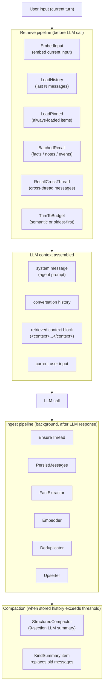
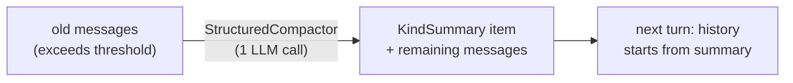

# Memory

## TL;DR

Memory gives an agent the ability to remember things — across turns in a single conversation, across completely separate sessions, and as structured facts the LLM can search on demand. Every layer is opt-in: an agent without memory config still works, and you add only the pieces you need.

---

## When to use it

- **Conversation history only** — you want the agent to remember what was said earlier in the same thread. Add `WithStore` and `WithMaxHistory`. No embedder needed.
- **Cross-thread recall** — the same user returns in a new session and you want the agent to surface what they said before. Add `WithSemanticRecall()` and `WithEmbedding`.
- **Structured items (facts, notes, events, playbooks)** — you want long-lived knowledge that outlives any single conversation. Add `WithEmbedding` and optionally `WithProvider` so the ingest pipeline can extract facts automatically.
- **Working memory** — the agent needs a writable scratchpad that persists across turns but can be overwritten freely. Add `WithWorkingMemory()`.
- **Compaction** — a thread is growing too long and you need the prompt to stay under the model's context window. Add `WithCompaction` (persistent) or `WithCompress` (in-memory), or both.
- **Not sure whether to use Memory or RAG?** Use Memory for conversation context — things a user said, facts about them, what happened in past sessions. Use RAG (the `rag` satellite) for document knowledge — PDFs, wikis, code that never changes based on conversation.

---

## Architecture



The retrieve pipeline runs synchronously before every `Execute` call. It embeds the current input, loads history from the store, pulls pinned items and batched recall hits, optionally fetches cross-thread messages, and trims to a token budget — all before the LLM sees anything.

The ingest pipeline runs in a background goroutine after the LLM responds. It saves the new messages, extracts structured items, embeds them, deduplicates, and writes to the store. The agent turn already returned to the caller before this finishes — ingest is eventual, not transactional.

Compaction fires inside the ingest path when stored history crosses a threshold fraction of the model's context window. The oldest messages are summarized into a single `KindSummary` item and replaced in the store.

---

## Mental model

Think of the memory system as three concentric layers, each building on the one inside it.

**Layer 1 — Conversation history (short-term).** The innermost and most common layer. Every user+assistant turn is saved to a `Store`. At the start of the next turn, the last N messages (controlled by `WithMaxHistory`) are loaded in order and placed into the prompt. This is the only layer that works without an embedder. It is also the only layer that *requires* a `ThreadID` on the task — without one, nothing is persisted.

**Layer 2 — Structured items (long-term).** The middle layer. After each turn the ingest pipeline can extract `MemoryItem` records — facts, notes, events, playbooks — from the conversation. These items persist across sessions and are indexed by embedding. On the next turn, the retrieve pipeline runs a vector search against them and injects the most relevant ones into the prompt as a `<context>...</context>` block. Pinned items skip scoring and always appear. This layer requires `WithEmbedding` and becomes significantly more useful with `WithProvider` (enables automatic fact extraction).

**Layer 3 — Cross-thread recall (episodic).** The outer layer. When `WithSemanticRecall()` is enabled, the retrieve pipeline also searches across *other threads* for the same `ChatID` and injects matching messages. This is how an agent remembers a user across separate sessions — not by loading every old conversation, but by surfacing the ones most similar to what the user just said.

**Working memory** is a special case inside Layer 2. It is a single `KindNote` item whose ID is deterministically derived from `(agentName, scope)`. Upserting it always overwrites the same row. Think of it as a sticky note the agent can rewrite each turn rather than accumulating a growing pile.

**Compaction** is orthogonal to the layers. It is a pressure valve: when stored history gets so long that loading it would overflow the model's context window, compaction replaces the oldest portion with a structured summary. The summary lands in the store as a `KindSummary` item and appears at the start of the history slice on the next load.

---

## How it works step by step

1. **`Execute` is called** with a `core.AgentTask` containing `ThreadID`, `ChatID`, and `Input`. If `ThreadID` is empty, the memory system is a no-op for this turn.
2. **`BuildMessages` starts the retrieve pipeline.** The current user input is embedded (if an embedder is configured) to produce a query vector.
3. **History is loaded.** The last `MaxHistory` messages for this `ThreadID` are fetched from the store in chronological order.
4. **Pinned items are loaded.** Any `MemoryItem` with `Pinned: true` matching the agent's scope is fetched unconditionally and added to the context block.
5. **Batched recall runs.** The query vector is used to search for relevant items by `Kind` (defaults to `KindFact`). Up to `RecallTopK` hits above the similarity threshold are included.
6. **Cross-thread recall runs** (if `WithSemanticRecall()` is enabled). The same query vector searches across all threads for the same `ChatID`, excluding the current thread. Hits above `SemanticRecallMinScore` are injected.
7. **Token budget trim runs** (if `WithMaxTokens` is set). If the assembled history exceeds the budget, messages are dropped — either oldest-first, or least-relevant-first when `WithSemanticTrimming()` is active. `WithKeepRecent(n)` always protects the N most recent messages from being dropped.
8. **The message slice is assembled** in order: system prompt → conversation history → retrieved context block (`<context>...</context>`) → current user input. The context block is a separate user message to preserve system-message cache hits.
9. **The LLM call is made.** The assembled messages are sent to the provider.
10. **`PersistTurn` is called in a background goroutine** (bounded to 16 concurrent slots). It runs the ingest pipeline: save both messages → run the default chain (fact extraction, embedding, dedup) → run any custom `IngestProcessor`s → upsert all candidates to the store.
11. **Compaction check runs inside ingest.** If the stored history length now exceeds `threshold × contextWindow` tokens, the `Compactor` is called on the oldest slice. The structured summary replaces those messages in the store as a `KindSummary` item.
12. **`Execute` returns to the caller.** Steps 10–11 may still be running. Call `agent.Memory().Close()` on shutdown to drain in-flight goroutines.

---

## Compaction

Compaction is the mechanism that keeps long-running threads from overflowing the model's context window. It fires automatically inside the ingest pipeline — you do not call it directly.

**What triggers it.** When `WithCompaction(compactor, threshold)` is configured, the ingest path checks whether the stored message count exceeds `threshold × contextWindow` after every turn. `threshold` is a float between 0 and 1; `0.80` is the recommended starting point.

**How it summarizes.** `compaction.NewStructuredCompactor(provider)` makes one LLM call with a fixed prompt that produces a 9-section structured summary: goals, work completed, decisions, open questions, next steps, active context, key artifacts, metadata, and a scratchpad (stripped before saving). If the thread already contains a prior compact, the prompt shifts to incremental mode — it preserves the prior summary by reference and focuses only on new material.

**Where the summary goes.** The summary is written to the store as a `KindSummary` item and the original messages it covers are removed. On the next turn, history loading finds the summary at the start of the slice and the subsequent messages after it — the LLM sees continuity without seeing every raw message.



**In-memory compression (`WithCompress`).** A lighter alternative that does not touch the store. If the in-memory message slice passed to `Execute` exceeds a rune threshold, a summarization function is called inline and the result replaces the old slice. This is useful for long single-session tasks when you have no store but still want to avoid context overflow.

Both can coexist: `WithCompress` handles the hot path (single session, no I/O), `WithCompaction` handles the long tail (multi-session threads).

---

## Common patterns and gotchas

**`ThreadID` determines persistence scope.** An `Execute` call without a `ThreadID` is stateless — nothing is read from or written to the store. If history isn't persisting, check that `ThreadID` is set on the task.

**Ingest is eventual, not transactional.** Structured items (facts, embeddings) are extracted and written in a background goroutine after the turn completes. If you call `Recall` immediately after `Execute` in a test, the item may not be there yet. Call `agent.Memory().Close()` to drain before asserting.

**Embedding cache.** The `embedding_cache.go` caches embeddings for identical texts within a session. If you are sending the same content repeatedly (e.g., a system preamble), the embedder is called only once. This is transparent — you do not configure it.

**Trim vs compact vs forget.** Trim (`WithMaxTokens`) drops messages from the *in-memory prompt slice* for one turn — nothing is deleted from the store. Compact (`WithCompaction`) permanently replaces old messages in the *store* with a summary. Forget (`mem.Forget(...)`) permanently deletes `MemoryItem` records. They target different things.

**Semantic recall needs an embedder.** `WithSemanticRecall()`, `WithSemanticTrimming()`, and `Recall()` all silently do nothing — or return an error — if no `EmbeddingProvider` is configured via `WithEmbedding`. Wire the embedder first; then add semantic features.

---

## Quick example

```go
import (
    "github.com/nevindra/oasis"
    "github.com/nevindra/oasis/memory"
    "github.com/nevindra/oasis/compaction"
)

// store implements memory.Store (e.g. store/sqlite or store/postgres).
// embedder implements core.EmbeddingProvider.

agent := oasis.NewLLMAgent("assistant", "helpful assistant", provider,
    oasis.WithMemory(
        memory.WithStore(store),
        memory.WithEmbedding(embedder),
        memory.WithMaxHistory(20),
        memory.WithSemanticRecall(),
        memory.WithCompaction(
            compaction.NewStructuredCompactor(provider),
            0.80,
        ),
    ),
)

result, err := agent.Execute(ctx, core.AgentTask{
    ThreadID: "user-abc-thread-1",
    ChatID:   "user-abc",
    Input:    "What did we decide about the API last time?",
})
```

What each option does:

- `WithStore(store)` — wires conversation history and item persistence. Use a satellite (`store/sqlite`, `store/postgres`) rather than implementing `memory.Store` yourself.
- `WithEmbedding(embedder)` — required for semantic recall, fact extraction, dedup, and semantic trimming. Omit if you only need raw history.
- `WithMaxHistory(20)` — load the last 20 messages per thread; default is 10.
- `WithSemanticRecall()` — surface relevant messages from the user's *other* threads, ranked by cosine similarity to the current input.
- `WithCompaction(compactor, 0.80)` — when stored history exceeds 80% of the model's context window, summarize the oldest portion into a structured compact.
- `ThreadID` and `ChatID` anchor the turn. `ThreadID` scopes the history; `ChatID` scopes cross-thread recall. Both must be set for the full feature set.

---

## Next

- [API reference](./api.md)
- [Examples](./examples.md)
