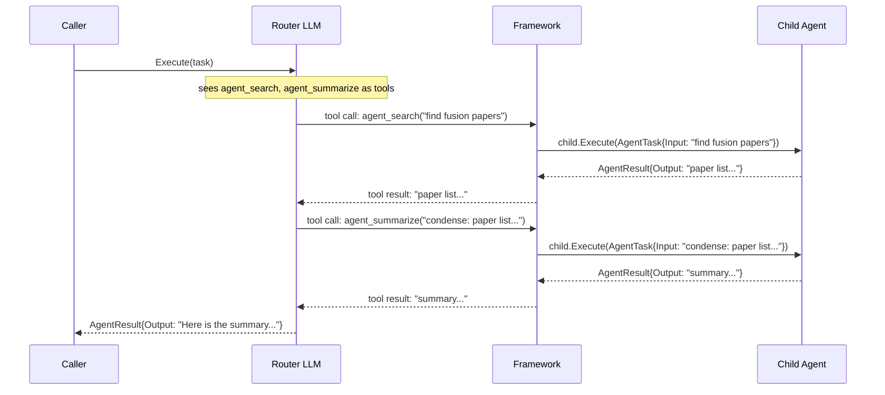
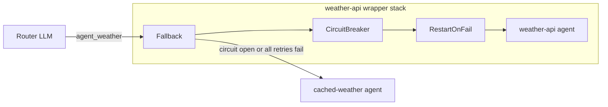

# Network

## TL;DR

A Network is a pool of specialized agents coordinated by an LLM router. Hand it a list of agents; when a task arrives, the router decides who to call, in what order, and how to combine their outputs — no hard-coded sequencing needed.

The key difference from Workflow: Workflow routing is compile-time (you write the DAG). Network routing is runtime (the LLM writes the DAG, turn by turn). Use Network when you cannot or do not want to predetermine the order of agent calls.

## When to use it

- **Multiple specializations, LLM-driven order** — you have a search agent, a summarize agent, a code-review agent, etc., and you want the model to pick the right one for each sub-task rather than fixing the sequence yourself.

- **Sequence unknown at compile time** — the exact call order depends on what the task turns out to need; a fixed DAG would be over-specified.

- **Fault tolerance on individual agents** — you need retries, fallback agents, or circuit breakers that fire at agent-call boundaries without touching your own code.

- **Composability** — a Network is itself a `core.Agent`, so it can be a child of another Network, or a step inside a Workflow.

**Use a single `LLMAgent` instead** when one model is enough — one provider, one system prompt, a set of tools.

**Use [Workflow](../workflow/index.md) instead** when the coordination logic is fixed and deterministic: a DAG you control at compile time, not LLM-driven at runtime. A Workflow is faster (no LLM routing overhead), easier to test (deterministic paths), and more auditable (the call sequence is visible in code). A Network is more flexible but introduces variance — the router may choose a suboptimal or unexpected path, especially with a weak system prompt or a poorly described child.

| | LLMAgent | Network | Workflow |
|---|---|---|---|
| Routing decisions | n/a (no sub-agents) | LLM at runtime | developer at compile time |
| Sub-agent calls | none | dynamic | static DAG |
| Fault tolerance | none built-in | supervisor policies | step-level error handling |
| Composable as Agent | yes | yes | yes |

## Architecture



The router LLM sits in the middle of a standard tool-calling loop. The children look exactly like tools from the router's perspective — each one is a callable named `agent_<name>`. The framework intercepts those calls, delegates to the real agent, and feeds the result back as a tool response. That loop repeats until the router emits a plain-text reply with no further calls.

The key thing the diagram shows: each child call is a full round-trip through the framework. The router does not stream directly to the child or share state with it. It constructs a text argument, the child executes in isolation and returns a text result, and the router continues with that text in its next context window.

One critical implication: the router holds its own conversation context that the children never see. Each child receives only the sub-task the router constructs for it and returns only its result. There is no shared message history between the router and its children.

## Mental model

**Children are tools.** At construction time, the framework generates one `core.ToolDefinition` per child agent. The tool name is `agent_<name>` and the description is the agent's description string — which is how the router LLM decides which agent fits a given sub-task. Good child descriptions are the single biggest lever on routing quality.

**Networks compose recursively.** Because `*network.Network` satisfies `core.Agent`, you can pass a Network wherever an agent is expected — including as a child of another Network. The outer router calls `agent_research` and has no idea that `research` is itself a network running a two-agent routing loop internally. Depth is invisible across levels. This is the same composability principle as Unix pipes: each component speaks the same `Agent` interface, so combining them requires no adapter code.

**Supervisor policies are construction-time wrappers, not call-time decorators.** When you call `network.WithSupervisor(RestartOnFail(2))`, the framework wraps each child agent in a `restartAgent` shim at the moment `New` runs. By the time `Execute` is ever called, the child stored in `n.agents["search"]` is already the wrapped version. The router calls `agent_search`; the framework dispatches to the wrapped agent; the supervisor logic (retry, fallback, circuit-break) fires inside the shim before any result reaches the router. The router sees a success or a final error — never the retry attempts.

**Dynamic spawning extends the tool list at runtime.** With `WithDynamicSpawning`, the router gains a `spawn_agent` tool. When it calls `spawn_agent`, the framework invokes your `ChildBuilder`, registers the new agent via `AddAgent`, and tells the router the new `agent_<name>` tool is immediately available. All subsequent `Execute` calls on the same Network see the new child. `AddAgent` and `RemoveAgent` are also available directly for programmatic membership changes — useful when you want to add or evict agents based on external signals (feature flags, load, availability).

**The router has its own config.** The router LLM is a full `LLMAgent` internally. `WithRouter(agent.WithMemory(...), agent.WithTracer(...))` passes `agent.AgentOption` values directly to the router's config, giving it its own memory, tracing, and logging — completely separate from the children. This means the router can accumulate cross-task memory (if you give it a memory backend) while the children remain stateless.

**Topology is inspectable.** `net.Topology()` returns a read-only snapshot of the Network's current graph: the root name, a `Node` per child (with its `NodeKind` — `"llm-agent"` or `"network"` — and the supervisor labels applied to it), and an `Edge` per child pointing from the root. This is useful for logging the structure at startup, driving visualization tooling, or writing assertions in tests. The snapshot is safe to call concurrently with `Execute`, `AddAgent`, and `RemoveAgent`, and subsequent membership changes do not mutate a previously returned `Topology`.

## How it works step by step

1. **Task arrives.** Caller invokes `net.Execute(ctx, core.AgentTask{Input: "..."})`. Any `core.RunOption` values (deadline, streaming channel, provider overrides) are parsed first.

2. **Span opens.** `ExecuteWithSpan` opens a trace span (if a tracer is configured on the router) and calls the inner run loop function.

3. **Tool list resolves.** The run loop calls `ResolveTools`. For a static network (no `WithDynamicSpawning`), this returns the pre-computed cached slice — rebuilt once at construction and again on every `AddAgent`/`RemoveAgent`. The slice contains one `agent_<name>` tool definition per child (in alphabetical order for deterministic prompts) plus any direct tools attached via `WithRouter`. For a dynamic network, the tool list is rebuilt on every `Execute` call to include any children spawned since last time.

4. **Router LLM call.** The router sends the task as the user message along with its system prompt and the resolved tool definitions to the provider. The provider returns a response with either a plain-text answer or one or more tool calls.

5. **Final answer path.** If the response is plain text with no tool calls, the loop exits immediately and `Execute` returns `AgentResult{Output: text}` to the caller.

6. **Tool call routing.** If the response contains a tool call, `makeDispatch` classifies it by name. A name beginning with `agent_` routes to `dispatchAgent`. The name `spawn_agent` (only available with `WithDynamicSpawning`) routes to `dispatchSpawn`. Any other name is dispatched to a direct tool registered on the router.

7. **Child lookup.** `dispatchAgent` strips the `agent_` prefix to recover the agent name, acquires a read lock, and looks up the child in the `agents` map. If no such child exists (possible if `RemoveAgent` was called mid-flight), an error result is returned to the router immediately.

8. **Streaming events.** If a streaming channel was passed to `Execute`, the framework emits `EventAgentStart` before calling the child and `EventAgentFinish` after. `EventAgentFinish` carries name, duration, and `core.Usage` (tokens consumed by the child's run).

9. **Child executes.** `child.Execute` runs — which may itself be another Network with its own routing loop, a leaf `LLMAgent`, or any `core.Agent` implementation. The parent has no visibility into what happens inside. The child inherits the parent context (so cancellation propagates), but has its own fresh conversation history.

10. **Result feeds back.** The child's `AgentResult.Output` string is returned to the router as the tool result for the call it made in step 4. The router appends this to its conversation context.

11. **Router continues.** The router processes the tool result and produces the next response — another tool call or the final plain-text answer.

12. **Loop repeats.** Steps 4–11 continue until the router produces a final answer, the context is cancelled, a deadline fires, or the router's configured maximum turn count is reached.

## Supervisor policies and fault tolerance

Supervisors wrap child agents at construction time. The router never interacts with a supervisor directly; it just calls `agent_<name>` and gets back a result (or an error if all policies are exhausted).



| Policy | What it does | When to reach for it |
|--------|-------------|----------------------|
| `RestartOnFail(n)` | Retries the child up to `n` times before propagating the error. | Transient failures — network blips, provider timeouts. |
| `Fallback(backup)` | On any error, runs `backup` and returns its result. | You have a cheaper or cached fallback path. |
| `Quorum(askN, majorityN, agents...)` | Runs `askN` agents in parallel; returns the output that at least `majorityN` agree on. | High-stakes answers where you want cross-validation. |
| `CircuitBreaker(threshold, cooldown)` | Opens after `threshold` consecutive failures; returns `ErrCircuitOpen` without calling the child until `cooldown` elapses. | Protecting against a child that is repeatedly failing and slowing the whole network. |
| `Chain(p1, p2, ...)` | Composes policies. Earlier policies wrap closer to the child; later ones wrap further out. | Combining retry + fallback, or circuit-breaker + fallback. |

Policies apply in two layers. `WithSupervisor(p)` applies `p` to every child. `WithSupervisorFor("name", p)` stacks additional policies on top for a specific child. Multiple `WithSupervisorFor` calls for the same name compose via `Chain` in registration order.

The diagram above shows the wrapper stack for a single child. Reading left to right is the call direction: the router reaches `Fallback` first. `Fallback` tries the inner stack (CircuitBreaker → RestartOnFail → real agent). If the circuit is open, `CircuitBreaker` returns `ErrCircuitOpen` immediately; `Fallback` catches that and calls `backupAgent` instead. If the circuit is closed but the real agent keeps failing, `RestartOnFail` retries up to its limit, then propagates the error up to `CircuitBreaker` which records another failure. When the threshold is reached the circuit opens.

The `Chain` policy makes explicit composition readable: `Chain(RestartOnFail(3), Fallback(backup))` is equivalent to `WithSupervisorFor("name", RestartOnFail(3))` followed by `WithSupervisorFor("name", Fallback(backup))` — earlier in the chain wraps closer to the real agent.

## Common patterns and gotchas

**Router context is separate from child context.** The router LLM accumulates a growing conversation history across its tool-calling loop. The children each receive a fresh `AgentTask` containing only the sub-task string the router constructed. If a child needs prior results, the router must pass them explicitly in the sub-task argument.

**Tool names are `agent_<name>`, exactly.** The router LLM calls children by this naming convention. If you need the router to prefer certain agents, make those agents' description strings more specific — the description is the only signal the router LLM uses to choose.

**Duplicate child names panic at construction.** `network.New` panics if two children share a name. This is intentional: a duplicate would silently overwrite the registered agent while adding a second identical tool definition to the router's tool list, causing unpredictable routing. Name your agents uniquely.

**Supervisors wrap at construction, not per-call.** Once `New` returns, the child stored in the network is already the wrapped version. Calling `WithSupervisor` after construction has no effect. To change policies at runtime, remove the child with `RemoveAgent` and re-add it with `AddAgent` (which re-applies the current policies).

**Dynamic spawning is unbounded by default.** `MaxChildren: 0` in `SpawnPolicy` means no cap. Set it to a reasonable limit in production — an unrestricted router can fill memory by creating thousands of agents across a long session.

**Nested Networks look opaque from outside.** When a `*Network` is a child of another Network, the outer router sees only `agent_research` (or whatever the inner network's name is). It calls that tool, gets a text result back, and has no knowledge that three more agent hops happened inside. This is intentional — composability without coupling. The implication is that `net.Topology()` on the outer network shows `KindNetwork` for the child but does not recurse into it. If you want the full tree, call `Topology()` on each nested network separately.

**The router description shapes behavior.** The Network's own description string (second argument to `New`) becomes the router's task context. The more precisely it describes when and how to coordinate children, the more predictable the routing becomes. Treat the network description as a lightweight system prompt for the coordinator role.

## Quick example

```go
import (
    "context"
    "fmt"

    "github.com/nevindra/oasis/agent"
    "github.com/nevindra/oasis/core"
    "github.com/nevindra/oasis/network"
)

var p core.Provider // e.g. gemini.NewProvider(...)

searchAgent    := agent.New("search",    "Searches the web for current facts", p)
summarizeAgent := agent.New("summarize", "Condenses a body of text",           p)

net := network.New(
    "coordinator",
    "Routes research tasks to search and summarize agents",
    p,
    network.WithChildren(searchAgent, summarizeAgent),
    network.WithSupervisor(network.RestartOnFail(2)),
)

result, err := net.Execute(context.Background(), core.AgentTask{
    Input: "Find and summarize recent breakthroughs in fusion energy",
})
if err != nil {
    panic(err)
}
fmt.Println(result.Output)
```

**Walkthrough:**

1. `agent.New` creates two leaf agents. Their second argument (the description) is what the router LLM reads to decide when to call each one — keep it precise.
2. `network.New` builds the router. `WithChildren` registers both agents; the framework produces tool definitions `agent_search` and `agent_summarize` automatically.
3. `WithSupervisor(RestartOnFail(2))` wraps both children in a retry shim at construction time. The router never sees retries — it just gets results.
4. `Execute` starts the routing loop. The router calls `agent_search` to gather facts, then calls `agent_summarize` on those facts, then returns the final answer in `result.Output`.
5. If either child fails, the retry shim fires up to two more attempts before the error propagates to the router.

## Next

- [API reference](./api.md)
- [Examples](./examples.md)
