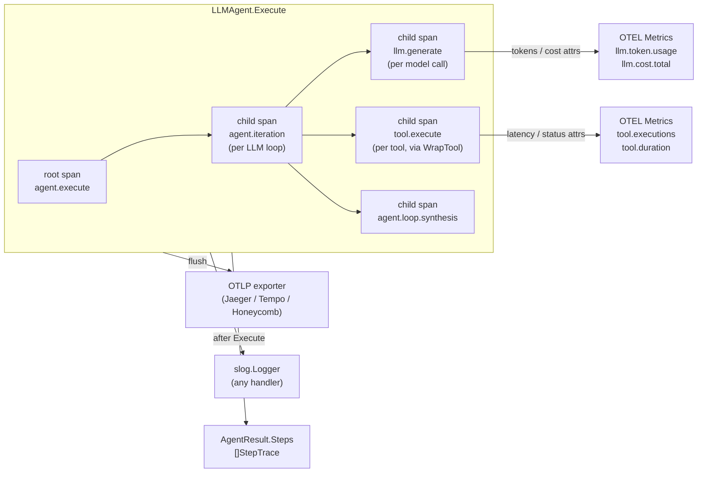
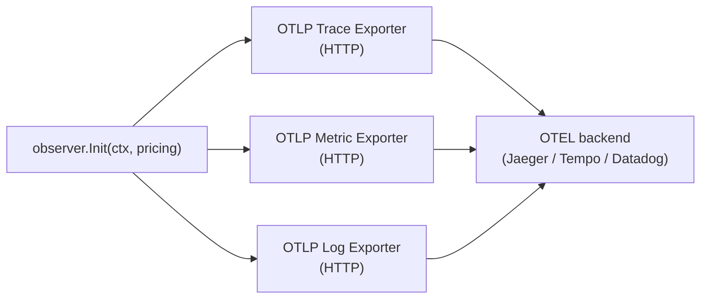

# Observability

## TL;DR

Oasis gives you two levers: structured logs via the standard `slog` package that
work with zero setup, and distributed traces via the `observer` satellite that
plug into any OpenTelemetry-compatible backend (Jaeger, Grafana Tempo, Honeycomb,
Datadog, etc.).

## When to use it

- **Use `WithLogger` (slog)** when you want lifecycle events in your existing log
  pipeline. No new infrastructure, no extra import beyond `log/slog`.
- **Use `AgentResult.Steps`** when you need per-tool timing and token counts
  after the run — always populated, no tracer required.
- **Use the `observer` satellite (OTEL)** when you need:
  - Distributed traces across a multi-agent or multi-service system.
  - Latency histograms for LLM calls and tool executions.
  - Cost tracking per model, per request, in a Grafana or Honeycomb dashboard.
  - A flame graph that shows exactly which call slowed a run down.
- **Use both** — `slog` + `WithTracer` — in production. They are independent; one
  does not replace the other.

## Architecture



Each `Execute` call opens a root span (`agent.execute`). Every LLM loop pass
becomes an `agent.iteration` child span with an `llm.generate` grandchild for the
actual model call. Tool dispatches become `tool.execute` spans when you use
`observer.WrapTool`. Final response assembly is `agent.loop.synthesis`.

Span context flows through the Go `context.Context` automatically. Sub-agents
spawned inside a tool call inherit the parent span, giving you a single trace tree
across the entire delegation chain.

`AgentResult.Steps` is a parallel, in-process view of the same run. It is
populated by the agent loop regardless of whether a `Tracer` is wired in — no
OTEL setup needed to read it.

## Mental model

**Layer 1 — slog (logs).** Every `LLMAgent` has a `*slog.Logger` wired in via
`WithLogger`. The agent emits structured key-value log records at key lifecycle
points: start, finish, errors, subagent calls. Because it is standard `log/slog`,
you can route output to any handler — JSON to stdout, cloud logging, tint for a
coloured terminal — without touching Oasis.

**Layer 2 — Tracer interface (spans).** `core.Tracer` is a two-method interface:
`Start` opens a span; `Span.End` closes it. The agent creates spans internally for
`agent.execute`, `agent.iteration`, `llm.generate`, and a few more. When
`WithTracer` is not called, the agent skips all span creation with a nil check —
no stub needed. You can implement `core.Tracer` yourself to send spans anywhere, or
use `observer.NewTracer()` for full OTEL.

**Layer 3 — AgentResult.Steps (in-process traces).** After every `Execute` call,
`result.Steps` holds a `[]StepTrace` — one entry per tool call or sub-agent
delegation. Each entry has the tool name, truncated input/output for display, raw
`json.RawMessage` bytes for unmarshalling, per-step token usage, and wall-clock
duration. This layer is always on; it costs no network, no config, no extra import.

**The observer satellite.** `observer` is an opt-in module with a full OTEL SDK
dependency. `observer.Init` sets up trace, metric, and log providers backed by
OTLP HTTP exporters. `observer.NewTracer()` wraps the global OTEL tracer into a
`core.Tracer`. `observer.WrapProvider` and `observer.WrapTool` add per-call spans
and metrics on top of any provider or tool without modifying them.

**Token and cost metadata.** Spans emitted by `WrapProvider` carry `llm.tokens.input`,
`llm.tokens.output`, `llm.tokens.cached`, and `llm.cost_usd` as attributes.
The same fields are mirrored into `StepTrace.Usage` for in-process access. You
can query cost in your backend by filtering the `llm.cost.total` metric on
`llm.model`.

## How it works step by step

1. `agent.Execute(ctx, task)` is called. The agent checks whether a `Tracer` was
   set via `WithTracer`.
2. If a tracer is present, `tracer.Start(ctx, "agent.execute", ...)` opens the
   root span. The returned context carries the span for all downstream calls.
3. The LLM loop begins. For each iteration, `tracer.Start(ctx, "agent.iteration")`
   opens a child span.
4. Before each model call, `tracer.Start(ctx, "llm.generate")` opens a grandchild
   span. If you are using `observer.WrapProvider`, a parallel `llm.chat_stream`
   span is emitted by the provider wrapper with token-count attributes.
5. The model responds. Token usage is read from the stream. If `WrapProvider` is
   used, `span.SetAttr` attaches `llm.tokens.input`, `llm.tokens.output`,
   `llm.tokens.cached`, and `llm.cost_usd`. The `llm.generate` span ends.
6. The agent decides to call a tool. `tracer.Start(ctx, "tool.execute")` is
   emitted by `observer.WrapTool` (if the tool was wrapped). Attributes include
   `tool.name` and the raw arg length.
7. The tool runs. On completion, the span records latency and `tool.status`
   (`"ok"`, `"tool_error"`, or `"error"`). The `tool.execute` span ends.
8. `buildStepTrace` constructs a `StepTrace` from the tool call and result. It is
   appended to the in-flight `[]StepTrace` slice regardless of OTEL state.
9. The loop continues until the model emits a final response. `agent.loop.synthesis`
   spans the assembly step.
10. All spans end. The OTEL SDK batches and flushes them to the OTLP exporter.
11. `AgentResult` is returned. `result.Steps` holds the full `[]StepTrace`.
    `result.Usage` holds aggregate token counts. Both are available with no OTEL.

## OTEL integration (observer satellite)

The `observer` package lives in `github.com/nevindra/oasis/observer` — a satellite
module with its own `go.mod`. Import it only when you need OTEL.



**Key functions:**

| Function | What it does |
|----------|-------------|
| `observer.Init(ctx, pricing)` | Starts trace, metric, and log OTLP exporters. Returns `*Instruments`, a shutdown func, and an error. Call shutdown before exit. |
| `observer.NewTracer()` | Returns a `core.Tracer` from the global OTEL provider. Call after `Init`. |
| `observer.WrapProvider(inner, model, inst)` | Wraps a `core.Provider` to emit `llm.chat_stream` spans and metrics. |
| `observer.WrapTool(inner, inst)` | Wraps a `core.AnyTool` to emit `tool.execute` spans and metrics. |
| `observer.WrapEmbedding(inner, model, inst)` | Wraps a `core.EmbeddingProvider` to emit `llm.embed` spans and metrics. |
| `observer.NewCostCalculator(overrides)` | Merges built-in pricing with caller overrides. Pass to `Init`. |

Configuration is entirely through standard `OTEL_*` environment variables —
`OTEL_EXPORTER_OTLP_ENDPOINT`, `OTEL_SERVICE_NAME`, etc. No code changes between
local dev (endpoint absent → no-op) and production.

## Common patterns and gotchas

**`WithTracer` and `WithLogger` are different concerns.** `WithTracer` controls
spans (distributed traces). `WithLogger` controls log lines. Using one does not
enable the other. In production you typically want both; omitting either has no
effect on the other.

**`AgentResult.Steps` is always populated.** Even with no `Tracer` and no OTEL
setup, `result.Steps` is filled after every `Execute` call whenever tools ran.
Use it for lightweight post-run audits without adding any dependency.

**`s.Input` / `s.Output` are display-only.** `StepTrace.Input` is truncated to
200 chars and `Output` to 500 chars. Do not `json.Unmarshal` them — truncation
may land inside a JSON value. Use `s.RawArgs` and `s.RawOutput` instead, or call
`result.ToolCalls()` / `result.ToolResults()`.

**Span naming conventions.** Agent-emitted spans use `agent.*` and `llm.*`
prefixes. Observer wrappers use `llm.chat_stream`, `tool.execute`, and `llm.embed`.
Custom spans you create should use your own namespace to avoid collisions (e.g.,
`myapp.preprocess`).

**Adding custom attributes.** After opening a span, call `span.SetAttr(...)` any
time before `span.End()`. Use the typed constructors — `core.StringAttr`,
`core.IntAttr`, `core.BoolAttr`, `core.Float64Attr` — so the OTEL backend
receives the correct attribute type rather than an `any`.

## Quick example

```go
import (
    "context"
    "fmt"
    "log/slog"
    "os"

    "github.com/nevindra/oasis/agent"
    "github.com/nevindra/oasis/observer"
)

func main() {
    ctx := context.Background()

    // --- OTEL setup (optional; skip this block for slog-only) ---
    inst, shutdown, err := observer.Init(ctx, observer.DefaultPricing)
    if err != nil {
        panic(err)
    }
    defer shutdown(ctx)
    _ = inst // inst is used when wrapping providers/tools

    // NewTracer reads from the global OTEL provider Init just configured.
    tracer := observer.NewTracer()

    // --- Agent wiring ---
    a := agent.New("assistant", systemPrompt, provider,
        agent.WithTracer(tracer),
        agent.WithLogger(slog.New(slog.NewJSONHandler(os.Stdout, nil))),
    )

    result, err := a.Execute(ctx, agent.AgentTask{Input: "summarise today's news"})
    if err != nil {
        panic(err)
    }

    // result.Steps is available regardless of OTEL setup.
    for _, s := range result.Steps {
        fmt.Printf("[%s] %s  dur=%s  tokens=%d\n",
            s.Type, s.Name, s.Duration,
            s.Usage.InputTokens+s.Usage.OutputTokens)
    }
}
```

Walk-through:
- `observer.Init` reads `OTEL_EXPORTER_OTLP_ENDPOINT` from the environment. When
  the variable is absent, spans go to the no-op provider silently — no error.
- `defer shutdown(ctx)` flushes in-flight spans and metrics before exit. Always
  defer it immediately after `Init`.
- `agent.WithTracer(tracer)` wires distributed tracing into the run loop. Every
  `Execute` call will emit `agent.execute`, `agent.iteration`, and `llm.generate`
  spans automatically.
- `agent.WithLogger(...)` takes any `*slog.Logger`. The agent emits structured
  events throughout the run; here they go to JSON on stdout.
- `result.Steps` is inspected after the call. `s.Type` is `"tool"` or `"agent"`.
  `s.Duration` is wall-clock time. `s.Usage` is per-step token counts.

## Next

- [API reference](./api.md)
- [Examples](./examples.md)
