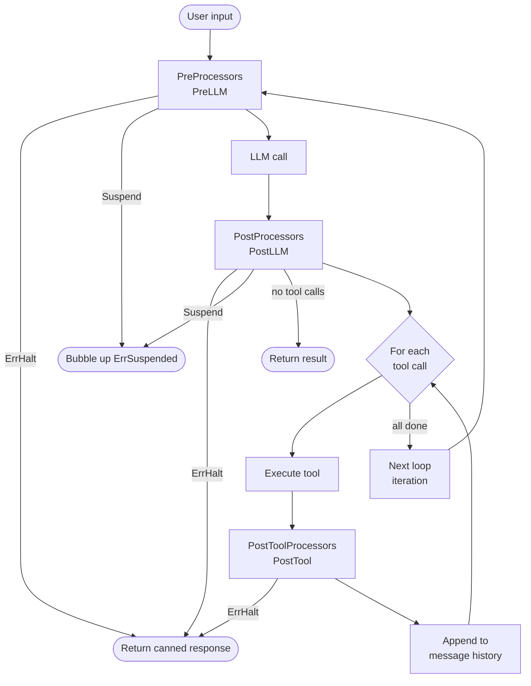

# Processors

## TL;DR

Processors are small hooks you attach to an LLM agent's run loop at three fixed
points — before the LLM call, after the response, and after each tool result.
They let you add safety checks, transformations, rate limiting, and human
approval without touching the loop itself.

## When to use them

- You need to **inspect or modify every LLM request** before it goes out
  (content filtering, token budgeting, context injection).
- You need to **inspect or modify every LLM response** before tools execute
  (tool call filtering, output length cap).
- You need to **intercept every tool result** before it enters message history
  (PII redaction, audit logging, result annotation).
- You need to **block or pause** the loop conditionally (guardrail halt, human
  approval gate).

**Processor vs other hooks:**

| Concern | Correct mechanism |
|---|---|
| Per-LLM-call safety / transform | Processor |
| LLM call retries (429, 503) | `oasis.WithRetry(provider)` |
| Request-rate and token-rate limiting | `provider.Chain(oasis.RateLimitMiddleware(oasis.RPM(n)))(base)` |
| Workflow step retries | `oasis.Retry(n, delay)` on the step |
| Distributed tracing / metrics | `observer` package (OTEL) |
| Post-run execution traces | `result.Steps` |

## Architecture



Every iteration of the agent loop passes through the same three hook points.
The `PreLLM` hooks run before the model sees the request — this is where
injection detection and content guards live. The `PostLLM` hooks run after the
model responds but before any tool is executed — this is where tool-call
filtering and approval gates live. The `PostTool` hooks run after each
individual tool result, before it is appended to the conversation — this is
where redaction and audit logging live.

At any hook point the processor can short-circuit (`*ErrHalt`), pause for human
input (`Suspend`), or simply pass through (`nil`). Control flows straight down;
no processor can jump backwards.

## Mental model

**Three distinct moments.** `PreLLM` owns the outbound request: the full message
history is available and mutable. `PostLLM` owns the inbound response: the LLM's
text and the list of tool calls it requested are both mutable. `PostTool` owns
the individual result of one tool execution before it enters history: the call
that triggered it is read-only, but the result text is mutable.

**One struct, many roles.** A single struct can implement any combination of the
three interfaces. If your PII redactor needs to scrub input, output, and tool
results, it implements all three — you register the same instance with all three
`With*` options and the chain dispatches it at each matching hook.

**Four outcomes at any hook.** Return `nil` to pass through. Modify the pointer
you received to change the data in place. Return `*ErrHalt{Response: "..."}` to
stop the loop immediately — the caller receives a clean `AgentResult` with that
string as the output and a nil Go error (no exception, no panic). Return
`oasis.Suspend(payload)` to pause the loop and surface a `*ErrSuspended` to the
caller, who can later call `Resume` to continue or `Release` to abandon.

**Guardrails are processors.** The built-in guards in the `guardrail`
package (`InjectionGuard`, `ContentGuard`, `KeywordGuard`, `MaxToolCallsGuard`,
`CostGuard`, `TokenBudgetGuard`, `RedactionGuard`) are ordinary structs that
implement the processor interfaces. There is no separate guardrail runtime. You
compose them with your own processors using the same registration options.

**HITL is Suspend.** Human-in-the-loop approval works through the same
`Suspend`/`Resume` mechanism. A `PostProcessor` calls
`oasis.Suspend(payload)` when it sees a dangerous tool call. The agent freezes,
preserving full conversation state. Your application code shows the pending
decision to a human, waits for their response, then calls
`suspended.Resume(ctx, responseBytes)` to continue from where it left off.

## How it works step by step

1. **Execute begins.** `agent.Execute(ctx, task)` (or `ExecuteStream`) starts
   the run loop. The system prompt and the new user message are assembled into
   the initial request.
2. **PreProcessors run in order.** Each registered `PreProcessor` receives a
   pointer to the `ChatRequest`. Processors run in the order they were passed
   to `WithPreProcessors`.
3. **ErrHalt check.** If any `PreProcessor` returns `*ErrHalt`, the loop stops
   immediately. `Execute` returns `AgentResult{Output: halt.Response}` with a
   nil error. Remaining processors are skipped.
4. **Suspend check.** If any `PreProcessor` returns `oasis.Suspend(payload)`,
   the agent captures the current message snapshot and returns `*ErrSuspended`
   to the caller. The loop is paused, not terminated.
5. **LLM call.** The (possibly modified) request goes to the provider. The
   response arrives as text content and zero or more tool calls.
6. **PostProcessors run in order.** Each registered `PostProcessor` receives a
   pointer to the `ChatResponse`. Same halt and suspend rules apply.
7. **No tool calls — loop ends.** If the LLM returned no tool calls, the loop
   terminates and `Execute` returns the final `AgentResult`.
8. **Tool execution begins.** For each tool call in the response (in order):
9. **Tool runs.** The framework dispatches the call to the matching `Tool`.
   Business failures go in `ToolResult.Error`; the Go error is reserved for
   infrastructure failures.
10. **PostToolProcessors run in order.** Each registered `PostToolProcessor`
    receives the (read-only) `ToolCall` and a pointer to the `ToolResult`. Halt
    and suspend rules apply here too.
11. **Result enters history.** The (possibly modified) tool result is appended
    to the message history.
12. **Loop iterates.** After all tool calls are processed, the loop goes back to
    step 2 with the updated history — until the LLM returns a final text
    response with no tool calls.

## Guardrails

Oasis ships seven guards in `github.com/nevindra/oasis/guardrail`. Each is
an ordinary processor; compose them with `WithPreProcessors`,
`WithPostProcessors`, and `WithPostToolProcessors` like any other. Import the
package directly — guardrail constructors are not re-exported from the root
`oasis` package.

| Guard | Hook | What it does |
|---|---|---|
| `InjectionGuard` | PreProcessor | Five-layer prompt injection detection: known phrases, role overrides, delimiter injection, base64 payloads, custom regex. Returns `*ErrHalt` on detection. |
| `ContentGuard` | Pre + Post | Rune-based input and output length limits (Unicode-safe). Zero for a limit disables that side. Returns `*ErrHalt` when exceeded. |
| `KeywordGuard` | PreProcessor | Case-insensitive substring and regex blocklist on user messages. Returns `*ErrHalt` on match. |
| `MaxToolCallsGuard` | PostProcessor | Trims the tool call list to the first N calls. Degrades silently — no halt. |
| `CostGuard` | Pre + Post | Per-run, per-model spend ceiling. Prices cumulative token usage against a pricing table and halts when the budget is exceeded. |
| `TokenBudgetGuard` | PreProcessor | Heuristic token-aware context trimming. Drops oldest non-system messages until the estimated token count fits the budget. Complements compaction (which summarizes; this trims losslessly). |
| `RedactionGuard` | Pre + Post + Stream | Deterministic regex redaction on input, output, and streamed deltas. Ships built-in presets for PII, secrets, and URLs. |

`InjectionGuard` runs a pre-pass (zero-width char stripping, NFKC
normalization) before its five layers. Layer 2 (role-override detection) can
produce false positives on content that contains `user:` at line start; use
`SkipLayers(2)` if needed.

### Cost guard

`CostGuard` prices the run's cumulative per-model token usage (accumulated by
the agent loop in the run context) against an injected pricing table and halts
when the total exceeds the ceiling. It never blocks blind: with no pricing table
it logs once and stays inactive. Unknown models cost 0 (fail open). The guard
acts at both `PreLLM` (to catch a resumed run already over budget) and `PostLLM`
(after each call).

```go
import (
    "github.com/nevindra/oasis/guardrail"
    "github.com/nevindra/oasis/provider/catalog"
)

guard := guardrail.NewCostGuard(5.0,
    guardrail.WithPricing(catalog.PricingMap()),
)
```

Pricing is injected explicitly via `WithPricing` to keep the `guardrail` package
free of any catalog dependency. `catalog.PricingMap()` returns a
`map[string]core.ModelPricing` from the static registry — no API calls needed.

### Token-budget guard

`TokenBudgetGuard` is the cheap, lossless complement to compaction. Compaction
summarizes; token-budget trimming drops entire messages (oldest first) until the
heuristic estimate fits the budget.

The default estimator is intentionally hot (~1 token per 3 runes, padded) so
the guard trims early rather than overflowing a provider context window. Plug in
a real tokenizer via `WithEstimator`. System messages and the N most recent
messages (`PreserveLast`) are always protected. Orphaned tool-result messages
(whose originating tool call was trimmed) are dropped automatically.

```go
guard := guardrail.NewTokenBudgetGuard(8000,
    guardrail.PreserveLast(2), // keep the 2 most recent messages
)
```

### Redaction guard

`RedactionGuard` applies deterministic, zero-cost regex redaction to request
messages, response content, and streamed text/thinking deltas. Three strategies:

- `StrategyRedact` (default) — replace each match with `[REDACTED:<kind>]`.
- `StrategyBlock` — halt the run (`*ErrHalt`) on first match.
- `StrategyWarn` — log the match, pass through unchanged.

Built-in presets (`"pii"`, `"secrets"`, `"urls"`) cover common patterns; add
custom rules with `RedactRule`. Control which side is inspected with
`RedactPhases` (`PhaseBoth`, `PhaseInput`, `PhaseOutput`).

```go
guard := guardrail.NewRedactionGuard(
    guardrail.RedactPresets("pii", "secrets"),
    guardrail.RedactStrategy(guardrail.StrategyRedact),
)
```

**Streaming redaction limitation:** `PostChunk` operates per-chunk and has no
cross-chunk state. A secret split across two consecutive deltas is not caught.
For guaranteed coverage of streamed output, complement streaming redaction with
a non-streaming `PostLLM` guard (or accumulate the full response before
inspecting it).

**Structured output limitation:** `PostChunk` covers `EventTextDelta` and
`EventThinking` deltas only. It does NOT redact `EventObjectDelta` or
`EventObjectFinish` snapshots from structured-output (ResponseSchema) responses.
Use a `PostProcessor` to redact structured output after the full response is
assembled.

## Streaming processor hook

`core.StreamProcessor` is an optional capability interface that runs on each
streamed text or thinking delta before it reaches the caller's channel. Guards
and custom processors opt in by implementing it.

```go
type StreamProcessor interface {
    PostChunk(ctx context.Context, ev *core.StreamEvent) (*core.StreamEvent, error)
}
```

Register streaming processors via `processor.Chain.AddStream`:

```go
chain := processor.NewChain()
chain.AddStream(myRedactionGuard) // runs on EventTextDelta and EventThinking
```

Or pass the guard directly to both the standard processor hooks and rely on the
agent's built-in chain wiring (see examples).

**Contract:** return the event (possibly mutated) to forward it, `nil` to drop
the chunk, or `*core.ErrHalt` to halt the stream. A halt at stream level emits
an `EventHalt` to the caller's channel but does **not** abort the in-flight LLM
call or stop billing — the model continues generating. For a hard halt that ends
the run, use a non-streaming `PostLLM` guard instead.

## `ask_user` multi-select

When `WithInputHandler` is configured, the LLM gains a built-in `ask_user`
tool. Set `multi_select: true` in the tool call to allow the user to choose
more than one option from the provided list. The result is returned to the LLM
as a JSON array.

```json
{
  "question": "Which topics should we cover?",
  "options": ["security", "cost", "performance", "scalability"],
  "multi_select": true
}
```

The `InputRequest` receives `MultiSelect: true`; the handler populates
`InputResponse.Values` (a `[]string`) with the selected items. The agent
marshals the values to a JSON array and returns it to the LLM as the tool
result.

See the [API reference](api.md) for all constructor options.

## HITL: Suspend and InputHandler

**Suspend** pauses the agent mid-loop. Call `oasis.Suspend(payload)` from any
`PreProcessor` or `PostProcessor`. The agent saves a snapshot of the current
conversation (bounded to 256 MB by default) and returns `*ErrSuspended` from
`Execute`. Nothing is lost — the snapshot holds the full message history up to
the pause point.

```go
result, err := agent.Execute(ctx, task)
var suspended *oasis.ErrSuspended
if errors.As(err, &suspended) {
    // present suspended.Payload to the human
    result, err = suspended.Resume(ctx, approvalBytes)
    // or, if abandoned:
    // suspended.Release()
}
```

A default TTL of 30 minutes applies to the snapshot. Override with
`suspended.WithSuspendTTL(d)`. Call `suspended.Release()` when you know the
suspend will never be resumed — this frees the captured memory immediately.

**SuspendProtocol[Req, Resp]** adds compile-time types to the
suspend/resume contract. Declare the protocol once at package level; use it at
both the suspension site (inside the processor) and the resume site (in your
application code). The compiler rejects mismatched types.

```go
var ApproveTransfer = oasis.NewSuspendProtocol[TransferReq, ApprovalResp](
    "billing.approve_transfer",
)
// Inside the processor:
return ApproveTransfer.Suspend(TransferReq{Amount: amount, To: account})
// In the caller:
req, _ := ApproveTransfer.PayloadFrom(suspended) // returns TransferReq
result, err = ApproveTransfer.Resume(suspended, ctx, ApprovalResp{Approved: true})
```

**InputHandler** is for synchronous human input that blocks within the same
request cycle. When you call `oasis.WithInputHandler(h)` on an agent, the LLM
gains a built-in `ask_user` tool it can call autonomously. Processors can also
call the handler directly via `agent.InputHandlerFromContext(ctx)` — useful for
approval-gate processors that want to route through the same channel instead of
suspending.

Use `Suspend` when the human is offline or the approval is asynchronous. Use
`InputHandler` when the handler can block and answer immediately.

## Common patterns and gotchas

- **Return the pointer, not the value.** `ErrHalt` is recognized by the agent
  loop via a pointer check. `return oasis.ErrHalt{...}` (value form) silently
  becomes a plain non-nil error — the loop treats it as an infrastructure
  failure, not a clean halt. Always write `return &oasis.ErrHalt{...}`.

- **Registration order is execution order.** Within a phase, processors run
  exactly in the order you pass them. Put safety checks first (`InjectionGuard`,
  `ContentGuard`) so they can block before any transformer runs. Put loggers last
  so they see the final state.

- **Rate limiting wraps the provider, not the processor list.**
  `RateLimitMiddleware` sits at the provider level and sleeps before the LLM
  call budget is exhausted. It is not a `PreProcessor`. Chain order matters
  (earlier middleware wrap later ones):
  `provider.Chain(agent.RetryMiddleware(), oasis.RateLimitMiddleware(oasis.RPM(60)))(base)`.

- **Suspend payload persistence is your responsibility.** The snapshot lives in
  memory. If your process restarts while a suspend is in flight, the
  `*ErrSuspended` is gone. For durable HITL workflows, serialize
  `suspended.Payload` to your own store before returning the response to the
  caller, and reconstruct the resume flow from there.

- **Processors must be safe for concurrent use.** Multiple agents can share the
  same processor instance. Do not store per-call state in the struct — use local
  variables inside the hook method, or protect shared state with a mutex.

## Quick example

```go
import (
    "github.com/nevindra/oasis"
    "github.com/nevindra/oasis/guardrail"
)

// A custom guardrail that blocks competitor mentions.
type CompanyGuard struct{}

func (g *CompanyGuard) PreLLM(_ context.Context, req *oasis.ChatRequest) error {
    for i := len(req.Messages) - 1; i >= 0; i-- {
        if req.Messages[i].Role == "user" {
            if strings.Contains(strings.ToLower(req.Messages[i].Content), "acme corp") {
                return &oasis.ErrHalt{Response: "I can't discuss competitors."}
            }
            break
        }
    }
    return nil
}

// Wire it up alongside a built-in guardrail.
agent := oasis.NewAgent("corp", "Corporate assistant", provider,
    oasis.WithPreProcessors(
        guardrail.NewInjectionGuard(), // built-in: runs first, blocks injection
        &CompanyGuard{},               // custom: runs second, blocks competitor mentions
    ),
    oasis.WithPostProcessors(
        guardrail.NewContentGuard(guardrail.MaxOutputLength(10_000)), // cap response length
    ),
)
```

Walkthrough: on every iteration, `InjectionGuard.PreLLM` runs first and
normalizes the input before checking for injection patterns. If it passes,
`CompanyGuard.PreLLM` checks the last user message for the blocked keyword. If
that passes, the LLM call proceeds. After the response arrives,
`ContentGuard.PostLLM` measures its rune length and halts if it exceeds 10,000
characters — the caller receives the canned message from `ContentGuard` instead
of the oversized output.

## Next

- [API reference](./api.md)
- [Examples](./examples.md)
