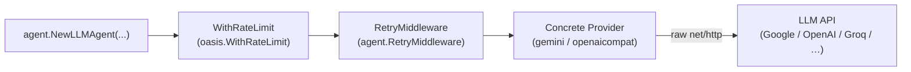

# Providers

## TL;DR

A provider is the thin HTTP adapter that connects Oasis to an LLM backend. You
give it an API key and a model name; it sends raw `net/http` requests and hands
back a `ChatResponse`. Oasis carries **no LLM vendor SDK** — every provider is a
handful of HTTP calls, keeping binaries small and vendor churn out of your build.

---

## When to use which

- **`provider/gemini`** — Google Gemini models: Flash, Pro, thinking variants,
  image generation, grounded search.
- **`provider/openaicompat`** — anything that speaks the OpenAI chat-completions
  API: OpenAI, Groq, Mistral, DeepSeek, Ollama (local), vLLM, LM Studio, Azure
  OpenAI. One constructor, any endpoint.
- **`provider/resolve`** — config-driven setup. Pass a `resolve.Config` and get
  back an `oasis.Provider` without importing both satellite packages. Good for
  apps that read provider names from env vars or config files.
- **`provider/catalog`** — runtime model discovery. Register API keys, list
  available models, validate a model ID before starting an agent, or create a
  provider by `"provider/model"` string.
- **`agent.RetryMiddleware`** — wrap any provider to retry on HTTP 429/503 with
  exponential backoff and jitter.
- **`oasis.WithRateLimit`** — enforce an RPM or TPM budget before requests leave
  your process, using a sliding 1-minute window.

---

## Architecture



The agent holds a single `oasis.Provider` reference — it does not know which
concrete implementation is behind it. That reference is usually a decorator
chain: the outermost layer enforces your rate budget (`WithRateLimit`), the
middle layer retries transient failures (`RetryMiddleware`), and the innermost
layer is the raw HTTP provider.

Order matters. `WithRateLimit` sits outside `RetryMiddleware` so that rate
limiting counts the first attempt, not every retry. Once streaming tokens start
flowing, `RetryMiddleware` stops retrying — you never get duplicate output.

---

## Mental model

**The `Provider` interface is the only contract.** It has two methods:
`ChatStream` writes `StreamEvent` deltas to a channel as the model streams, then
closes the channel and returns the final `ChatResponse`. `Name` returns a string
identifier used in logs. That is the entire surface. Swap the concrete type
behind the interface — same agent code, different model.

**Decorators compose.** `RetryMiddleware` and `WithRateLimit` both accept a
`Provider` and return a `Provider`. You stack them with `provider.Chain` or by
nesting calls. The result satisfies the same interface, so the agent cannot
tell — and does not care — how many layers are present.

**The catalog is a model registry.** `catalog.ModelCatalog` knows the base URLs
and static metadata for major platforms (Gemini, OpenAI, Groq, Mistral,
DeepSeek). You register API keys, and it merges live model availability from the
platform's API with that static data. Use it when you want to let users pick a
model at runtime, or to fail fast with a clear error when a model is
deprecated or missing.

**`resolve.Provider` is the import-lite path.** Importing both `provider/gemini`
and `provider/openaicompat` in every binary is unnecessary. `resolve.Provider`
reads a `Config.Provider` string and calls the right constructor internally.
Unknown providers fall back to OpenAI-compatible if you supply a `BaseURL`.

**Raw HTTP is a design principle, not a shortcut.** Vendor SDKs add transitive
dependencies, version drift, and surface area you don't control. A single
`net/http` POST is auditable in one file. Adding a new provider means writing
one file — no SDK to learn.

---

## How it works step by step

1. The agent assembles a `core.ChatRequest` — messages, tool definitions, any
   response schema, and per-request generation params.
2. It calls `provider.ChatStream(ctx, req, ch)` on whatever `oasis.Provider` it
   holds.
3. If the provider is wrapped with `WithRateLimit`, that decorator checks the
   sliding RPM/TPM window. If the budget is exhausted it blocks until a slot
   opens (or the context cancels).
4. The call passes to `RetryMiddleware`. On the first attempt it sets a flag:
   no tokens have been sent yet.
5. `RetryMiddleware` calls the inner (concrete) provider's `ChatStream`.
6. The concrete provider marshals `ChatRequest` into the wire format — either
   Google's `generateContent` JSON or OpenAI's `chat/completions` JSON.
7. It opens an HTTP POST to the API endpoint and begins reading the SSE or
   chunked stream.
8. For each delta (a text token, a tool-call fragment, a thinking token) it
   writes a `core.StreamEvent` to `ch`. The agent or caller reads from `ch`
   concurrently.
9. If an HTTP error arrives **before any tokens are sent**, `RetryMiddleware`
   checks whether it is transient (429 or 503). If yes, it backs off and
   retries from step 5. If tokens have already been sent, the error passes
   through immediately — no duplicate output.
10. Once the stream is complete, the concrete provider closes `ch` and returns
    a fully assembled `ChatResponse` (content, tool calls, usage counts, finish
    reason).
11. Decorators return. The final `ChatResponse` bubbles up to the agent.
12. The agent uses `resp.ToolCalls` to dispatch any tool calls and loop, or
    returns the result to the caller.

---

## Embedding providers

Chat and embedding are separate interfaces. `core.EmbeddingProvider` (re-exported
as `oasis.EmbeddingProvider`) has three methods: `Embed(ctx, texts)` returns one
`[]float32` vector per input text in input order; `Dimensions` returns the fixed
vector size; `Name` identifies the provider.

`core.MultimodalEmbeddingProvider` adds `EmbedMultimodal` for mixed text and
image inputs. Check for it with a type assertion at runtime — implementations
that also handle text-only satisfy both interfaces.

Both `provider/gemini` and `provider/openaicompat` ship embedding
implementations. Wrap them with `agent.WithEmbeddingRetry` for the same
retry behavior as chat providers. The `memory` and `rag` packages consume
`EmbeddingProvider` directly — you supply one at construction time.

```go
emb := gemini.NewEmbedding(apiKey, "text-embedding-004", 768)
retried := agent.WithEmbeddingRetry(emb, agent.RetryMaxAttempts(3))
```

---

## Common patterns and gotchas

**Streaming vs. non-streaming.** `ChatStream` is the only method on the
interface — there is no separate non-streaming call. For callers that only need
the final response and do not want to process deltas, use the `oasis.Chat`
convenience helper: it calls `ChatStream` internally, drains the channel, and
returns the assembled `ChatResponse`.

**Tool-calling wire format.** Gemini and OpenAI-compatible providers both support
tool calls, but they use different JSON shapes on the wire. Both providers
normalize to `core.ToolCall` in the response — your agent code does not need to
branch on provider type.

**`TopK` is Gemini-only.** Setting `GenerationParams.TopK` on an
OpenAI-compatible provider emits a warning and the field is ignored. Use
provider-specific options when you need behavior that only one side supports.

**Rate limits are proactive, not reactive.** `WithRateLimit` blocks before
sending a request that would exceed the budget. It does not wait for the
API to return a 429. Use it together with `RetryMiddleware` — the rate limiter
prevents most quota errors; the retry layer handles the ones that slip through.

**Catalog results are cached.** `ModelCatalog.List` and `ListProvider` cache live
API results for 1 hour by default. Pass `catalog.WithCatalogTTL` to change the
window, or `catalog.WithRefresh(catalog.RefreshNone)` to skip live calls
entirely and use only static metadata.

---

## Quick example

```go
package main

import (
    "context"
    "fmt"
    "os"
    "time"

    "github.com/nevindra/oasis"
    "github.com/nevindra/oasis/agent"
    "github.com/nevindra/oasis/provider/gemini"
)

func main() {
    // 1. Raw provider — speaks HTTPS to the Gemini API, no SDK involved.
    raw := gemini.New(os.Getenv("GEMINI_API_KEY"), "gemini-2.0-flash")

    // 2. Retry transient 429/503 errors: up to 5 attempts, 500ms base delay.
    retried := agent.WithRetry(raw,
        agent.RetryMaxAttempts(5),
        agent.RetryBaseDelay(500*time.Millisecond),
    )

    // 3. Rate-limit to 60 RPM and 100k TPM (outermost layer).
    llm := oasis.WithRateLimit(retried, oasis.RPM(60), oasis.TPM(100_000))

    // 4. The agent sees only oasis.Provider — not Gemini, not the decorators.
    ag := oasis.NewLLMAgent("assistant", "You are a helpful assistant.", llm)

    result, err := ag.Execute(context.Background(), oasis.AgentTask{Input: "Hello"})
    if err != nil {
        panic(err)
    }
    fmt.Println(result.Output)
}
```

`raw` is the concrete Gemini provider with default temperature (0.1) and top-p
(0.9). `retried` wraps it with retry — the agent never sees a 429 unless all
five attempts fail. `llm` adds the rate limiter on the outside so the budget
window covers successful calls only. The agent receives `llm` as a plain
`oasis.Provider`; swapping Gemini for Groq means replacing one line.

---

## Next

- [API reference](./api.md)
- [Examples](./examples.md)
