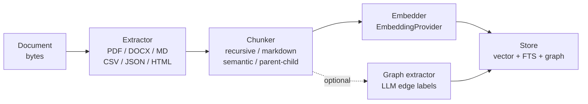
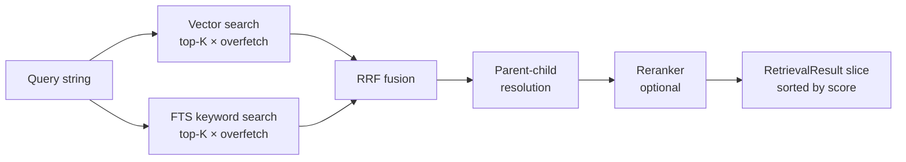

# RAG

## TL;DR

Retrieval-Augmented Generation (RAG) gives your agent long-term knowledge about your documents. You push files in once; the framework breaks them into chunks, turns each chunk into a vector, and stores everything. At query time the agent searches that store and hands the most relevant passages to the LLM as context — so the model reasons over your data, not its training weights.

## When to use it

- Your agent must answer questions about a private or frequently-updated document collection (internal wikis, product manuals, legal contracts, reports).
- You want the LLM to cite specific passages instead of hallucinating from training data.
- You have structured knowledge with conceptual links (prerequisite chains, "X elaborates Y") and want graph traversal on top of semantic search.
- **Not for conversation history.** That lives in `memory/`. RAG is document/knowledge retrieval only.
- **Not a replacement for fine-tuning.** RAG is better for factual recall over large, changing corpora; fine-tuning is better for style and behavior.

## Architecture

### Ingestion pipeline



### Retrieval pipeline



The ingestion pipeline runs once (or whenever documents change). The retrieval pipeline runs on every query. They are fully decoupled — you ingest from a batch job and query from a live request handler without any shared state.

The vector path finds semantically similar content even when the exact words differ. The FTS path catches precise keyword hits. RRF (Reciprocal Rank Fusion) merges them: a chunk that ranks high in both lists scores much higher than one that only tops one. The optional reranker then re-scores the merged set with a heavier model for final precision.

## Mental model

**Ingestion vs retrieval.** Think of ingestion as building an index and retrieval as querying it. `ingest.Ingestor` owns the write side; `rag.HybridRetriever` and `rag.GraphRetriever` own the read side. They share nothing except the `core.Store`.

**Chunks vs parents.** The default `StrategyFlat` embeds one level of evenly-sized chunks (512 tokens by default). `StrategyParentChild` embeds small child chunks (256 tokens) for precise vector matching, but links each child to a larger parent chunk (1024 tokens). At retrieval time the parent text is returned to the LLM — you get matching precision *and* richer context without doing anything extra in your retrieval call.

**Hybrid retrieval: why two searches?** Vector search finds "what is conceptually similar?" — it handles paraphrases, synonyms, and topic drift well but can miss exact terms. Full-text search finds "what contains these exact words?" — it excels on names, codes, and jargon. Neither alone is sufficient. RRF (constant k=60) fuses them by summing inverse-rank scores, so a document that appears in both lists rises to the top even if neither search ranked it #1 individually.

**Reranking refines.** After RRF you have a rough top-N. A reranker assigns a new relevance score to each candidate by reading the query and chunk text together. `ScoreReranker` is a zero-cost filter (drops below a threshold). `LLMReranker` asks the provider to score each candidate 0–10 — slower but highest precision. Both degrade gracefully: on failure the original order is returned, no error surfaced.

**Graph RAG follows relations.** When you enable `WithGraphExtraction`, the ingestor runs an LLM after chunking to label relationships between chunks — `references`, `elaborates`, `depends_on`, `contradicts`, `part_of`, `similar_to`, `caused_by`, `sequence`. These become edges in the store. `GraphRetriever` seeds from a normal vector search, then BFS-traverses those edges up to `MaxHops` hops. Each hop multiplies the score by a decay factor (`{1.0, 0.7, 0.5}` by default). This surfaces chunks a pure vector search would miss — for example "this section depends on a concept three chunks earlier."

## How it works step by step

### Ingestion

1. **Call `IngestFile` / `IngestText` / `IngestReader`.** The ingestor rejects content above `maxContentSize` (default 50 MB) immediately.
2. **Extract text.** The content type is inferred from the filename extension. The matching extractor runs: `PDFExtractor`, `DOCXExtractor`, `MarkdownExtractor`, `CSVExtractor`, `JSONExtractor`, `HTMLExtractor`, or `PlainTextExtractor`. Extractors that also implement `MetadataExtractor` return per-page metadata (page numbers, headings). The built-in `PDFExtractor` does pure-Go text extraction — ideal for clean, digital PDFs, but it has no OCR or layout reconstruction. For scanned pages, tables, or multi-column documents, register an external parser (liteparse, LlamaParse) via `WithExtractor` — see Recipe 8 in [examples.md](examples.md).
3. **Chunk.** The selected chunker splits the extracted text. `StrategyFlat` uses one chunker (auto-selected by content type; Markdown files get `MarkdownChunker`, everything else gets `RecursiveChunker`). `StrategyParentChild` splits into parents first, then each parent into children; only children get embeddings.
4. **Optional contextual enrichment.** If `WithContextualEnrichment` is set, the LLM prepends a 1-2 sentence context prefix to each chunk before embedding. The prefix anchors the chunk in the broader document, improving vector matching for noisy or ambiguous passages. On LLM failure the original text is used.
5. **Embed.** All chunks are sent to the `EmbeddingProvider` in batches of `batchSize` (default 64). The resulting vectors are stored alongside the chunk text.
6. **Optional graph extraction.** If `WithGraphExtraction` is set, chunks are sent in batches to an LLM which outputs a JSON edge list. Each edge has a `RelationType` and a confidence weight. Edges below `GraphExtractionConfig.MinEdgeWeight` are discarded. Setting `SequenceEdges: true` in the config adds free `RelSequence` links between consecutive chunks without any LLM call.
7. **Write to store.** The document record, chunk records (with embeddings and metadata), and edges are written to the store. If the store write fails the call returns an error; no partial state is committed.

### Retrieval

1. **Call `HybridRetriever.Retrieve(ctx, query, topK)`.** The retriever embeds the query string using the same `EmbeddingProvider` used at ingest time. (Use `RetrieveWithEmbedding` to skip this if you already have the vector.)
2. **Vector search.** The store is queried for the top `topK × overfetchMultiplier` (default 3x) chunks by cosine similarity. More candidates means better reranking quality later.
3. **FTS keyword search** (parallel with step 2). If the store implements `core.KeywordSearcher`, a keyword query runs in parallel for the same overfetched count. If not, this step is skipped silently — no error.
4. **RRF fusion.** Vector and keyword result lists are merged using Reciprocal Rank Fusion with `keywordWeight` (default 0.3) and `1 - keywordWeight` for vector. Items that appear in both lists score higher.
5. **Parent-child resolution.** For any chunk with a `ParentID`, the ingestor fetches the parent text and substitutes it. On failure the child text is returned instead.
6. **Reranking** (optional). If `WithReranker` is set, the merged list is passed to the reranker with the original `topK`. The reranker re-scores and trims.
7. **Score filter.** Results below `minRetrievalScore` are dropped. The final slice, sorted descending by score, is returned. Call `h.Sources()` to get the same results as `[]core.Source` for agent citation.

### Graph RAG

1. **Seed.** `GraphRetriever.Retrieve` runs an initial vector search for `SeedTopK` (default 10) chunks. Optionally, keyword results are also merged into the seed set when `SeedKeywordWeight > 0` in `GraphRetrieverConfig`.
2. **BFS traversal.** Starting from every seed chunk, the retriever loads outgoing edges from the store. If `Bidirectional: true` is set in the config, incoming edges are also traversed. Edges are filtered by `RelationFilter` and `MinTraversalScore`.
3. **Hop decay.** Scores of graph-discovered chunks are multiplied by `HopDecay[hop]` (e.g., 0.7 at hop 1, 0.5 at hop 2) and by the edge weight. This ensures seed chunks still outrank distant graph chunks unless those chunks are highly connected.
4. **Score blending.** Final score = `VectorWeight × vectorScore + GraphWeight × graphScore`. Defaults: 0.7 vector, 0.3 graph.
5. **Graph topK reservation.** If `GraphTopK > 0` in the config, that many result slots are reserved for graph-discovered chunks so seed chunks can't crowd them out.
6. **Rerank and return.** If `Reranker` is set in the config, the blended list is reranked before returning. Each `RetrievalResult.GraphContext` records the edge path that discovered the chunk (`FromChunkID`, `Relation`, `Description`).

## Common patterns and gotchas

**Chunk strategy choice.** `StrategyFlat` is the right default for most corpora. Switch to `StrategyParentChild` when you need better LLM context (the parent text is richer) but still want high retrieval precision. Use `SemanticChunker` for narrative prose where paragraph breaks don't align with topic shifts — but note it makes an embedding API call at ingest time.

**Embedding dimension must match.** The dimension of the embedding vector produced by your provider must match what the store's vector index was created with. Changing embedding providers after ingestion requires re-ingesting all documents.

**Graph extraction is LLM-heavy.** Each batch of 5 chunks (default `BatchSize`) makes one LLM call. For a 200-chunk document that is 40 LLM calls. Set `GraphExtractionConfig.Workers` to parallelize, `MinEdgeWeight: 0.5` to drop noise, and `SemanticBatching: true` to group topically similar chunks for better edge quality. Free `RelSequence` edges via `SequenceEdges: true` in the config cost nothing.

**Reranker timeout.** `LLMReranker` has a default timeout of 2 minutes. For latency-sensitive paths set `WithRerankerTimeout(15 * time.Second)` and let it degrade gracefully (original order returned on timeout).

**`Sources()` race.** `HybridRetriever.Sources()` returns the sources from the most recently completed `Retrieve` call. It is not safe to call concurrently with another `Retrieve` — each concurrent caller may observe interleaved updates. Consume sources before the next retrieval.

## Quick example

```go
import (
    "context"
    "fmt"
    "os"

    "github.com/nevindra/oasis/ingest"
    "github.com/nevindra/oasis/rag"
)

ctx := context.Background()

// Ingest once (e.g., at startup or in a batch job).
ing := ingest.NewIngestor(store, embeddingProvider,
    ingest.WithStrategy(ingest.StrategyParentChild), // child embeds, parent returned
    ingest.WithGraphExtraction(llmProvider, ingest.GraphExtractionConfig{
        SequenceEdges: true,   // free sequential links, no extra LLM calls
        MinEdgeWeight: 0.5,    // discard low-confidence edges
    }),
)

data, _ := os.ReadFile("handbook.pdf")
result, err := ing.IngestFile(ctx, data, "handbook.pdf")
if err != nil {
    panic(err)
}
fmt.Printf("doc %s: %d chunks stored\n", result.DocumentID, result.ChunkCount)

// Retrieve at query time.
retriever := rag.NewHybridRetriever(store, embeddingProvider,
    rag.WithMinRetrievalScore(0.4),      // drop weak matches
    rag.WithOverfetchMultiplier(4),      // fetch 4x candidates before scoring
    rag.WithReranker(rag.NewScoreReranker(0.4)),
)

results, err := retriever.Retrieve(ctx, "What is the refund policy?", 5)
if err != nil {
    panic(err)
}
for _, r := range results {
    fmt.Printf("[%.2f] %s\n", r.Score, r.Content[:120])
}
```

**Walkthrough:**

- `NewIngestor` registers all built-in extractors automatically. The `.pdf` extension routes to `PDFExtractor`. `StrategyParentChild` stores two chunk levels; only children are embedded.
- `IngestFile` runs the full pipeline (extract → chunk → embed → store → graph) in one call. No intermediate steps to manage. `result.ChunkCount` includes both parent and child chunks.
- `NewHybridRetriever` detects whether the store supports FTS (`core.KeywordSearcher`) and enables keyword search automatically if so.
- `WithOverfetchMultiplier(4)` fetches 20 candidates for a `topK=5` call. The `ScoreReranker` then drops anything below 0.4 and trims to 5.
- Each `RetrievalResult` carries the parent text (because `StrategyParentChild` was used), a score in [0, 1], and document provenance fields (`DocumentID`, `DocumentSource`, `DocumentTitle`).

## Next

- [API reference](./api.md)
- [Examples](./examples.md)
