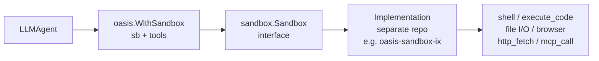

# Sandbox

## TL;DR

A sandbox is an isolated container your agent controls via a Go interface — it can
run shell commands, execute code, read and write files, and drive a real browser
without touching the host machine. Oasis defines the interface and the tool wrappers;
a separate implementation repo wires up the actual container runtime.

---

## When to use it

- Your agent needs to run untrusted code (Python, Bash, JavaScript) safely.
- Your agent needs a real browser — scraping, form interaction, screenshots, PDF export.
- You want file operations (read, write, glob, grep) isolated from your server.
- You need to call MCP tools that run inside the container, not on the host.
- You're building a coding assistant, data-analysis pipeline, or research agent that
  needs a full OS environment.

**When you do NOT need a sandbox:** if your agent only calls well-defined APIs you
control and processes text, skip the sandbox. Container spin-up adds 1–3 s and
requires a Docker-compatible runtime. Use `tools/http` or your own `AnyTool`
implementations instead.

**Sandbox vs. HTTP tool:** use `http_fetch` (included in the sandbox tool set) for
simple GET requests. Use the browser stack (`browser` + `page_text`) when the target
site blocks plain HTTP or requires JavaScript rendering. The sandbox gives you both
in one place; a plain HTTP tool gives you neither.

---

## Architecture



`WithSandbox` does two things: it stores the sandbox reference on the agent and
registers the tool list the LLM can call. The `sandbox.Sandbox` interface is the
contract — it lives in `github.com/nevindra/oasis/sandbox`. The implementation
(container provisioning, Docker networking, health checks) lives in a separate repo;
you import it once and inject it everywhere.

`sandbox.Tools(sb)` is the bridge. It wraps every method of `Sandbox` into an
`oasis.AnyTool` the LLM can call by name — `shell`, `execute_code`, `file_read`,
`browser`, and so on. The agent never speaks directly to the container; it invokes
tools, and the tools call the interface.

---

## Mental model

**The interface is the contract.** `sandbox.Sandbox` defines every operation an
agent can perform: shell, code execution, file I/O, browser control, HTTP fetch,
web search, and MCP dispatch. The framework core holds only a minimal `core.Sandbox`
stub (a single `Close() error` method) so the agent configuration has a typed field
without pulling in the full satellite package and its dependencies.

**Implementations are pluggable.** You swap runtimes by changing one import. The
rest of your code works against the interface. `oasis-sandbox-ix` uses Docker;
another implementation could use Firecracker, gVisor, or a remote API — none of that
changes the agent code.

**`Tools()` exposes capability as agent tools.** `sandbox.Tools(sb)` returns 19
`oasis.AnyTool` values (20 when a writable mount or `FileDelivery` is configured).
Pass them to `WithSandbox` and the LLM sees them in its tool schema on every call.
You can restrict the set by passing a subset, but the default is all capabilities.

**Lifecycle is manager-owned, not caller-owned.** `Manager` provisions containers,
tracks them by `SessionID`, enforces a concurrency cap, and runs a TTL reaper that
destroys expired sandboxes automatically. `sb.Close()` releases Go-side resources
only (open handles, connections) — it does not stop or remove the container.
Container teardown is `Manager`'s job.

**Mounts let you move data in and out.** By default, everything written inside the
sandbox is ephemeral. A `MountSpec` attaches a `FilesystemMount` backend (S3, GCS,
local disk — anything you implement) at a sandbox path. Input mounts prefetch files
into the container before the agent runs. Output mounts publish files to the backend
at session end. The `Manifest` tracks backend versions to prevent overwrites on
concurrent sessions.

---

## How it works step by step

1. Create a `Manager` (e.g., `ix.NewManager(ix.DefaultConfig())`) once per process.
   It owns the Docker daemon connection and enforces concurrency limits.

2. For each agent session, call `mgr.Create(ctx, sandbox.CreateOpts{SessionID: ...})`.
   The manager provisions a container, runs a health check, and blocks until it passes.
   `SessionID` is your conversation or request ID — use it later to retrieve or destroy
   the same sandbox via `mgr.Get(sessionID)` or `mgr.Destroy(ctx, sessionID)`.

3. Optionally, call `sandbox.PrefetchMounts(ctx, sb, mounts, manifest)` to copy
   backend files into the container before the agent starts (readable mounts with
   `PrefetchOnStart: true`).

4. Call `sandbox.Tools(sb, opts...)` to get the agent tool list. Pass
   `sandbox.WithMounts(specs, manifest)` if you want `file_write` and `file_edit`
   calls intercepted and published to the backend automatically.

5. Call `oasis.WithSandbox(sb, tools...)` to wire the sandbox and its tools onto the
   agent. Both the sandbox reference and the tool list are stored in the agent config.

6. The agent runs. The LLM sees all sandbox tools in its schema and calls them —
   `shell`, `file_write`, `browser`, etc. — as part of its normal tool-use loop.

7. Each tool call dispatches through the `Sandbox` interface to the container.
   Results (stdout, file content, page text, search results) come back as `ToolResult`
   values and are fed to the LLM on the next iteration.

8. If a `file_write` or `file_edit` call lands under a writable mount path, the tool
   wrapper publishes the file to the backend immediately — no manual flush needed.

9. At session end, call `sandbox.FlushMounts(ctx, sb, mounts, manifest)` to catch any
   files written via `shell` that bypassed the tool interceptors.

10. Call `sb.Close()` to release Go-side resources.

11. The TTL reaper inside the manager destroys the container when its TTL expires —
    even if the agent is still active. Set a conservative TTL as a safety valve.

12. To shut down cleanly, call `mgr.Shutdown(ctx)` (drains in-flight work, keeps
    containers for recovery) or `mgr.Close()` (force-destroys all containers).

---

## Mounts and lifecycle

### Input mounts (prefetch)

Set `Mode: sandbox.MountReadOnly` and `PrefetchOnStart: true` on a `MountSpec` to
copy backend files into the container before the agent runs. Call `PrefetchMounts`
once, after `Create` and before the agent executes. The manifest records each file's
backend version so any future writes use the correct optimistic-concurrency precondition.

Use `Include` and `Exclude` glob patterns to limit which files are copied. Without
them, every key under the backend prefix is fetched.

### Output mounts (flush)

Set `Mode: sandbox.MountWriteOnly` and `FlushOnClose: true` to publish sandbox files
to a backend at session end. `FlushMounts` scans the mount path, compares local files
to the manifest, and uploads new or changed files. Tool interceptors handle
`file_write` and `file_edit` calls immediately; `FlushMounts` catches anything else
written via `shell`.

Set `MirrorDeletes: true` only when the backend should mirror the exact sandbox state
— it will delete backend keys for files the agent removed locally. Off by default.

### TTL behavior

`CreateOpts.TTL` is a hard wall-clock limit. The container is destroyed when it
expires regardless of in-flight work. Zero means the manager's configured default.
Use a short TTL (e.g., 5 minutes) for one-shot tasks; longer (e.g., 30–60 minutes)
for interactive sessions. The TTL reaper runs as a background goroutine inside the
manager — you do not need to poll or schedule cleanup yourself.

---

## Common patterns and gotchas

**Import the implementation, not just the interface.** `github.com/nevindra/oasis/sandbox`
gives you the interface, types, and `Tools()`. It does not give you a working
container. You must import a concrete implementation such as
`github.com/nevindra/oasis-sandbox-ix` and pass it wherever `sandbox.Manager` or
`sandbox.Sandbox` is expected.

**Do not call `sb.Close()` to stop the container.** `sb.Close()` releases Go-side
resources only. The container keeps running until the TTL fires or you call
`mgr.Destroy(ctx, sessionID)`. To tear down a session eagerly, call `Destroy`.

**`SessionID` determines session identity.** Two calls to `mgr.Get(sameID)` return
the same sandbox — they share the container filesystem. Use unique IDs per
conversation or isolated task unless intentional sharing is the goal.

**Resource limits are declarations, not Go enforcement.** `ResourceSpec` values (CPU,
memory, disk) are passed to the container runtime. The Go layer does not enforce them.
Keep the defaults (`ResourceSpec{}`) unless you have a measured reason to increase them.

**MCP tools run inside the container.** `mcp_call` dispatches to an MCP server
started inside the container by the implementation's config. The LLM passes `server`,
`tool`, and `args`; the sandbox routes the call to the correct in-container server.
No extra Go wiring is required — `sandbox.Tools(sb)` includes `mcp_call` automatically.

---

## Quick example

```go
import (
    "context"
    "log"
    "time"

    oasis "github.com/nevindra/oasis"
    "github.com/nevindra/oasis/sandbox"
    ix    "github.com/nevindra/oasis-sandbox-ix" // implementation
)

func main() {
    ctx := context.Background()

    // One manager per process — owns the Docker connection and concurrency limit.
    mgr := ix.NewManager(ix.DefaultConfig())
    defer mgr.Close()

    // Provision a container for this session. Blocks until health check passes.
    sb, err := mgr.Create(ctx, sandbox.CreateOpts{
        SessionID: "session-abc",
        TTL:       30 * time.Minute,
    })
    if err != nil {
        log.Fatal(err)
    }
    defer sb.Close() // releases Go-side resources; container lifecycle is manager-owned

    // Wrap the sandbox as agent tools and attach to the agent.
    agent := oasis.NewLLMAgent(
        "coder", "You are a coding assistant.",
        provider,
        oasis.WithSandbox(sb, sandbox.Tools(sb)...),
    )

    result, err := agent.Execute(ctx, oasis.AgentTask{
        Input: "Write a Python script that prints the first 10 Fibonacci numbers and run it.",
    })
    if err != nil {
        log.Fatal(err)
    }
    log.Println(result.Output)
}
```

**Walkthrough:**

- `ix.NewManager` initialises the Docker-backed manager. One per process is standard —
  it holds the daemon connection and enforces the concurrency cap.
- `mgr.Create` boots a container and blocks until its health check passes.
  `SessionID` lets you retrieve the same sandbox later with `mgr.Get`.
- `sb.Close()` is deferred for Go-side cleanup. The container's actual lifetime is
  governed by the `TTL` and the manager's TTL reaper.
- `sandbox.Tools(sb)` returns all 19 agent-callable tools. Spreading them with `...`
  into `WithSandbox` registers each one individually on the agent.
- The LLM will call `execute_code` or `shell` to run the script, receive the output
  as a tool result, and return a summary — entirely within the isolated container.

---

## Next

- [API reference](./api.md)
- [Examples](./examples.md)
