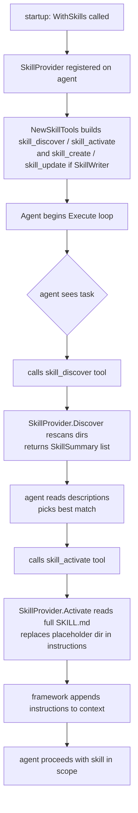

# Skills

## TL;DR

A skill is a markdown file on disk that an agent loads on demand to get specialized instructions. It stays inactive until the agent asks for it, then its full content is injected into context — turning a general-purpose agent into a domain expert for that task.

## When to use it

- **Skills vs. system prompt** — use skills when instructions only apply to specific tasks. The system prompt is for the agent's permanent identity and global rules; skills are for task-specific know-how that does not need to be in scope all the time.
- **Skills vs. memory** — memory is what the agent learned from past conversations; skills are instructions you authored. They compose: a skill tells the agent *how to write a report*; memory tells it *what this user's reporting preferences are*.
- **Skills vs. RAG** — RAG retrieves relevant documents from a corpus at query time. Skills are curated instruction packages you deliberately wrote, with a name and a description the agent can browse and select.
- **`WithSkills` vs. `WithActiveSkills`** — use `WithSkills` when you want the agent to discover and self-select at runtime. Use `WithActiveSkills` when you know a skill is always needed and want it injected unconditionally from the first LLM call.
- **File-based vs. built-in** — use `skills.FromDir(...)` for your own skills; use `skills.Builtin()` to get framework-provided skills (PDF, DOCX, XLSX, PPTX, design-system) without writing any instructions yourself.

**Decision table:**

| | System prompt | Skills (`WithSkills`) | Active skills (`WithActiveSkills`) | Memory | RAG |
|---|---|---|---|---|---|
| Always in context | Yes | No | Yes | Partial | No |
| Agent self-selects | No | Yes | No | No | No |
| You author the content | Yes | Yes | Yes | No | Yes |
| Update without code change | No | Yes (edit file) | No | N/A | Yes |
| Token cost per call | Always | Only when loaded | Always | Per retrieval | Per retrieval |
| Best for | Persona, rules | Task-specific how-to | Always-needed how-to | User history | Document knowledge |

## Architecture



The left side of the diagram is setup (runs once at agent construction); the right side is runtime (runs for each task execution). The two built-in tool names the LLM calls — `skill_discover` and `skill_activate` — are registered just like any other tool you add with `WithTools`. They appear in the tool list the LLM sees, and the LLM decides when to invoke them.

The provider is scanned on every `Discover` call — no in-process cache — so a skill file you drop on disk is immediately visible without restarting the agent. When `Activate` is called, the framework resolves the `{dir}` placeholder in the instructions body to the absolute path of the skill folder, enabling skill instructions to reference local asset files by path.

`skills.Chain` layers multiple providers with explicit priority. `Discover` returns the union; `Activate` searches left to right and returns the first match. This lets project-level skills override user-level skills, which override built-ins — without touching each other's files.

## Mental model

Think of a skill as a plugin that lives on your filesystem rather than in your code. Before the agent runs, no skill instructions exist in the LLM's context. The agent discovers them as it needs them — browsing a catalog, picking one that matches the current task, and loading its full content.

A skill directory looks like this:

```
my-skills/
  data-analyst/
    SKILL.md          ← frontmatter + instructions
  invoice-writer/
    SKILL.md
    templates/        ← optional assets referenced via {dir}
      invoice.html
  code-reviewer/
    SKILL.md
```

The directory name is the canonical identifier. `SkillProvider.Activate("data-analyst")` looks for `my-skills/data-analyst/SKILL.md`.

**Lazy loading by design.** Skill instructions are not paid for in tokens until the agent actively loads them. A system prompt with ten specialized instruction blocks costs tokens on every single call. Skills cost tokens only when relevant — `skill_discover` exchanges a lightweight list of names and descriptions, and `skill_activate` pulls one full instruction set.

**The framework exposes skills as tools, not magic.** When you call `WithSkills(provider)`, Oasis registers `skill_discover` and `skill_activate` as ordinary LLM tools. The agent calls them exactly as it calls any other tool. This means skill selection is governed by the same reasoning the agent applies to all tool use — it can explain its choice, recover from a bad pick, and chain skills.

**The agent decides, not the framework.** The framework never auto-selects a skill. It exposes the discovery and activation operations; the LLM decides when to call them and which skill to load. A well-written system prompt that says "call skill_discover when the task requires specialized knowledge" is enough instruction for most agents.

**Skills can reference each other.** A skill's frontmatter can list other skills in its `references` field. Activating it via `ActivateWithReferences` prepends the referenced skills' instructions first. This allows layered expertise: an `invoice-writer` skill can build on `oasis-pdf` and `oasis-design-system` without repeating their content.

**Providers are an open interface.** `SkillProvider` has two methods — `Discover` and `Activate` — and nothing else. You can implement it against any backend: a database, a remote API, a Git repository. The optional `SkillWriter` interface (three methods: `CreateSkill`, `UpdateSkill`, `DeleteSkill`) is checked at runtime via type assertion — you add write capability only to providers that can support it, without breaking providers that cannot.

## How it works step by step

1. At agent build time, `WithSkills(provider)` is called. The framework calls `NewSkillTools(provider)` internally.
2. `NewSkillTools` always returns `skill_discover` and `skill_activate`. If `provider` implements `SkillWriter`, it also returns `skill_create` and `skill_update`.
3. These tools are registered on the agent alongside any tools you added with `WithTools`. No extra code on your part.
4. The agent begins its execution loop and receives a task from `ag.Execute(ctx, task)`.
5. The agent calls the `skill_discover` tool. `SkillProvider.Discover` rescans the configured directories (non-existent dirs are silently skipped) and returns `[]SkillSummary` — lightweight objects containing only `Name`, `Description`, `Tags`, and `Compatibility`. Full instructions are not loaded at this stage.
6. The LLM reads the summaries and decides which skill fits the task. (If none fits, it proceeds without activating one.)
7. The agent calls `skill_activate` with the chosen skill name.
8. `SkillProvider.Activate` reads the full `SKILL.md` from disk, parses the YAML frontmatter, and returns a `Skill` struct. Any `{dir}` placeholder in the instructions body is replaced with the absolute folder path before the struct is returned.
9. The framework appends `skill.Instructions` to the agent's working context for the remainder of this execution.
10. The agent proceeds with the skill's instructions now in scope — it follows the task steps, uses the recommended tools, and applies the format rules the skill specifies.
11. If the skill has a `references` field, call `ActivateWithReferences` instead of plain `Activate` (or in code: the `skill_activate` tool handles this path when references are set). Referenced skills' instructions are prepended, separated by `---`, one level deep only.
12. If the provider implements `SkillWriter`, the agent can also call `skill_create` to persist a new skill it developed during the task, making it immediately discoverable on the next `skill_discover` call — no restart needed.

## SKILL.md format

Each skill is a directory whose name is the skill's canonical identifier. The directory must contain a `SKILL.md` file with YAML frontmatter followed by the instruction body:

```markdown
---
name: data-analyst
description: Analyze datasets, produce summaries, identify trends.
tags: [data, analytics, csv]
tools: [shell, file_read]
model: gpt-4o
references: [base-statistics]
compatibility: oasis >= 0.30
license: MIT
metadata:
  author: your-name
  version: 1.0.0
---

You are an expert data analyst. When given a dataset:

1. Inspect the schema first — column names, types, row count.
2. Look for nulls, outliers, and format inconsistencies before drawing conclusions.
3. Summarize findings in plain language the user can act on.
```

The minimum viable skill has only `description` and a body. Everything else is optional. The `description` is the single most important field — it is the only text the LLM sees during `skill_discover`, before any instructions are loaded. A vague description like "useful stuff" leads to random activation or no activation at all; a specific description like "Generate professional PDF invoices from structured data" gives the LLM a clear signal.

**Frontmatter fields:**

| Key | Required | Notes |
|---|---|---|
| `name` | Recommended | Falls back to folder name if absent. |
| `description` | Yes (for discovery) | The LLM reads this to decide whether to activate. Make it specific. |
| `tags` | No | Inline array: `[go, data, pdf]` |
| `tools` | No | Advisory tool hints. Does not restrict or auto-register tools. |
| `model` | No | Model preference hint. Not enforced by the framework. |
| `references` | No | Skills whose instructions are prepended by `ActivateWithReferences`. |
| `compatibility` | No | Free-form string, e.g. `"oasis >= 0.30"`. |
| `license` | No | SPDX identifier. |
| `metadata` | No | Nested key-value block. Available as `Skill.Metadata`. |

**The `{dir}` placeholder.** Any occurrence in the instructions body is replaced at activation time with the absolute path to the skill folder. Use it to reference local assets:

```markdown
Load the invoice template from {dir}/templates/invoice.html.
```

**Assets.** A skill directory can contain any supporting files alongside `SKILL.md` — templates, config files, schemas. Reference them via `{dir}`.

## Common patterns and gotchas

**Active vs. available skills.** `WithSkills` makes skills *available* — the agent must call `skill_discover` then `skill_activate` before instructions are in scope. `WithActiveSkills` makes skills *active from the first call* — no tool call happens, instructions are appended to the system prompt unconditionally. You can mix both: pre-activate a "house-rules" skill with `WithActiveSkills`, and keep domain skills available via `WithSkills`.

**Scope per agent, not global.** Each agent carries its own `SkillProvider`. In a multi-agent system, pass different providers to different agents to give them distinct skill catalogs. There is no global registry.

**Chaining and override priority.** `skills.Chain(a, b, c)` returns the first provider that has a given skill name on `Activate`. Project-level skills override user-level skills, which override built-ins. The `Discover` result is the union, deduplicated, sorted by name.

**References are one level deep.** `ActivateWithReferences` resolves the `references` list of the target skill, but it does not follow the references of those referenced skills. Circular references are therefore harmless, and reference chains longer than one hop require explicit code.

**Skill cost in tokens.** Each activated skill's instructions count against the context window for the remainder of that execution. Keep skill bodies concise and task-focused. A skill that covers everything costs as much as a bloated system prompt.

**`DefaultSkillDirs` for AgentSkills-compatible layout.** If you want your project to follow the AgentSkills convention, use `skills.FromDir(skills.DefaultSkillDirs()...)`. This scans `<cwd>/.agents/skills/` (project-level) and `~/.agents/skills/` (user-level). Both are included whether or not they exist yet — `FromDir` handles missing directories gracefully.

**Concurrent safety.** All providers (`fileSkillProvider`, `builtinSkillProvider`, `chainedSkillProvider`) are safe for concurrent use. `Discover` rescans the filesystem on every call with no shared mutable state. Write operations (`CreateSkill`, `UpdateSkill`, `DeleteSkill`) do not hold locks across file I/O — if you need concurrent writes to the same skill name, serialize them in your own code.

## Quick example

```go
package main

import (
    "context"
    "fmt"

    "github.com/nevindra/oasis"
    "github.com/nevindra/oasis/provider/openaicompat"
    "github.com/nevindra/oasis/skills"
)

func main() {
    // User skills in ./skills override framework built-ins on name collision.
    provider := skills.Chain(
        skills.FromDir("./skills"),
        skills.Builtin(),
    )

    llm := openaicompat.New("https://api.openai.com/v1", "gpt-4o", "YOUR_KEY")

    ag := oasis.NewAgent(llm,
        oasis.WithPrompt("You are a helpful assistant. "+
            "When the task requires specialized knowledge, "+
            "call skill_discover to see available skills, then activate the right one."),
        oasis.WithSkills(provider),
    )

    result, err := ag.Execute(context.Background(), oasis.AgentTask{
        Input: "Generate a Q1 sales report as an Excel file.",
    })
    if err != nil {
        panic(err)
    }
    fmt.Println(result.Output)
}
```

**Walkthrough:**

- `skills.Chain(...)` merges two providers; the file-based one is checked first, so your skills shadow built-ins with the same name.
- `oasis.WithSkills(provider)` registers `skill_discover`, `skill_activate`, `skill_create`, and `skill_update` automatically. `skill_create` and `skill_update` appear only because `FromDir` implements `SkillWriter`.
- The system prompt instructs the agent to use skills. The LLM reads it and knows to call `skill_discover` when it encounters a specialized task.
- For the Excel task, the agent discovers `oasis-xlsx` from the built-in library, activates it, and follows its instructions to produce the file.

## Next

- [API reference](./api.md)
- [Examples](./examples.md)
