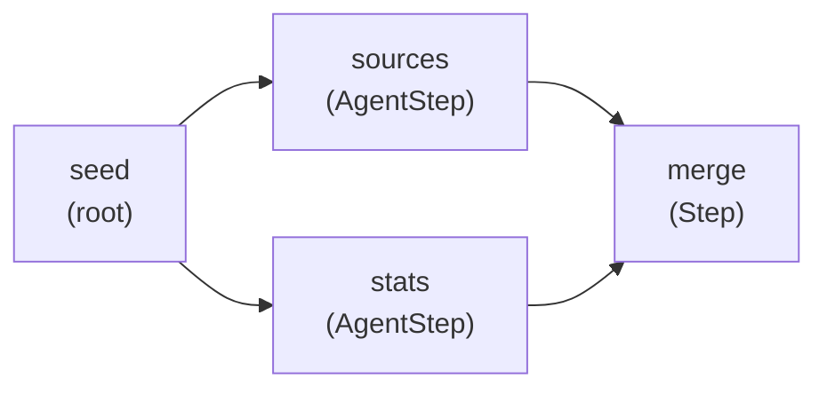

# Workflow

## TL;DR

Workflow is a DAG-based orchestrator: you declare steps and their dependencies
up front, and the engine executes them in parallel wherever the graph allows.
Routing is fixed at construction time — no LLM decides what runs next.

## When to use it

- The execution path is known before the run starts: "always fetch, then
  analyze, then email."
- You need guaranteed, auditable order that a human can verify by reading the
  code — not inferred from a model's output.
- You want independent steps to run in parallel without writing goroutine
  plumbing by hand.
- You are composing existing agents (LLMAgent, Network, or other Workflows)
  into a pipeline and the topology never changes between calls.

**Workflow vs LLMAgent:** An LLMAgent iterates in a tool-calling loop until the
model decides it's done. Use Workflow when you want deterministic multi-step
execution, not model-driven iteration.

**Workflow vs Network:** A Network asks a router LLM which sub-agent to call
next — the path is decided at runtime. A Workflow uses explicit `After()` edges
— the path is decided at construction time. Pick Network when the routing
depends on content; pick Workflow when the routing is known upfront.
See [Network](../network/index.md).

## Architecture



The diagram shows a fan-out / fan-join DAG. `seed` is a root step with no
dependencies. `sources` and `stats` both depend on `seed`, so they start
simultaneously as soon as `seed` finishes. `merge` depends on both — it waits
until the last of the two completes, then runs.

Each arrow is an `After()` edge. The engine tracks how many unfinished
dependencies each step still has (its in-degree). When a step finishes, its
in-degree is decremented for every step that declared it as a dependency. Any
step that reaches zero launches immediately in its own goroutine — no polling,
no timers.

## Mental model

**The graph is nodes plus edges.** A node is a step (a function, an agent call,
a loop). An edge is an `After()` declaration. You build the graph by passing
`WorkflowOption` values to `workflow.New`, which validates the graph — checks
for duplicate names, unknown `After()` targets, and cycles — before returning
the `*Workflow`. If validation fails, you get an error at construction time, not
a panic at runtime.

**The engine tracks in-degrees.** Internally, each step starts with an
in-degree equal to the number of steps it must wait for. When any step
completes (success, failure, or condition-skip), the engine decrements the
in-degree of every downstream step. A step whose in-degree hits zero is ready
and launches in a goroutine immediately. The coordinator loop sits on a `done`
channel and drives this — no mutexes on the scheduling maps, only on shared
result state.

**Steps communicate through WorkflowContext.** `WorkflowContext` is a
concurrent key-value store shared across all steps in one execution. An
`AgentStep` named `"fetch"` automatically writes its output under
`"fetch.output"`. A later step reads it with `wCtx.Get("fetch.output")` or
passes `InputFrom("fetch.output")` so the engine does the read. Custom `Step`
functions write with `wCtx.Set(key, value)` directly.

**Failure is fast and propagates forward.** The first step that errors cancels
all in-flight steps via context cancellation. Steps that depended on the failed
step are marked `StepSkipped` — the engine propagates skips recursively through
the DAG. A step skipped by a `When()` condition is treated differently: it
counts as satisfied, so its dependents still run.

**Each execution is isolated.** Concurrent calls to `Execute` are safe — each
gets its own `WorkflowContext` and execution state. The `*Workflow` itself holds
no mutable per-call state.

## How it works step by step

1. Call `workflow.New(name, description, ...options)`. Each `AgentStep`,
   `Step`, `ForEach`, or `DoUntil` call adds a node; each `After()` inside
   those calls adds a directed edge.
2. `New` validates the graph: no duplicate step names, no `After()` pointing at
   an unknown name, no cycles (detected via topological sort). An error here is
   a programmer mistake — fix the graph.
3. Call `wf.Execute(ctx, core.AgentTask{Input: "..."})`. The engine creates a
   fresh `WorkflowContext` seeded with the task, then calls `runDAG`.
4. `runDAG` initialises an in-degree counter for every step and immediately
   launches all root steps (steps with no `After()` edges) as goroutines.
5. Each goroutine calls `executeStep`, which first evaluates the step's `When()`
   condition. If the condition returns false, the step is recorded as
   `StepSkipped` (condition skip) and the goroutine exits.
6. If the condition passes, `executeStep` runs the step's function (or agent
   call) via `executeWithRetry`. On each attempt it calls the underlying
   function; if the function returns an error that is not a suspension or
   context cancellation, it waits the configured delay and tries again up to
   `Retry(n, delay)` times.
7. A completed step sends its name to the `done` channel. The coordinator loop
   decrements in-degrees for all of that step's dependents. Any dependent whose
   in-degree hits zero is launched immediately.
8. If a step fails after all retries, `skipStep` propagates `StepSkipped`
   forward to every transitive dependent. In-flight steps receive context
   cancellation.
9. If a step calls `Suspend(payload)`, `Execute` returns `*ErrSuspended` to the
   caller. Call `err.Resume(ctx, data)` when the human response arrives; the
   engine replays the completed steps from saved state and continues from the
   suspended step.
10. Output keys follow the convention `"{name}.output"` for `AgentStep` (and
    most `Step` functions that call `wCtx.Set` with that key). Override with
    `OutputTo(key)`.
11. When the `done` loop drains (all steps finished or skipped), `buildResult`
    iterates steps in declaration order, picks the last successful step's output
    as `AgentResult.Output`, aggregates token usage, and fires `WithOnFinish`.
12. `Execute` returns `(AgentResult, nil)` on full success, or
    `(AgentResult, *WorkflowError)` on failure — partial output may still be
    present in `AgentResult.Output`.

## Composing with other primitives

`*Workflow` implements `core.Agent`. That one fact enables all composition
patterns in Oasis.

**Workflow as a Network child.** Pass the workflow to `network.WithChildren`
like any other agent. The router LLM sees it as a single callable tool. When
the router calls it, the entire DAG runs and the Network receives the final
output. This is how you give a Network a multi-step sub-task without the router
knowing about the internal steps.

**Workflow inside another Workflow.** Use `workflow.AgentStep("sub", myWorkflow)`
to nest one workflow as a step inside another. The parent waits for the child
workflow to finish, then routes its output using `InputFrom("sub.output")` as
normal.

**Non-agent steps.** Use `workflow.Step` for pure Go functions: validation,
data transformation, seeding context with a list for a later `ForEach` step.
Use `workflow.ForEach` to fan out over a `[]any` slice stored in context, with
configurable concurrency. Use `workflow.DoUntil` or `workflow.DoWhile` for
loops with a safety cap (`MaxIter`, defaults to 10).

**Streaming.** Pass `core.WithStream(ch)` to `Execute`. The engine emits
`EventStepStart` and `EventStepFinish` for each step, and `EventStepProgress`
for `ForEach` iterations, on the channel.

## Common patterns / gotchas

**Output keys default to `"{name}.output"`.** Both `AgentStep` and custom
`Step` functions that call `wCtx.Set("{name}.output", ...)` follow this
convention. The API reference lists any cases where the key differs — when in
doubt, pass `OutputTo("my-key")` to be explicit.

**`When()` skips are not failures.** A step skipped by `When()` is marked
`StepSkipped` but is treated as satisfied. Its dependents run normally. This is
the correct way to implement conditional branching — one branch skips, the
other runs, and any downstream join step still fires. Contrast this with a
failed upstream, which propagates as `StepSkipped` with the failure flag set,
causing all dependents to skip too.

**`ErrSuspended` is for human-in-the-loop.** When a step needs human input,
return `Suspend(payload)` from the `StepFunc`. The caller receives
`*ErrSuspended` from `Execute`. Serialize the suspended state (the error
carries everything needed), wait for human input, then call `.Resume(ctx,
data)`. Retries do not fire on suspension — only on ordinary Go errors.

**`ErrMaxIterExceeded` from loops.** `DoUntil` and `DoWhile` both have a safety
cap (default 10 iterations). If the exit condition is never met, the step fails
with `ErrMaxIterExceeded`. Use `errors.Is` to detect it; increase `MaxIter(n)`
or fix the exit condition.

**Construction-time errors are programmer mistakes.** `workflow.New` returns an
error — not a panic — for duplicate step names, unknown `After()` targets, and
cycles. Call it at startup (not inside a hot path) and treat an error as a
bug in the graph definition, not a recoverable runtime condition.

## Quick example

```go
package main

import (
    "context"
    "fmt"

    "github.com/nevindra/oasis/core"
    "github.com/nevindra/oasis/workflow"
)

func main() {
    // fetchAgent and summarizeAgent are existing core.Agent implementations.
    wf, err := workflow.New("report", "Fetch then summarize",
        workflow.AgentStep("fetch", fetchAgent),
        workflow.AgentStep("summarize", summarizeAgent,
            workflow.After("fetch"),
            workflow.InputFrom("fetch.output"),
        ),
    )
    if err != nil {
        panic(err) // construction-time: duplicate name, unknown dep, or cycle
    }

    result, err := wf.Execute(context.Background(), core.AgentTask{Input: "latest AI news"})
    if err != nil {
        panic(err)
    }
    fmt.Println(result.Output)
}
```

**Walkthrough:**

1. `workflow.New` validates the two-step graph at construction time. No panics
   later.
2. `AgentStep("fetch", fetchAgent)` — `fetch` is a root step (no `After()`).
   Its output is stored in context under `"fetch.output"` automatically.
3. `After("fetch")` — `summarize` waits for `fetch` to finish.
4. `InputFrom("fetch.output")` — the engine reads `"fetch.output"` from context
   and passes it as `AgentTask.Input` to `summarizeAgent`.
5. `Execute` returns when both steps finish. `result.Output` is `summarize`'s
   output — the last successful step in declaration order.

## Next

- [API reference](./api.md)
- [Examples](./examples.md)
